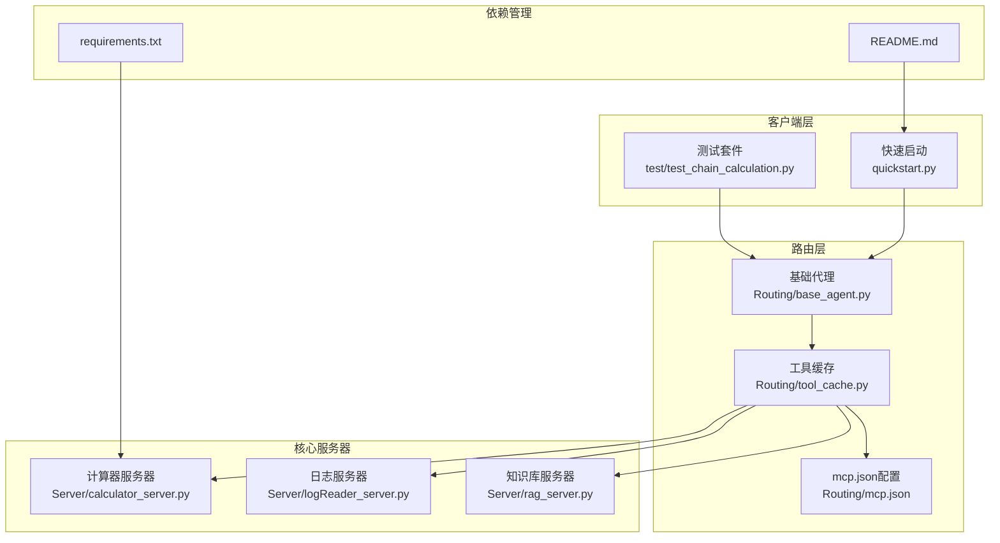
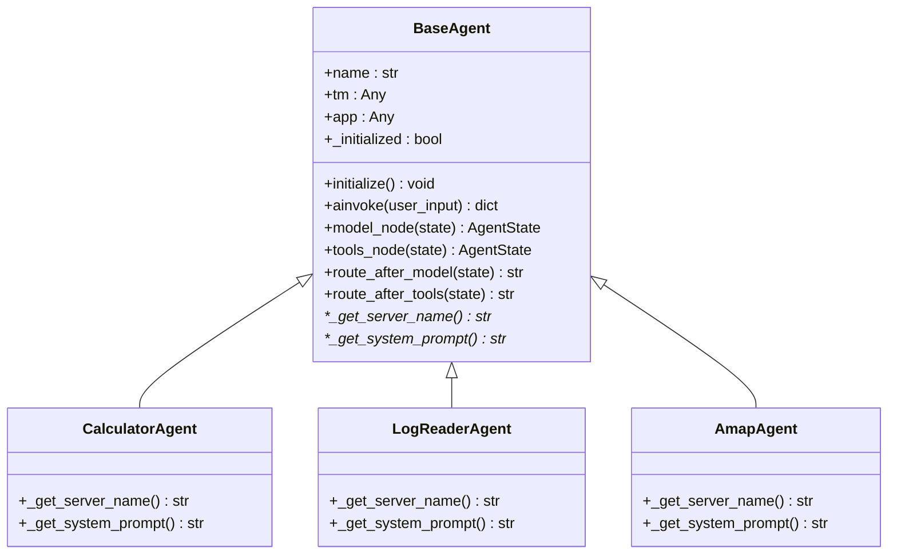
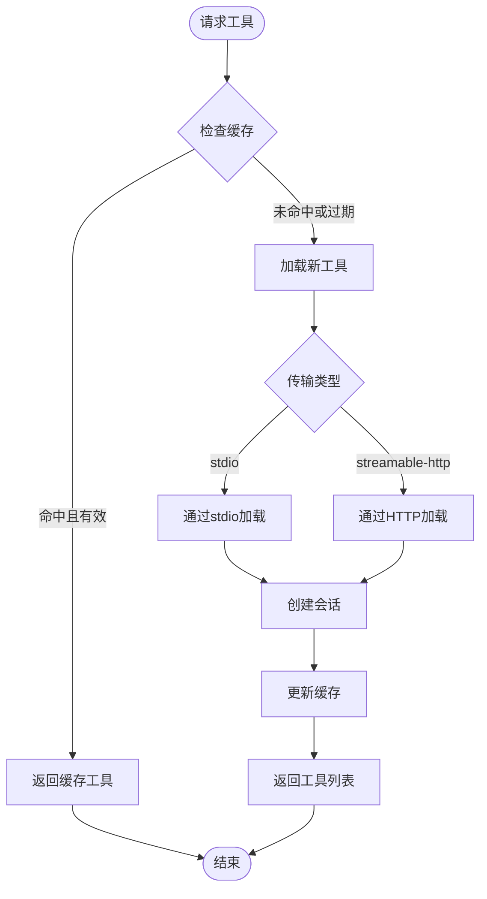
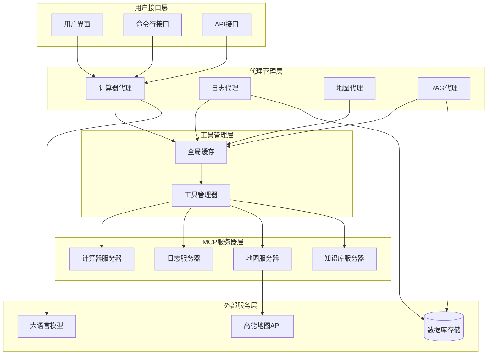
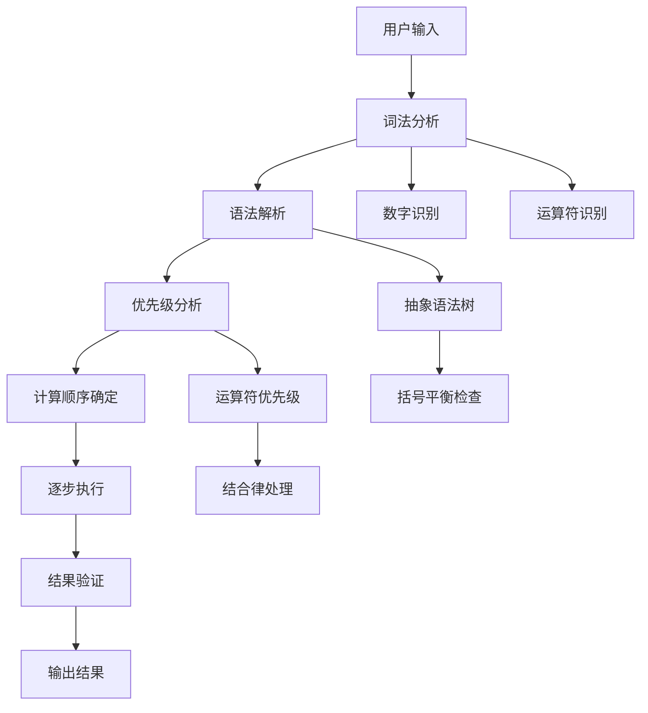
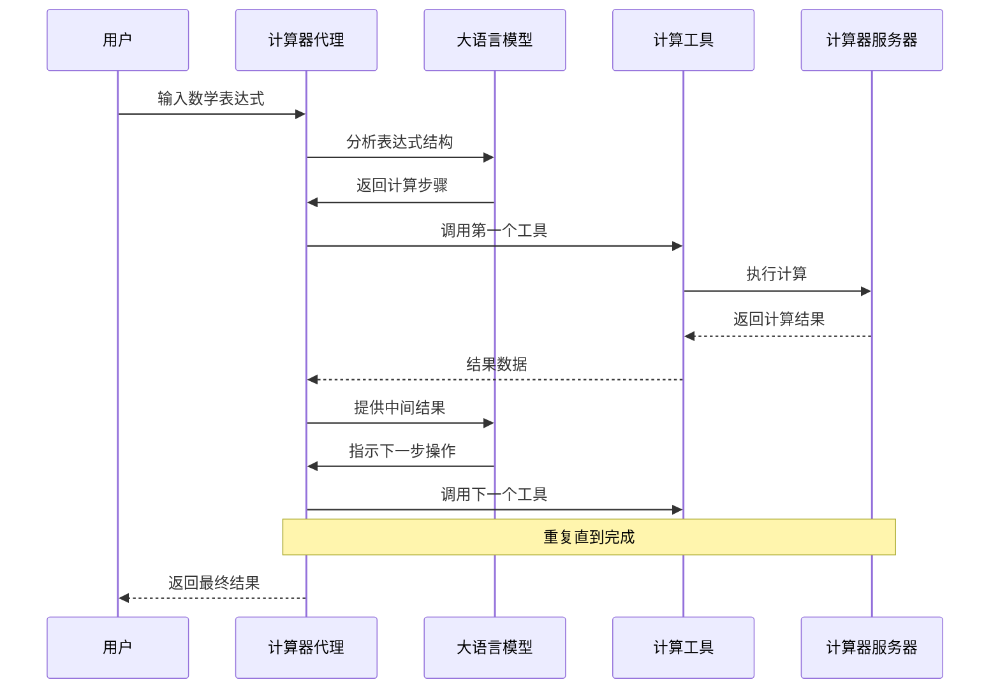
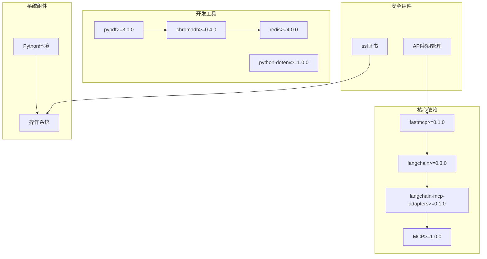
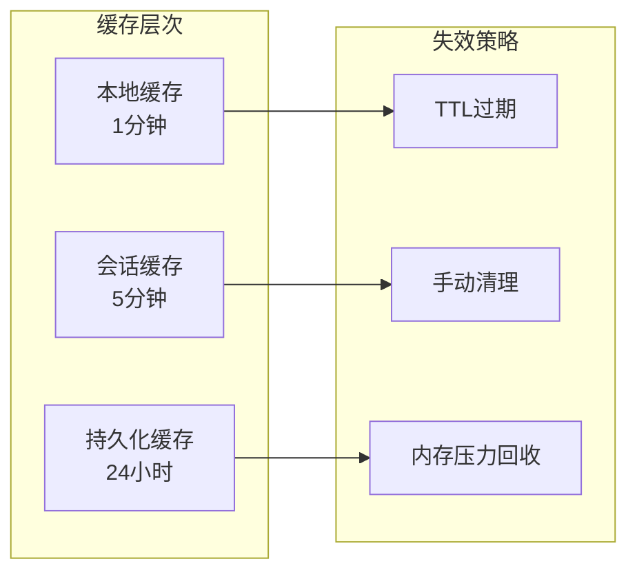

# 计算器MCP服务器技术文档

<cite>
**本文档引用的文件**
- [calculator_server.py](file://Server/calculator_server.py)
- [base_agent.py](file://Routing/base_agent.py)
- [tool_cache.py](file://Routing/tool_cache.py)
- [mcp.json](file://Routing/mcp.json)
- [test_chain_calculation.py](file://test/test_chain_calculation.py)
- [quickstart.py](file://quickstart.py)
- [README.md](file://README.md)
- [requirements.txt](file://requirements.txt)
</cite>

## 目录
1. [简介](#简介)
2. [项目结构](#项目结构)
3. [核心组件](#核心组件)
4. [架构概览](#架构概览)
5. [详细组件分析](#详细组件分析)
6. [依赖关系分析](#依赖关系分析)
7. [性能考虑](#性能考虑)
8. [故障排除指南](#故障排除指南)
9. [结论](#结论)

## 简介

计算器MCP服务器是一个基于Model Context Protocol (MCP)构建的智能计算服务系统。该系统通过标准化协议连接AI模型与外部计算工具，实现了高效的数学表达式解析、链式计算逻辑和运算符优先级处理。系统采用模块化设计，支持多服务器架构，能够处理复杂的数学计算任务。

本项目的核心目标是提供一个可靠的计算器服务，通过MCP协议为AI代理提供精确的数学计算能力。系统不仅支持基本的四则运算，还能处理复杂的链式计算和运算符优先级问题。

## 项目结构

该项目采用清晰的模块化组织结构，主要分为以下几个核心部分：



**图表来源**
- [calculator_server.py:1-111](file://Server/calculator_server.py#L1-L111)
- [base_agent.py:1-497](file://Routing/base_agent.py#L1-L497)
- [tool_cache.py:1-302](file://Routing/tool_cache.py#L1-L302)
- [mcp.json:1-29](file://Routing/mcp.json#L1-L29)

**章节来源**
- [README.md:1-125](file://README.md#L1-L125)
- [requirements.txt:1-17](file://requirements.txt#L1-L17)

## 核心组件

### 计算器MCP服务器

计算器MCP服务器是系统的核心组件，负责提供数学计算功能。它基于FastMCP框架构建，支持标准输入输出(Stdio)传输协议。

#### 主要功能特性

1. **基本数学运算**：支持加法、减法、乘法、除法四种基本运算
2. **错误处理机制**：内置除零检测和异常处理
3. **标准化输出格式**：统一的JSON响应格式
4. **实时日志记录**：每个操作都有详细的执行日志

#### 服务器配置

服务器通过装饰器注册工具函数，每个工具函数都经过精心设计以满足特定的计算需求：

- `add()`: 执行加法运算，返回包含操作类型、输入参数和结果的完整信息
- `subtract()`: 执行减法运算，支持负数和小数运算
- `multiply()`: 执行乘法运算，处理大数和精度问题
- `divide()`: 执行除法运算，包含除零保护机制

**章节来源**
- [calculator_server.py:16-105](file://Server/calculator_server.py#L16-L105)

### 基础代理系统

基础代理系统(BaseAgent)提供了统一的代理框架，支持多服务器工具管理和智能路由功能。

#### 核心架构设计



**图表来源**
- [base_agent.py:29-497](file://Routing/base_agent.py#L29-L497)

#### 代理工作流程

代理系统采用LangGraph工作流引擎，实现了智能的任务调度和执行：

1. **初始化阶段**：加载全局工具缓存，建立LLM连接
2. **模型推理**：LLM分析用户输入，决定计算策略
3. **工具调用**：执行具体的数学计算操作
4. **结果整合**：将工具结果整合为最终响应

**章节来源**
- [base_agent.py:44-318](file://Routing/base_agent.py#L44-L318)

### 工具缓存管理系统

工具缓存管理系统(GlobalToolCache)实现了高效的工具加载和管理机制，支持多种传输协议和缓存策略。

#### 缓存策略设计



**图表来源**
- [tool_cache.py:85-197](file://Routing/tool_cache.py#L85-L197)

#### 支持的传输协议

1. **Stdio协议**：本地进程间通信，适用于计算器服务器
2. **Streamable HTTP协议**：网络远程通信，适用于高德地图等外部服务
3. **自动重连机制**：网络异常时的自动恢复功能

**章节来源**
- [tool_cache.py:118-243](file://Routing/tool_cache.py#L118-L243)

## 架构概览

系统采用分层架构设计，实现了高度解耦和可扩展的计算服务架构。



**图表来源**
- [base_agent.py:322-497](file://Routing/base_agent.py#L322-L497)
- [tool_cache.py:39-302](file://Routing/tool_cache.py#L39-L302)

### 通信协议设计

系统支持多种通信协议，确保不同场景下的最佳性能：

1. **MCP协议**：标准化的模型上下文协议
2. **LangChain适配器**：与LangChain生态系统的无缝集成
3. **异步处理**：支持高并发的异步计算模式

**章节来源**
- [mcp.json:1-29](file://Routing/mcp.json#L1-L29)

## 详细组件分析

### 数学表达式解析算法

系统实现了智能的数学表达式解析算法，能够处理复杂的链式计算和运算符优先级。

#### 解析流程设计



**图表来源**
- [base_agent.py:332-400](file://Routing/base_agent.py#L332-L400)

#### 运算符优先级处理

系统严格遵循数学运算的优先级规则：

1. **高优先级运算**：乘法(*)和除法(/)优先于加法(+)和减法(-)
2. **同级运算处理**：从左到右依次计算
3. **括号优先**：括号内的运算具有最高优先级
4. **函数调用**：三角函数、对数等函数具有最高优先级

**章节来源**
- [base_agent.py:340-343](file://Routing/base_agent.py#L340-L343)

### 链式计算逻辑

链式计算是系统的核心功能之一，实现了复杂的多步计算能力。

#### 计算流程控制



**图表来源**
- [base_agent.py:102-217](file://Routing/base_agent.py#L102-L217)

#### 错误处理机制

系统实现了多层次的错误处理机制：

1. **输入验证**：检查数学表达式的合法性
2. **运行时错误**：捕获计算过程中的异常
3. **工具调用错误**：处理MCP工具调用失败
4. **网络错误**：处理服务器连接问题

**章节来源**
- [base_agent.py:122-210](file://Routing/base_agent.py#L122-L210)

### API接口规范

系统提供了标准化的API接口，支持RESTful和MCP协议两种模式。

#### 工具函数接口

每个数学运算都对应一个标准化的工具函数：

| 工具名称 | 参数 | 返回值 | 描述 |
|---------|------|--------|------|
| add | a: float, b: float | dict | 加法运算 |
| subtract | a: float, b: float | dict | 减法运算 |
| multiply | a: float, b: float | dict | 乘法运算 |
| divide | a: float, b: float | dict | 除法运算 |

#### 响应格式规范

所有工具调用都返回统一的JSON格式：

```json
{
  "operation": "运算类型",
  "a": 输入参数1,
  "b": 输入参数2,
  "result": 计算结果,
  "error": "错误信息"
}
```

**章节来源**
- [calculator_server.py:17-105](file://Server/calculator_server.py#L17-L105)

## 依赖关系分析

系统采用了现代化的依赖管理策略，确保了良好的可维护性和扩展性。



**图表来源**
- [requirements.txt:1-17](file://requirements.txt#L1-L17)

### 外部服务集成

系统集成了多个外部服务，扩展了计算能力：

1. **高德地图服务**：提供地理位置和导航功能
2. **大语言模型服务**：提供智能推理和自然语言处理
3. **向量数据库**：支持RAG知识检索功能

**章节来源**
- [README.md:80-101](file://README.md#L80-L101)

## 性能考虑

系统在设计时充分考虑了性能优化，采用了多种策略来提升计算效率。

### 缓存策略优化



#### 性能优化建议

1. **批量处理**：对于相似的计算请求，考虑批量处理以减少开销
2. **预热机制**：在高负载前预热工具缓存
3. **连接池管理**：合理管理MCP服务器连接，避免资源浪费
4. **异步处理**：充分利用异步特性，提高并发处理能力

### 内存管理

系统实现了智能的内存管理策略：

- **工具缓存**：避免重复加载相同的工具定义
- **会话复用**：复用MCP服务器连接会话
- **垃圾回收**：定期清理过期的缓存数据

## 故障排除指南

### 常见问题及解决方案

#### 服务器启动问题

**问题**：计算器服务器无法启动
**解决方案**：
1. 检查Python环境配置
2. 验证依赖包安装情况
3. 确认端口和传输协议配置

#### 工具调用失败

**问题**：MCP工具调用返回错误
**解决方案**：
1. 检查服务器配置文件
2. 验证API密钥设置
3. 确认网络连接状态

#### 计算结果异常

**问题**：计算结果与预期不符
**解决方案**：
1. 检查运算符优先级设置
2. 验证输入参数格式
3. 确认工具函数实现

**章节来源**
- [quickstart.py:61-68](file://quickstart.py#L61-L68)

### 调试技巧

1. **启用详细日志**：通过环境变量控制日志级别
2. **单元测试**：使用提供的测试套件验证功能
3. **性能监控**：监控工具调用时间和内存使用情况

**章节来源**
- [test_chain_calculation.py:14-65](file://test/test_chain_calculation.py#L14-L65)

## 结论

计算器MCP服务器是一个设计精良、功能完整的智能计算服务系统。通过采用模块化架构、标准化协议和先进的缓存策略，系统实现了高效、可靠和可扩展的数学计算能力。

### 主要优势

1. **标准化协议**：基于MCP协议，确保与其他系统的兼容性
2. **智能路由**：通过LLM实现智能的任务调度和执行
3. **高性能缓存**：多层缓存策略提升系统响应速度
4. **完善的错误处理**：多层次的错误检测和恢复机制

### 未来发展方向

1. **扩展运算类型**：支持更复杂的数学函数和运算
2. **增强AI集成**：提升LLM在计算决策中的作用
3. **优化性能**：进一步提升大规模计算的处理能力
4. **增强安全性**：加强输入验证和访问控制机制

该系统为构建智能代理应用提供了坚实的基础，能够满足各种复杂的计算需求，并为未来的功能扩展奠定了良好的技术基础。