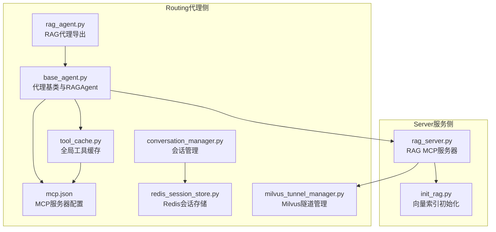
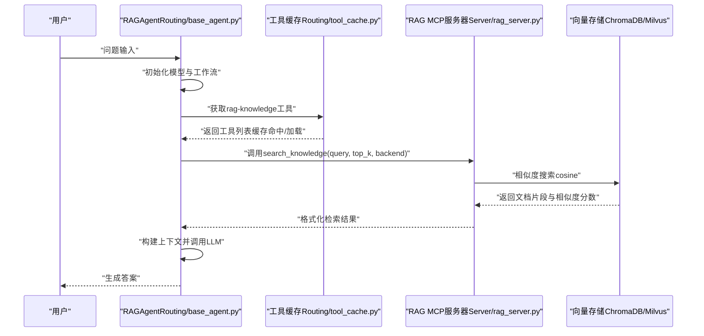
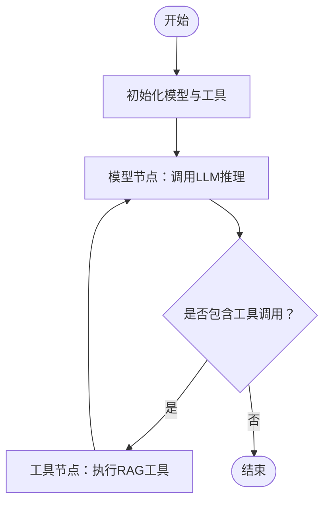
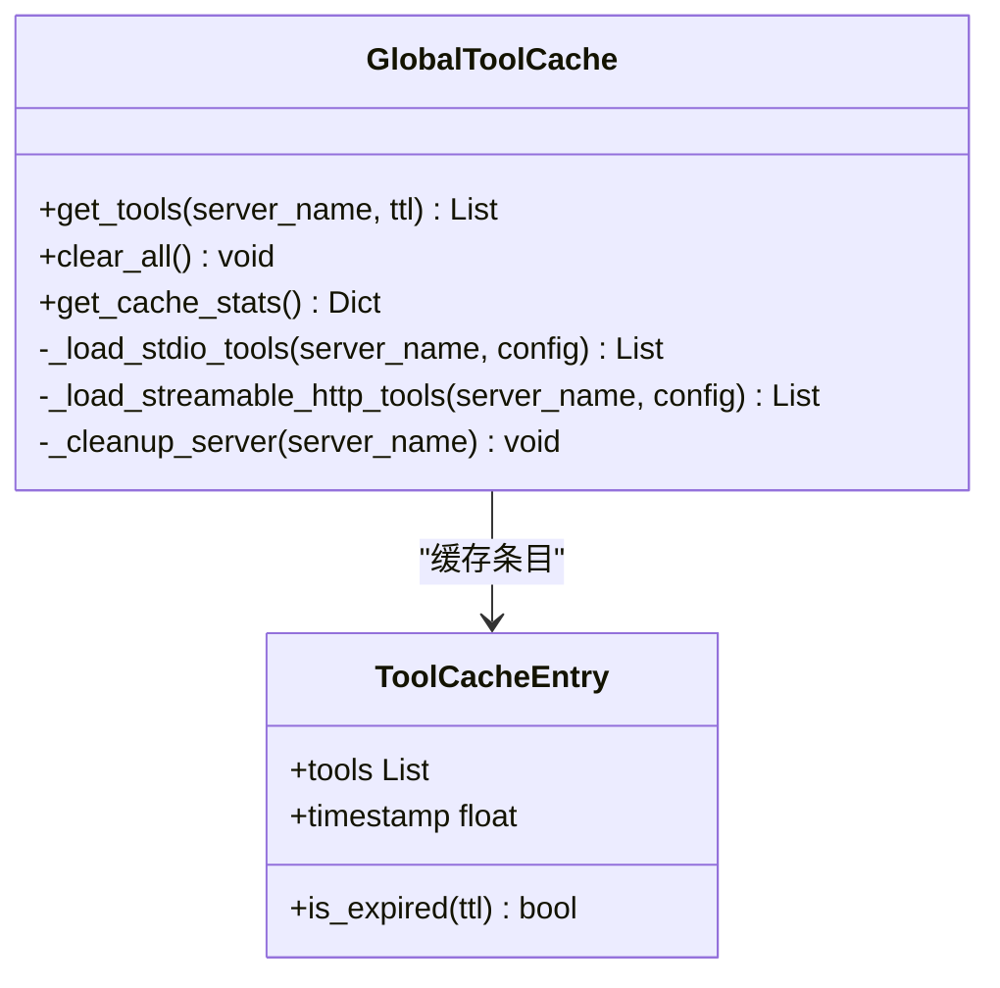
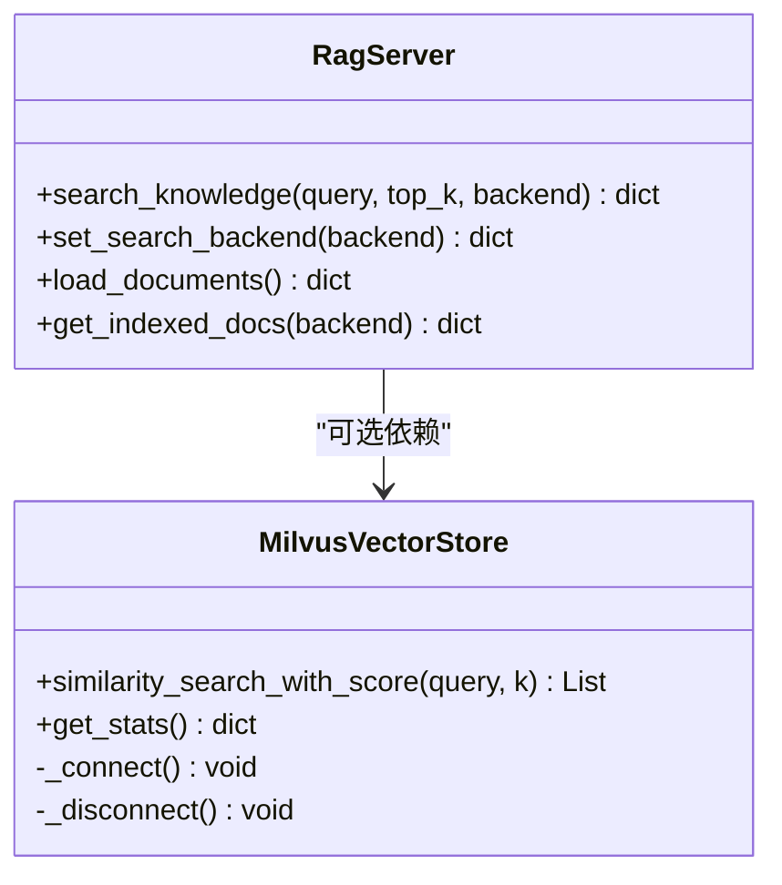
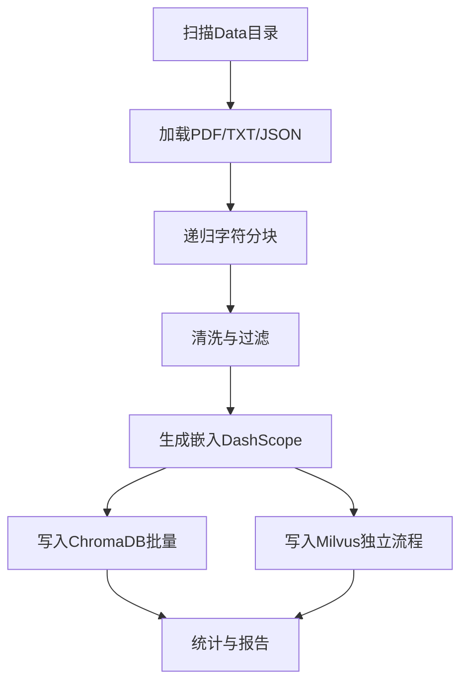
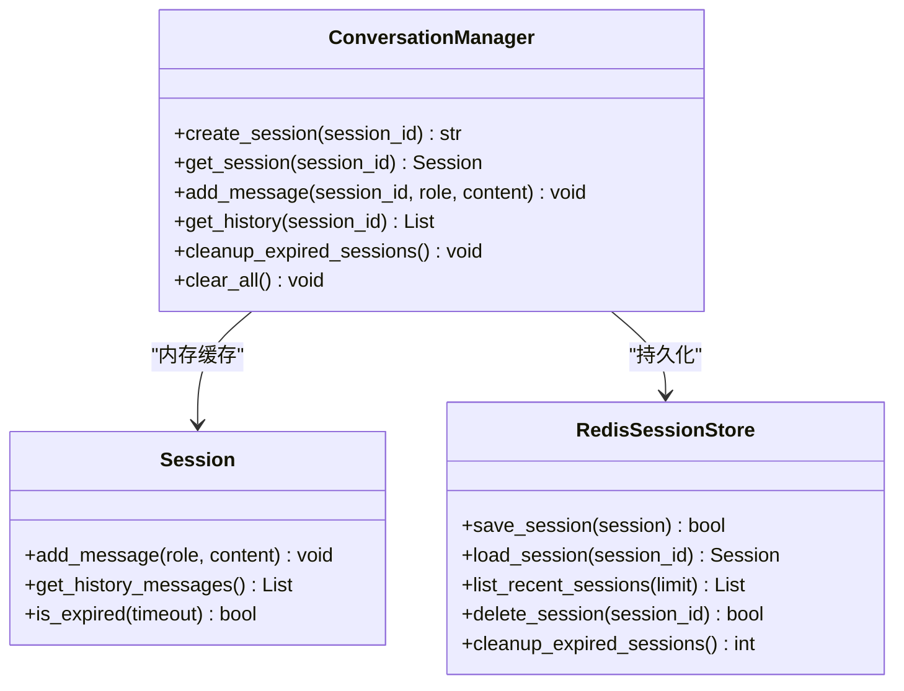
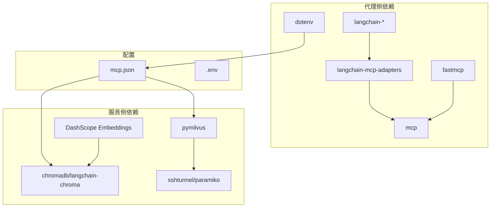

# RAG代理

<cite>
**本文档引用的文件**
- [rag_agent.py](file://Routing/rag_agent.py)
- [base_agent.py](file://Routing/base_agent.py)
- [tool_cache.py](file://Routing/tool_cache.py)
- [mcp.json](file://Routing/mcp.json)
- [rag_server.py](file://Server/rag_server.py)
- [init_rag.py](file://Server/init_rag.py)
- [milvus_tunnel_manager.py](file://Routing/milvus_tunnel_manager.py)
- [conversation_manager.py](file://Routing/conversation_manager.py)
- [redis_session_store.py](file://Routing/redis_session_store.py)
- [test_rag.py](file://test/test_rag.py)
- [demo_conversation.py](file://demo_conversation.py)
- [quickstart.py](file://quickstart.py)
- [requirements.txt](file://requirements.txt)
- [README.md](file://README.md)
</cite>

## 目录
1. [简介](#简介)
2. [项目结构](#项目结构)
3. [核心组件](#核心组件)
4. [架构总览](#架构总览)
5. [详细组件分析](#详细组件分析)
6. [依赖关系分析](#依赖关系分析)
7. [性能考虑](#性能考虑)
8. [故障排查指南](#故障排查指南)
9. [结论](#结论)
10. [附录](#附录)

## 简介
本文件面向RAG代理的实现与使用，系统性阐述其检索增强生成（RAG）原理、向量检索与语义匹配、上下文构建与答案生成流程，以及代理与RAG MCP服务器的交互模式、查询优化与结果排序策略。文档还提供部署指南、效果评估标准、缓存策略与性能调优建议，并给出具体使用示例的代码路径指引，帮助读者快速上手并高效运维。

## 项目结构
该项目采用模块化设计，围绕“代理基类 + 工具缓存 + MCP服务器 + 会话管理”的架构组织代码。RAG代理位于Routing目录，RAG MCP服务器位于Server目录，二者通过MCP协议进行通信；同时提供向量索引初始化脚本与Milvus隧道管理器以支撑大规模向量检索。

图表来源
- [base_agent.py:1-497](file://Routing/base_agent.py#L1-L497)
- [tool_cache.py:1-302](file://Routing/tool_cache.py#L1-L302)
- [mcp.json:1-29](file://Routing/mcp.json#L1-L29)
- [rag_server.py:1-363](file://Server/rag_server.py#L1-L363)
- [init_rag.py:1-506](file://Server/init_rag.py#L1-L506)
- [milvus_tunnel_manager.py:1-101](file://Routing/milvus_tunnel_manager.py#L1-L101)
- [conversation_manager.py:1-275](file://Routing/conversation_manager.py#L1-L275)
- [redis_session_store.py:1-228](file://Routing/redis_session_store.py#L1-L228)
- [rag_agent.py:1-11](file://Routing/rag_agent.py#L1-L11)

章节来源
- [README.md:1-125](file://README.md#L1-L125)
- [requirements.txt:1-17](file://requirements.txt#L1-L17)

## 核心组件
- 代理基类与RAGAgent：统一工具加载、消息处理、错误处理与工作流编排，RAGAgent负责知识问答意图与向量后端适配。
- 全局工具缓存：跨代理共享MCP服务器连接与工具列表，避免重复加载，支持TTL过期与线程安全。
- MCP服务器配置：集中声明各MCP服务器的传输协议、命令/URL与参数，RAG服务器通过stdio启动。
- RAG MCP服务器：提供search_knowledge、set_search_backend、load_documents、get_indexed_docs等工具，支持ChromaDB与Milvus双后端。
- 向量索引初始化：扫描Data目录，加载PDF/TXT/JSON，分块与清洗，生成嵌入并写入ChromaDB与Milvus。
- 会话管理与缓存：支持内存与Redis双层持久化，提供会话生命周期管理与历史消息获取。
- Milvus隧道管理：通过SSH隧道安全连接远程Milvus，支持多种密钥格式与端口配置。

章节来源
- [base_agent.py:29-497](file://Routing/base_agent.py#L29-L497)
- [tool_cache.py:39-302](file://Routing/tool_cache.py#L39-L302)
- [mcp.json:1-29](file://Routing/mcp.json#L1-L29)
- [rag_server.py:193-353](file://Server/rag_server.py#L193-L353)
- [init_rag.py:294-496](file://Server/init_rag.py#L294-L496)
- [conversation_manager.py:82-275](file://Routing/conversation_manager.py#L82-L275)
- [redis_session_store.py:14-228](file://Routing/redis_session_store.py#L14-L228)
- [milvus_tunnel_manager.py:14-101](file://Routing/milvus_tunnel_manager.py#L14-L101)

## 架构总览
RAG代理通过LangGraph工作流驱动，结合全局工具缓存与MCP协议，实现“模型推理—工具调用—结果回传”的闭环。RAG MCP服务器提供向量检索与索引管理工具，支持ChromaDB（本地）与Milvus（远程SSH隧道）两种后端，具备自动回退与统计查询能力。

图表来源
- [base_agent.py:102-318](file://Routing/base_agent.py#L102-L318)
- [tool_cache.py:85-117](file://Routing/tool_cache.py#L85-L117)
- [rag_server.py:193-244](file://Server/rag_server.py#L193-L244)

## 详细组件分析

### RAG代理与工作流
- 继承BaseAgent，重写_get_server_name返回"rag-knowledge"，_get_system_prompt根据当前向量后端（ChromaDB或Milvus）注入调用指导。
- 工作流包含model与tools两个节点，条件路由依据AI消息中的tool_calls决定是否进入工具节点；工具执行后回传给模型节点继续推理。
- 工具调用结果通过ToolMessage注入，RAGAgent对工具返回做精简处理，仅提取必要字段，避免LLM被冗余信息干扰。

图表来源
- [base_agent.py:238-256](file://Routing/base_agent.py#L238-L256)
- [base_agent.py:102-130](file://Routing/base_agent.py#L102-L130)
- [base_agent.py:131-217](file://Routing/base_agent.py#L131-L217)

章节来源
- [base_agent.py:433-463](file://Routing/base_agent.py#L433-L463)
- [base_agent.py:238-318](file://Routing/base_agent.py#L238-L318)

### 全局工具缓存与MCP交互
- 工具缓存以服务器名为键，缓存工具列表与会话句柄，支持stdio与streamable-http两种传输协议。
- 首次加载时通过MultiServerMCPClient或HTTP客户端建立连接并加载工具；缓存过期后自动清理并重新加载。
- 支持路径解析与环境变量替换，确保跨平台与多Agent复用。

图表来源
- [tool_cache.py:39-302](file://Routing/tool_cache.py#L39-L302)

章节来源
- [tool_cache.py:85-140](file://Routing/tool_cache.py#L85-L140)
- [tool_cache.py:198-243](file://Routing/tool_cache.py#L198-L243)

### RAG MCP服务器与向量检索
- 提供search_knowledge、set_search_backend、load_documents、get_indexed_docs等工具。
- get_vector_store根据backend参数选择ChromaDB或Milvus封装类；MilvusVectorStore通过SSH隧道连接远程集合，支持统计查询与批量搜索。
- 搜索接口返回文档片段、元数据与相似度分数，支持后端切换与错误处理。

图表来源
- [rag_server.py:51-159](file://Server/rag_server.py#L51-L159)
- [rag_server.py:193-353](file://Server/rag_server.py#L193-L353)

章节来源
- [rag_server.py:161-190](file://Server/rag_server.py#L161-L190)
- [rag_server.py:193-244](file://Server/rag_server.py#L193-L244)
- [rag_server.py:247-276](file://Server/rag_server.py#L247-L276)
- [rag_server.py:279-353](file://Server/rag_server.py#L279-L353)

### 向量索引初始化与数据管线
- 扫描Data目录，加载PDF/TXT/JSON，统一转换为Document并标注元数据。
- 使用RecursiveCharacterTextSplitter进行分块，过滤空内容与过短块，清洗特殊字符，确保文本质量。
- 通过DashScope Embeddings生成向量，批量写入ChromaDB；同时尝试写入Milvus（独立调用，不共享Embedding）。
- 支持Milvus Collection初始化、索引创建与批量插入，具备进度反馈与异常处理。

图表来源
- [init_rag.py:294-496](file://Server/init_rag.py#L294-L496)

章节来源
- [init_rag.py:48-158](file://Server/init_rag.py#L48-L158)
- [init_rag.py:208-292](file://Server/init_rag.py#L208-L292)
- [init_rag.py:322-466](file://Server/init_rag.py#L322-L466)

### 会话管理与缓存策略
- 会话管理器支持内存与Redis双层持久化，提供创建、加载、清理、过期回收等能力。
- Redis存储包含会话元数据、消息列表、活跃索引与历史列表，支持批量操作与TTL控制。
- 与工具缓存配合，在会话生命周期内复用工具连接，减少冷启动成本。

图表来源
- [conversation_manager.py:82-275](file://Routing/conversation_manager.py#L82-L275)
- [redis_session_store.py:14-228](file://Routing/redis_session_store.py#L14-L228)

章节来源
- [conversation_manager.py:148-232](file://Routing/conversation_manager.py#L148-L232)
- [redis_session_store.py:36-132](file://Routing/redis_session_store.py#L36-L132)

### Milvus隧道管理
- 通过SSH隧道将本地端口转发到远程Milvus gRPC端口，支持RSA/ECDSA/Ed25519多种私钥格式。
- 自动加载环境变量作为默认配置，创建失败时提供明确错误信息，便于排查网络与密钥问题。

章节来源
- [milvus_tunnel_manager.py:20-89](file://Routing/milvus_tunnel_manager.py#L20-L89)

## 依赖关系分析
- 代理侧依赖：langchain-mcp-adapters、mcp、fastmcp、dotenv等，用于MCP客户端、协议与环境变量加载。
- 服务侧依赖：chromadb、langchain-chroma、DashScope Embeddings、pymilvus、sshtunnel、paramiko等，用于向量存储、嵌入与远程连接。
- 配置文件：mcp.json集中声明各MCP服务器的传输协议与参数；.env文件提供API密钥与端口配置。

图表来源
- [requirements.txt:1-17](file://requirements.txt#L1-L17)
- [mcp.json:1-29](file://Routing/mcp.json#L1-L29)

章节来源
- [requirements.txt:1-17](file://requirements.txt#L1-L17)
- [mcp.json:1-29](file://Routing/mcp.json#L1-L29)

## 性能考虑
- 工具缓存与连接复用：全局工具缓存避免重复加载MCP服务器工具，降低冷启动延迟；会话管理器在会话周期内复用连接，减少握手开销。
- 向量检索优化：
  - Milvus：使用COSINE度量与IVF_FLAT索引，nprobe参数可权衡召回率与延迟；支持批量搜索与分批插入。
  - ChromaDB：本地持久化，适合小规模场景；批量add_texts提升吞吐。
- 文本清洗与分块：递归分块与字符清洗减少噪声，提高检索质量；合理设置chunk_size与overlap平衡召回与上下文长度。
- 查询优化：RAGAgent在工具调用后对返回结果做精简，避免LLM被冗余信息干扰，提升生成稳定性。
- 结果排序：search_knowledge返回相似度分数，可在应用层二次排序或过滤，结合元数据（如来源、文件类型）进行去重与筛选。

章节来源
- [rag_server.py:98-121](file://Server/rag_server.py#L98-L121)
- [init_rag.py:322-335](file://Server/init_rag.py#L322-L335)
- [init_rag.py:404-456](file://Server/init_rag.py#L404-L456)
- [base_agent.py:173-181](file://Routing/base_agent.py#L173-L181)

## 故障排查指南
- MCP服务器不可达
  - 检查mcp.json中transport与参数是否正确；stdio模式确认命令与args路径；HTTP模式确认URL与超时设置。
  - 工具缓存加载失败时查看日志，确认环境变量与路径解析。
- Milvus连接失败
  - 确认SSH密钥格式与路径；检查本地端口转发是否成功；查看隧道管理器错误输出。
  - 若Milvus不可用，RAG MCP服务器会自动回退到ChromaDB。
- 向量索引初始化失败
  - 检查Data目录是否存在与权限；确认DashScope API Key；观察分块与清洗阶段的日志，定位无效内容。
- 会话持久化问题
  - Redis连接失败时会自动降级为内存模式；检查Redis配置与网络连通性。
- 意图识别与路由
  - 使用test_rag.py进行RAG路由测试，核对router_workflow的决策与输出。

章节来源
- [tool_cache.py:198-243](file://Routing/tool_cache.py#L198-L243)
- [milvus_tunnel_manager.py:84-89](file://Routing/milvus_tunnel_manager.py#L84-L89)
- [rag_server.py:31-33](file://Server/rag_server.py#L31-L33)
- [init_rag.py:294-496](file://Server/init_rag.py#L294-L496)
- [conversation_manager.py:112-118](file://Routing/conversation_manager.py#L112-L118)
- [test_rag.py:14-44](file://test/test_rag.py#L14-L44)

## 结论
本RAG代理通过统一的代理基类、全局工具缓存与MCP协议，实现了稳定高效的检索增强生成能力。服务侧提供ChromaDB与Milvus双后端支持，具备完善的索引初始化与统计查询能力。结合会话管理与缓存策略，系统在准确性、性能与可运维性方面达到良好平衡。建议在生产环境中优先使用Milvus并开启SSH隧道，配合合理的分块与清洗策略，持续监控检索质量与响应时延，以获得最佳效果。

## 附录

### 使用示例（代码路径）
- 创建RAG代理并进行知识问答
  - [create_rag_agent:488-496](file://Routing/base_agent.py#L488-L496)
  - [RAGAgent._get_system_prompt:447-462](file://Routing/base_agent.py#L447-L462)
- 调用RAG MCP服务器工具
  - [search_knowledge:193-244](file://Server/rag_server.py#L193-L244)
  - [set_search_backend:247-276](file://Server/rag_server.py#L247-L276)
  - [get_indexed_docs:307-353](file://Server/rag_server.py#L307-L353)
- 初始化向量索引
  - [initialize_rag_index:294-496](file://Server/init_rag.py#L294-L496)
- 多轮对话与会话管理
  - [chat_with_session（演示脚本）:19-68](file://demo_conversation.py#L19-L68)
  - [ConversationManager:122-232](file://Routing/conversation_manager.py#L122-L232)
- 快速启动与工具展示
  - [quickstart.py:8-57](file://quickstart.py#L8-L57)

章节来源
- [demo_conversation.py:19-68](file://demo_conversation.py#L19-L68)
- [rag_server.py:193-353](file://Server/rag_server.py#L193-L353)
- [init_rag.py:294-496](file://Server/init_rag.py#L294-L496)
- [conversation_manager.py:122-232](file://Routing/conversation_manager.py#L122-L232)
- [quickstart.py:8-57](file://quickstart.py#L8-L57)

### 部署指南
- 环境准备
  - 安装依赖：参考[requirements.txt:1-17](file://requirements.txt#L1-L17)
  - 配置环境变量：在.env中设置API Key与端口（如DASHSCOPE_API_KEY、MILVUS_LOCAL_PORT等）
- 启动RAG MCP服务器
  - 通过stdio运行：[rag_server.py:356-362](file://Server/rag_server.py#L356-L362)
- 初始化向量索引
  - 手动触发：[load_documents:279-303](file://Server/rag_server.py#L279-L303)
  - 或直接运行初始化脚本：[init_rag.py:499-505](file://Server/init_rag.py#L499-L505)
- 验证与测试
  - 使用演示脚本：[demo_conversation.py:19-68](file://demo_conversation.py#L19-L68)
  - 使用路由测试：[test_rag.py:14-44](file://test/test_rag.py#L14-L44)

章节来源
- [requirements.txt:1-17](file://requirements.txt#L1-L17)
- [rag_server.py:356-362](file://Server/rag_server.py#L356-L362)
- [init_rag.py:499-505](file://Server/init_rag.py#L499-L505)
- [demo_conversation.py:19-68](file://demo_conversation.py#L19-L68)
- [test_rag.py:14-44](file://test/test_rag.py#L14-L44)

### 效果评估标准
- 检索质量
  - 召回率与精确率：评估top_k返回中相关片段占比
  - 相似度阈值：根据业务需求设定过滤阈值
  - 元数据一致性：来源文件与类型标注的准确性
- 生成质量
  - 答案相关性：人工评估与关键词匹配
  - 上下文完整性：是否充分引用检索片段
  - 一致性与可解释性：答案来源可追溯
- 性能指标
  - 平均响应时延（含工具调用与LLM推理）
  - 工具缓存命中率与会话复用率
  - 向量库写入与查询吞吐量

章节来源
- [rag_server.py:214-237](file://Server/rag_server.py#L214-L237)
- [init_rag.py:482-489](file://Server/init_rag.py#L482-L489)