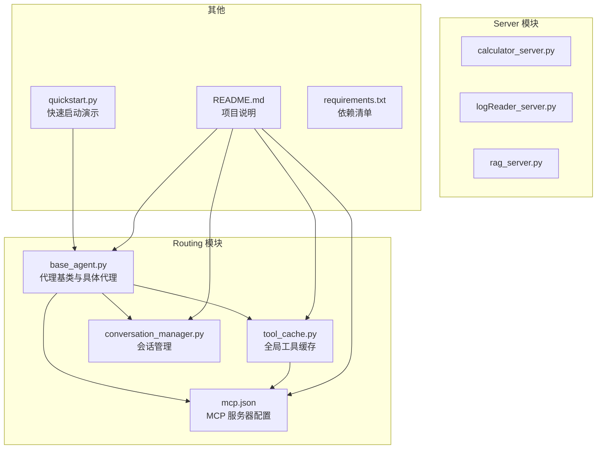
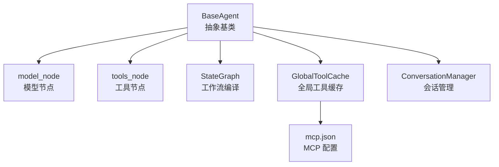
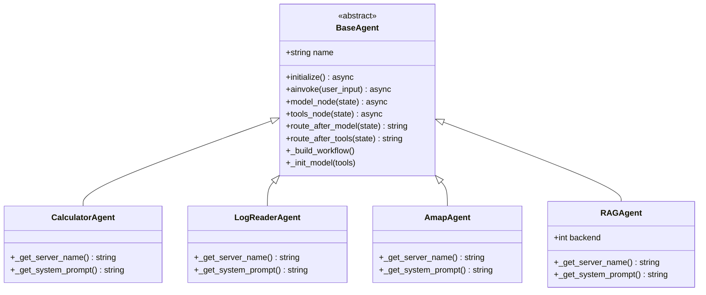
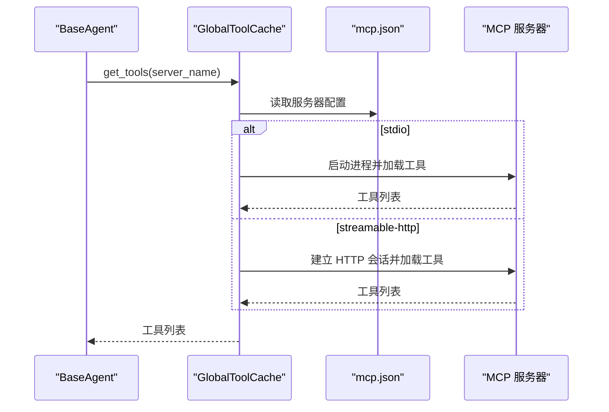
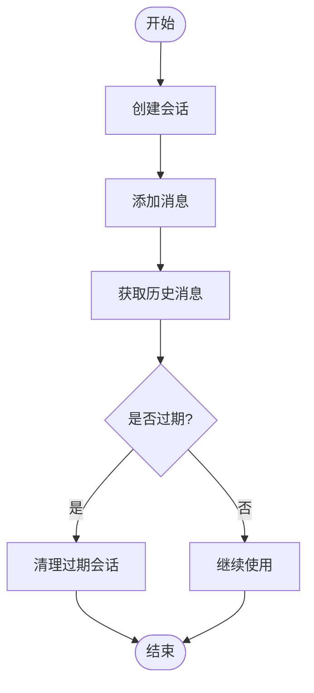
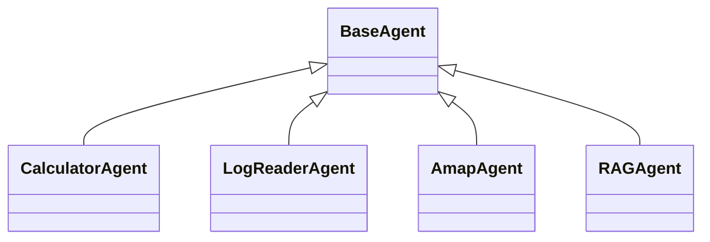
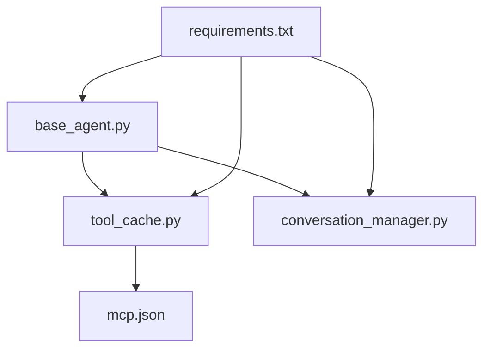

# 代理基类设计

<cite>
**本文档引用的文件**
- [base_agent.py](file://Routing/base_agent.py)
- [tool_cache.py](file://Routing/tool_cache.py)
- [conversation_manager.py](file://Routing/conversation_manager.py)
- [mcp.json](file://Routing/mcp.json)
- [calculator.py](file://Routing/calculator.py)
- [log_reader.py](file://Routing/log_reader.py)
- [amap.py](file://Routing/amap.py)
- [rag_agent.py](file://Routing/rag_agent.py)
- [README.md](file://README.md)
- [quickstart.py](file://quickstart.py)
- [requirements.txt](file://requirements.txt)
</cite>

## 目录
1. [简介](#简介)
2. [项目结构](#项目结构)
3. [核心组件](#核心组件)
4. [架构总览](#架构总览)
5. [详细组件分析](#详细组件分析)
6. [依赖关系分析](#依赖关系分析)
7. [性能考虑](#性能考虑)
8. [故障排除指南](#故障排除指南)
9. [结论](#结论)
10. [附录](#附录)

## 简介
本文件系统性阐述基于 LangGraph 的代理基类设计，重点围绕 BaseAgent 抽象基类的架构、核心接口、状态管理、工具加载策略、消息处理模式、与 MCP 客户端的集成方式、连接池管理与资源回收机制。同时提供继承基类创建自定义代理的实践指南、生命周期管理、错误处理与性能优化建议，以及常见陷阱与最佳实践。

## 项目结构
该项目采用模块化设计，将“工具与模型”、“状态定义”、“模型节点”、“工具节点”、“结束逻辑”、“构建与编译”六大职责分离，形成清晰的分层与解耦。Routing 模块为核心业务层，负责代理基类、工具缓存、会话管理与具体代理实现；Server 目录提供 MCP 服务器侧的工具实现；README 提供高层架构与使用说明。

**图表来源**
- [base_agent.py](file://Routing/base_agent.py)
- [tool_cache.py](file://Routing/tool_cache.py)
- [conversation_manager.py](file://Routing/conversation_manager.py)
- [mcp.json](file://Routing/mcp.json)
- [quickstart.py](file://quickstart.py)
- [README.md](file://README.md)
- [requirements.txt](file://requirements.txt)

**章节来源**
- [README.md](file://README.md)
- [base_agent.py](file://Routing/base_agent.py)
- [tool_cache.py](file://Routing/tool_cache.py)
- [conversation_manager.py](file://Routing/conversation_manager.py)
- [mcp.json](file://Routing/mcp.json)

## 核心组件
- BaseAgent 抽象基类：定义代理的统一初始化流程、状态结构、消息处理节点、工作流构建与执行入口，要求子类实现服务器名称与系统提示词。
- GlobalToolCache 全局工具缓存：集中管理 MCP 服务器连接与工具加载，支持 TTL 过期策略、线程安全访问、多传输协议（stdio/streamable-http）加载与会话管理。
- 会话管理器：提供多轮对话上下文管理、历史消息存储、Redis 持久化与过期清理。
- 具体代理实现：CalculatorAgent、LogReaderAgent、AmapAgent、RAGAgent，均继承 BaseAgent 并实现抽象方法。

**章节来源**
- [base_agent.py](file://Routing/base_agent.py)
- [tool_cache.py](file://Routing/tool_cache.py)
- [conversation_manager.py](file://Routing/conversation_manager.py)

## 架构总览
下图展示了代理基类与工具缓存、会话管理、MCP 配置之间的交互关系，以及 LangGraph 工作流的节点与路由。

**图表来源**
- [base_agent.py](file://Routing/base_agent.py)
- [tool_cache.py](file://Routing/tool_cache.py)
- [mcp.json](file://Routing/mcp.json)
- [conversation_manager.py](file://Routing/conversation_manager.py)

## 详细组件分析

### BaseAgent 抽象基类
- 角色与职责
  - 统一初始化：延迟初始化，按需加载工具、绑定模型、构建工作流。
  - 统一消息处理：定义模型节点与工具节点，实现条件路由与状态更新。
  - 统一错误处理：捕获模型调用与工具执行异常，记录错误并回传。
  - 统一执行入口：提供异步调用接口，封装状态构建与结果提取。
- 核心接口与抽象方法
  - _get_server_name：返回 MCP 服务器名称，用于从工具缓存获取对应工具集合。
  - _get_system_prompt：返回系统提示词，注入到消息流首条 SystemMessage。
- 状态结构（AgentState）
  - 包含消息列表、当前步骤、工具调用记录、工具执行结果、最终响应与错误信息。
- 节点与路由
  - 模型节点：若首条消息非 SystemMessage，则自动注入系统提示词；调用 LLM 并更新状态。
  - 工具节点：解析上一轮 AI 消息中的工具调用，按名称匹配缓存工具并执行，构造 ToolMessage 回写消息流。
  - 路由规则：模型节点根据是否存在工具调用决定进入工具节点或结束；工具节点执行完毕后回到模型节点继续推理。
- 工作流构建
  - 使用 StateGraph 定义节点与边，编译后通过 ainvoke 执行。
- 异步调用入口
  - ainvoke 接收用户输入，构建初始状态，执行工作流并提取最终响应或错误信息。

**图表来源**
- [base_agent.py](file://Routing/base_agent.py)

**章节来源**
- [base_agent.py](file://Routing/base_agent.py)

### 工具缓存与 MCP 集成
- 全局缓存策略
  - 单例模式，基于服务器名称的 TTL 缓存，避免重复加载工具与连接。
  - 线程安全：使用锁保护并发访问。
- 传输协议支持
  - stdio：通过命令与参数启动外部进程，使用 MultiServerMCPClient 管理连接。
  - streamable-http：通过 HTTP URL 建立会话，支持超时控制与连接初始化。
- 会话管理与资源回收
  - 保存会话引用，支持清理指定服务器的缓存与会话；提供清空所有缓存的方法。
  - 在清理过程中静默处理异常，避免影响主流程。
- 配置加载
  - 从 mcp.json 中读取各服务器的传输类型、命令/URL、参数等配置。

**图表来源**
- [tool_cache.py](file://Routing/tool_cache.py)
- [mcp.json](file://Routing/mcp.json)

**章节来源**
- [tool_cache.py](file://Routing/tool_cache.py)
- [mcp.json](file://Routing/mcp.json)

### 会话管理机制
- 会话对象
  - 支持添加消息、获取历史与近期消息、判断过期、清理与统计。
- 会话管理器
  - 单例模式，支持内存与 Redis 双层持久化；自动清理过期会话；提供创建、获取、删除、清理等操作。
- 与代理的关系
  - 代理在执行前可结合会话管理器获取上下文消息，增强多轮对话体验。

**图表来源**
- [conversation_manager.py](file://Routing/conversation_manager.py)

**章节来源**
- [conversation_manager.py](file://Routing/conversation_manager.py)

### 具体代理实现与工厂函数
- CalculatorAgent：面向数学链式计算，强调严格按工具调用顺序与优先级执行。
- LogReaderAgent：面向日志读取与分析，强调错误与警告信息的总结。
- AmapAgent：面向地图服务，提供天气、地理编码、路径规划等能力。
- RAGAgent：面向知识库检索，支持本地 ChromaDB 与远程 Milvus 后端切换。
- 工厂函数：提供便捷的异步初始化与返回代理实例，保持向后兼容。

**图表来源**
- [base_agent.py](file://Routing/base_agent.py)

**章节来源**
- [base_agent.py](file://Routing/base_agent.py)
- [calculator.py](file://Routing/calculator.py)
- [log_reader.py](file://Routing/log_reader.py)
- [amap.py](file://Routing/amap.py)
- [rag_agent.py](file://Routing/rag_agent.py)

## 依赖关系分析
- 外部依赖
  - LangChain/LangGraph：消息模型、状态图与编译执行。
  - langchain-mcp-adapters：MCP 工具加载与客户端适配。
  - FastMCP/mcp：底层 MCP 协议支持。
  - Redis、ChromaDB、PyMilvus：会话持久化与向量检索。
- 内部模块依赖
  - BaseAgent 依赖 GlobalToolCache 与会话管理器。
  - GlobalToolCache 依赖 mcp.json 配置与 MCP 客户端。
  - 具体代理依赖 BaseAgent。

**图表来源**
- [base_agent.py](file://Routing/base_agent.py)
- [tool_cache.py](file://Routing/tool_cache.py)
- [conversation_manager.py](file://Routing/conversation_manager.py)
- [mcp.json](file://Routing/mcp.json)
- [requirements.txt](file://requirements.txt)

**章节来源**
- [requirements.txt](file://requirements.txt)
- [base_agent.py](file://Routing/base_agent.py)
- [tool_cache.py](file://Routing/tool_cache.py)
- [conversation_manager.py](file://Routing/conversation_manager.py)
- [mcp.json](file://Routing/mcp.json)

## 性能考虑
- 延迟初始化：仅在首次调用时初始化模型与工作流，减少冷启动开销。
- 工具缓存：基于 TTL 的全局缓存避免重复加载 MCP 工具，降低 I/O 与连接成本。
- 传输协议选择：stdio 适合本地工具，streamable-http 适合远程服务；合理选择可提升响应速度。
- 超时控制：HTTP 传输设置超时，防止阻塞；工具执行结果按需提取，避免冗余数据回传。
- 并发安全：缓存访问使用锁，避免竞态条件。
- 会话清理：定期清理过期会话，释放内存与持久化空间。

[本节为通用性能指导，无需特定文件引用]

## 故障排除指南
- 工具加载失败
  - 检查 mcp.json 中服务器配置是否正确，传输协议与参数是否匹配。
  - 确认 stdio 命令与参数路径有效，必要时进行相对路径转换。
  - 对于 streamable-http，确认网络可达与超时设置合理。
- 连接池与资源回收
  - 若出现连接泄漏，检查 GlobalToolCache 的清理逻辑是否被调用。
  - 对于 HTTP 会话，确认 __aexit__ 调用成功；stdio 客户端需显式 close。
- 模型调用异常
  - 捕获异常并记录错误信息，确保状态中 error 字段被正确填充。
  - 检查系统提示词注入逻辑，确保首条消息为 SystemMessage。
- 工具执行异常
  - 工具名称匹配失败时抛出明确错误；工具返回结构需符合预期，必要时提取 result 字段。
- 会话问题
  - Redis 初始化失败时自动降级为内存模式；检查 Redis 连接配置与可用性。
  - 定期调用清理过期会话，避免内存膨胀。

**章节来源**
- [tool_cache.py](file://Routing/tool_cache.py)
- [base_agent.py](file://Routing/base_agent.py)
- [conversation_manager.py](file://Routing/conversation_manager.py)

## 结论
BaseAgent 通过抽象与模板方法模式，将工具加载、消息处理、状态管理与工作流编译进行统一封装，显著降低了子类实现复杂度。配合 GlobalToolCache 的全局缓存与会话管理器的上下文持久化，系统在可扩展性、性能与可靠性方面达到良好平衡。遵循本文的最佳实践与故障排除建议，可高效构建稳定、可维护的多代理系统。

[本节为总结性内容，无需特定文件引用]

## 附录

### 如何继承基类创建自定义代理
- 步骤
  - 新建类继承 BaseAgent，实现 _get_server_name 与 _get_system_prompt。
  - 在初始化时设置代理名称（可复用父类构造逻辑）。
  - 如需特殊工具参数或后端配置，可在构造函数中接收并传递给系统提示词。
  - 通过工厂函数或直接实例化并调用 initialize 完成延迟初始化。
- 示例参考路径
  - [CalculatorAgent 实现](file://Routing/base_agent.py)
  - [LogReaderAgent 实现](file://Routing/base_agent.py)
  - [AmapAgent 实现](file://Routing/base_agent.py)
  - [RAGAgent 实现](file://Routing/base_agent.py)

**章节来源**
- [base_agent.py](file://Routing/base_agent.py)

### 代理生命周期管理
- 初始化阶段：initialize 延迟执行，加载工具、绑定模型、构建并编译工作流。
- 执行阶段：ainvoke 构建初始状态，驱动工作流循环（模型→工具→模型），直至无工具调用或异常。
- 清理阶段：可通过 GlobalToolCache.clear_all 清空缓存与会话；会话管理器定期清理过期会话。

**章节来源**
- [base_agent.py](file://Routing/base_agent.py)
- [tool_cache.py](file://Routing/tool_cache.py)
- [conversation_manager.py](file://Routing/conversation_manager.py)

### 错误处理机制
- 模型节点：捕获 LLM 调用异常，设置错误状态并终止流程。
- 工具节点：逐个工具执行并记录结果或错误，构造 ToolMessage 回写消息流。
- 工厂函数：包装初始化过程，确保异常可被上层感知。

**章节来源**
- [base_agent.py](file://Routing/base_agent.py)

### 性能优化策略
- 使用全局工具缓存与 TTL 控制，避免重复加载。
- 合理设置 LLM 参数（温度、模型、基础 URL）以平衡准确性与速度。
- 对工具返回进行精简（仅提取 result 字段），减少上下文噪声。
- 会话历史长度限制与过期清理，降低状态膨胀。

**章节来源**
- [tool_cache.py](file://Routing/tool_cache.py)
- [conversation_manager.py](file://Routing/conversation_manager.py)
- [base_agent.py](file://Routing/base_agent.py)

### 最佳实践与常见陷阱
- 最佳实践
  - 明确系统提示词边界，避免过度泛化导致工具调用不精确。
  - 为每个代理定义稳定的服务器名称与提示词，便于缓存命中与一致性。
  - 在工具执行前校验工具名称与参数，提前发现配置错误。
  - 使用工厂函数或统一入口管理代理生命周期，避免重复初始化。
- 常见陷阱
  - 忽视 MCP 配置文件路径与环境变量替换，导致工具加载失败。
  - 未处理工具返回结构差异，导致后续推理异常。
  - 忘记清理缓存与会话，造成资源泄漏与内存增长。
  - 在 streamable-http 传输中未设置超时，导致长时间阻塞。

**章节来源**
- [tool_cache.py](file://Routing/tool_cache.py)
- [mcp.json](file://Routing/mcp.json)
- [base_agent.py](file://Routing/base_agent.py)
- [conversation_manager.py](file://Routing/conversation_manager.py)