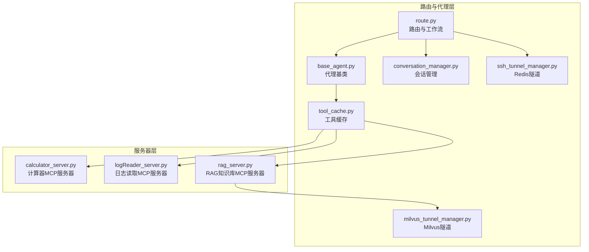
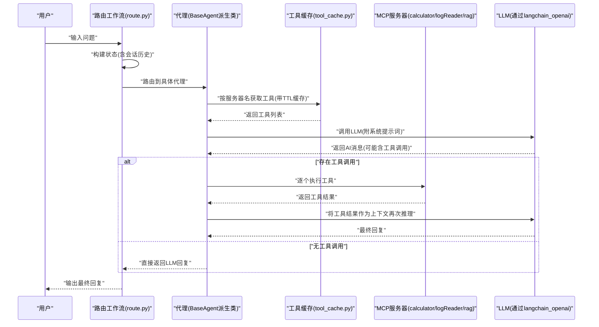
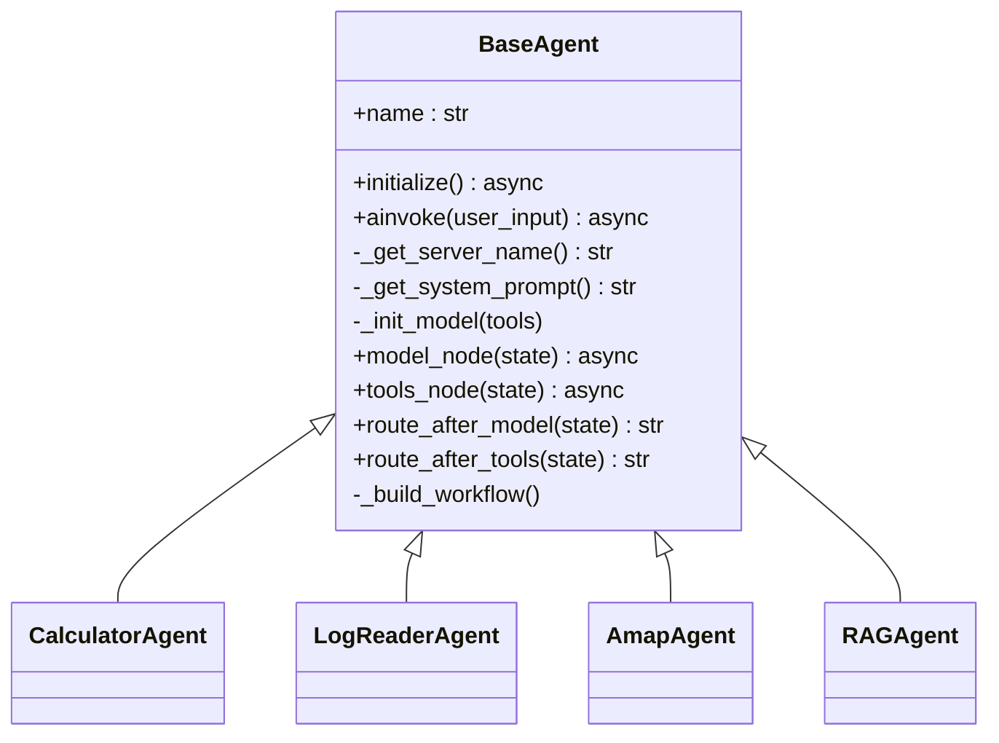
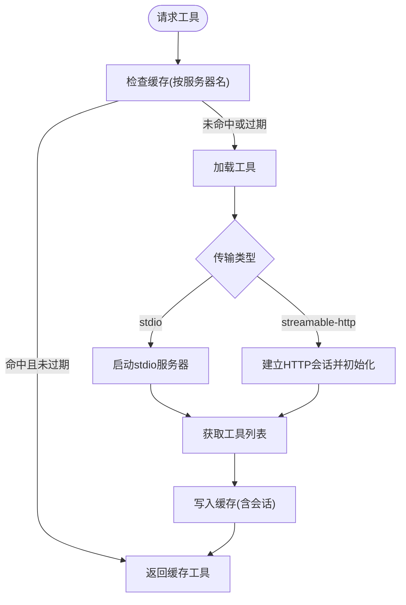
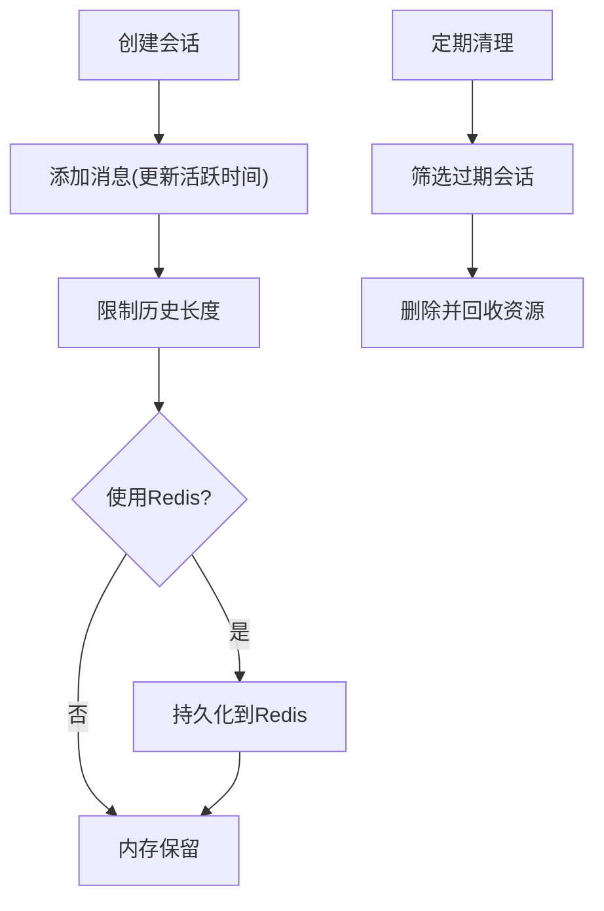
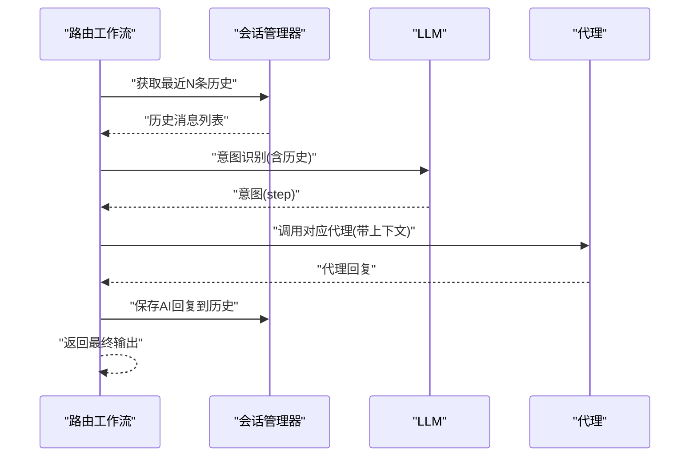
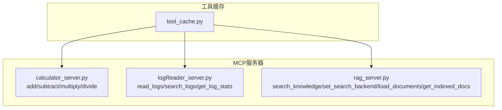
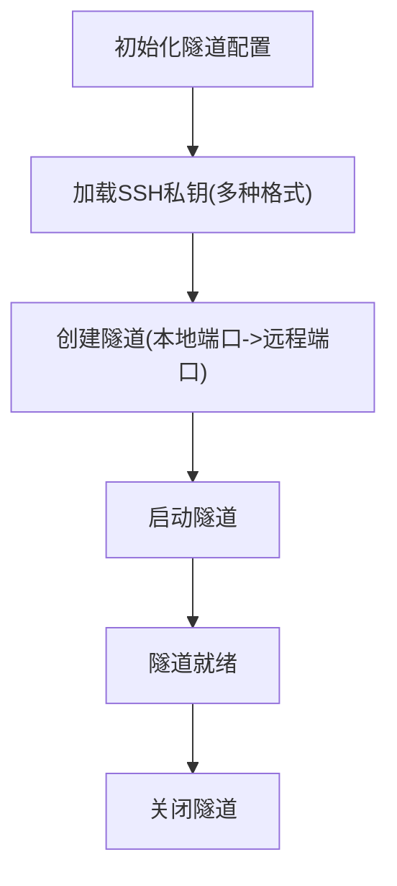
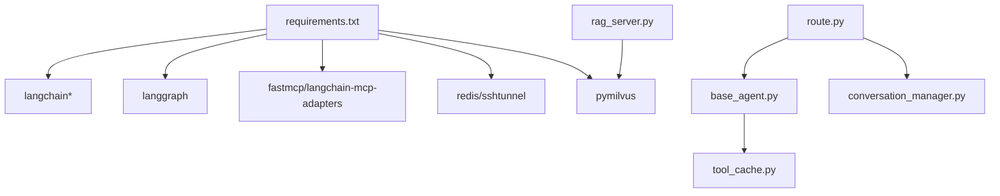

# 代理系统

<cite>
**本文档引用的文件**   
- [base_agent.py](file://Routing/base_agent.py)
- [tool_cache.py](file://Routing/tool_cache.py)
- [conversation_manager.py](file://Routing/conversation_manager.py)
- [route.py](file://Routing/route.py)
- [mcp.json](file://Routing/mcp.json)
- [calculator_server.py](file://Server/calculator_server.py)
- [logReader_server.py](file://Server/logReader_server.py)
- [rag_server.py](file://Server/rag_server.py)
- [amap.py](file://Routing/amap.py)
- [calculator.py](file://Routing/calculator.py)
- [log_reader.py](file://Routing/log_reader.py)
- [rag_agent.py](file://Routing/rag_agent.py)
- [ssh_tunnel_manager.py](file://Routing/ssh_tunnel_manager.py)
- [milvus_tunnel_manager.py](file://Routing/milvus_tunnel_manager.py)
- [quickstart.py](file://quickstart.py)
- [demo_conversation.py](file://demo_conversation.py)
- [README.md](file://README.md)
- [requirements.txt](file://requirements.txt)
</cite>

## 目录
1. [简介](#简介)
2. [项目结构](#项目结构)
3. [核心组件](#核心组件)
4. [架构总览](#架构总览)
5. [详细组件分析](#详细组件分析)
6. [依赖分析](#依赖分析)
7. [性能考虑](#性能考虑)
8. [故障排除指南](#故障排除指南)
9. [结论](#结论)
10. [附录](#附录)

## 简介
本代理系统基于 Model Context Protocol（MCP）协议，采用 LangGraph 工作流引擎，实现了“意图识别 + 代理路由 + 工具调用”的完整闭环。系统通过统一的代理基类、全局工具缓存、会话管理与 SSH 隧道，支撑计算器、日志读取、高德地图、RAG 知识库等多种专业代理，具备良好的扩展性与稳定性。

## 项目结构
- 路由与代理层（Routing）：负责意图识别、代理路由、会话管理、工具缓存、SSH 隧道等
- 服务器层（Server）：提供 MCP 工具服务器（计算器、日志读取、RAG 知识库）
- 快速启动与演示：提供快速启动脚本与循环对话演示脚本
- 配置与依赖：MCP 服务器配置、依赖清单、README

**图表来源**
- [route.py:1-553](file://Routing/route.py#L1-L553)
- [base_agent.py:1-497](file://Routing/base_agent.py#L1-L497)
- [tool_cache.py:1-302](file://Routing/tool_cache.py#L1-L302)
- [conversation_manager.py:1-275](file://Routing/conversation_manager.py#L1-L275)
- [ssh_tunnel_manager.py:1-100](file://Routing/ssh_tunnel_manager.py#L1-L100)
- [milvus_tunnel_manager.py:1-101](file://Routing/milvus_tunnel_manager.py#L1-L101)
- [calculator_server.py:1-111](file://Server/calculator_server.py#L1-L111)
- [logReader_server.py:1-151](file://Server/logReader_server.py#L1-L151)
- [rag_server.py:1-363](file://Server/rag_server.py#L1-L363)

**章节来源**
- [README.md:1-125](file://README.md#L1-L125)
- [requirements.txt:1-17](file://requirements.txt#L1-L17)

## 核心组件
- 代理基类与具体代理
  - 代理基类提供统一的工具加载、消息处理、错误处理与工作流构建；具体代理（计算器、日志读取、高德地图、RAG）通过继承扩展服务器名与系统提示词
- 全局工具缓存
  - 以服务器名为键的 TTL 缓存，支持 stdio 与 streamable-http 两种传输协议，自动管理连接与清理
- 会话管理
  - 支持内存与 Redis 持久化，提供多轮对话上下文、过期清理、统计查询
- 路由与工作流
  - 基于 LangGraph 的路由工作流，结合历史上下文进行意图识别，动态路由到对应代理
- MCP 服务器
  - 提供计算器、日志读取、RAG 知识库等工具，支持本地 stdio 与高德地图 streamable-http

**章节来源**
- [base_agent.py:29-497](file://Routing/base_agent.py#L29-L497)
- [tool_cache.py:39-302](file://Routing/tool_cache.py#L39-L302)
- [conversation_manager.py:82-275](file://Routing/conversation_manager.py#L82-L275)
- [route.py:149-291](file://Routing/route.py#L149-L291)
- [mcp.json:1-29](file://Routing/mcp.json#L1-L29)

## 架构总览
系统采用“路由层 + 代理层 + 工具层”的三层架构。路由层负责意图识别与工作流编排；代理层负责与 LLM 交互、工具调用与状态管理；工具层通过 MCP 协议提供外部能力。

**图表来源**
- [route.py:351-414](file://Routing/route.py#L351-L414)
- [base_agent.py:102-318](file://Routing/base_agent.py#L102-L318)
- [tool_cache.py:85-140](file://Routing/tool_cache.py#L85-L140)
- [calculator_server.py:16-105](file://Server/calculator_server.py#L16-L105)
- [logReader_server.py:18-102](file://Server/logReader_server.py#L18-L102)
- [rag_server.py:193-244](file://Server/rag_server.py#L193-L244)

## 详细组件分析

### 代理基类与具体代理
- 设计要点
  - 统一工具加载：通过全局工具缓存按服务器名获取工具，避免重复加载
  - 统一消息处理：在模型节点注入系统提示词，工具节点执行工具调用并将结果以 ToolMessage 形式回传
  - 统一错误处理：捕获模型调用与工具执行异常，记录错误并回传
  - 工作流编排：使用 LangGraph StateGraph 定义“模型节点 -> 工具节点 -> 模型节点”循环
- 关键流程
  - 初始化：延迟初始化，首次使用时加载工具并编译工作流
  - 推理：若 AI 消息包含工具调用，则进入工具节点执行；否则结束
  - 结果：提取最终 AI 回复或错误信息

**图表来源**
- [base_agent.py:29-497](file://Routing/base_agent.py#L29-L497)

**章节来源**
- [base_agent.py:44-66](file://Routing/base_agent.py#L44-L66)
- [base_agent.py:102-130](file://Routing/base_agent.py#L102-L130)
- [base_agent.py:131-217](file://Routing/base_agent.py#L131-L217)
- [base_agent.py:238-256](file://Routing/base_agent.py#L238-L256)
- [base_agent.py:322-401](file://Routing/base_agent.py#L322-L401)
- [base_agent.py:403-416](file://Routing/base_agent.py#L403-L416)
- [base_agent.py:418-431](file://Routing/base_agent.py#L418-L431)
- [base_agent.py:433-463](file://Routing/base_agent.py#L433-L463)

### 全局工具缓存
- 设计要点
  - 单例缓存：按服务器名缓存工具与会话，支持 TTL 过期
  - 多传输协议：支持 stdio 与 streamable-http，自动解析环境变量与相对路径
  - 连接管理：保存会话引用，提供清理接口，避免资源泄露
- 关键流程
  - 获取工具：命中缓存直接返回；过期或首次加载时，按配置启动服务器并加载工具
  - 清理：显式清理或应用关闭时批量关闭会话与传输

**图表来源**
- [tool_cache.py:85-140](file://Routing/tool_cache.py#L85-L140)
- [tool_cache.py:141-243](file://Routing/tool_cache.py#L141-L243)
- [tool_cache.py:244-290](file://Routing/tool_cache.py#L244-L290)

**章节来源**
- [tool_cache.py:39-66](file://Routing/tool_cache.py#L39-L66)
- [tool_cache.py:85-117](file://Routing/tool_cache.py#L85-L117)
- [tool_cache.py:118-140](file://Routing/tool_cache.py#L118-L140)
- [tool_cache.py:141-243](file://Routing/tool_cache.py#L141-L243)
- [tool_cache.py:244-290](file://Routing/tool_cache.py#L244-L290)

### 会话管理
- 设计要点
  - 单例模式：全局会话管理器，支持内存与 Redis 持久化
  - 上下文保留：限制历史长度，提供最近 N 条消息接口
  - 过期清理：定时清理过期会话，支持 Redis 侧清理
- 关键流程
  - 创建会话：自动生成 ID，必要时持久化
  - 添加消息：更新活跃时间，限制历史长度
  - 清理：内存与 Redis 双通道清理

**图表来源**
- [conversation_manager.py:122-147](file://Routing/conversation_manager.py#L122-L147)
- [conversation_manager.py:166-184](file://Routing/conversation_manager.py#L166-L184)
- [conversation_manager.py:234-253](file://Routing/conversation_manager.py#L234-L253)

**章节来源**
- [conversation_manager.py:82-121](file://Routing/conversation_manager.py#L82-L121)
- [conversation_manager.py:122-184](file://Routing/conversation_manager.py#L122-L184)
- [conversation_manager.py:234-275](file://Routing/conversation_manager.py#L234-L275)

### 路由与工作流
- 设计要点
  - 意图识别：基于 LLM 的结构化输出，结合历史上下文判断
  - 动态路由：根据意图路由到计算器、日志读取、高德地图或 RAG 知识库代理
  - 循环对话：通过会话管理器保留上下文，支持多轮对话
- 关键流程
  - 构建输入：将历史消息拼接到当前输入，形成带上下文的输入
  - 路由决策：调用 LLM 识别意图，返回目标节点
  - 执行与收尾：调用对应代理，保存 AI 回复，返回最终结果

**图表来源**
- [route.py:149-234](file://Routing/route.py#L149-L234)
- [route.py:351-414](file://Routing/route.py#L351-L414)

**章节来源**
- [route.py:149-234](file://Routing/route.py#L149-L234)
- [route.py:258-291](file://Routing/route.py#L258-L291)
- [route.py:351-414](file://Routing/route.py#L351-L414)

### MCP 服务器与工具
- 计算器服务器
  - 提供加减乘除工具，返回结构化结果
- 日志读取服务器
  - 提供读取最新日志、关键词搜索、统计信息等工具
- RAG 知识库服务器
  - 提供知识检索、切换后端、加载文档、统计信息等工具；支持本地 ChromaDB 与远程 Milvus（通过 SSH 隧道）

**图表来源**
- [calculator_server.py:16-105](file://Server/calculator_server.py#L16-L105)
- [logReader_server.py:18-145](file://Server/logReader_server.py#L18-L145)
- [rag_server.py:193-353](file://Server/rag_server.py#L193-L353)

**章节来源**
- [calculator_server.py:16-105](file://Server/calculator_server.py#L16-L105)
- [logReader_server.py:18-145](file://Server/logReader_server.py#L18-L145)
- [rag_server.py:193-353](file://Server/rag_server.py#L193-L353)

### SSH 隧道与远程服务
- Redis 隧道
  - 通过 SSH 私钥建立本地到远程 Redis 的隧道，支持多种密钥格式
- Milvus 隧道
  - 与 Redis 隧道类似，用于连接远程 Milvus gRPC 服务

**图表来源**
- [ssh_tunnel_manager.py:19-81](file://Routing/ssh_tunnel_manager.py#L19-L81)
- [milvus_tunnel_manager.py:20-89](file://Routing/milvus_tunnel_manager.py#L20-L89)

**章节来源**
- [ssh_tunnel_manager.py:12-100](file://Routing/ssh_tunnel_manager.py#L12-L100)
- [milvus_tunnel_manager.py:14-101](file://Routing/milvus_tunnel_manager.py#L14-L101)

## 依赖分析
- 外部依赖
  - LangChain/LangGraph：工作流与消息模型
  - fastmcp/langchain-mcp-adapters：MCP 客户端与工具加载
  - DashScope API：LLM 服务
  - Redis/sshtunnel/pymilvus：会话持久化与远程服务访问
- 内部耦合
  - 路由工作流依赖代理工厂函数与会话管理器
  - 代理基类依赖工具缓存与 LLM
  - RAG 服务器依赖 Milvus 隧道管理器（可选）

**图表来源**
- [requirements.txt:1-17](file://requirements.txt#L1-L17)
- [route.py:14-29](file://Routing/route.py#L14-L29)
- [base_agent.py:68-88](file://Routing/base_agent.py#L68-L88)
- [rag_server.py:17-33](file://Server/rag_server.py#L17-L33)

**章节来源**
- [requirements.txt:1-17](file://requirements.txt#L1-L17)
- [route.py:14-29](file://Routing/route.py#L14-L29)

## 性能考虑
- 工具缓存
  - 通过 TTL 缓存减少重复加载 MCP 服务器的成本，建议合理设置 TTL（默认 300 秒）
- 会话管理
  - 控制历史消息数量，避免上下文过长导致推理成本上升
- 并发与清理
  - 代理与工具节点异步执行，工作流结束后及时清理缓存与会话，防止资源泄漏
- 远程服务
  - Redis 与 Milvus 通过 SSH 隧道访问，注意隧道建立与关闭的时机，避免频繁重建

[本节为通用指导，无需特定文件来源]

## 故障排除指南
- 环境变量与配置
  - 确认 .env 中包含必要的 API Key（DashScope、高德地图等）
  - MCP 服务器配置文件路径与权限正确
- 工具加载失败
  - 检查传输协议与命令参数，stdio 服务器路径是否可执行，streamable-http URL 是否可达
  - 观察工具缓存的清理日志，确认会话与传输是否正常关闭
- 会话异常
  - 若使用 Redis，确认隧道已建立且凭据正确；查看会话清理日志
- LLM 调用异常
  - 检查系统提示词与消息格式；代理基类会捕获异常并回传错误信息
- RAG 后端切换
  - 使用 RAG 服务器的后端切换工具，确认当前后端与 Milvus 可用性

**章节来源**
- [tool_cache.py:194-196](file://Routing/tool_cache.py#L194-L196)
- [tool_cache.py:240-242](file://Routing/tool_cache.py#L240-L242)
- [conversation_manager.py:234-253](file://Routing/conversation_manager.py#L234-L253)
- [base_agent.py:122-129](file://Routing/base_agent.py#L122-L129)
- [rag_server.py:247-277](file://Server/rag_server.py#L247-L277)

## 结论
该代理系统通过统一的代理基类、全局工具缓存与会话管理，实现了稳定高效的“意图识别 + 工具调用”闭环。配合 MCP 服务器与 SSH 隧道，系统既支持本地工具，也能安全访问远程服务。通过合理的缓存策略、会话控制与资源清理，系统在可扩展性与性能之间取得了良好平衡。

[本节为总结性内容，无需特定文件来源]

## 附录

### 如何创建自定义代理
- 继承代理基类，实现服务器名与系统提示词
- 在 MCP 服务器中注册相应工具
- 在路由配置中添加服务器信息
- 通过工厂函数或直接实例化使用

**章节来源**
- [base_agent.py:322-463](file://Routing/base_agent.py#L322-L463)
- [mcp.json:1-29](file://Routing/mcp.json#L1-L29)

### 如何配置代理行为
- LLM 参数：通过环境变量设置基础 URL、模型名与温度
- 工具缓存：调整 TTL 以平衡性能与新鲜度
- 会话管理：设置最大历史条数与会话超时时间

**章节来源**
- [base_agent.py:73-85](file://Routing/base_agent.py#L73-L85)
- [tool_cache.py:62](file://Routing/tool_cache.py#L62)
- [conversation_manager.py:104-106](file://Routing/conversation_manager.py#L104-L106)

### 如何扩展代理功能
- 新增 MCP 工具：在对应服务器中添加工具函数并导出
- 新增代理类型：继承基类并实现路由与提示词
- 新增后端：在 RAG 服务器中扩展向量库支持

**章节来源**
- [calculator_server.py:16-105](file://Server/calculator_server.py#L16-L105)
- [logReader_server.py:18-145](file://Server/logReader_server.py#L18-L145)
- [rag_server.py:193-353](file://Server/rag_server.py#L193-L353)

### 生命周期管理与清理
- 应用关闭时调用清理接口，确保工具缓存、会话、Redis 与 SSH 隧道全部释放

**章节来源**
- [route.py:434-456](file://Routing/route.py#L434-L456)

### 调试方法
- 快速启动脚本：验证工具加载与基本对话
- 循环对话演示：观察工具缓存与上下文保持效果
- 日志与统计：查看缓存统计、会话统计与错误日志

**章节来源**
- [quickstart.py:8-68](file://quickstart.py#L8-L68)
- [demo_conversation.py:19-102](file://demo_conversation.py#L19-L102)
- [route.py:511-517](file://Routing/route.py#L511-L517)