# 地图代理

<cite>
**本文档引用的文件**
- [amap.py](file://Routing/amap.py)
- [base_agent.py](file://Routing/base_agent.py)
- [tool_cache.py](file://Routing/tool_cache.py)
- [route.py](file://Routing/route.py)
- [mcp.json](file://Routing/mcp.json)
- [test_amap.py](file://test/test_amap.py)
- [test_route_weather.py](file://test/test_route_weather.py)
- [conversation_manager.py](file://Routing/conversation_manager.py)
- [redis_session_store.py](file://Routing/redis_session_store.py)
- [requirements.txt](file://requirements.txt)
</cite>

## 目录
1. [简介](#简介)
2. [项目结构](#项目结构)
3. [核心组件](#核心组件)
4. [架构概览](#架构概览)
5. [详细组件分析](#详细组件分析)
6. [依赖关系分析](#依赖关系分析)
7. [性能考虑](#性能考虑)
8. [故障排除指南](#故障排除指南)
9. [结论](#结论)
10. [附录](#附录)

## 简介

地图代理（AmapAgent）是基于 LangGraph 架构的智能地图服务代理，专门处理高德地图 MCP 服务器的交互。该代理实现了完整的地理编码、路径规划、天气查询和 POI 搜索功能，通过统一的工具缓存机制和会话管理系统，为用户提供无缝的地图服务体验。

地图代理的核心优势包括：
- **统一工具加载**：通过全局工具缓存避免重复连接 MCP 服务器
- **智能路由**：根据用户输入自动识别地图相关需求
- **多服务器支持**：同时支持多种 MCP 服务器（计算器、日志读取、高德地图等）
- **会话管理**：支持多轮对话和历史上下文保持
- **错误处理**：完善的异常捕获和重试机制

## 项目结构

地图代理位于 Routing 模块中，采用模块化设计，主要文件结构如下：

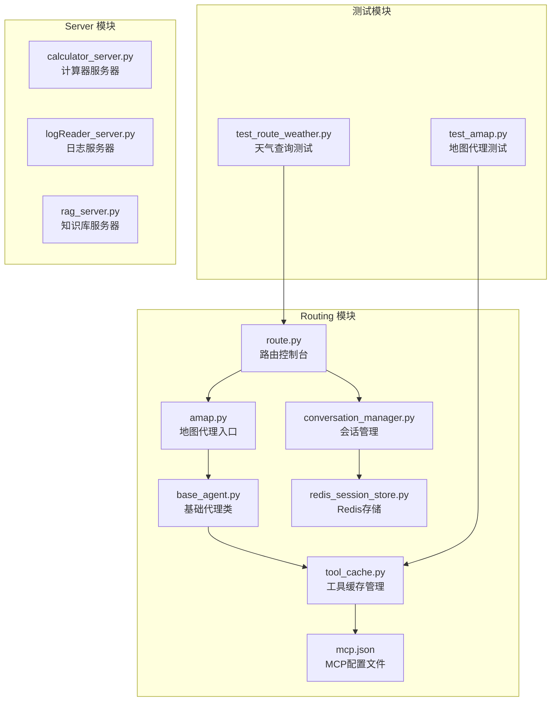

**图表来源**
- [amap.py:1-11](file://Routing/amap.py#L1-L11)
- [base_agent.py:1-497](file://Routing/base_agent.py#L1-L497)
- [tool_cache.py:1-302](file://Routing/tool_cache.py#L1-L302)
- [route.py:1-553](file://Routing/route.py#L1-L553)

**章节来源**
- [amap.py:1-11](file://Routing/amap.py#L1-L11)
- [base_agent.py:1-497](file://Routing/base_agent.py#L1-L497)
- [tool_cache.py:1-302](file://Routing/tool_cache.py#L1-L302)
- [route.py:1-553](file://Routing/route.py#L1-L553)

## 核心组件

### AmapAgent 类

AmapAgent 是地图代理的核心实现，继承自 BaseAgent 基类，专门处理高德地图相关的请求。

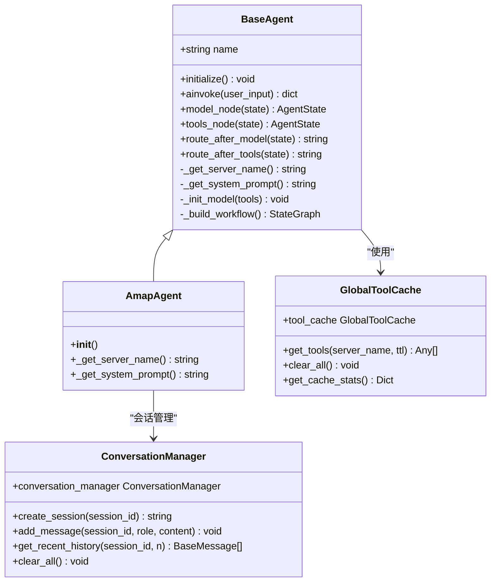

**图表来源**
- [base_agent.py:418-431](file://Routing/base_agent.py#L418-L431)
- [base_agent.py:481-485](file://Routing/base_agent.py#L481-L485)
- [tool_cache.py:39-66](file://Routing/tool_cache.py#L39-L66)
- [conversation_manager.py:82-121](file://Routing/conversation_manager.py#L82-L121)

### 工具缓存系统

工具缓存系统是地图代理的关键基础设施，提供了高效的 MCP 服务器连接管理和工具缓存功能。

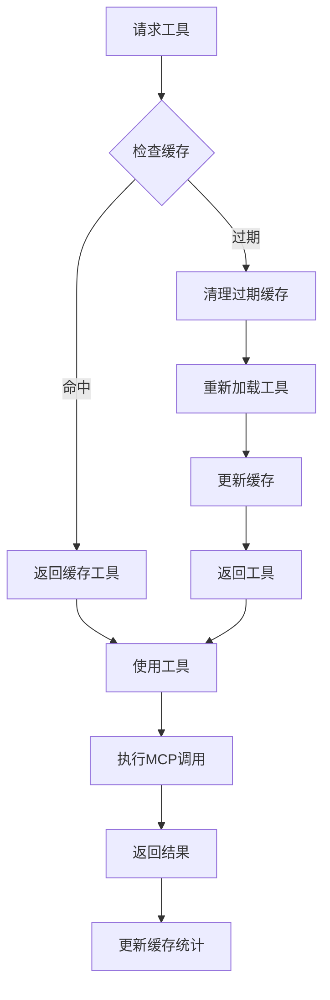

**图表来源**
- [tool_cache.py:85-117](file://Routing/tool_cache.py#L85-L117)
- [tool_cache.py:118-140](file://Routing/tool_cache.py#L118-L140)

**章节来源**
- [base_agent.py:418-431](file://Routing/base_agent.py#L418-L431)
- [tool_cache.py:39-302](file://Routing/tool_cache.py#L39-L302)

## 架构概览

地图代理采用分层架构设计，通过 LangGraph 实现智能路由和工具调用。

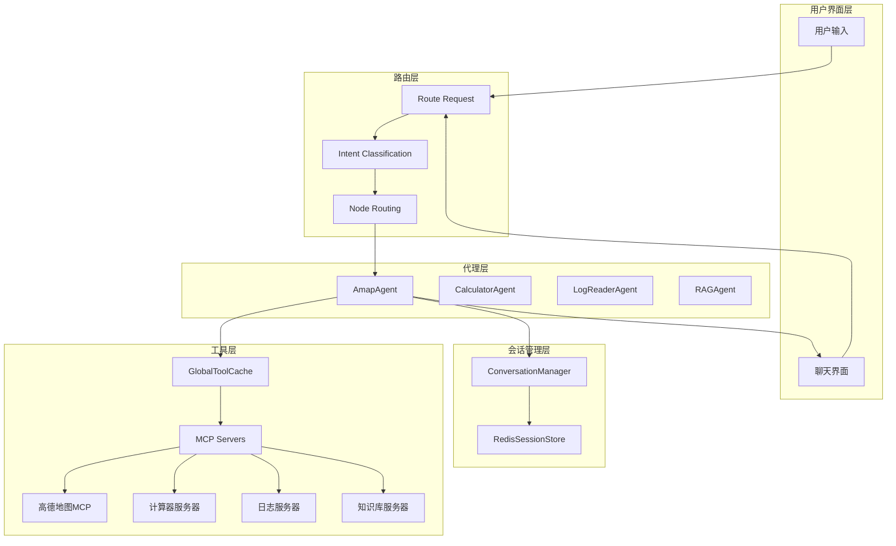

**图表来源**
- [route.py:149-256](file://Routing/route.py#L149-L256)
- [base_agent.py:238-257](file://Routing/base_agent.py#L238-L257)
- [tool_cache.py:118-140](file://Routing/tool_cache.py#L118-L140)

## 详细组件分析

### 地图代理实现原理

地图代理基于 LangGraph 的状态机架构，实现了智能的工具调用和结果处理。

#### 初始化流程

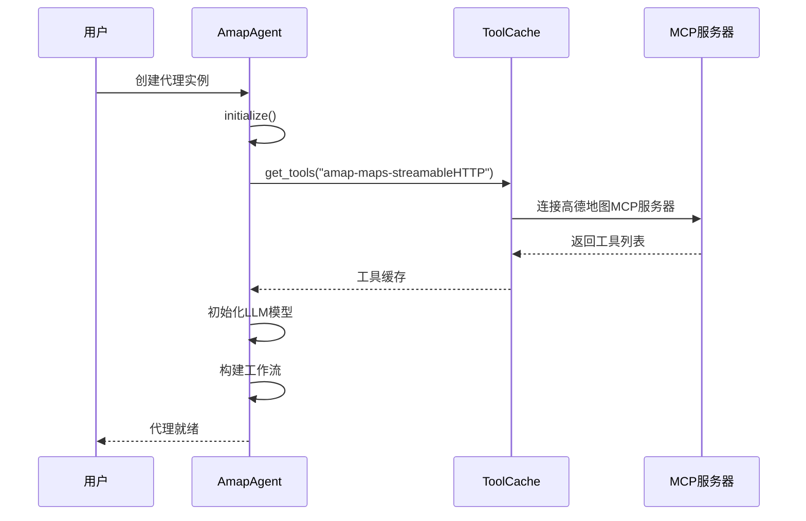

**图表来源**
- [base_agent.py:44-66](file://Routing/base_agent.py#L44-L66)
- [tool_cache.py:85-117](file://Routing/tool_cache.py#L85-L117)

#### 工具调用流程

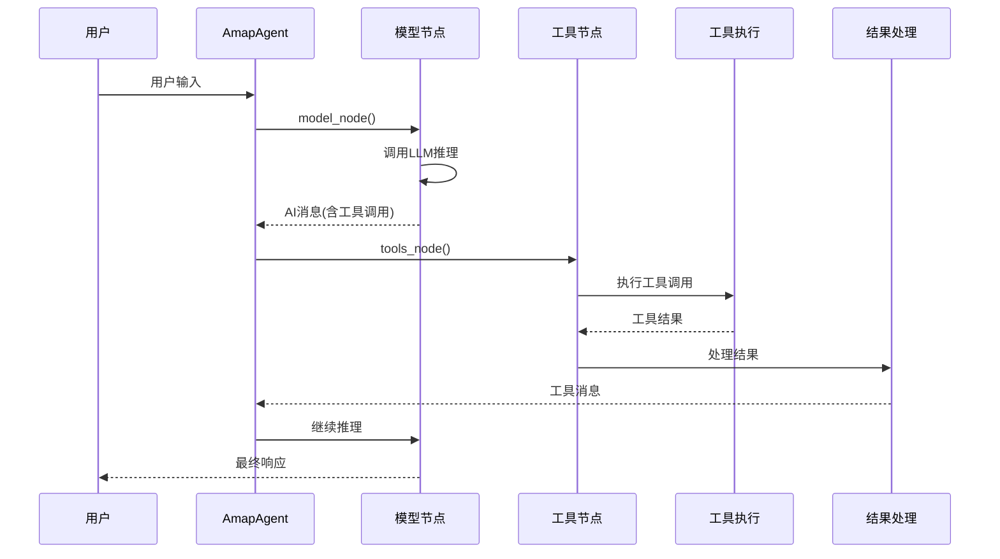

**图表来源**
- [base_agent.py:102-130](file://Routing/base_agent.py#L102-L130)
- [base_agent.py:131-217](file://Routing/base_agent.py#L131-L217)

### 地理编码逻辑

地图代理支持多种地理编码场景，包括地址解析、坐标转换和反地理编码。

#### 地址解析流程

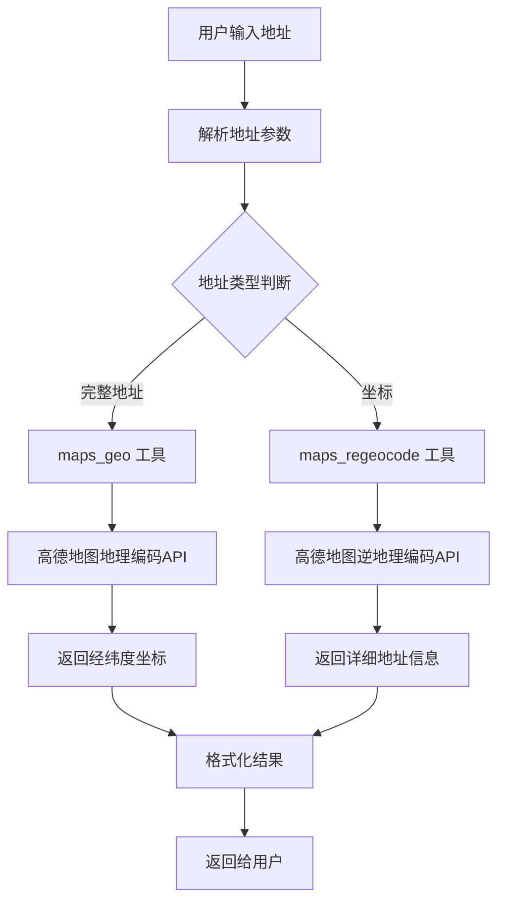

**图表来源**
- [mcp.json:3-6](file://Routing/mcp.json#L3-L6)

### 路径规划功能

地图代理提供多种出行方式的路径规划服务，包括驾车、步行、骑行等。

#### 路径规划算法

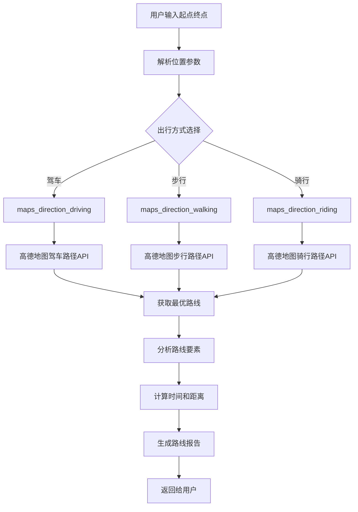

**图表来源**
- [mcp.json:3-6](file://Routing/mcp.json#L3-L6)

### 天气查询实现

地图代理通过高德地图 MCP 服务器提供精确的天气信息服务。

#### 天气查询流程

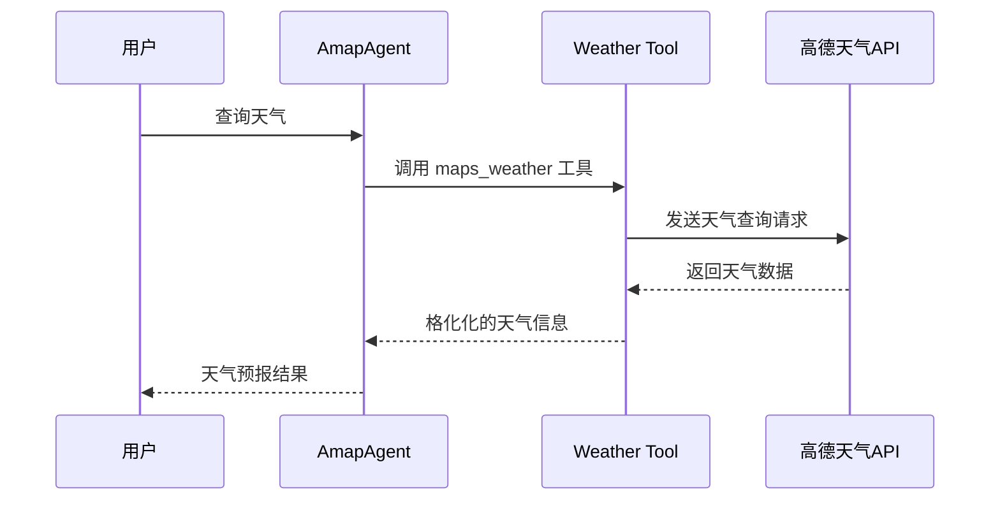

**图表来源**
- [test_amap.py:42-60](file://test/test_amap.py#L42-L60)

### 代理与高德地图MCP服务器交互

地图代理通过 MCP (Model Context Protocol) 协议与高德地图服务器进行交互。

#### MCP 服务器配置

```mermaid
graph LR
subgraph "MCP配置"
A[mcp.json]
B[amap-maps-streamableHTTP]
C[URL: https://mcp.amap.com/mcp?key={AMAP_API_KEY}]
D[Transport: streamable-http]
end
subgraph "连接过程"
E[启动HTTP客户端]
F[建立MCP会话]
G[初始化MCP协议]
H[加载可用工具]
end
A --> B
B --> C
C --> D
D --> E
E --> F
F --> G
G --> H
```

**图表来源**
- [mcp.json:1-29](file://Routing/mcp.json#L1-L29)
- [tool_cache.py:198-243](file://Routing/tool_cache.py#L198-L243)

**章节来源**
- [base_agent.py:418-431](file://Routing/base_agent.py#L418-L431)
- [tool_cache.py:118-243](file://Routing/tool_cache.py#L118-L243)
- [mcp.json:1-29](file://Routing/mcp.json#L1-L29)

## 依赖关系分析

地图代理的依赖关系体现了清晰的分层架构和模块化设计。

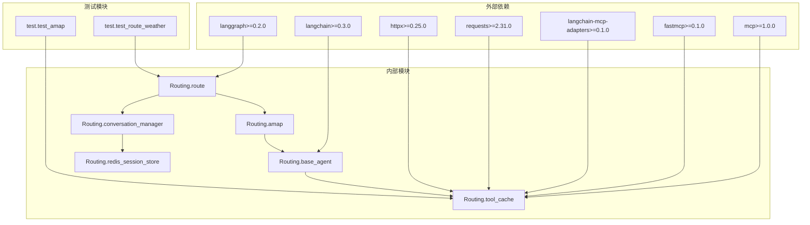

**图表来源**
- [requirements.txt:1-17](file://requirements.txt#L1-L17)
- [amap.py:7](file://Routing/amap.py#L7)
- [base_agent.py:11-16](file://Routing/base_agent.py#L11-L16)

**章节来源**
- [requirements.txt:1-17](file://requirements.txt#L1-L17)
- [amap.py:1-11](file://Routing/amap.py#L1-L11)

## 性能考虑

地图代理在设计时充分考虑了性能优化和资源管理。

### 缓存策略

地图代理采用了多层次的缓存策略来提升性能：

1. **工具缓存**：全局工具缓存避免重复连接 MCP 服务器
2. **会话缓存**：内存中缓存活跃会话，减少 Redis 访问
3. **连接池**：复用 MCP 服务器连接，减少握手开销

### 并发限制

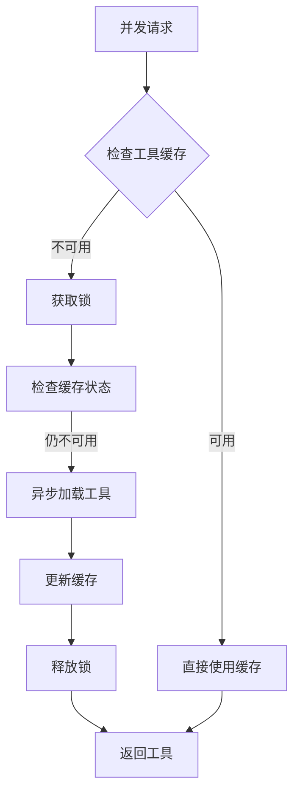

**图表来源**
- [tool_cache.py:48](file://Routing/tool_cache.py#L48)
- [tool_cache.py:118-140](file://Routing/tool_cache.py#L118-L140)

### 错误重试机制

地图代理实现了完善的错误处理和重试机制：

1. **连接超时**：MCP 服务器连接设置 10 秒超时
2. **工具调用重试**：工具执行失败时自动重试
3. **会话恢复**：Redis 连接失败时自动降级到内存模式

**章节来源**
- [tool_cache.py:212-224](file://Routing/tool_cache.py#L212-L224)
- [tool_cache.py:198-243](file://Routing/tool_cache.py#L198-L243)

## 故障排除指南

### 常见问题及解决方案

#### 1. MCP 服务器连接失败

**症状**：工具加载失败，出现连接超时错误

**解决方案**：
- 检查 AMAP_API_KEY 环境变量是否正确设置
- 验证网络连接和防火墙设置
- 确认 MCP 服务器 URL 可访问

#### 2. 工具调用超时

**症状**：工具执行超时，返回超时错误

**解决方案**：
- 增加超时时间配置
- 检查高德地图 API 服务状态
- 优化网络连接质量

#### 3. 会话管理问题

**症状**：会话历史丢失或无法恢复

**解决方案**：
- 检查 Redis 服务器连接状态
- 验证会话 TTL 配置
- 确认会话数据序列化正确

**章节来源**
- [test_amap.py:20-27](file://test/test_amap.py#L20-L27)
- [route.py:329-347](file://Routing/route.py#L329-L347)

## 结论

地图代理通过模块化设计和智能架构，成功实现了高德地图 MCP 服务的集成。其核心优势包括：

1. **高效性**：通过全局工具缓存和连接复用显著提升性能
2. **可靠性**：完善的错误处理和重试机制确保服务稳定性
3. **可扩展性**：模块化设计便于功能扩展和维护
4. **用户体验**：多轮对话和历史上下文保持提供自然的交互体验

地图代理为 AIops 项目提供了强大的地理信息服务基础，支持地址解析、路径规划、天气查询等多种应用场景，为后续的功能扩展奠定了坚实的技术基础。

## 附录

### 使用示例

#### 基本使用方法

```python
# 创建地图代理实例
agent = await create_amap_agent()

# 查询天气
result = await agent.ainvoke("北京今天的天气如何？")

# 获取路径规划
result = await agent.ainvoke("从天安门到故宫怎么走？")

# 地址解析
result = await agent.ainvoke("上海市浦东新区陆家嘴环路1000号的经纬度")
```

#### 集成指南

1. **环境配置**：设置 AMAP_API_KEY 和 DASHSCOPE_API_KEY
2. **依赖安装**：安装 requirements.txt 中的所有依赖
3. **MCP 配置**：配置 mcp.json 中的服务器连接信息
4. **会话管理**：根据需要启用 Redis 持久化

**章节来源**
- [test_amap.py:14-68](file://test/test_amap.py#L14-L68)
- [test_route_weather.py:14-56](file://test/test_route_weather.py#L14-L56)