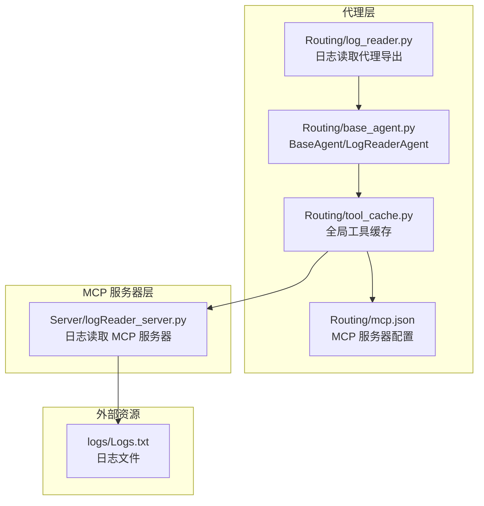
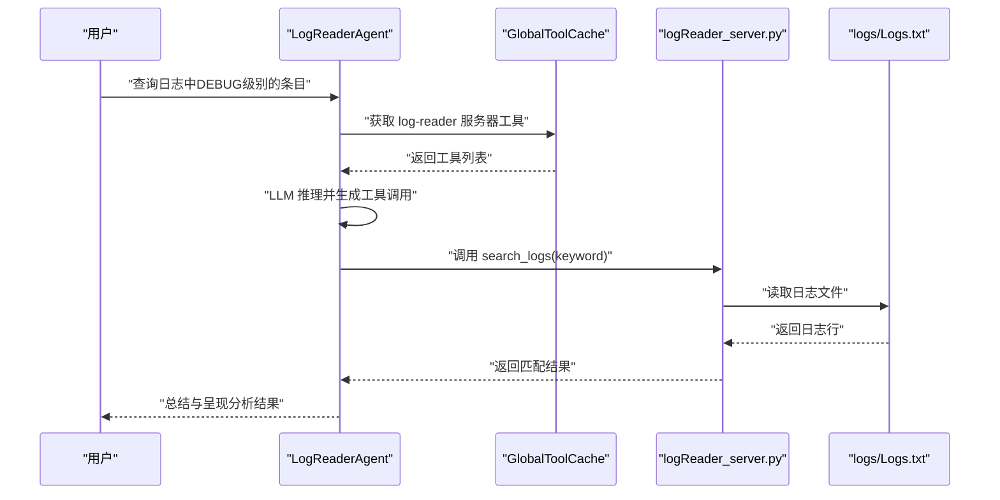
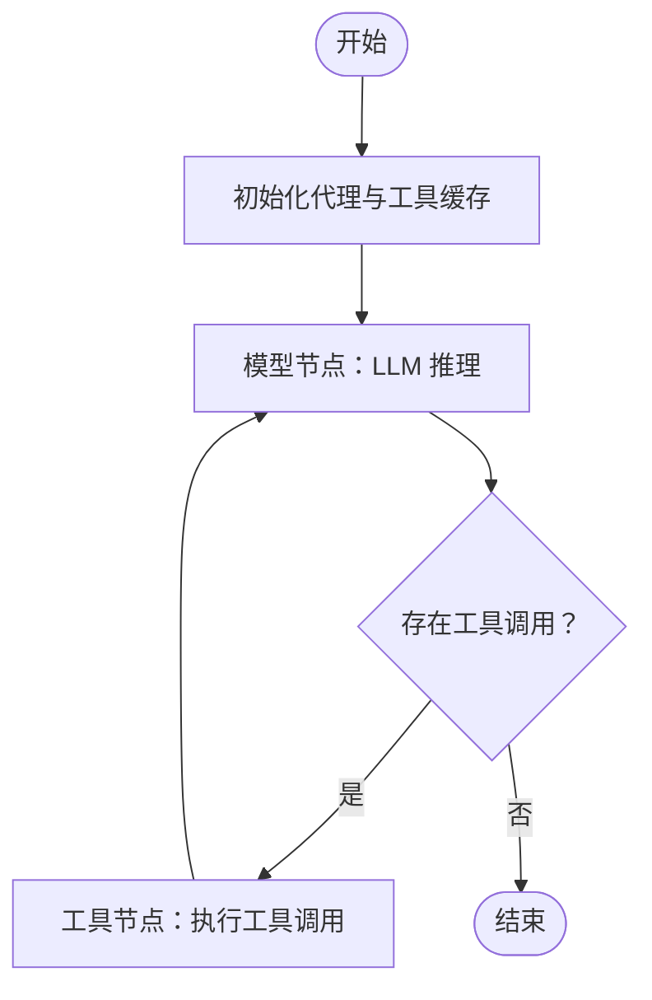
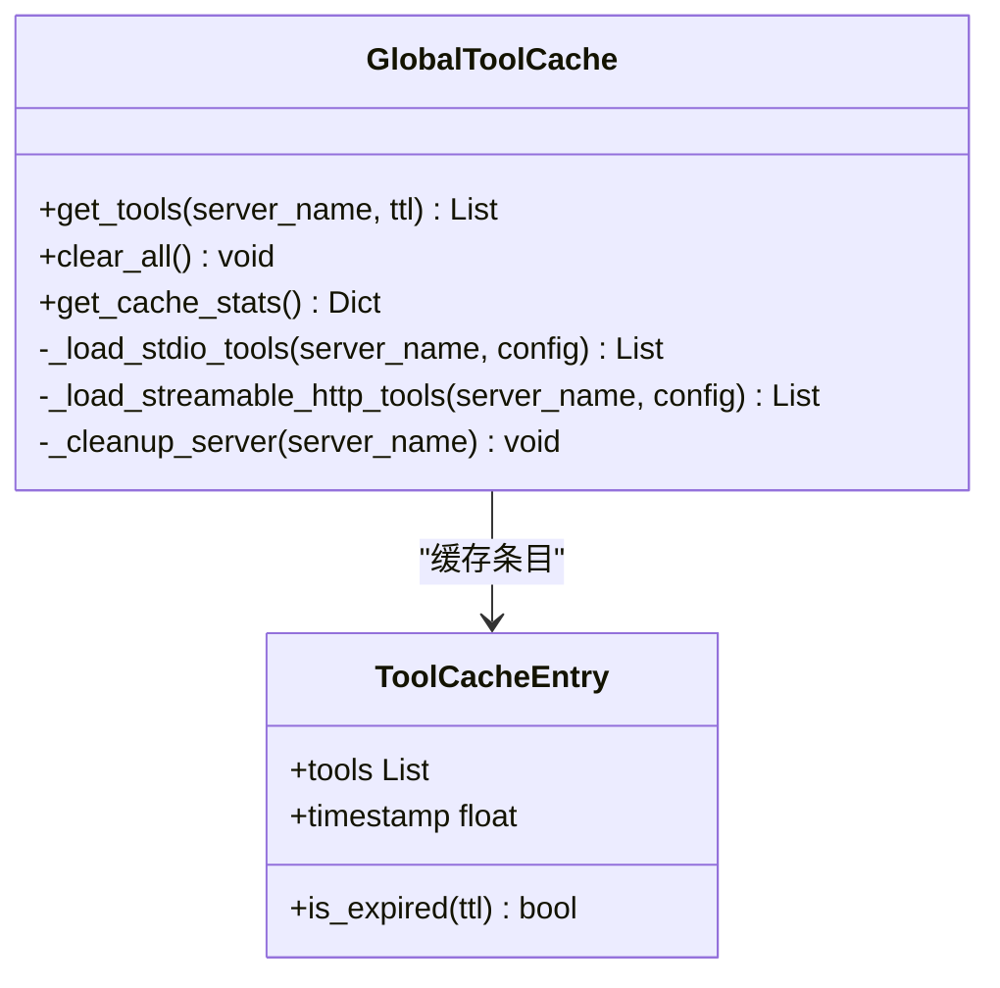
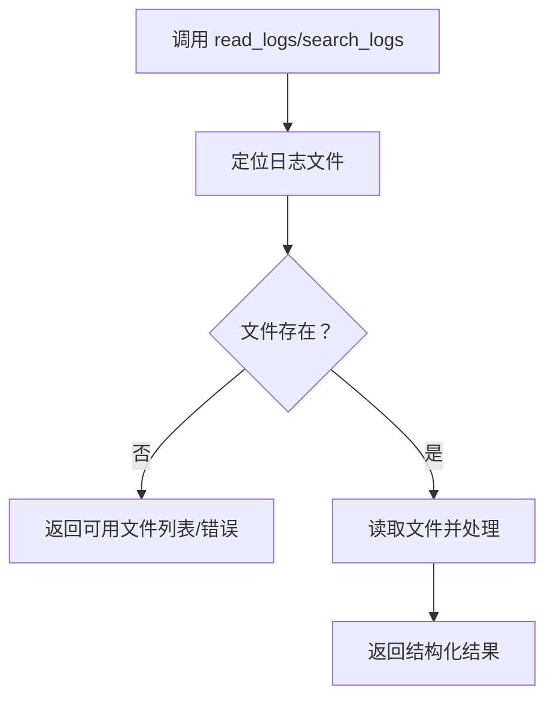
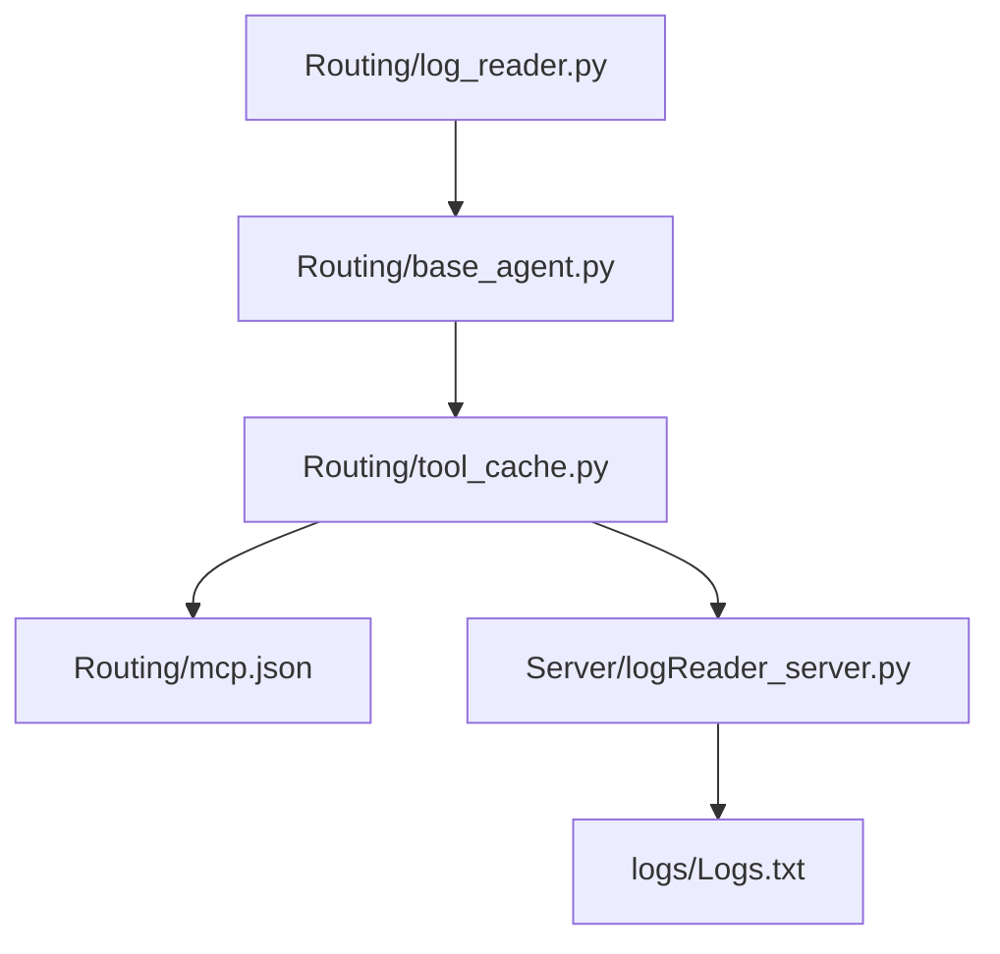

# 日志读取代理

<cite>
**本文档引用的文件**
- [Routing/log_reader.py](file://Routing/log_reader.py)
- [Routing/base_agent.py](file://Routing/base_agent.py)
- [Routing/tool_cache.py](file://Routing/tool_cache.py)
- [Server/logReader_server.py](file://Server/logReader_server.py)
- [Routing/mcp.json](file://Routing/mcp.json)
- [README.md](file://README.md)
- [quickstart.py](file://quickstart.py)
</cite>

## 目录
1. [简介](#简介)
2. [项目结构](#项目结构)
3. [核心组件](#核心组件)
4. [架构总览](#架构总览)
5. [详细组件分析](#详细组件分析)
6. [依赖分析](#依赖分析)
7. [性能考虑](#性能考虑)
8. [故障排查指南](#故障排查指南)
9. [结论](#结论)
10. [附录](#附录)

## 简介
本文件系统性阐述“日志读取代理”的实现原理、日志解析与分析流程，覆盖以下主题：
- 日志格式识别与时间戳处理
- 过滤条件设置与统计分析
- 代理与日志读取 MCP 服务器的交互模式、查询参数与结果处理
- 日志缓冲机制、增量更新与性能优化策略
- 使用场景与最佳实践

日志读取代理基于 MCP（Model Context Protocol）协议，通过 LangGraph 工作流驱动，结合全局工具缓存与标准输入输出（stdio）传输协议，实现对本地日志文件的读取、搜索与统计。

## 项目结构
该项目采用模块化设计，围绕“代理层”“工具缓存层”“MCP 服务器层”组织代码。日志读取代理位于“Routing”目录，MCP 服务器位于“Server”目录，工具缓存与配置位于“Routing”目录。

图表来源
- [Routing/log_reader.py:1-11](file://Routing/log_reader.py#L1-L11)
- [Routing/base_agent.py:403-416](file://Routing/base_agent.py#L403-L416)
- [Routing/tool_cache.py:85-117](file://Routing/tool_cache.py#L85-L117)
- [Routing/mcp.json:14-20](file://Routing/mcp.json#L14-L20)
- [Server/logReader_server.py:18-58](file://Server/logReader_server.py#L18-L58)

章节来源
- [README.md:5-36](file://README.md#L5-L36)
- [Routing/log_reader.py:1-11](file://Routing/log_reader.py#L1-L11)
- [Routing/base_agent.py:403-416](file://Routing/base_agent.py#L403-L416)
- [Routing/tool_cache.py:85-117](file://Routing/tool_cache.py#L85-L117)
- [Routing/mcp.json:14-20](file://Routing/mcp.json#L14-L20)
- [Server/logReader_server.py:18-58](file://Server/logReader_server.py#L18-L58)

## 核心组件
- 日志读取代理（LogReaderAgent）
  - 继承自 BaseAgent，负责统一的消息处理、工具绑定与工作流编排。
  - 通过工具缓存获取“log-reader”服务器的工具集合，自动完成工具调用与结果回传。
- 工具缓存（GlobalToolCache）
  - 单例缓存，按服务器名称与 TTL 策略管理工具加载与会话生命周期。
  - 支持 stdio 与 streamable-http 两种传输协议，自动解析配置文件与环境变量。
- 日志读取 MCP 服务器（logReader_server.py）
  - 提供 read_logs、search_logs、get_log_stats 三类工具，面向本地日志文件进行读取、搜索与统计。
  - 通过 stdio 与代理通信，返回结构化结果或错误信息。

章节来源
- [Routing/base_agent.py:403-416](file://Routing/base_agent.py#L403-L416)
- [Routing/tool_cache.py:39-66](file://Routing/tool_cache.py#L39-L66)
- [Server/logReader_server.py:18-103](file://Server/logReader_server.py#L18-L103)

## 架构总览
下图展示了从用户输入到日志分析结果的完整链路：代理初始化、工具加载、LLM 推理、工具调用与结果回传。

图表来源
- [Routing/base_agent.py:102-130](file://Routing/base_agent.py#L102-L130)
- [Routing/base_agent.py:131-217](file://Routing/base_agent.py#L131-L217)
- [Routing/tool_cache.py:85-117](file://Routing/tool_cache.py#L85-L117)
- [Server/logReader_server.py:60-103](file://Server/logReader_server.py#L60-L103)

## 详细组件分析

### 日志读取代理（LogReaderAgent）
- 角色与职责
  - 作为专用代理，封装系统提示词与服务器名称，驱动 LangGraph 工作流。
  - 通过工具缓存统一加载“log-reader”工具，减少重复初始化与网络开销。
- 工作流节点
  - 模型节点：注入系统提示词，调用 LLM 生成工具调用计划。
  - 工具节点：解析工具调用，执行工具并构造工具消息回传给模型。
  - 路由逻辑：根据是否存在工具调用决定流转至工具节点或结束。
- 结果处理
  - 工具返回值中若存在“result”字段，仅传递该字段值，避免泄露原始数据结构，提升安全性与可控性。

图表来源
- [Routing/base_agent.py:238-257](file://Routing/base_agent.py#L238-L257)
- [Routing/base_agent.py:102-130](file://Routing/base_agent.py#L102-L130)
- [Routing/base_agent.py:131-217](file://Routing/base_agent.py#L131-L217)

章节来源
- [Routing/base_agent.py:403-416](file://Routing/base_agent.py#L403-L416)
- [Routing/base_agent.py:102-130](file://Routing/base_agent.py#L102-L130)
- [Routing/base_agent.py:131-217](file://Routing/base_agent.py#L131-L217)

### 工具缓存（GlobalToolCache）
- 缓存策略
  - 以服务器名为键，TTL 过期控制缓存生命周期；过期后自动清理并重建连接。
  - 支持 stdio 与 streamable-http 两种传输协议，自动解析命令行参数与环境变量。
- 会话管理
  - 为每个服务器维护活跃会话，确保工具调用的低延迟与稳定性。
- 错误处理
  - 在加载失败或超时时抛出明确异常，便于上层捕获与降级处理。

图表来源
- [Routing/tool_cache.py:39-66](file://Routing/tool_cache.py#L39-L66)
- [Routing/tool_cache.py:85-117](file://Routing/tool_cache.py#L85-L117)
- [Routing/tool_cache.py:141-197](file://Routing/tool_cache.py#L141-L197)
- [Routing/tool_cache.py:198-243](file://Routing/tool_cache.py#L198-L243)

章节来源
- [Routing/tool_cache.py:39-66](file://Routing/tool_cache.py#L39-L66)
- [Routing/tool_cache.py:85-117](file://Routing/tool_cache.py#L85-L117)
- [Routing/tool_cache.py:141-197](file://Routing/tool_cache.py#L141-L197)
- [Routing/tool_cache.py:198-243](file://Routing/tool_cache.py#L198-L243)

### 日志读取 MCP 服务器（logReader_server.py）
- 工具接口
  - read_logs(lines): 读取最新 N 行日志，返回条目列表。
  - search_logs(keyword): 按关键词搜索日志，返回匹配条目列表。
  - get_log_stats(): 获取日志文件大小、修改时间、行数等统计信息。
- 文件定位与容错
  - 支持 app.log 与 Logs.txt 两种常见命名，自动扫描 logs 目录并列出可用文件。
  - 发生异常时返回结构化错误信息，便于前端或代理层统一处理。
- 时间戳与统计
  - 统计信息包含文件大小与最后修改时间，便于增量分析与版本对比。

图表来源
- [Server/logReader_server.py:18-58](file://Server/logReader_server.py#L18-L58)
- [Server/logReader_server.py:60-103](file://Server/logReader_server.py#L60-L103)
- [Server/logReader_server.py:105-145](file://Server/logReader_server.py#L105-L145)

章节来源
- [Server/logReader_server.py:18-58](file://Server/logReader_server.py#L18-L58)
- [Server/logReader_server.py:60-103](file://Server/logReader_server.py#L60-L103)
- [Server/logReader_server.py:105-145](file://Server/logReader_server.py#L105-L145)

### 代理与 MCP 服务器交互模式
- 传输协议
  - 通过 stdio 与本地进程通信，降低网络开销，适合本地日志文件读取场景。
- 查询参数与结果
  - read_logs(lines)：整数参数，返回列表；search_logs(keyword)：字符串参数，返回列表；get_log_stats()：无参，返回字典。
  - 结果统一包装为结构化 JSON，便于代理层解析与二次处理。

章节来源
- [Routing/mcp.json:14-20](file://Routing/mcp.json#L14-L20)
- [Server/logReader_server.py:18-58](file://Server/logReader_server.py#L18-L58)
- [Server/logReader_server.py:60-103](file://Server/logReader_server.py#L60-L103)
- [Server/logReader_server.py:105-145](file://Server/logReader_server.py#L105-L145)

## 依赖分析
- 组件耦合
  - LogReaderAgent 依赖 BaseAgent 的工作流框架与工具绑定能力。
  - 工具缓存对 MCP 客户端与配置文件存在直接依赖，但通过单例与延迟初始化降低耦合。
  - MCP 服务器与日志文件存在文件系统耦合，但通过统一接口屏蔽差异。
- 外部依赖
  - LangChain/LangGraph：消息模型与工作流编排。
  - FastMCP/langchain-mcp-adapters：MCP 协议适配与工具加载。
  - Python 标准库：文件读写、环境变量与时间处理。

图表来源
- [Routing/base_agent.py:403-416](file://Routing/base_agent.py#L403-L416)
- [Routing/tool_cache.py:85-117](file://Routing/tool_cache.py#L85-L117)
- [Routing/mcp.json:14-20](file://Routing/mcp.json#L14-L20)
- [Server/logReader_server.py:18-58](file://Server/logReader_server.py#L18-L58)

章节来源
- [Routing/base_agent.py:403-416](file://Routing/base_agent.py#L403-L416)
- [Routing/tool_cache.py:85-117](file://Routing/tool_cache.py#L85-L117)
- [Routing/mcp.json:14-20](file://Routing/mcp.json#L14-L20)
- [Server/logReader_server.py:18-58](file://Server/logReader_server.py#L18-L58)

## 性能考虑
- 工具缓存与连接复用
  - 通过 TTL 控制缓存生命周期，避免频繁重启 MCP 服务器；保持 stdio 会话，降低启动开销。
- I/O 优化
  - 服务器侧采用一次性读取与切片策略，避免全量扫描大文件；统计信息按需计算，减少不必要的 I/O。
- 结果精简
  - 工具节点仅传递“result”字段值，减少上下文噪声，提高 LLM 处理效率。
- 并发与异步
  - 工具缓存与代理均采用异步加载与调用，提升整体吞吐。

章节来源
- [Routing/tool_cache.py:39-66](file://Routing/tool_cache.py#L39-L66)
- [Routing/tool_cache.py:141-197](file://Routing/tool_cache.py#L141-L197)
- [Server/logReader_server.py:46-57](file://Server/logReader_server.py#L46-L57)
- [Routing/base_agent.py:173-181](file://Routing/base_agent.py#L173-L181)

## 故障排查指南
- 问题：找不到日志文件
  - 现象：返回可用文件列表或错误信息。
  - 处理：确认 logs 目录存在且包含 app.log 或 Logs.txt；检查权限与路径。
- 问题：MCP 服务器未启动
  - 现象：工具加载失败或超时。
  - 处理：检查 mcp.json 中命令与参数；确认 Python 环境与依赖已安装。
- 问题：搜索无结果
  - 现象：search_logs 返回“未找到匹配项”。
  - 处理：确认关键词大小写不敏感；检查日志内容是否包含目标关键字。
- 问题：统计信息异常
  - 现象：文件大小或修改时间异常。
  - 处理：确认文件未被其他进程锁定；检查系统时间与时区设置。

章节来源
- [Server/logReader_server.py:40-44](file://Server/logReader_server.py#L40-L44)
- [Server/logReader_server.py:82-86](file://Server/logReader_server.py#L82-L86)
- [Server/logReader_server.py:97-98](file://Server/logReader_server.py#L97-L98)
- [Server/logReader_server.py:124-128](file://Server/logReader_server.py#L124-L128)

## 结论
日志读取代理通过 MCP 协议与本地日志服务器协同，实现了从“自然语言查询”到“结构化日志结果”的闭环。其核心优势在于：
- 统一的工具加载与缓存机制，显著降低延迟与资源消耗；
- 明确的工具接口与结果规范，便于二次加工与报表生成；
- 强大的容错与错误提示，提升系统可运维性。

## 附录

### 使用示例与最佳实践
- 使用场景
  - 实时监控告警：通过 search_logs 过滤 ERROR/WARNING 级别日志，快速定位问题。
  - 增量分析：结合 get_log_stats 获取文件大小与修改时间，实现增量读取与差异比对。
  - 报表生成：将 read_logs 的结果进行二次统计，输出趋势图与摘要报告。
- 最佳实践
  - 优先使用关键词精确匹配，避免全量扫描。
  - 对高频查询启用工具缓存，减少重复初始化。
  - 在代理层对工具返回值进行清洗与摘要，避免将原始日志直接暴露给用户。

章节来源
- [quickstart.py:35-38](file://quickstart.py#L35-L38)
- [Server/logReader_server.py:18-58](file://Server/logReader_server.py#L18-L58)
- [Server/logReader_server.py:60-103](file://Server/logReader_server.py#L60-L103)
- [Server/logReader_server.py:105-145](file://Server/logReader_server.py#L105-L145)