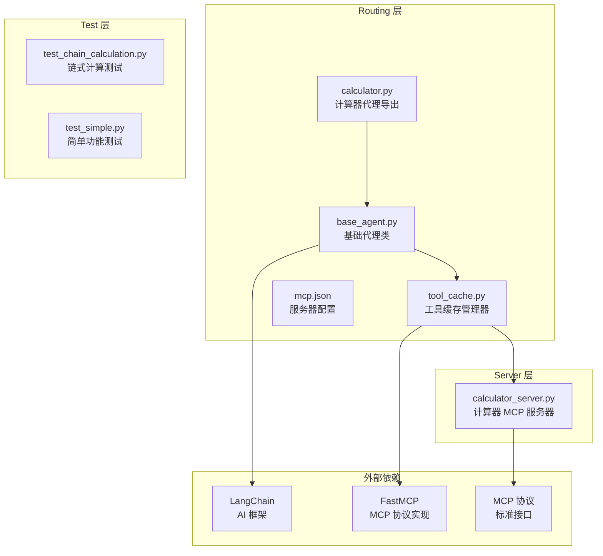
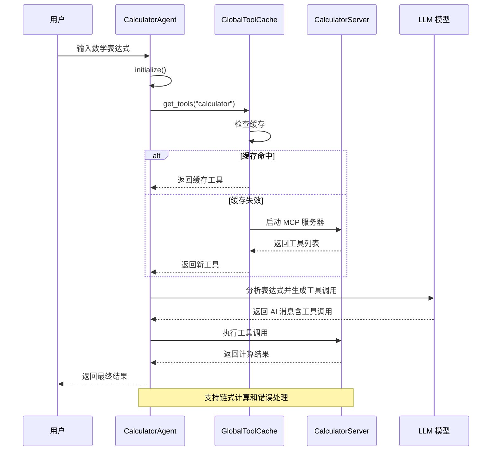
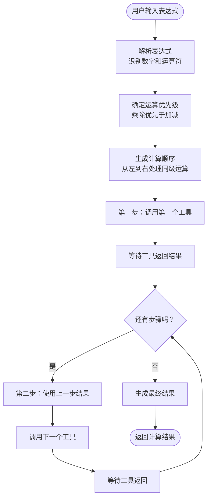
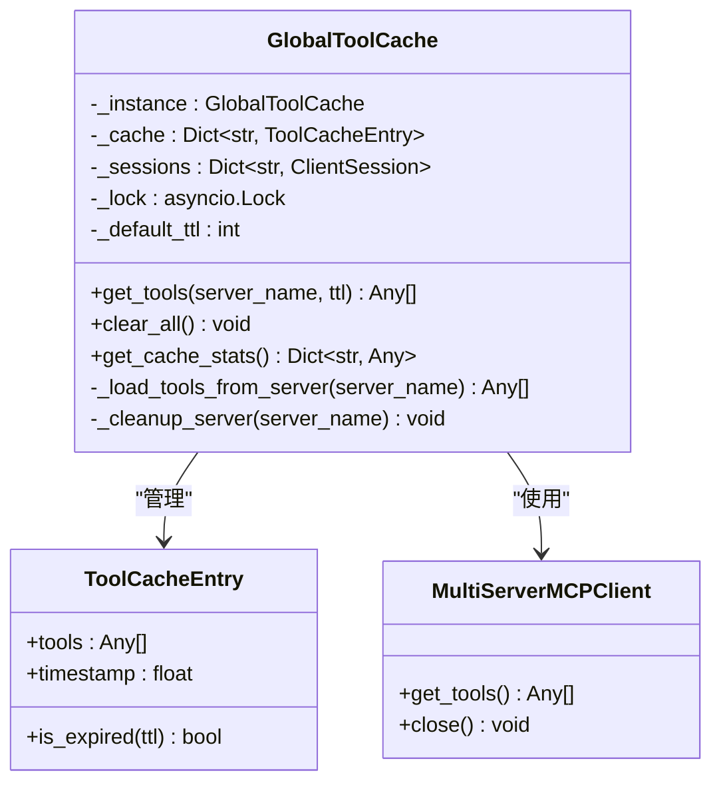
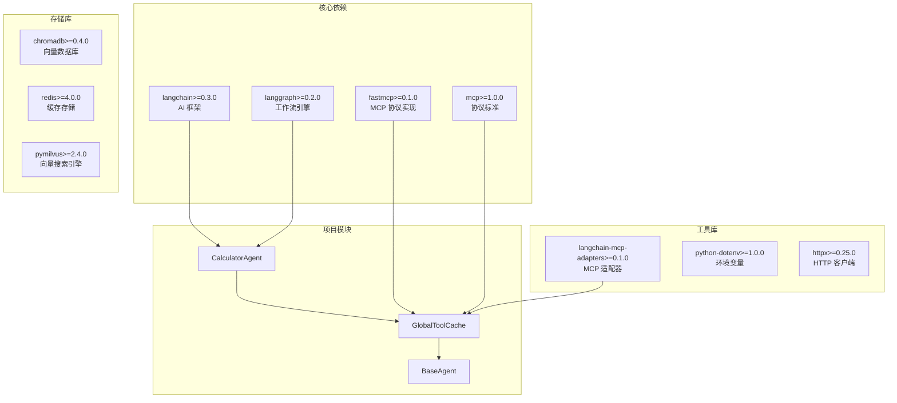
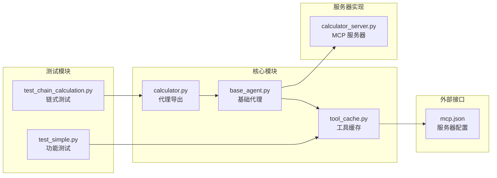

# 计算器代理

<cite>
**本文档引用的文件**
- [calculator.py](file://Routing/calculator.py)
- [base_agent.py](file://Routing/base_agent.py)
- [tool_cache.py](file://Routing/tool_cache.py)
- [calculator_server.py](file://Server/calculator_server.py)
- [mcp.json](file://Routing/mcp.json)
- [test_chain_calculation.py](file://test/test_chain_calculation.py)
- [test_simple.py](file://test/test_simple.py)
- [README.md](file://README.md)
- [requirements.txt](file://requirements.txt)
</cite>

## 目录
1. [简介](#简介)
2. [项目结构](#项目结构)
3. [核心组件](#核心组件)
4. [架构概览](#架构概览)
5. [详细组件分析](#详细组件分析)
6. [依赖关系分析](#依赖关系分析)
7. [性能考虑](#性能考虑)
8. [故障排除指南](#故障排除指南)
9. [结论](#结论)

## 简介

计算器代理是基于 Model Context Protocol (MCP) 构建的智能代理系统中的核心组件，专门负责处理数学计算请求。该代理通过与计算器 MCP 服务器的交互，实现了复杂的链式计算、运算符优先级处理和错误处理机制。

该项目采用模块化设计，将工具定义、状态管理、节点实现等分离到不同模块中，便于维护和扩展。计算器代理继承自通用的 BaseAgent 基类，利用全局工具缓存管理器实现高效的工具加载和复用。

## 项目结构

项目采用分层架构设计，主要包含以下核心模块：

**图表来源**
- [calculator.py:1-11](file://Routing/calculator.py#L1-L11)
- [base_agent.py:1-497](file://Routing/base_agent.py#L1-L497)
- [tool_cache.py:1-302](file://Routing/tool_cache.py#L1-L302)
- [calculator_server.py:1-111](file://Server/calculator_server.py#L1-L111)

**章节来源**
- [README.md:1-125](file://README.md#L1-L125)
- [requirements.txt:1-17](file://requirements.txt#L1-L17)

## 核心组件

### 计算器代理 (CalculatorAgent)

CalculatorAgent 是专门处理数学计算请求的代理类，继承自 BaseAgent 基类。它实现了以下核心功能：

- **系统提示词管理**：提供详细的数学计算指导原则
- **运算优先级处理**：严格遵循数学运算优先级规则
- **链式计算支持**：支持多步连续计算操作
- **工具调用协调**：与 MCP 服务器进行交互

### 基础代理类 (BaseAgent)

BaseAgent 提供了通用的代理框架，包含：

- **状态管理**：统一的消息状态管理和工作流控制
- **工具加载**：通过全局缓存机制动态加载工具
- **错误处理**：完善的异常捕获和错误恢复机制
- **工作流编译**：基于 LangGraph 的状态图构建

### 工具缓存管理器 (GlobalToolCache)

全局工具缓存管理器实现了以下关键特性：

- **单例模式**：确保全局唯一实例
- **TTL 过期策略**：支持缓存过期和自动刷新
- **线程安全**：使用异步锁保证并发安全性
- **多服务器支持**：统一管理多个 MCP 服务器的连接

**章节来源**
- [base_agent.py:322-401](file://Routing/base_agent.py#L322-L401)
- [base_agent.py:29-67](file://Routing/base_agent.py#L29-L67)
- [tool_cache.py:39-66](file://Routing/tool_cache.py#L39-L66)

## 架构概览

计算器代理的整体架构采用分层设计，实现了清晰的关注点分离：

**图表来源**
- [base_agent.py:258-318](file://Routing/base_agent.py#L258-L318)
- [tool_cache.py:85-117](file://Routing/tool_cache.py#L85-L117)
- [calculator_server.py:16-105](file://Server/calculator_server.py#L16-L105)

## 详细组件分析

### 计算器代理实现

#### 系统提示词设计

计算器代理的核心在于其精心设计的系统提示词，该提示词包含了以下关键要素：

**核心原则**
- 无计算能力，仅能通过工具获取结果
- 遵循数学运算优先级：先乘除，后加减
- 每步只能调用一个工具，等待结果后再进行下一步
- 下一步参数必须使用正确的数值

**运算优先级规则**
- 乘法和除法优先于加法和减法
- 同级运算从左到右依次计算
- 分析用户输入时先识别所有运算符，确定计算顺序

#### 链式计算处理流程

**图表来源**
- [base_agent.py:332-399](file://Routing/base_agent.py#L332-L399)

#### 工具调用机制

计算器代理通过以下机制与 MCP 服务器交互：

1. **工具发现**：从全局缓存中获取计算器服务器的工具列表
2. **工具映射**：建立工具名称到工具对象的映射关系
3. **参数提取**：从 AI 消息中提取工具调用参数
4. **结果处理**：提取工具返回的数值结果

**章节来源**
- [base_agent.py:131-217](file://Routing/base_agent.py#L131-L217)
- [base_agent.py:322-401](file://Routing/base_agent.py#L322-L401)

### 工具缓存管理器

#### 缓存策略设计

GlobalToolCache 实现了高效的缓存策略：

**TTL 过期机制**
- 默认缓存时间为 300 秒（5 分钟）
- 支持自定义过期时间
- 自动检测和清理过期缓存

**多服务器连接管理**
- 支持 stdio 和 streamable-http 两种传输协议
- 统一管理服务器连接生命周期
- 自动处理连接异常和重连

#### 并发处理能力

**图表来源**
- [tool_cache.py:39-66](file://Routing/tool_cache.py#L39-L66)
- [tool_cache.py:27-37](file://Routing/tool_cache.py#L27-L37)

**章节来源**
- [tool_cache.py:118-243](file://Routing/tool_cache.py#L118-L243)
- [tool_cache.py:244-290](file://Routing/tool_cache.py#L244-L290)

### MCP 服务器实现

#### 计算器服务器功能

计算器 MCP 服务器提供了四个核心数学运算工具：

**加法运算 (add)**
- 参数：两个浮点数 a 和 b
- 返回：包含运算类型、参数和结果的字典
- 特殊处理：结果减去 100

**减法运算 (subtract)**
- 参数：被减数 a 和减数 b  
- 返回：标准的运算结果字典

**乘法运算 (multiply)**
- 参数：两个乘数 a 和 b
- 返回：乘法运算结果

**除法运算 (divide)**
- 参数：被除数 a 和除数 b
- 错误处理：除数为零时返回错误信息
- 正常返回：标准的运算结果字典

**章节来源**
- [calculator_server.py:16-105](file://Server/calculator_server.py#L16-L105)

### 测试与验证

#### 链式计算测试

测试套件验证了计算器代理的链式计算能力：

**测试场景覆盖**
- 简单计算：12 + 6
- 链式计算：12 + 6 - 95  
- 复杂优先级：5 * 3 + 10 - 2
- 混合运算：59 + 8 - 8 - 9 / 7

**测试验证内容**
- 运算优先级正确性
- 工具调用顺序和参数传递
- 结果聚合和最终输出
- 错误处理机制

**章节来源**
- [test_chain_calculation.py:14-64](file://test/test_chain_calculation.py#L14-L64)

## 依赖关系分析

### 外部依赖关系

项目依赖于多个关键库来实现其功能：

**图表来源**
- [requirements.txt:1-17](file://requirements.txt#L1-L17)
- [base_agent.py:70-85](file://Routing/base_agent.py#L70-L85)

### 内部模块依赖

**图表来源**
- [mcp.json:1-29](file://Routing/mcp.json#L1-L29)
- [calculator.py:7-10](file://Routing/calculator.py#L7-L10)

**章节来源**
- [requirements.txt:1-17](file://requirements.txt#L1-L17)
- [mcp.json:7-13](file://Routing/mcp.json#L7-L13)

## 性能考虑

### 缓存优化策略

计算器代理采用了多层次的性能优化策略：

**工具缓存优化**
- 使用 TTL 机制避免重复加载
- 单例模式减少内存占用
- 异步锁保证线程安全
- 自动清理过期资源

**连接池管理**
- 复用 MCP 服务器连接
- 智能连接重用
- 异常连接自动重建
- 超时机制防止阻塞

### 并发处理能力

**异步编程模型**
- 全面采用 asyncio 异步编程
- 非阻塞的工具调用
- 并发工具执行支持
- 事件循环优化

**资源管理**
- 自动资源清理
- 连接池大小限制
- 内存使用监控
- 超时异常处理

## 故障排除指南

### 常见问题诊断

#### 工具加载失败

**症状**：代理初始化时报工具加载错误

**可能原因**
- MCP 服务器配置文件缺失或格式错误
- 服务器进程启动失败
- 网络连接超时
- 权限不足

**解决方案**
1. 检查 mcp.json 配置文件格式
2. 验证服务器命令路径正确性
3. 确认网络连接可用
4. 检查环境变量设置

#### 运算错误处理

**症状**：除法运算返回错误信息

**处理机制**
- 除数为零时返回明确的错误信息
- 错误信息包含具体原因
- 代理层正确处理并报告错误

#### 性能问题

**症状**：代理响应缓慢或内存泄漏

**诊断步骤**
1. 检查工具缓存命中率
2. 监控服务器连接状态
3. 分析异步任务执行时间
4. 检查资源清理机制

**章节来源**
- [tool_cache.py:194-196](file://Routing/tool_cache.py#L194-L196)
- [calculator_server.py:95-98](file://Server/calculator_server.py#L95-L98)

### 调试方法

#### 日志分析

**启用详细日志**
- 在初始化时打印详细信息
- 监控工具调用过程
- 记录错误和异常信息
- 跟踪缓存状态变化

#### 性能监控

**关键指标**
- 工具加载时间
- 服务器响应延迟
- 缓存命中率
- 内存使用情况

**监控建议**
- 定期检查缓存统计信息
- 监控服务器连接状态
- 分析工具调用频率
- 跟踪错误发生率

## 结论

计算器代理系统展现了现代 AI 应用的优秀实践，通过以下关键特性实现了高效可靠的数学计算服务：

**架构优势**
- 模块化设计便于维护和扩展
- 缓存机制显著提升性能
- 异步编程模型支持高并发
- 完善的错误处理机制

**技术特色**
- 严格的运算优先级处理
- 支持复杂的链式计算
- 多种传输协议支持
- 统一的工具管理接口

**应用场景**
- 企业级数学计算需求
- 教育辅助工具开发
- 数据分析前置处理
- AI 应用集成方案

该系统为基于 MCP 协议的 AI 代理开发提供了优秀的参考实现，其设计理念和架构模式值得在类似项目中借鉴和应用。