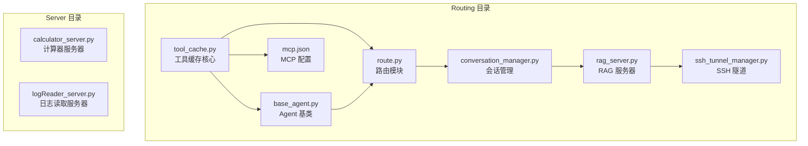
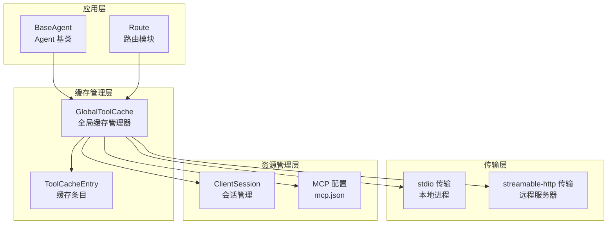
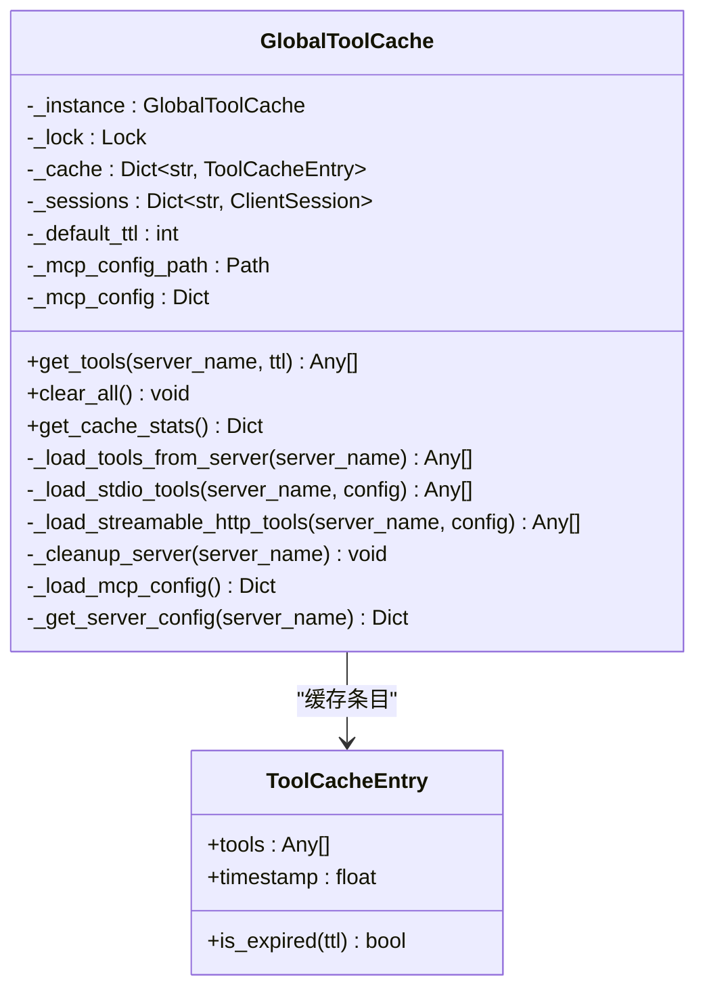
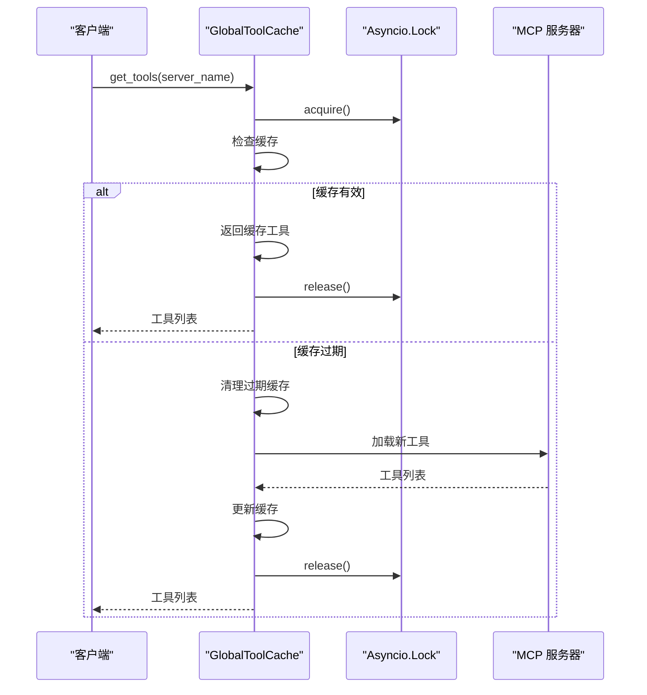
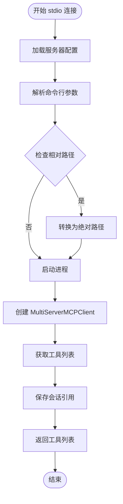
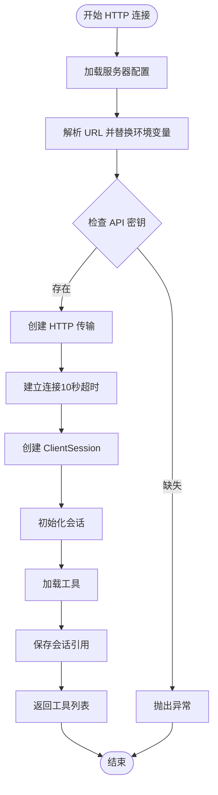
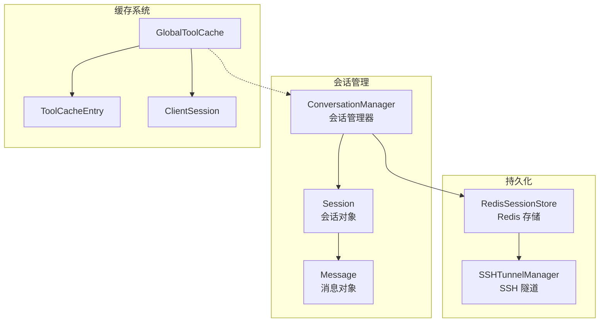
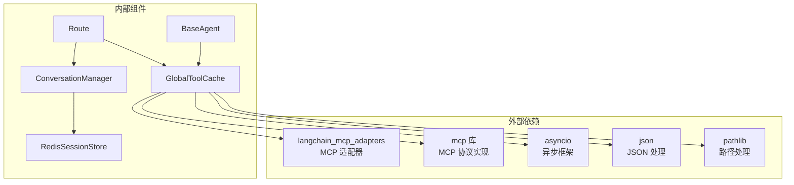

# 工具缓存

<cite>
**本文档引用的文件**
- [tool_cache.py](file://Routing/tool_cache.py)
- [base_agent.py](file://Routing/base_agent.py)
- [route.py](file://Routing/route.py)
- [mcp.json](file://Routing/mcp.json)
- [conversation_manager.py](file://Routing/conversation_manager.py)
- [redis_session_store.py](file://Routing/redis_session_store.py)
- [ssh_tunnel_manager.py](file://Routing/ssh_tunnel_manager.py)
- [test_redis_session_unit.py](file://test/test_redis_session_unit.py)
- [test_redis_session_integration.py](file://test/test_redis_session_integration.py)
</cite>

## 目录
1. [简介](#简介)
2. [项目结构](#项目结构)
3. [核心组件](#核心组件)
4. [架构概览](#架构概览)
5. [详细组件分析](#详细组件分析)
6. [依赖关系分析](#依赖关系分析)
7. [性能考虑](#性能考虑)
8. [故障排除指南](#故障排除指南)
9. [结论](#结论)

## 简介

工具缓存组件是 Aiops 项目中的关键基础设施，负责管理 MCP（Model Context Protocol）服务器连接和工具列表的缓存。该组件通过统一的缓存策略避免重复加载工具，显著提升系统性能和响应速度。

该缓存系统采用全局单例模式设计，支持多种传输协议（stdio 和 streamable-http），提供 TTL 过期策略、线程安全的缓存访问和统一的资源管理。系统还集成了会话管理和持久化功能，确保在应用重启后能够恢复之前的对话状态。

## 项目结构

工具缓存系统主要位于 Routing 目录下，包含以下核心文件：



**图表来源**
- [tool_cache.py:1-302](file://Routing/tool_cache.py#L1-L302)
- [base_agent.py:1-497](file://Routing/base_agent.py#L1-L497)
- [route.py:1-553](file://Routing/route.py#L1-L553)

**章节来源**
- [tool_cache.py:1-302](file://Routing/tool_cache.py#L1-L302)
- [base_agent.py:1-497](file://Routing/base_agent.py#L1-L497)
- [route.py:1-553](file://Routing/route.py#L1-L553)

## 核心组件

### GlobalToolCache 类

GlobalToolCache 是工具缓存系统的核心类，采用单例模式设计，提供以下主要功能：

- **全局缓存管理**：维护所有 MCP 服务器的工具缓存
- **TTL 过期策略**：支持可配置的缓存过期时间
- **多协议支持**：同时支持 stdio 和 streamable-http 两种传输协议
- **线程安全**：使用 asyncio.Lock 确保并发访问的安全性
- **资源管理**：自动管理服务器连接和会话生命周期

### ToolCacheEntry 类

ToolCacheEntry 是缓存条目的数据结构，包含：

- **工具列表**：缓存的工具对象集合
- **时间戳**：缓存创建或更新的时间
- **过期检查**：提供 is_expired 方法判断缓存有效性

### 传输协议支持

系统支持两种主要的 MCP 传输协议：

1. **stdio 协议**：通过标准输入输出与服务器进程通信
2. **streamable-http 协议**：通过 HTTP 接口与远程服务器通信

**章节来源**
- [tool_cache.py:27-302](file://Routing/tool_cache.py#L27-L302)

## 架构概览

工具缓存系统采用分层架构设计，各层职责明确：



**图表来源**
- [tool_cache.py:39-302](file://Routing/tool_cache.py#L39-L302)
- [base_agent.py:29-497](file://Routing/base_agent.py#L29-L497)
- [route.py:1-553](file://Routing/route.py#L1-L553)

## 详细组件分析

### GlobalToolCache 实现分析

#### 缓存策略设计

GlobalToolCache 采用了基于服务器名称的键值缓存策略，每个 MCP 服务器对应一个独立的缓存条目：



**图表来源**
- [tool_cache.py:39-302](file://Routing/tool_cache.py#L39-L302)

#### 生命周期管理

缓存系统提供了完整的生命周期管理机制：

1. **初始化阶段**：加载 MCP 配置文件，设置默认 TTL 参数
2. **使用阶段**：提供线程安全的工具获取接口
3. **清理阶段**：支持按服务器清理和全量清理

#### 并发控制机制

系统使用 asyncio.Lock 确保缓存操作的线程安全：



**图表来源**
- [tool_cache.py:85-116](file://Routing/tool_cache.py#L85-L116)

**章节来源**
- [tool_cache.py:39-302](file://Routing/tool_cache.py#L39-L302)

### 传输协议实现

#### stdio 协议实现

stdio 协议通过标准输入输出与本地进程通信：



**图表来源**
- [tool_cache.py:141-197](file://Routing/tool_cache.py#L141-L197)

#### streamable-http 协议实现

streamable-http 协议通过 HTTP 接口与远程服务器通信：



**图表来源**
- [tool_cache.py:198-242](file://Routing/tool_cache.py#L198-L242)

**章节来源**
- [tool_cache.py:118-242](file://Routing/tool_cache.py#L118-L242)

### 会话管理集成

工具缓存系统与会话管理系统深度集成：



**图表来源**
- [conversation_manager.py:82-275](file://Routing/conversation_manager.py#L82-L275)
- [redis_session_store.py:14-228](file://Routing/redis_session_store.py#L14-L228)

**章节来源**
- [conversation_manager.py:82-275](file://Routing/conversation_manager.py#L82-L275)
- [redis_session_store.py:14-228](file://Routing/redis_session_store.py#L14-L228)

## 依赖关系分析

工具缓存系统的主要依赖关系如下：



**图表来源**
- [tool_cache.py:11-25](file://Routing/tool_cache.py#L11-L25)
- [base_agent.py:11-16](file://Routing/base_agent.py#L11-L16)
- [route.py:14-25](file://Routing/route.py#L14-L25)

**章节来源**
- [tool_cache.py:11-25](file://Routing/tool_cache.py#L11-L25)
- [base_agent.py:11-16](file://Routing/base_agent.py#L11-L16)
- [route.py:14-25](file://Routing/route.py#L14-L25)

## 性能考虑

### 缓存命中率优化

为了提高缓存命中率，系统采用了以下策略：

1. **合理的 TTL 设置**：默认 300 秒（5分钟）的缓存过期时间平衡了新鲜度和性能
2. **按服务器隔离**：每个 MCP 服务器使用独立的缓存空间，避免相互影响
3. **懒加载机制**：只有在首次访问时才加载工具，减少不必要的资源消耗

### 内存管理优化

系统在内存管理方面采取了多项措施：

1. **及时清理**：过期缓存会自动清理，防止内存泄漏
2. **连接复用**：同一服务器的多次访问复用已建立的连接
3. **资源回收**：应用关闭时自动清理所有缓存和连接

### 并发性能优化

为了支持高并发访问，系统实现了：

1. **异步锁机制**：使用 asyncio.Lock 确保线程安全的同时最小化阻塞时间
2. **非阻塞 I/O**：所有网络操作都是异步的
3. **连接池管理**：合理管理服务器连接，避免过多的连接开销

## 故障排除指南

### 常见问题及解决方案

#### 缓存加载失败

**问题症状**：
- 工具加载过程中出现异常
- 控制台显示加载失败信息

**可能原因**：
1. MCP 服务器配置文件不存在或格式错误
2. 服务器进程启动失败
3. 网络连接超时

**解决方案**：
1. 检查 mcp.json 配置文件格式
2. 验证服务器进程路径和参数
3. 检查网络连接和防火墙设置

#### 缓存过期问题

**问题症状**：
- 工具频繁重新加载
- 性能下降明显

**可能原因**：
- TTL 设置过短
- 系统时间不正确
- 缓存清理逻辑异常

**解决方案**：
1. 调整默认 TTL 参数
2. 检查系统时间同步
3. 查看缓存清理日志

#### 内存泄漏问题

**问题症状**：
- 内存使用持续增长
- 应用运行时间越长越慢

**可能原因**：
- 缓存条目未正确清理
- 服务器连接未关闭
- 会话数据未释放

**解决方案**：
1. 确保在应用关闭时调用清理函数
2. 检查资源释放逻辑
3. 监控内存使用情况

### 调试工具和方法

#### 缓存状态监控

系统提供了缓存统计功能：

```python
# 获取缓存统计信息
stats = tool_cache.get_cache_stats()
print(f"缓存服务器: {stats['cached_servers']}")
print(f"缓存数量: {stats['cache_count']}")
print(f"活跃会话: {stats['active_sessions']}")
```

#### 性能分析方法

1. **日志分析**：通过控制台输出的调试信息分析缓存命中情况
2. **内存监控**：使用系统监控工具观察内存使用变化
3. **性能测试**：编写基准测试评估不同配置下的性能表现

**章节来源**
- [tool_cache.py:291-297](file://Routing/tool_cache.py#L291-L297)
- [route.py:510-517](file://Routing/route.py#L510-L517)

## 结论

工具缓存组件是 Aiops 项目中不可或缺的重要组成部分，它通过智能的缓存策略和完善的资源管理机制，显著提升了系统的性能和可靠性。

### 主要优势

1. **高性能**：通过缓存避免重复加载工具，大幅减少响应时间
2. **高可用性**：支持多种传输协议和自动重连机制
3. **易维护性**：统一的接口设计和完善的错误处理
4. **可扩展性**：模块化的架构便于功能扩展和定制

### 设计亮点

1. **智能缓存策略**：基于 TTL 的过期机制和按服务器隔离的缓存设计
2. **完善的生命周期管理**：从创建到销毁的完整资源管理
3. **并发安全保证**：使用异步锁确保多线程环境下的安全性
4. **深度集成**：与会话管理和持久化系统无缝集成

### 未来改进方向

1. **缓存预热机制**：在应用启动时预加载常用工具
2. **智能过期策略**：根据使用频率动态调整 TTL
3. **分布式缓存**：支持多实例部署时的缓存共享
4. **监控告警**：增加更详细的性能监控和告警功能

工具缓存系统为整个 Aiops 项目提供了坚实的基础设施支撑，其设计理念和实现方案值得在类似的 AI 应用开发中借鉴和参考。