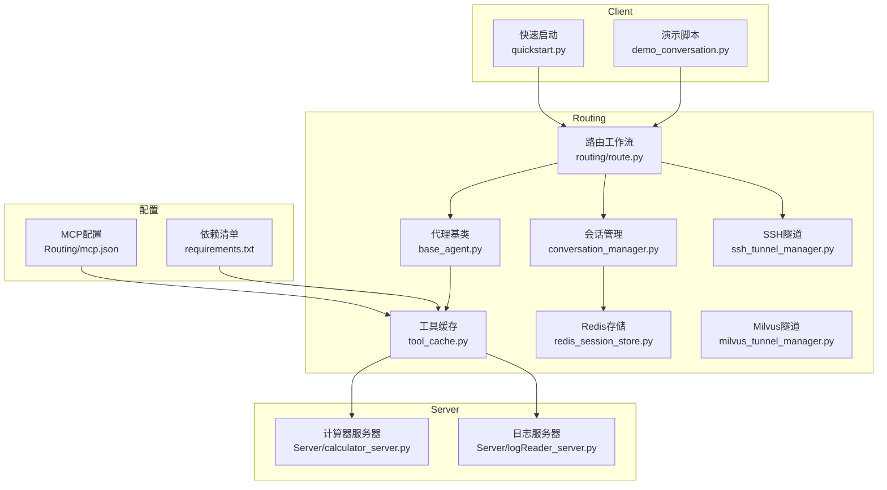
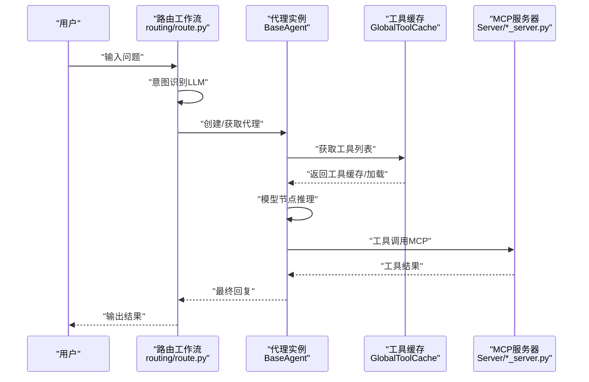
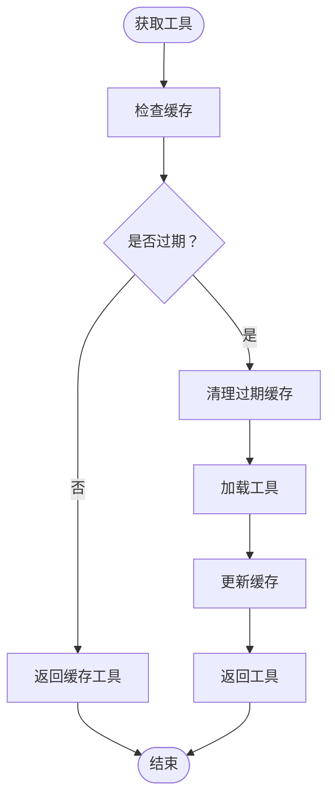
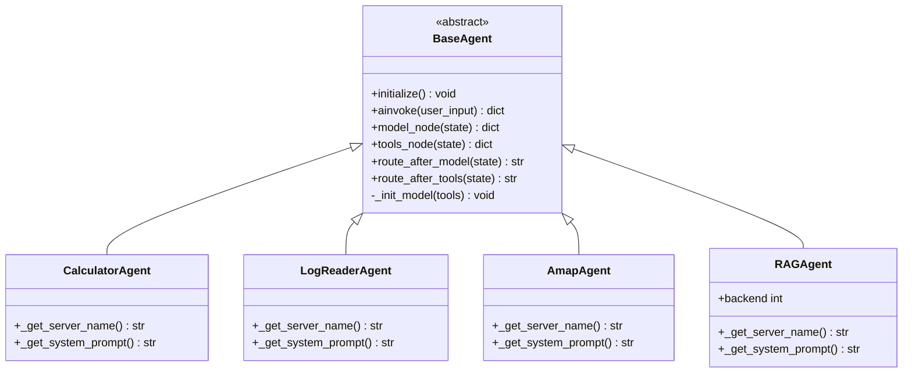
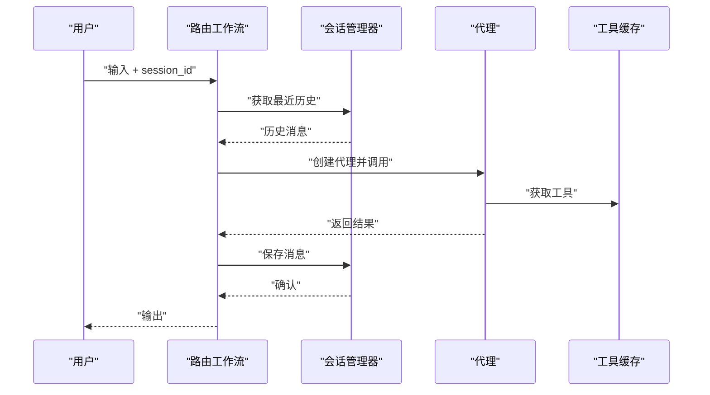
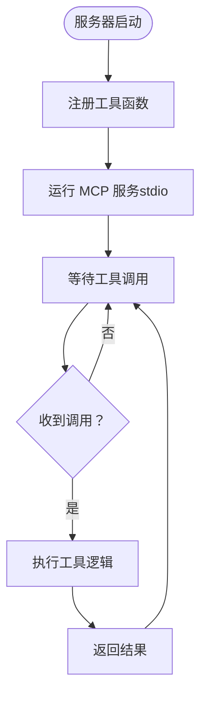
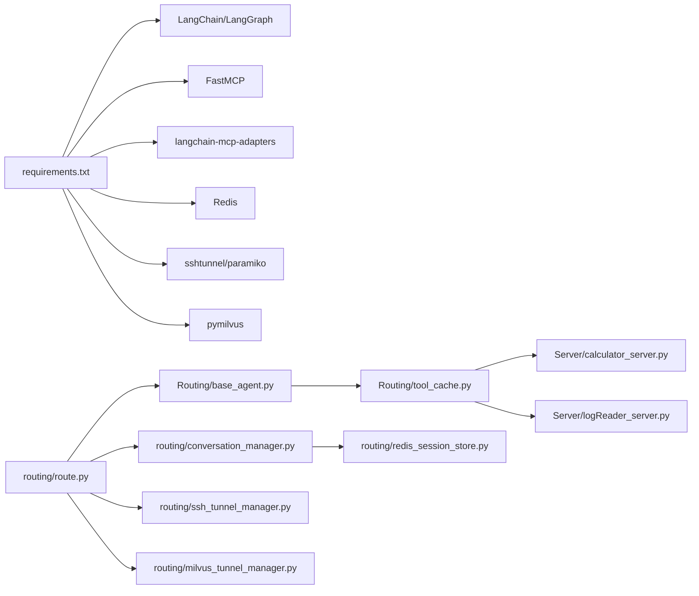

# 核心组件

<cite>
**本文档引用的文件**
- [README.md](file://README.md)
- [quickstart.py](file://quickstart.py)
- [requirements.txt](file://requirements.txt)
- [Routing/tool_cache.py](file://Routing/tool_cache.py)
- [Routing/base_agent.py](file://Routing/base_agent.py)
- [routing/route.py](file://routing/route.py)
- [routing/conversation_manager.py](file://routing/conversation_manager.py)
- [routing/redis_session_store.py](file://routing/redis_session_store.py)
- [routing/ssh_tunnel_manager.py](file://routing/ssh_tunnel_manager.py)
- [routing/milvus_tunnel_manager.py](file://routing/milvus_tunnel_manager.py)
- [routing/calculator.py](file://routing/calculator.py)
- [routing/amap.py](file://routing/amap.py)
- [routing/log_reader.py](file://routing/log_reader.py)
- [routing/rag_agent.py](file://routing/rag_agent.py)
- [Server/calculator_server.py](file://Server/calculator_server.py)
- [Server/logReader_server.py](file://Server/logReader_server.py)
- [Routing/mcp.json](file://Routing/mcp.json)
- [demo_conversation.py](file://demo_conversation.py)
</cite>

## 目录
1. [简介](#简介)
2. [项目结构](#项目结构)
3. [核心组件](#核心组件)
4. [架构总览](#架构总览)
5. [详细组件分析](#详细组件分析)
6. [依赖关系分析](#依赖关系分析)
7. [性能考虑](#性能考虑)
8. [故障排除指南](#故障排除指南)
9. [结论](#结论)
10. [附录](#附录)

## 简介
本项目基于 Model Context Protocol (MCP) 构建，提供统一的智能代理系统，通过标准化协议连接 AI 模型与外部工具/数据源。系统包含以下核心组件：
- MCP 客户端：负责与 MCP 服务器通信，动态加载工具并执行推理与工具调用
- MCP 服务器：提供具体工具能力（计算器、日志读取、高德地图等）
- 代理系统：封装工具调用流程，支持多轮对话与会话管理
- 工具缓存：统一管理工具连接与缓存，避免重复加载，支持 TTL 过期策略
- 会话管理：支持多轮对话上下文保持与持久化存储
- SSH 隧道：安全连接远程服务（Redis、Milvus）

## 项目结构
项目采用模块化组织，围绕 Routing、Server、Client 等目录划分职责：
- Routing：代理系统、工具缓存、会话管理、路由与工具适配
- Server：MCP 服务器实现（计算器、日志读取等）
- Client：MCP 客户端相关模块（示例）
- Data：示例数据文件
- test：单元测试与集成测试
- vector_store：向量数据库数据目录

**图表来源**
- [routing/route.py:258-291](file://routing/route.py#L258-L291)
- [Routing/tool_cache.py:39-66](file://Routing/tool_cache.py#L39-L66)
- [routing/conversation_manager.py:82-121](file://routing/conversation_manager.py#L82-L121)
- [routing/redis_session_store.py:14-35](file://routing/redis_session_store.py#L14-L35)
- [routing/ssh_tunnel_manager.py:12-18](file://routing/ssh_tunnel_manager.py#L12-L18)
- [routing/milvus_tunnel_manager.py:14-19](file://routing/milvus_tunnel_manager.py#L14-L19)
- [Server/calculator_server.py:1-14](file://Server/calculator_server.py#L1-L14)
- [Server/logReader_server.py:1-15](file://Server/logReader_server.py#L1-L15)
- [Routing/mcp.json:1-29](file://Routing/mcp.json#L1-L29)
- [requirements.txt:1-17](file://requirements.txt#L1-L17)

**章节来源**
- [README.md:5-36](file://README.md#L5-L36)
- [requirements.txt:1-17](file://requirements.txt#L1-L17)

## 核心组件
本节概述四大核心组件及其职责与交互关系。

- MCP 客户端
  - 通过工具缓存统一加载 MCP 服务器工具，支持 stdio 与 streamable-http 两种传输协议
  - 在代理系统中作为工具提供者，驱动推理与工具调用流程

- MCP 服务器
  - 提供具体工具能力：计算器（加减乘除）、日志读取（读取、搜索、统计）
  - 以 FastMCP 框架实现，支持标准 MCP 协议

- 代理系统
  - 基于 LangGraph 的状态机工作流，包含模型节点与工具节点
  - 统一处理消息、路由决策、工具调用与结果回传
  - 支持多轮对话上下文注入与错误处理

- 工具缓存
  - 全局单例缓存，避免重复加载 MCP 服务器工具
  - 支持 TTL 过期策略、线程安全访问、会话生命周期管理
  - 统一管理 stdio 与 streamable-http 两类连接

**章节来源**
- [Routing/tool_cache.py:39-66](file://Routing/tool_cache.py#L39-L66)
- [Routing/base_agent.py:29-67](file://Routing/base_agent.py#L29-L67)
- [routing/route.py:60-109](file://routing/route.py#L60-L109)
- [Server/calculator_server.py:12-13](file://Server/calculator_server.py#L12-L13)
- [Server/logReader_server.py:14-15](file://Server/logReader_server.py#L14-L15)

## 架构总览
系统采用“路由-代理-工具缓存-服务器”的分层架构。用户输入经由路由模块识别意图，选择对应代理；代理通过工具缓存获取工具并调用 MCP 服务器；工具缓存负责连接管理与缓存控制；会话管理器提供多轮对话上下文与持久化。

**图表来源**
- [routing/route.py:149-234](file://routing/route.py#L149-L234)
- [Routing/base_agent.py:102-130](file://Routing/base_agent.py#L102-L130)
- [Routing/tool_cache.py:85-117](file://Routing/tool_cache.py#L85-L117)
- [Server/calculator_server.py:108-111](file://Server/calculator_server.py#L108-L111)
- [Server/logReader_server.py:148-151](file://Server/logReader_server.py#L148-L151)

## 详细组件分析

### 工具缓存（GlobalToolCache）
- 设计要点
  - 单例模式，全局共享缓存与会话
  - 基于服务器名称的 TTL 缓存策略，默认 5 分钟
  - 支持 stdio 与 streamable-http 两种传输协议
  - 自动清理过期缓存与会话，提供统计信息

- 关键流程
  - 首次加载：根据 mcp.json 配置选择传输方式，创建连接并加载工具
  - 后续访问：检查 TTL，命中则直接返回缓存工具
  - 清理策略：过期时关闭会话并移除缓存条目

**图表来源**
- [Routing/tool_cache.py:85-117](file://Routing/tool_cache.py#L85-L117)
- [Routing/tool_cache.py:244-280](file://Routing/tool_cache.py#L244-L280)

**章节来源**
- [Routing/tool_cache.py:39-66](file://Routing/tool_cache.py#L39-L66)
- [Routing/tool_cache.py:85-140](file://Routing/tool_cache.py#L85-L140)
- [Routing/tool_cache.py:198-243](file://Routing/tool_cache.py#L198-L243)
- [Routing/tool_cache.py:281-298](file://Routing/tool_cache.py#L281-L298)
- [Routing/mcp.json:1-29](file://Routing/mcp.json#L1-L29)

### 代理系统（BaseAgent 与专用代理）
- 设计要点
  - 统一状态结构（消息、步骤、工具调用与结果、错误）
  - LangGraph 工作流：模型节点 → 工具节点 → 模型节点（循环）
  - 工具调用结果提取：仅传递 result 字段，避免泄露原始数据
  - 多代理支持：计算器、日志读取、高德地图、RAG 知识库

- 关键流程
  - 初始化：从工具缓存加载工具，绑定 LLM
  - 模型节点：注入系统提示词，调用 LLM 推理
  - 工具节点：解析工具调用，执行并构造 ToolMessage
  - 路由逻辑：根据是否有工具调用决定下一步

**图表来源**
- [Routing/base_agent.py:29-67](file://Routing/base_agent.py#L29-L67)
- [Routing/base_agent.py:322-401](file://Routing/base_agent.py#L322-L401)
- [Routing/base_agent.py:403-416](file://Routing/base_agent.py#L403-L416)
- [Routing/base_agent.py:418-431](file://Routing/base_agent.py#L418-L431)
- [Routing/base_agent.py:433-463](file://Routing/base_agent.py#L433-L463)

**章节来源**
- [Routing/base_agent.py:19-27](file://Routing/base_agent.py#L19-L27)
- [Routing/base_agent.py:44-67](file://Routing/base_agent.py#L44-L67)
- [Routing/base_agent.py:102-130](file://Routing/base_agent.py#L102-L130)
- [Routing/base_agent.py:131-218](file://Routing/base_agent.py#L131-L218)
- [Routing/base_agent.py:238-257](file://Routing/base_agent.py#L238-L257)
- [Routing/base_agent.py:322-401](file://Routing/base_agent.py#L322-L401)
- [Routing/base_agent.py:403-416](file://Routing/base_agent.py#L403-L416)
- [Routing/base_agent.py:418-431](file://Routing/base_agent.py#L418-L431)
- [Routing/base_agent.py:433-463](file://Routing/base_agent.py#L433-L463)

### 路由与会话管理
- 路由工作流
  - 意图识别：基于 LLM 的结构化 JSON 输出，支持历史上下文
  - 节点路由：根据意图路由到计算器、日志读取、高德地图或 RAG 查询
  - 多轮对话：通过会话管理器注入历史消息，增强上下文理解

- 会话管理
  - 内存与 Redis 双重持久化：内存缓存 + Redis 持久化
  - 自动清理：过期会话清理与活跃会话索引
  - 统一接口：创建、添加消息、获取历史、清理与统计

**图表来源**
- [routing/route.py:149-234](file://routing/route.py#L149-L234)
- [routing/route.py:351-414](file://routing/route.py#L351-L414)
- [routing/conversation_manager.py:122-147](file://routing/conversation_manager.py#L122-L147)
- [routing/conversation_manager.py:166-184](file://routing/conversation_manager.py#L166-L184)

**章节来源**
- [routing/route.py:149-234](file://routing/route.py#L149-L234)
- [routing/route.py:351-414](file://routing/route.py#L351-L414)
- [routing/conversation_manager.py:82-121](file://routing/conversation_manager.py#L82-L121)
- [routing/conversation_manager.py:166-184](file://routing/conversation_manager.py#L166-L184)
- [routing/conversation_manager.py:234-253](file://routing/conversation_manager.py#L234-L253)

### MCP 服务器
- 计算器服务器
  - 工具：加法、减法、乘法、除法
  - 异常处理：除零保护
  - 运行模式：stdio

- 日志读取服务器
  - 工具：读取最新日志、按关键词搜索、获取统计信息
  - 文件探测：支持 app.log 与 Logs.txt
  - 运行模式：stdio

**图表来源**
- [Server/calculator_server.py:12-13](file://Server/calculator_server.py#L12-L13)
- [Server/calculator_server.py:16-105](file://Server/calculator_server.py#L16-L105)
- [Server/logReader_server.py:14-15](file://Server/logReader_server.py#L14-L15)
- [Server/logReader_server.py:18-145](file://Server/logReader_server.py#L18-L145)

**章节来源**
- [Server/calculator_server.py:16-105](file://Server/calculator_server.py#L16-L105)
- [Server/logReader_server.py:18-145](file://Server/logReader_server.py#L18-L145)

### SSH 隧道与远程服务
- SSH 隧道管理器
  - 支持 RSA/ECDSA/Ed25519 私钥加载
  - 自动创建本地端口到远程服务的隧道
  - 提供隧道关闭与错误处理

- Milvus 隧道管理器
  - 与 Redis 隧道管理器一致的模式，用于远程 Milvus gRPC 端口转发

**章节来源**
- [routing/ssh_tunnel_manager.py:19-81](file://routing/ssh_tunnel_manager.py#L19-L81)
- [routing/milvus_tunnel_manager.py:20-89](file://routing/milvus_tunnel_manager.py#L20-L89)

## 依赖关系分析
- 组件耦合
  - 路由工作流依赖代理工厂与工具缓存
  - 代理系统依赖工具缓存与 LLM 模型
  - 会话管理器可选依赖 Redis 存储
  - 工具缓存依赖 MCP 配置与服务器实现

- 外部依赖
  - LangChain/LangGraph：消息模型与工作流编排
  - FastMCP：MCP 服务器框架
  - langchain-mcp-adapters：MCP 工具加载
  - Redis/sshtunnel/pymilvus：会话持久化与远程服务访问

**图表来源**
- [requirements.txt:1-17](file://requirements.txt#L1-L17)
- [routing/route.py:14-28](file://routing/route.py#L14-L28)
- [Routing/base_agent.py:70-89](file://Routing/base_agent.py#L70-L89)
- [Routing/tool_cache.py:18-25](file://Routing/tool_cache.py#L18-L25)
- [routing/conversation_manager.py:112-115](file://routing/conversation_manager.py#L112-L115)
- [routing/redis_session_store.py:27-34](file://routing/redis_session_store.py#L27-L34)
- [routing/ssh_tunnel_manager.py:62-77](file://routing/ssh_tunnel_manager.py#L62-L77)
- [routing/milvus_tunnel_manager.py:71-77](file://routing/milvus_tunnel_manager.py#L71-L77)

**章节来源**
- [requirements.txt:1-17](file://requirements.txt#L1-L17)
- [routing/route.py:14-28](file://routing/route.py#L14-L28)

## 性能考虑
- 工具缓存
  - 使用 TTL 缓存减少重复加载开销，建议根据实际场景调整默认 TTL
  - 对于高频工具调用，优先使用缓存命中策略

- 会话管理
  - 合理设置会话超时与历史长度，避免内存占用过高
  - Redis 持久化可提升会话恢复能力，但需关注网络延迟

- LLM 调用
  - 控制温度与模型参数，平衡准确性与响应速度
  - 在工具节点中仅传递必要字段，减少上下文噪声

- 网络与隧道
  - SSH 隧道建立成本较高，建议复用现有隧道
  - 远程服务连接超时与重试策略需合理配置

[本节为通用指导，无需特定文件来源]

## 故障排除指南
- 工具加载失败
  - 检查 mcp.json 中服务器配置与传输协议
  - 确认 stdio 命令与参数路径正确，streamable-http URL 与 API Key 配置有效
  - 查看工具缓存清理日志，确认会话关闭与异常处理

- 会话持久化问题
  - Redis 连接失败时自动回退至内存模式，检查 Redis 配置与网络
  - 过期会话清理导致历史丢失，确认 TTL 设置与活跃状态

- SSH 隧道问题
  - 私钥格式不支持时尝试不同类型（RSA/ECDSA/Ed25519）
  - 隧道端口冲突或权限不足，检查本地端口与 SSH 凭据

- LLM 调用异常
  - API Key 未配置或无效，检查环境变量
  - 模型参数不合法，核对基础 URL、模型名与温度设置

**章节来源**
- [Routing/tool_cache.py:194-196](file://Routing/tool_cache.py#L194-L196)
- [Routing/tool_cache.py:240-242](file://Routing/tool_cache.py#L240-L242)
- [routing/conversation_manager.py:116-118](file://routing/conversation_manager.py#L116-L118)
- [routing/ssh_tunnel_manager.py:57-59](file://routing/ssh_tunnel_manager.py#L57-L59)
- [routing/milvus_tunnel_manager.py:66-68](file://routing/milvus_tunnel_manager.py#L66-L68)

## 结论
本项目通过工具缓存、代理系统与会话管理的协同，实现了基于 MCP 协议的智能代理系统。其模块化设计便于扩展与维护，支持多轮对话与远程服务安全访问。建议在生产环境中结合性能监控与日志审计，持续优化工具缓存策略与会话持久化方案。

[本节为总结性内容，无需特定文件来源]

## 附录

### 使用模式与示例
- 快速启动
  - 使用快速启动脚本创建代理、显示工具并进行示例对话
  - 参考路径：[quickstart.py:8-57](file://quickstart.py#L8-L57)

- 演示脚本
  - 展示工具缓存与多轮对话，包含会话管理与资源清理
  - 参考路径：[demo_conversation.py:19-98](file://demo_conversation.py#L19-L98)

- 专用代理导出
  - 保持向后兼容的工厂函数与类导出
  - 参考路径：[routing/calculator.py:6-10](file://routing/calculator.py#L6-L10)，[routing/amap.py:6-10](file://routing/amap.py#L6-L10)，[routing/log_reader.py:6-10](file://routing/log_reader.py#L6-L10)，[routing/rag_agent.py:6-10](file://routing/rag_agent.py#L6-L10)

### 配置选项
- 环境变量
  - LLM_BASE_URL、LLM_MODEL、LLM_TEMPERATURE：LLM 服务配置
  - DASHSCOPE_API_KEY：DashScope API Key
  - AMAP_API_KEY：高德地图 API Key
  - SSH_*、REDIS_*：远程服务与会话持久化配置
  - MILVUS_*：Milvus SSH 隧道配置

- MCP 配置
  - mcpServers：服务器名称、传输协议、命令/URL、参数
  - 参考路径：[Routing/mcp.json:1-29](file://Routing/mcp.json#L1-L29)

**章节来源**
- [quickstart.py:8-57](file://quickstart.py#L8-L57)
- [demo_conversation.py:19-98](file://demo_conversation.py#L19-L98)
- [routing/calculator.py:6-10](file://routing/calculator.py#L6-L10)
- [routing/amap.py:6-10](file://routing/amap.py#L6-L10)
- [routing/log_reader.py:6-10](file://routing/log_reader.py#L6-L10)
- [routing/rag_agent.py:6-10](file://routing/rag_agent.py#L6-L10)
- [Routing/mcp.json:1-29](file://Routing/mcp.json#L1-L29)