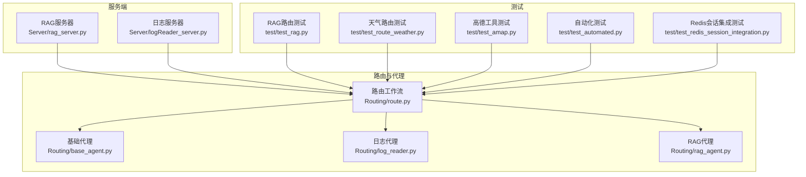
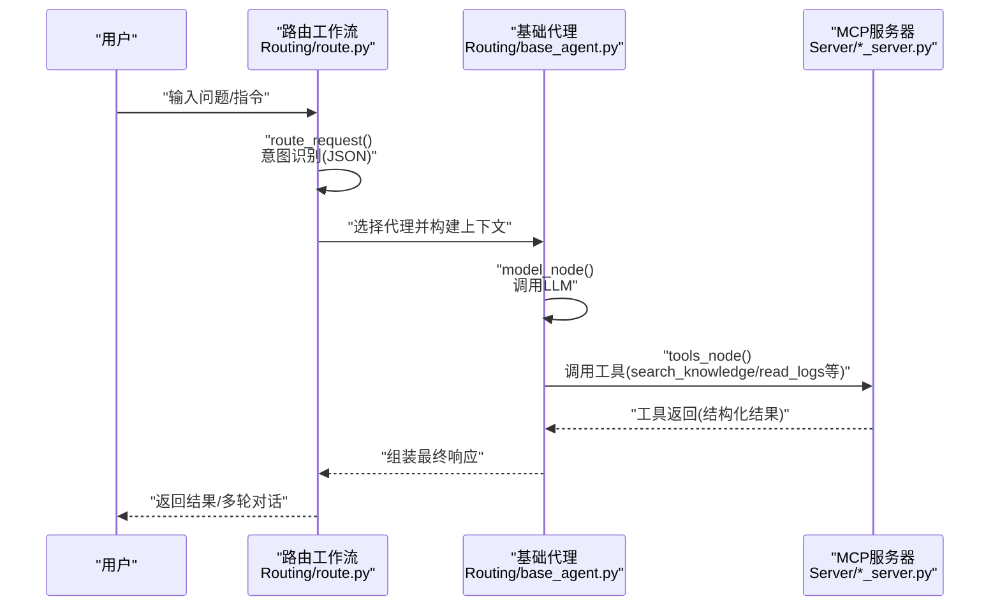
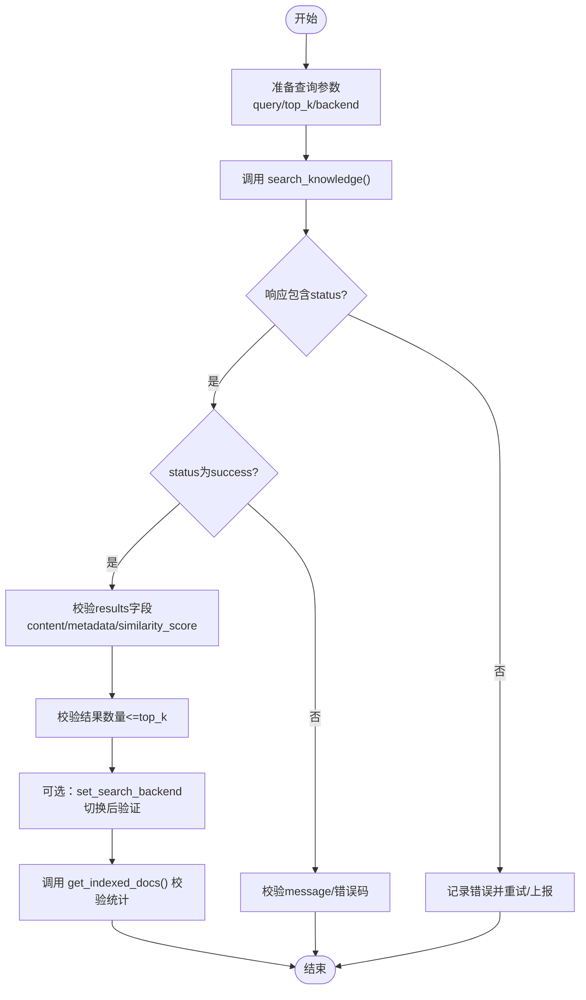
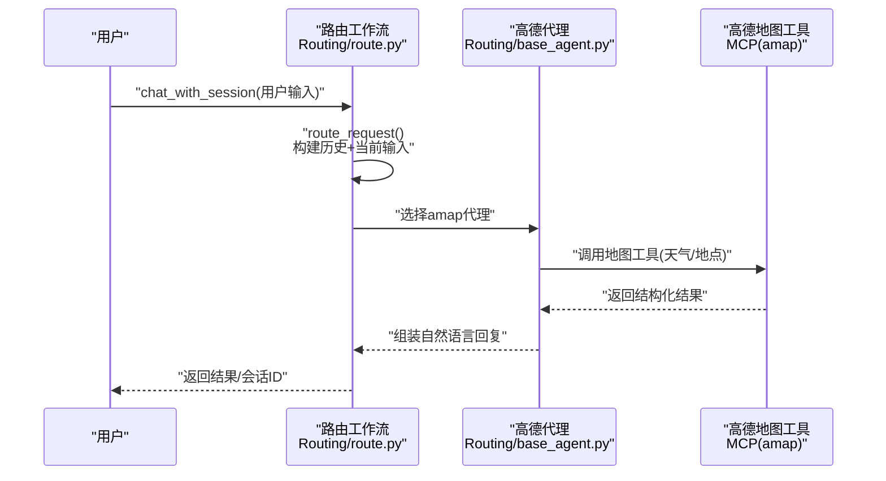
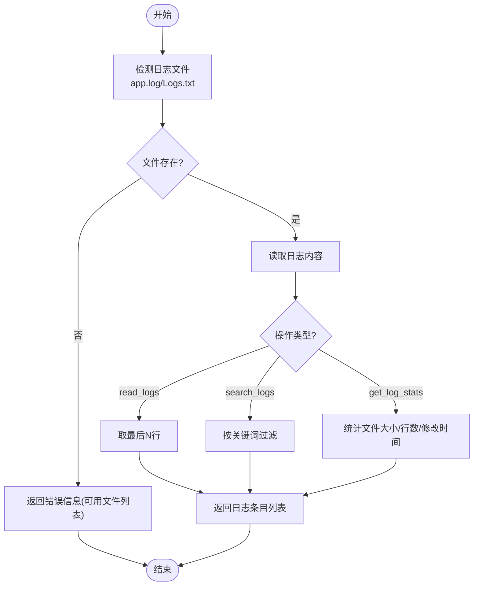
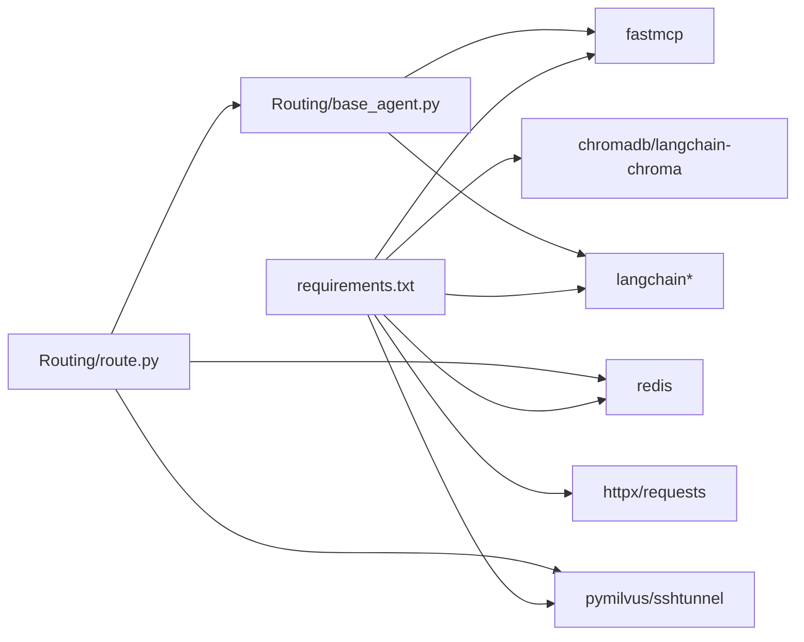

# API测试

<cite>
**本文引用的文件**
- [README.md](file://README.md)
- [requirements.txt](file://requirements.txt)
- [Server/rag_server.py](file://Server/rag_server.py)
- [Server/logReader_server.py](file://Server/logReader_server.py)
- [Routing/base_agent.py](file://Routing/base_agent.py)
- [Routing/route.py](file://Routing/route.py)
- [Routing/log_reader.py](file://Routing/log_reader.py)
- [Routing/rag_agent.py](file://Routing/rag_agent.py)
- [test/test_rag.py](file://test/test_rag.py)
- [test/test_route_weather.py](file://test/test_route_weather.py)
- [test/test_amap.py](file://test/test_amap.py)
- [test/test_automated.py](file://test/test_automated.py)
- [test/test_redis_session_integration.py](file://test/test_redis_session_integration.py)
</cite>

## 目录
1. [简介](#简介)
2. [项目结构](#项目结构)
3. [核心组件](#核心组件)
4. [架构总览](#架构总览)
5. [详细组件分析](#详细组件分析)
6. [依赖分析](#依赖分析)
7. [性能考虑](#性能考虑)
8. [故障排查指南](#故障排查指南)
9. [结论](#结论)
10. [附录](#附录)

## 简介
本文件面向AiOps项目的API测试，聚焦以下目标：
- REST/WS风格的API测试方法论与实践
- RAG知识库API、路由天气查询API、日志读取API的测试策略
- HTTP请求构造、响应验证与状态码检查
- 实时通信API的测试挑战与解决方案（消息格式、事件类型、连接状态）
- 性能测试（并发、压力、响应时间）
- 安全测试（认证、权限、数据完整性）
- 自动化与持续集成配置建议

项目采用LangGraph与MCP协议构建智能代理系统，核心能力包括：
- 基于向量检索的RAG知识库
- 高德地图天气查询
- 日志读取与统计
- 会话管理与多轮对话

## 项目结构
项目采用模块化分层设计，核心目录与职责如下：
- Server：MCP服务器实现（RAG、日志读取）
- Routing：路由与代理（意图识别、工具调用、会话管理）
- test：测试脚本（路由、天气、会话、自动化）
- Client：客户端测试（如Client_test.py）

图表来源
- [Server/rag_server.py:1-363](file://Server/rag_server.py#L1-L363)
- [Server/logReader_server.py:1-151](file://Server/logReader_server.py#L1-L151)
- [Routing/route.py:1-553](file://Routing/route.py#L1-L553)
- [Routing/base_agent.py:1-497](file://Routing/base_agent.py#L1-L497)
- [Routing/log_reader.py:1-11](file://Routing/log_reader.py#L1-L11)
- [Routing/rag_agent.py:1-11](file://Routing/rag_agent.py#L1-L11)
- [test/test_rag.py:1-50](file://test/test_rag.py#L1-L50)
- [test/test_route_weather.py:1-56](file://test/test/test_route_weather.py#L1-L56)
- [test/test_amap.py:1-68](file://test/test_amap.py#L1-L68)
- [test/test_automated.py:1-52](file://test/test_automated.py#L1-L52)
- [test/test_redis_session_integration.py:1-328](file://test/test_redis_session_integration.py#L1-L328)

章节来源
- [README.md:1-125](file://README.md#L1-L125)
- [requirements.txt:1-17](file://requirements.txt#L1-L17)

## 核心组件
- RAG知识库服务器：提供search_knowledge、set_search_backend、load_documents、get_indexed_docs等工具，以stdio形式运行
- 日志读取服务器：提供read_logs、search_logs、get_log_stats等工具，以stdio形式运行
- 路由工作流：根据用户输入与历史上下文识别意图，路由至计算器、日志读取、高德地图或RAG代理
- 基础代理：统一模型初始化、工具绑定、节点执行与错误处理
- 会话管理：支持Redis持久化、并发会话、过期清理与资源回收

章节来源
- [Server/rag_server.py:193-354](file://Server/rag_server.py#L193-L354)
- [Server/logReader_server.py:18-146](file://Server/logReader_server.py#L18-L146)
- [Routing/route.py:149-291](file://Routing/route.py#L149-L291)
- [Routing/base_agent.py:44-318](file://Routing/base_agent.py#L44-L318)

## 架构总览
下图展示从用户输入到工具调用与响应返回的端到端流程。

图表来源
- [Routing/route.py:149-291](file://Routing/route.py#L149-L291)
- [Routing/base_agent.py:102-217](file://Routing/base_agent.py#L102-L217)
- [Server/rag_server.py:193-354](file://Server/rag_server.py#L193-L354)
- [Server/logReader_server.py:18-146](file://Server/logReader_server.py#L18-L146)

## 详细组件分析

### RAG知识库API测试
- 接口能力
  - search_knowledge(query, top_k, backend)：向量检索，返回相关文档片段与相似度分数
  - set_search_backend(backend)：切换向量库后端（ChromaDB/Milvus）
  - load_documents()：手动触发文档加载与索引
  - get_indexed_docs(backend)：获取索引统计信息
- 测试策略
  - 正向用例：构造合理query，校验返回字段（status、results、backend_used）、结果数量与相似度范围
  - 边界用例：空查询、超大top_k、无效backend参数
  - 错误用例：Milvus不可用时的回退、索引为空时的no_results处理
  - 并发与性能：批量查询、缓存命中率、后端切换后的稳定性
- 关键验证点
  - 响应结构：status、results、backend_used、message（必要时）
  - 结果一致性：同查询多次调用结果稳定
  - 后端切换：set_search_backend后get_indexed_docs返回一致

图表来源
- [Server/rag_server.py:193-354](file://Server/rag_server.py#L193-L354)

章节来源
- [Server/rag_server.py:193-354](file://Server/rag_server.py#L193-L354)

### 路由天气查询API测试
- 接口能力
  - chat_with_session(user_input, session_id=None, rag_backend=0)：支持多轮对话，内部路由到高德地图代理
  - 路由工作流route_request()：基于历史上下文识别意图（calculator/log_reader/amap/rag_query）
- 测试策略
  - 单轮查询：北京天气、上海天气
  - 多轮追问：昨天/明天天气
  - 会话管理：创建、追加消息、清理
  - 工具缓存：验证工具加载与缓存命中
- 关键验证点
  - 响应成功标志与错误信息
  - 会话ID一致性与历史消息正确拼接
  - JSON意图识别与路由节点选择

图表来源
- [Routing/route.py:351-414](file://Routing/route.py#L351-L414)
- [Routing/base_agent.py:102-217](file://Routing/base_agent.py#L102-L217)

章节来源
- [Routing/route.py:149-291](file://Routing/route.py#L149-L291)
- [Routing/base_agent.py:44-318](file://Routing/base_agent.py#L44-L318)
- [test/test_route_weather.py:14-56](file://test/test_route_weather.py#L14-L56)
- [test/test_amap.py:14-68](file://test/test_amap.py#L14-L68)

### 日志读取API测试
- 接口能力
  - read_logs(lines)：读取最新N行日志
  - search_logs(keyword)：按关键词检索日志
  - get_log_stats()：获取日志文件统计（大小、修改时间、行数）
- 测试策略
  - 文件存在性：app.log/Logs.txt存在性与读写权限
  - 关键词匹配：大小写不敏感、空关键词、不存在关键词
  - 统计信息：文件大小、行数、最近修改时间
  - 错误场景：文件不存在、读取异常、路径异常
- 关键验证点
  - 返回结构：log_entry或error/result字段
  - 行数与关键词匹配数量
  - 统计字段完整性

图表来源
- [Server/logReader_server.py:18-146](file://Server/logReader_server.py#L18-L146)

章节来源
- [Server/logReader_server.py:18-146](file://Server/logReader_server.py#L18-L146)

### 实时通信API测试（概念性说明）
- 挑战
  - 消息格式验证：确保消息结构、字段类型与业务约定一致
  - 事件类型处理：订阅/取消订阅、心跳/重连、错误事件
  - 连接状态监控：连接建立、断线重连、超时与背压
- 方案
  - 基于HTTP长轮询/Server-Sent Events的渐进式验证
  - WebSocket场景下，建立握手、发送/接收消息、断线重连与状态机校验
  - 使用Mock或内嵌服务模拟上游事件源，隔离网络波动影响
- 本项目现状
  - 服务器以stdio运行，非典型HTTP/WS接口；测试通过工具缓存与工作流调用间接覆盖

[本节为概念性说明，不直接分析具体文件]

## 依赖分析
- 核心依赖：fastmcp、langchain、langchain-mcp-adapters、chromadb、redis、sshtunnel、pymilvus等
- 组件耦合
  - 路由工作流依赖代理与工具缓存
  - 代理依赖LLM与工具集合
  - 服务器通过MCP协议暴露工具，供代理调用
- 外部集成点
  - 高德地图API（AMAP_API_KEY）
  - DashScope LLM（DASHSCOPE_API_KEY）
  - Redis（会话持久化）
  - Milvus（可选，SSH隧道）

图表来源
- [requirements.txt:1-17](file://requirements.txt#L1-L17)
- [Routing/route.py:1-553](file://Routing/route.py#L1-L553)
- [Routing/base_agent.py:1-497](file://Routing/base_agent.py#L1-L497)

章节来源
- [requirements.txt:1-17](file://requirements.txt#L1-L17)

## 性能考虑
- 并发测试
  - 工具缓存命中：减少重复工具加载与MCP连接开销
  - 会话并发：Redis持久化下的多会话独立存储与清理
- 压力测试
  - RAG检索：批量查询、不同top_k、后端切换
  - 日志读取：大文件读取、高频关键词搜索
- 响应时间分析
  - 路由决策、LLM调用、工具执行、IO读写各阶段耗时
  - 缓存统计与命中率作为优化指标
- 优化建议
  - 合理设置LLM温度与模型
  - 后端选择：小规模数据用ChromaDB，大规模用Milvus并开启SSH隧道
  - 会话TTL与清理策略

[本节提供一般性指导，不直接分析具体文件]

## 故障排查指南
- 环境变量
  - DASHSCOPE_API_KEY、AMAP_API_KEY、REDIS_*、SSH_*等
- 常见错误
  - 工具加载失败：检查MCP服务器是否可用、网络与密钥
  - 会话持久化失败：Redis连接、SSH隧道、权限
  - Milvus不可用：依赖缺失、隧道未建立、连接参数
- 调试手段
  - 启用详细日志与traceback
  - 使用单元测试与集成测试快速定位
  - 会话清理与资源回收（cleanup_all）

章节来源
- [test/test_redis_session_integration.py:287-328](file://test/test_redis_session_integration.py#L287-L328)
- [Routing/route.py:434-456](file://Routing/route.py#L434-L456)

## 结论
本项目以LangGraph与MCP为核心，实现了意图识别、工具调用与多轮对话的统一框架。针对RAG、天气查询与日志读取三类API，建议采用“结构化响应验证+边界与错误场景覆盖+并发与性能评估”的综合测试策略。对于实时通信场景，可基于HTTP/SSE或WebSocket进行渐进式验证与Mock隔离。安全方面需强化认证、权限与数据完整性校验。最后，结合自动化测试与CI流水线，保障迭代质量与稳定性。

[本节为总结性内容，不直接分析具体文件]

## 附录

### API测试清单（示例）
- RAG知识库
  - 正向：search_knowledge返回字段与数量校验
  - 边界：空查询、top_k=0、无效backend
  - 错误：Milvus不可用回退、索引为空
  - 性能：批量查询、缓存命中率
- 路由天气
  - 单轮：北京天气
  - 多轮：追问明天天气
  - 会话：创建/清理/统计
- 日志读取
  - 文件存在性与读取
  - 关键词匹配与统计
- 安全
  - 环境变量校验
  - 工具调用鉴权与参数校验
- 自动化与CI
  - pytest/nose + tox/Makefile
  - Docker镜像与依赖安装
  - GitHub Actions流水线（安装依赖、环境变量注入、测试与报告）

[本节为通用清单，不直接分析具体文件]