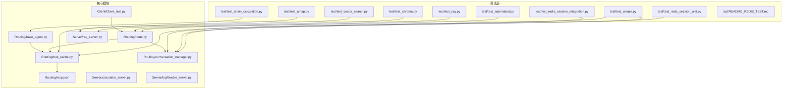
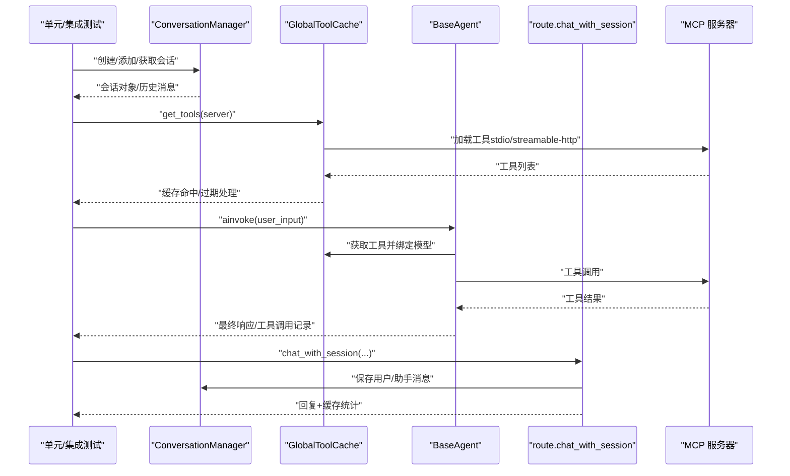
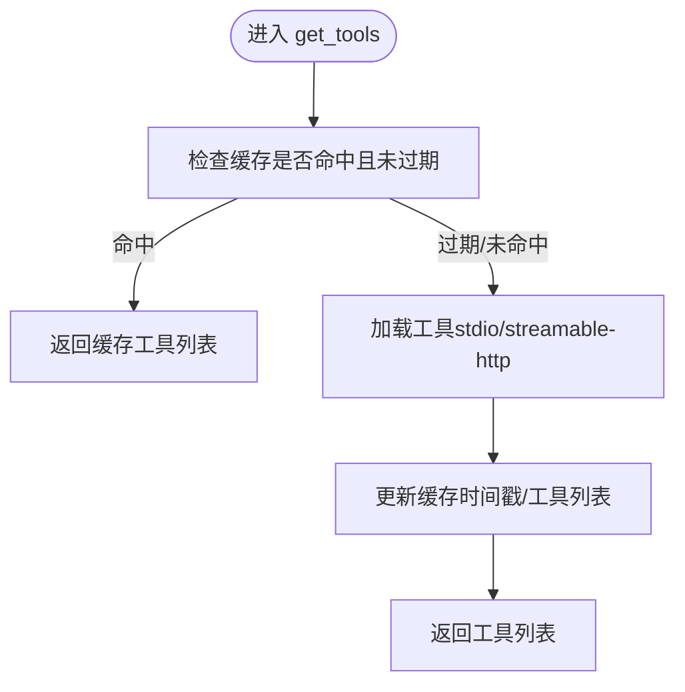
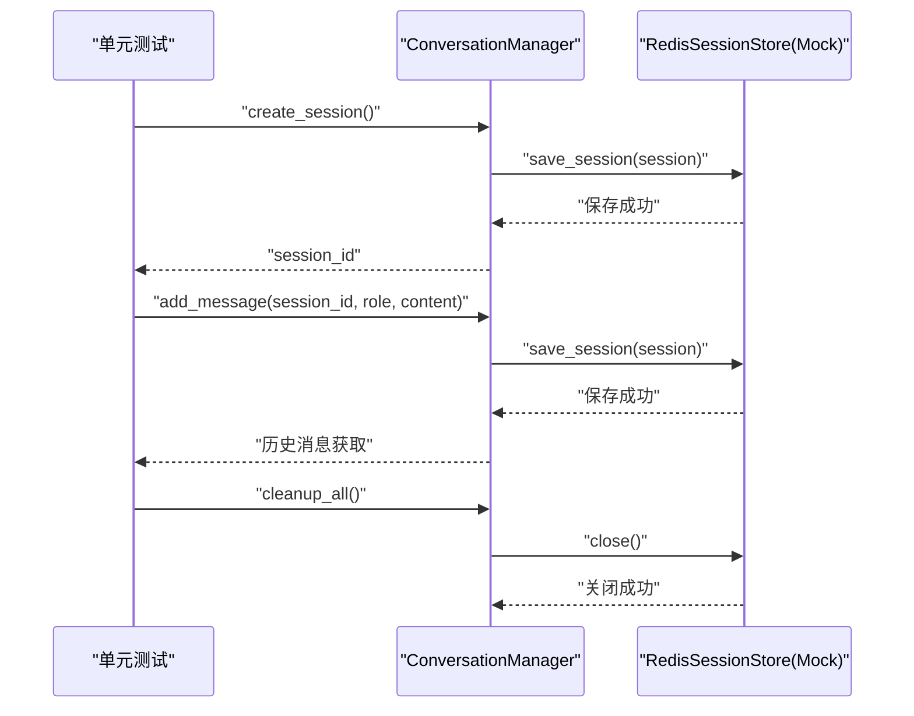
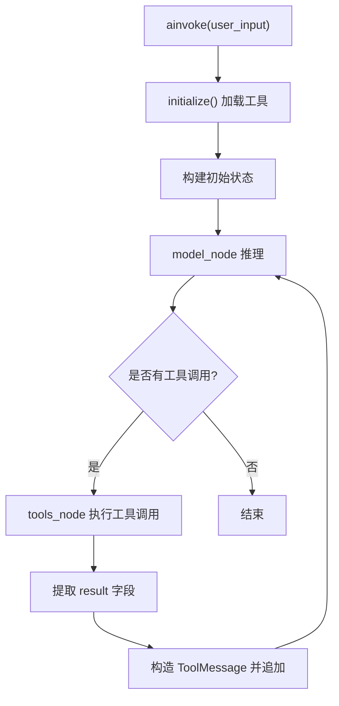
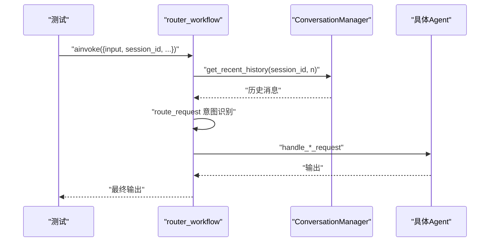
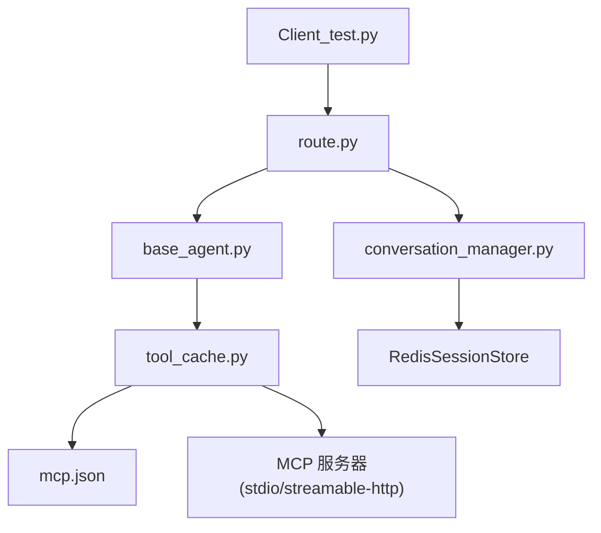

# 单元测试

<cite>
**本文档引用的文件**
- [test_simple.py](file://test/test_simple.py)
- [test_automated.py](file://test/test_automated.py)
- [test_chain_calculation.py](file://test/test_chain_calculation.py)
- [test_rag.py](file://test/test_rag.py)
- [test_amap.py](file://test/test_amap.py)
- [test_chroma.py](file://test/test_chroma.py)
- [test_vector_search.py](file://test/test_vector_search.py)
- [test_redis_session_unit.py](file://test/test_redis_session_unit.py)
- [test_redis_session_integration.py](file://test/test_redis_session_integration.py)
- [README_REDIS_TEST.md](file://test/README_REDIS_TEST.md)
- [tool_cache.py](file://Routing/tool_cache.py)
- [conversation_manager.py](file://Routing/conversation_manager.py)
- [base_agent.py](file://Routing/base_agent.py)
- [route.py](file://Routing/route.py)
- [mcp.json](file://Routing/mcp.json)
- [Client_test.py](file://Client/Client_test.py)
</cite>

## 目录
1. [引言](#引言)
2. [项目结构](#项目结构)
3. [核心组件](#核心组件)
4. [架构总览](#架构总览)
5. [详细组件分析](#详细组件分析)
6. [依赖分析](#依赖分析)
7. [性能考虑](#性能考虑)
8. [故障排查指南](#故障排查指南)
9. [结论](#结论)
10. [附录](#附录)

## 引言
本文件面向 AiOps 项目的单元测试体系，系统梳理各核心模块（MCP 工具缓存、代理系统、会话管理、路由与 RAG）的测试设计与实现方法。文档重点包括：
- 测试用例编写规范：测试数据准备、断言方法、异常处理
- 针对 MCP 服务器、代理系统、工具缓存、会话管理与 RAG 的单元/集成测试策略
- Mock 技术与测试隔离实践
- 覆盖率与质量标准建议
- 具体测试代码示例路径与最佳实践

## 项目结构
AiOps 的测试主要位于 test 目录，核心模块集中在 Routing 与 Server 目录，客户端入口在 Client 目录。下图展示测试与核心模块的关系。

**图表来源**
- [test_simple.py:1-103](file://test/test_simple.py#L1-L103)
- [test_automated.py:1-52](file://test/test_automated.py#L1-L52)
- [test_chain_calculation.py:1-65](file://test/test_chain_calculation.py#L1-L65)
- [test_rag.py:1-50](file://test/test_rag.py#L1-L50)
- [test_amap.py:1-68](file://test/test_amap.py#L1-L68)
- [test_chroma.py:1-29](file://test/test_chroma.py#L1-L29)
- [test_vector_search.py:1-66](file://test/test_vector_search.py#L1-L66)
- [test_redis_session_unit.py:1-294](file://test/test_redis_session_unit.py#L1-L294)
- [test_redis_session_integration.py:1-328](file://test/test_redis_session_integration.py#L1-L328)
- [tool_cache.py:1-302](file://Routing/tool_cache.py#L1-L302)
- [conversation_manager.py:1-275](file://Routing/conversation_manager.py#L1-L275)
- [base_agent.py:1-497](file://Routing/base_agent.py#L1-L497)
- [route.py:1-553](file://Routing/route.py#L1-L553)
- [mcp.json:1-29](file://Routing/mcp.json#L1-L29)
- [Client_test.py:1-230](file://Client/Client_test.py#L1-L230)

**章节来源**
- [test_simple.py:1-103](file://test/test_simple.py#L1-L103)
- [test_automated.py:1-52](file://test/test_automated.py#L1-L52)
- [test_chain_calculation.py:1-65](file://test/test_chain_calculation.py#L1-L65)
- [test_rag.py:1-50](file://test/test_rag.py#L1-L50)
- [test_amap.py:1-68](file://test/test_amap.py#L1-L68)
- [test_chroma.py:1-29](file://test/test_chroma.py#L1-L29)
- [test_vector_search.py:1-66](file://test/test_vector_search.py#L1-L66)
- [test_redis_session_unit.py:1-294](file://test/test_redis_session_unit.py#L1-L294)
- [test_redis_session_integration.py:1-328](file://test/test_redis_session_integration.py#L1-L328)
- [README_REDIS_TEST.md:1-174](file://test/README_REDIS_TEST.md#L1-L174)

## 核心组件
本节概述与测试密切相关的核心组件及其职责：
- 工具缓存（GlobalToolCache）：统一管理 MCP 服务器连接与工具加载，支持 TTL 缓存与会话管理
- 会话管理（ConversationManager）：多轮对话历史管理，支持内存与 Redis 持久化
- 代理基类（BaseAgent）：抽象 Agent 行为，统一工具加载、消息处理与错误处理
- 路由与会话（route.py）：意图识别与路由到具体 Agent，支持历史上下文与多轮对话
- MCP 配置（mcp.json）：定义各 MCP 服务器的传输协议与参数

**章节来源**
- [tool_cache.py:1-302](file://Routing/tool_cache.py#L1-L302)
- [conversation_manager.py:1-275](file://Routing/conversation_manager.py#L1-L275)
- [base_agent.py:1-497](file://Routing/base_agent.py#L1-L497)
- [route.py:1-553](file://Routing/route.py#L1-L553)
- [mcp.json:1-29](file://Routing/mcp.json#L1-L29)

## 架构总览
下图展示测试驱动的调用链路与关键断言点，体现单元测试如何覆盖核心模块的行为。

**图表来源**
- [test_simple.py:11-103](file://test/test_simple.py#L11-L103)
- [test_automated.py:12-52](file://test/test_automated.py#L12-L52)
- [test_chain_calculation.py:14-65](file://test/test_chain_calculation.py#L14-L65)
- [test_amap.py:14-68](file://test/test_amap.py#L14-L68)
- [tool_cache.py:85-117](file://Routing/tool_cache.py#L85-L117)
- [base_agent.py:258-318](file://Routing/base_agent.py#L258-L318)
- [route.py:351-415](file://Routing/route.py#L351-L415)

## 详细组件分析

### 工具缓存（GlobalToolCache）单元测试
- 测试目标
  - 验证缓存命中与过期清理
  - 验证 stdio 与 streamable-http 两种传输协议的工具加载
  - 验证清理逻辑（会话关闭、资源释放）
- 关键断言
  - 缓存统计信息（缓存服务器、缓存计数、活跃会话）
  - 工具列表长度与名称
  - 过期后重新加载
- Mock 与隔离
  - 通过 patch 替换配置加载与外部连接，避免真实 MCP 服务器依赖
- 示例路径
  - [test_simple.py:11-44](file://test/test_simple.py#L11-L44)
  - [test_amap.py:14-68](file://test/test_amap.py#L14-L68)
  - [tool_cache.py:85-117](file://Routing/tool_cache.py#L85-L117)

**图表来源**
- [tool_cache.py:85-117](file://Routing/tool_cache.py#L85-L117)

**章节来源**
- [test_simple.py:11-44](file://test/test_simple.py#L11-L44)
- [test_amap.py:14-68](file://test/test_amap.py#L14-L68)
- [tool_cache.py:1-302](file://Routing/tool_cache.py#L1-L302)

### 会话管理（ConversationManager）单元/集成测试
- 单元测试（Mock）
  - 验证启动时无/有历史会话的处理
  - 验证创建会话并保存到 Redis（Mock）
  - 验证添加消息并同步到 Redis（Mock）
  - 验证退出时资源清理
- 集成测试（真实 Redis）
  - 验证完整生命周期（创建、保存、加载、恢复）
  - 验证多会话并发管理
  - 验证会话过期清理机制
- 关键断言
  - 会话 ID 唯一性
  - 消息数量与内容一致性
  - Redis 连接与隧道关闭
- 示例路径
  - [test_redis_session_unit.py:22-294](file://test/test_redis_session_unit.py#L22-L294)
  - [test_redis_session_integration.py:26-328](file://test/test_redis_session_integration.py#L26-L328)
  - [README_REDIS_TEST.md:1-174](file://test/README_REDIS_TEST.md#L1-L174)

**图表来源**
- [test_redis_session_unit.py:90-191](file://test/test_redis_session_unit.py#L90-L191)
- [test_redis_session_integration.py:26-108](file://test/test_redis_session_integration.py#L26-L108)

**章节来源**
- [test_redis_session_unit.py:1-294](file://test/test_redis_session_unit.py#L1-L294)
- [test_redis_session_integration.py:1-328](file://test/test_redis_session_integration.py#L1-L328)
- [README_REDIS_TEST.md:1-174](file://test/README_REDIS_TEST.md#L1-L174)

### 代理系统（BaseAgent）单元测试
- 测试目标
  - 验证链式计算 Agent 的工具调用顺序与结果提取
  - 验证工具调用失败时的错误处理与消息构造
- 关键断言
  - 工具调用次数与顺序
  - 工具结果字段提取（仅 result 值）
  - 错误消息封装为 ToolMessage
- 示例路径
  - [test_chain_calculation.py:14-65](file://test/test_chain_calculation.py#L14-L65)
  - [base_agent.py:131-218](file://Routing/base_agent.py#L131-L218)

**图表来源**
- [base_agent.py:258-318](file://Routing/base_agent.py#L258-L318)
- [base_agent.py:131-218](file://Routing/base_agent.py#L131-L218)

**章节来源**
- [test_chain_calculation.py:1-65](file://test/test_chain_calculation.py#L1-L65)
- [base_agent.py:1-497](file://Routing/base_agent.py#L1-L497)

### 路由与 RAG 单元测试
- 测试目标
  - 验证路由工作流根据历史上下文与用户输入进行意图识别
  - 验证 RAG 知识库查询的后端切换（ChromaDB/Milvus）
- 关键断言
  - 决策结果与期望意图一致
  - 输出内容长度与格式
  - 多轮对话上下文拼接
- 示例路径
  - [test_rag.py:14-50](file://test/test_rag.py#L14-L50)
  - [route.py:149-234](file://Routing/route.py#L149-L234)

**图表来源**
- [test_rag.py:14-50](file://test/test_rag.py#L14-L50)
- [route.py:149-234](file://Routing/route.py#L149-L234)

**章节来源**
- [test_rag.py:1-50](file://test/test_rag.py#L1-L50)
- [route.py:1-553](file://Routing/route.py#L1-L553)

### 自动化测试与客户端集成
- 自动化测试
  - 模拟用户输入，验证多轮对话与缓存统计
- 客户端集成
  - Client_test.py 展示会话加载、命令交互、后端切换与资源清理
- 示例路径
  - [test_automated.py:12-52](file://test/test_automated.py#L12-L52)
  - [Client_test.py:40-230](file://Client/Client_test.py#L40-L230)

**章节来源**
- [test_automated.py:1-52](file://test/test_automated.py#L1-L52)
- [Client_test.py:1-230](file://Client/Client_test.py#L1-L230)

## 依赖分析
- 工具缓存依赖 MCP 配置文件与外部 MCP 服务器；通过 Mock 可实现测试隔离
- 会话管理依赖 Redis 存储；单元测试使用 Mock，集成测试使用真实 Redis
- 代理系统依赖工具缓存与 LLM；通过环境变量控制模型参数
- 路由模块依赖会话管理与工具缓存；支持多轮对话与历史上下文

**图表来源**
- [tool_cache.py:67-84](file://Routing/tool_cache.py#L67-L84)
- [mcp.json:1-29](file://Routing/mcp.json#L1-L29)
- [conversation_manager.py:100-121](file://Routing/conversation_manager.py#L100-L121)
- [base_agent.py:44-67](file://Routing/base_agent.py#L44-L67)
- [route.py:21-24](file://Routing/route.py#L21-L24)
- [Client_test.py:21-24](file://Client/Client_test.py#L21-L24)

**章节来源**
- [tool_cache.py:1-302](file://Routing/tool_cache.py#L1-L302)
- [conversation_manager.py:1-275](file://Routing/conversation_manager.py#L1-L275)
- [base_agent.py:1-497](file://Routing/base_agent.py#L1-L497)
- [route.py:1-553](file://Routing/route.py#L1-L553)
- [mcp.json:1-29](file://Routing/mcp.json#L1-L29)
- [Client_test.py:1-230](file://Client/Client_test.py#L1-L230)

## 性能考虑
- 工具缓存命中率：通过 TTL 控制与缓存统计接口评估
- 会话持久化：Redis 写入频率与序列化开销，建议批量写入与连接池
- 路由与代理：LLM 调用成本较高，应尽量减少不必要的工具调用
- 测试并发：集成测试中多会话并发需注意 Redis 锁与清理策略

## 故障排查指南
- Redis 相关
  - 确认 Redis 服务运行与端口可达
  - 若使用 SSH 隧道，检查密钥与隧道建立
  - 参考集成测试说明与常见问题定位
- MCP 服务器
  - 检查 mcp.json 配置与环境变量（如 AMAP_API_KEY）
  - 验证传输协议（stdio vs streamable-http）与超时设置
- 会话管理
  - 单元测试中使用 Mock 验证逻辑正确性
  - 集成测试中验证序列化/反序列化与过期清理

**章节来源**
- [README_REDIS_TEST.md:1-174](file://test/README_REDIS_TEST.md#L1-L174)
- [test_amap.py:14-68](file://test/test_amap.py#L14-L68)
- [tool_cache.py:198-243](file://Routing/tool_cache.py#L198-L243)

## 结论
本测试体系通过单元与集成测试相结合的方式，覆盖了工具缓存、会话管理、代理系统与路由的关键行为。单元测试强调 Mock 与隔离，集成测试强调真实环境验证。建议持续完善覆盖率与质量标准，确保每个函数与方法均有相应测试覆盖，并在 CI/CD 中强制执行。

## 附录
- 测试用例编写规范
  - 测试数据准备：使用最小必要数据，避免外部依赖
  - 断言方法：明确断言点（数量、内容、状态），区分成功与异常路径
  - 异常处理：捕获并验证异常消息，确保清理逻辑执行
- Mock 与隔离
  - 使用 patch/patch.object 替换外部依赖
  - 通过环境变量与配置文件注入可控参数
- 覆盖率与质量标准
  - 建议关键模块达到 80%+ 行覆盖率与 70%+ 分支覆盖率
  - 对异常路径与边界条件进行专项测试