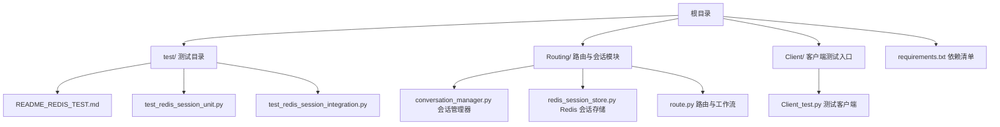
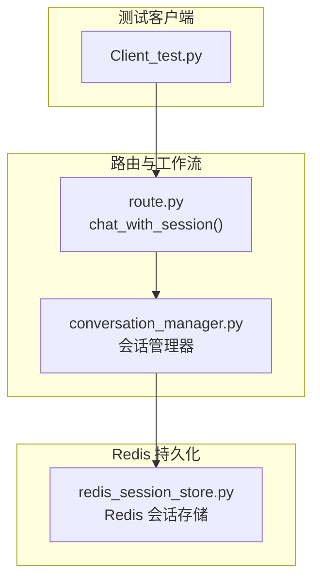
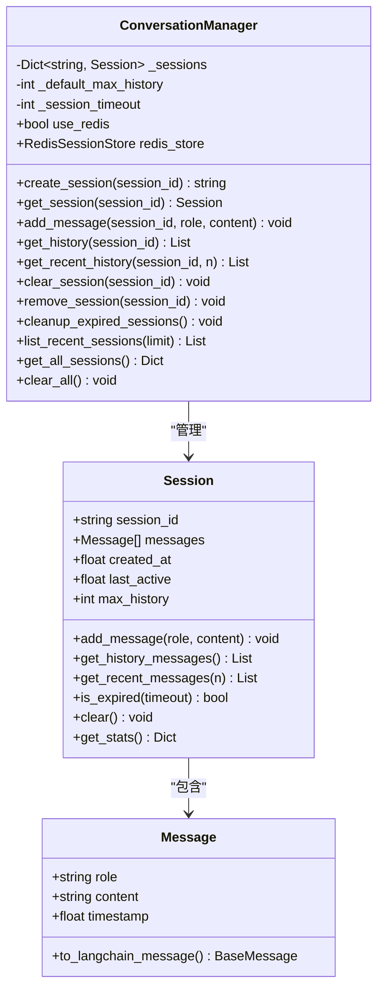
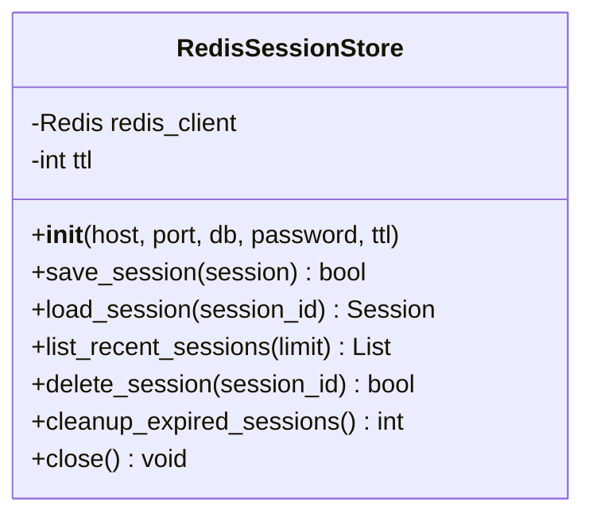
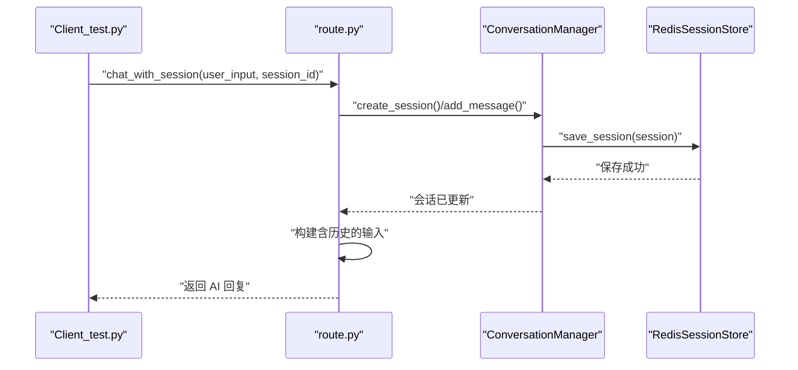
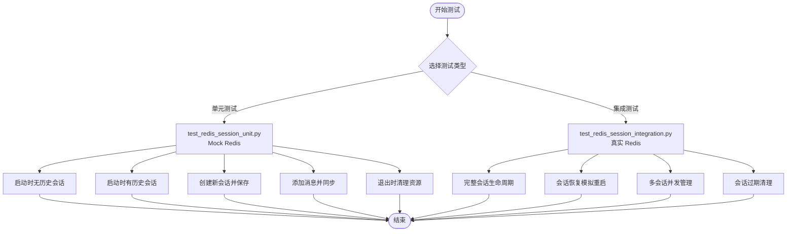
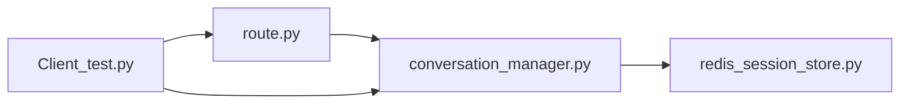

# 测试环境配置

<cite>
**本文引用的文件**
- [README.md](file://README.md)
- [requirements.txt](file://requirements.txt)
- [quickstart.py](file://quickstart.py)
- [test/README_REDIS_TEST.md](file://test/README_REDIS_TEST.md)
- [test/test_redis_session_unit.py](file://test/test_redis_session_unit.py)
- [test/test_redis_session_integration.py](file://test/test_redis_session_integration.py)
- [Client/Client_test.py](file://Client/Client_test.py)
- [Routing/conversation_manager.py](file://Routing/conversation_manager.py)
- [Routing/redis_session_store.py](file://Routing/redis_session_store.py)
- [Routing/route.py](file://Routing/route.py)
</cite>

## 目录
1. [简介](#简介)
2. [项目结构](#项目结构)
3. [核心组件](#核心组件)
4. [架构总览](#架构总览)
5. [详细组件分析](#详细组件分析)
6. [依赖关系分析](#依赖关系分析)
7. [性能考虑](#性能考虑)
8. [故障排除指南](#故障排除指南)
9. [结论](#结论)
10. [附录](#附录)

## 简介
本指南面向 AiOps 项目的测试环境搭建与运维，覆盖以下主题：
- Python 环境配置、虚拟环境与依赖安装
- 测试数据准备与管理（含会话持久化测试）
- Redis 测试环境的安装、配置与数据清理
- 环境变量配置与敏感信息安全管理
- Docker 容器化测试环境部署思路
- CI/CD 流水线配置建议
- 故障排除与性能优化实践

## 项目结构
项目采用模块化组织，测试相关代码集中在 test 目录，会话与 Redis 持久化逻辑位于 Routing 子模块，客户端测试入口位于 Client 子模块。

图表来源
- [test/README_REDIS_TEST.md:1-174](file://test/README_REDIS_TEST.md#L1-L174)
- [Routing/conversation_manager.py:1-275](file://Routing/conversation_manager.py#L1-L275)
- [Routing/redis_session_store.py:1-228](file://Routing/redis_session_store.py#L1-L228)
- [Routing/route.py:1-553](file://Routing/route.py#L1-L553)
- [Client/Client_test.py:1-230](file://Client/Client_test.py#L1-L230)

章节来源
- [README.md:1-125](file://README.md#L1-L125)
- [requirements.txt:1-17](file://requirements.txt#L1-L17)

## 核心组件
- 会话管理器：负责会话创建、消息添加、历史获取、过期清理与 Redis 持久化开关。
- Redis 会话存储：提供会话元数据、消息列表、活跃会话索引与过期会话清理。
- 路由与工作流：基于 LangGraph 的多代理路由，支持会话上下文注入。
- 客户端测试入口：支持循环对话、会话加载、工具缓存统计与 RAG 后端切换。
- 测试套件：单元测试（Mock）与集成测试（真实 Redis），覆盖会话生命周期、恢复、并发与过期清理。

章节来源
- [Routing/conversation_manager.py:82-275](file://Routing/conversation_manager.py#L82-L275)
- [Routing/redis_session_store.py:14-228](file://Routing/redis_session_store.py#L14-L228)
- [Routing/route.py:298-347](file://Routing/route.py#L298-L347)
- [Client/Client_test.py:40-230](file://Client/Client_test.py#L40-L230)
- [test/README_REDIS_TEST.md:1-174](file://test/README_REDIS_TEST.md#L1-L174)

## 架构总览
下图展示测试环境中的关键交互：客户端发起对话，路由模块根据会话上下文选择代理，会话管理器负责内存与 Redis 的一致性，Redis 存储承载会话持久化。

图表来源
- [Client/Client_test.py:180-230](file://Client/Client_test.py#L180-L230)
- [Routing/route.py:351-414](file://Routing/route.py#L351-L414)
- [Routing/conversation_manager.py:148-184](file://Routing/conversation_manager.py#L148-L184)
- [Routing/redis_session_store.py:36-88](file://Routing/redis_session_store.py#L36-L88)

## 详细组件分析

### 组件一：会话管理器（ConversationManager）
职责与行为
- 单例模式，管理多会话内存缓存与 Redis 持久化
- 提供创建、获取、添加消息、清空、删除、列出最近会话、过期清理等能力
- 支持 Redis 初始化失败回退至内存模式

图表来源
- [Routing/conversation_manager.py:18-275](file://Routing/conversation_manager.py#L18-L275)

章节来源
- [Routing/conversation_manager.py:82-275](file://Routing/conversation_manager.py#L82-L275)

### 组件二：Redis 会话存储（RedisSessionStore）
职责与行为
- 保存/加载会话元数据与消息列表
- 维护活跃会话有序集合与最近会话列表
- 提供过期会话清理与连接关闭

图表来源
- [Routing/redis_session_store.py:14-228](file://Routing/redis_session_store.py#L14-L228)

章节来源
- [Routing/redis_session_store.py:14-228](file://Routing/redis_session_store.py#L14-L228)

### 组件三：路由与会话上下文（route.py）
职责与行为
- 基于 LangGraph 的工作流，根据会话上下文路由到不同代理
- 提供会话级聊天接口，自动保存用户与 AI 消息
- 初始化 Redis 与 SSH 隧道，支持远程 Redis

图表来源
- [Client/Client_test.py:180-198](file://Client/Client_test.py#L180-L198)
- [Routing/route.py:351-414](file://Routing/route.py#L351-L414)
- [Routing/conversation_manager.py:148-184](file://Routing/conversation_manager.py#L148-L184)
- [Routing/redis_session_store.py:36-88](file://Routing/redis_session_store.py#L36-L88)

章节来源
- [Routing/route.py:298-347](file://Routing/route.py#L298-L347)
- [Routing/route.py:351-414](file://Routing/route.py#L351-L414)

### 组件四：测试套件（单元与集成）
- 单元测试（Mock）：验证启动、会话创建、消息同步与资源清理
- 集成测试（真实 Redis）：验证完整生命周期、会话恢复、并发与过期清理

图表来源
- [test/test_redis_session_unit.py:22-294](file://test/test_redis_session_unit.py#L22-L294)
- [test/test_redis_session_integration.py:26-328](file://test/test_redis_session_integration.py#L26-L328)

章节来源
- [test/README_REDIS_TEST.md:1-174](file://test/README_REDIS_TEST.md#L1-L174)
- [test/test_redis_session_unit.py:1-294](file://test/test_redis_session_unit.py#L1-L294)
- [test/test_redis_session_integration.py:1-328](file://test/test_redis_session_integration.py#L1-L328)

## 依赖关系分析
- 会话管理器依赖 Redis 会话存储（可选），在 Redis 初始化失败时回退内存模式
- 路由模块依赖会话管理器进行上下文注入与消息持久化
- 客户端测试入口依赖路由模块与会话管理器，提供交互式对话与会话管理命令

图表来源
- [Routing/conversation_manager.py:100-120](file://Routing/conversation_manager.py#L100-L120)
- [Routing/route.py:298-347](file://Routing/route.py#L298-L347)
- [Client/Client_test.py:22-23](file://Client/Client_test.py#L22-L23)

章节来源
- [Routing/conversation_manager.py:100-120](file://Routing/conversation_manager.py#L100-L120)
- [Routing/route.py:298-347](file://Routing/route.py#L298-L347)
- [Client/Client_test.py:22-23](file://Client/Client_test.py#L22-L23)

## 性能考虑
- 会话历史长度限制：默认保留最近若干轮对话，减少消息序列化与网络传输开销
- Redis TTL 与过期清理：合理设置会话 TTL 与定期清理，避免键空间膨胀
- 并发会话管理：使用有序集合维护活跃会话，提高查询效率
- 工具缓存统计：监控缓存命中率，优化代理调用频率

## 故障排除指南
常见问题与处理
- Redis 未运行或连接失败
  - 检查本地 Redis 是否启动，或使用 Docker 快速启动
  - 若使用远程 Redis，确认 SSH 隧道建立成功
- Paramiko DSSKey 报错
  - 降级 paramiko 至兼容版本，或更新密钥加载逻辑
- 测试数据污染
  - 集成测试会清理创建的数据；建议在隔离的测试 Redis 中运行
- 会话恢复异常
  - 确认 Redis 中会话键存在且未过期；必要时手动清理过期键

章节来源
- [test/README_REDIS_TEST.md:94-125](file://test/README_REDIS_TEST.md#L94-L125)
- [test/README_REDIS_TEST.md:66-78](file://test/README_REDIS_TEST.md#L66-L78)

## 结论
通过本指南，您可以在本地或容器化环境中快速搭建 AiOps 的测试环境，完成会话持久化与 Redis 集成测试，并掌握环境变量与敏感信息管理的最佳实践。建议在 CI/CD 中分别运行单元测试与集成测试，确保代码质量与稳定性。

## 附录

### A. Python 环境配置与依赖安装
- 创建并激活虚拟环境
- 安装依赖包
- 配置环境变量文件

章节来源
- [README.md:53-78](file://README.md#L53-L78)
- [requirements.txt:1-17](file://requirements.txt#L1-L17)

### B. 测试数据准备与管理
- 单元测试（Mock）：无需真实 Redis，适合快速验证逻辑
- 集成测试（真实 Redis）：验证完整生命周期与恢复能力
- 客户端测试：支持循环对话与会话管理命令

章节来源
- [test/README_REDIS_TEST.md:1-174](file://test/README_REDIS_TEST.md#L1-L174)
- [test/test_redis_session_unit.py:1-294](file://test/test_redis_session_unit.py#L1-L294)
- [test/test_redis_session_integration.py:1-328](file://test/test_redis_session_integration.py#L1-L328)
- [Client/Client_test.py:40-230](file://Client/Client_test.py#L40-L230)

### C. Redis 测试环境配置
- 本地安装或 Docker 启动
- 远程 Redis 通过 SSH 隧道访问
- 参数配置与清理策略

章节来源
- [test/README_REDIS_TEST.md:20-65](file://test/README_REDIS_TEST.md#L20-L65)
- [Routing/route.py:298-347](file://Routing/route.py#L298-L347)
- [Routing/redis_session_store.py:193-219](file://Routing/redis_session_store.py#L193-L219)

### D. 环境变量与敏感信息管理
- LLM 相关环境变量
- Redis 连接参数
- SSH 隧道参数
- 建议使用 .env 文件集中管理，避免硬编码

章节来源
- [Routing/route.py:26-38](file://Routing/route.py#L26-L38)
- [Routing/route.py:302-314](file://Routing/route.py#L302-L314)

### E. Docker 容器化测试环境部署（思路）
- 使用官方 Redis 镜像启动测试 Redis
- 在同一网络内运行应用容器，通过服务名访问 Redis
- 将 .env 与测试脚本映射到容器内，确保权限与路径一致

（本节为概念性指导，不直接对应具体源文件）

### F. CI/CD 流水线配置示例（思路）
- 分阶段执行：单元测试（Mock）优先，随后运行集成测试
- 使用 Docker Compose 启动 Redis 服务，供集成测试使用
- 将敏感信息以受保护变量形式注入，避免明文暴露

（本节为概念性指导，不直接对应具体源文件）