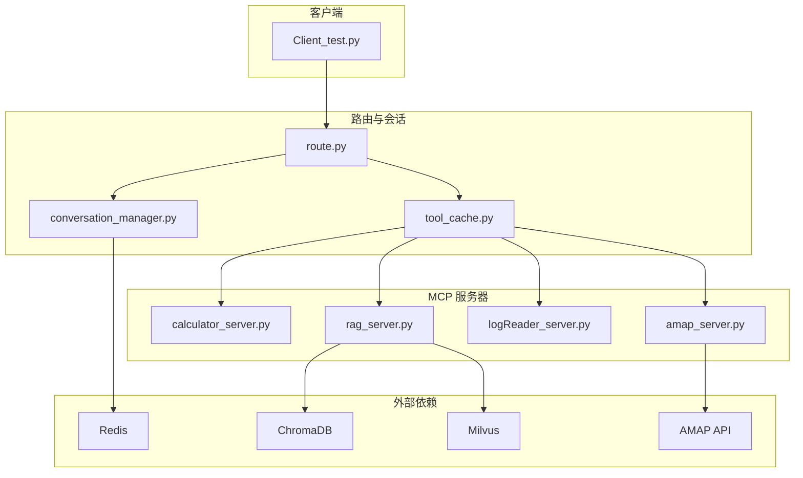
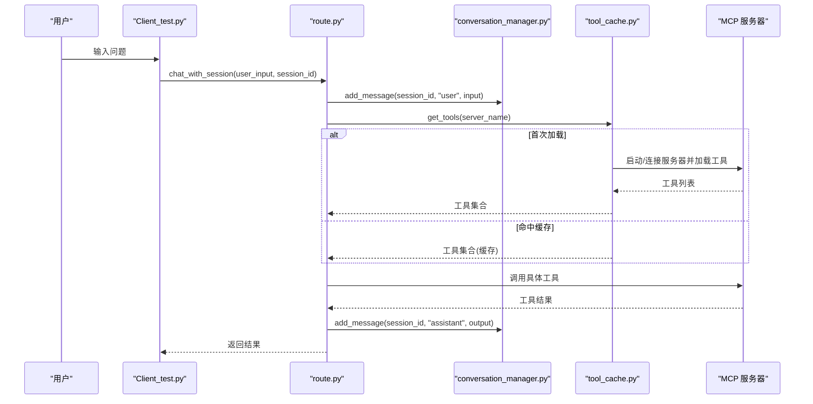
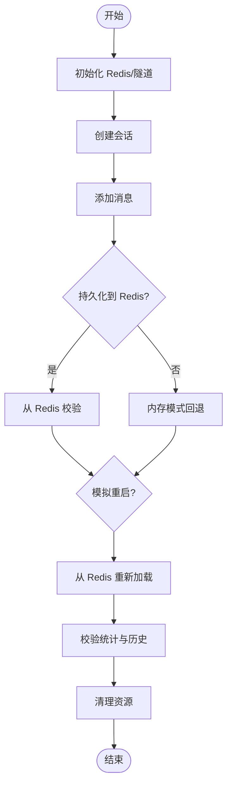
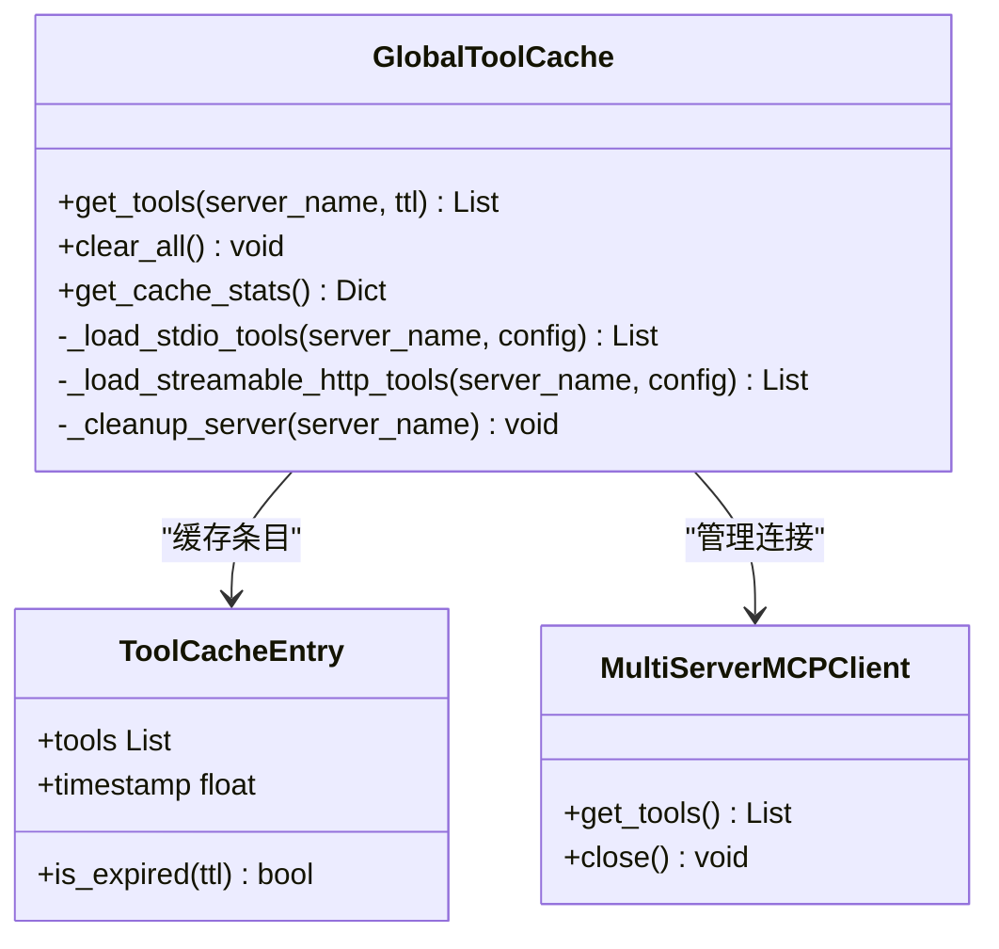
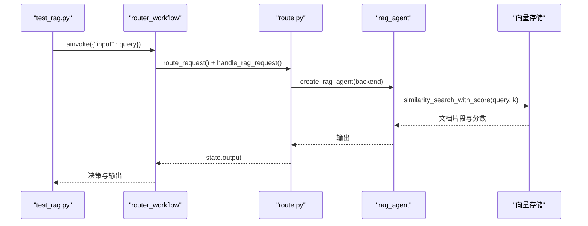
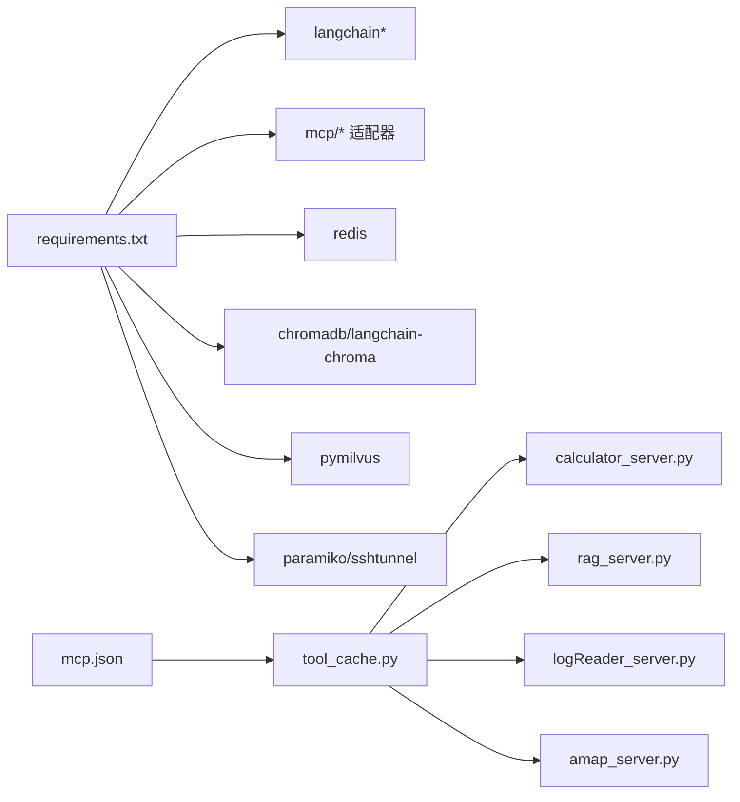

# 测试策略

<cite>
**本文档引用的文件**
- [README_REDIS_TEST.md](file://test/README_REDIS_TEST.md)
- [test_simple.py](file://test/test_simple.py)
- [test_automated.py](file://test/test_automated.py)
- [test_rag.py](file://test/test_rag.py)
- [test_redis_session_unit.py](file://test/test_redis_session_unit.py)
- [test_redis_session_integration.py](file://test/test_redis_session_integration.py)
- [test_chain_calculation.py](file://test/test_chain_calculation.py)
- [test_amap.py](file://test/test_amap.py)
- [test_chroma.py](file://test/test_chroma.py)
- [test_vector_search.py](file://test/test_vector_search.py)
- [route.py](file://Routing/route.py)
- [Client_test.py](file://Client/Client_test.py)
- [tool_cache.py](file://Routing/tool_cache.py)
- [conversation_manager.py](file://Routing/conversation_manager.py)
- [mcp.json](file://Routing/mcp.json)
- [calculator_server.py](file://Server/calculator_server.py)
- [rag_server.py](file://Server/rag_server.py)
- [requirements.txt](file://requirements.txt)
</cite>

## 目录
1. [简介](#简介)
2. [项目结构](#项目结构)
3. [核心组件](#核心组件)
4. [架构总览](#架构总览)
5. [详细组件分析](#详细组件分析)
6. [依赖关系分析](#依赖关系分析)
7. [性能考量](#性能考量)
8. [故障排查指南](#故障排查指南)
9. [结论](#结论)
10. [附录](#附录)

## 简介
本测试策略文档面向 AiOps 项目，系统化阐述测试架构与方法，覆盖单元测试、集成测试与端到端测试的设计原则；明确测试用例编写规范与最佳实践，重点针对 MCPP 协议与多服务器架构进行专项测试考虑；提供测试环境搭建与测试数据准备方法；给出自动化测试与持续集成配置思路；讨论性能与负载测试方法与工具；并提供测试覆盖率分析与质量评估标准，确保代码质量与系统稳定性。

## 项目结构
项目采用“路由层 + 代理层 + 服务器层”的分层设计，配合工具缓存与会话管理，形成以 LangGraph 为工作流引擎、MCP 为多服务器通信协议的多代理系统。测试文件按功能域划分，涵盖工具加载、会话持久化、RAG 检索、计算器代理、AMAP 工具、向量检索等。

图表来源
- [route.py:1-553](file://Routing/route.py#L1-L553)
- [Client_test.py:1-230](file://Client/Client_test.py#L1-L230)
- [tool_cache.py:1-302](file://Routing/tool_cache.py#L1-L302)
- [conversation_manager.py:1-275](file://Routing/conversation_manager.py#L1-L275)
- [calculator_server.py:1-111](file://Server/calculator_server.py#L1-L111)
- [rag_server.py:1-363](file://Server/rag_server.py#L1-L363)

章节来源
- [route.py:1-553](file://Routing/route.py#L1-L553)
- [Client_test.py:1-230](file://Client/Client_test.py#L1-L230)

## 核心组件
- 路由与工作流：基于 LangGraph 的状态机路由，支持历史上下文注入与多意图识别。
- 工具缓存：统一管理 MCP 服务器连接与工具加载，支持 TTL 过期与多传输协议（stdio、streamable-http）。
- 会话管理：多轮对话上下文管理，支持内存与 Redis 持久化，具备过期清理能力。
- 多服务器架构：计算器、RAG、日志读取、AMAP 等工具通过 MCP 服务器提供能力，支持本地与远程部署。

章节来源
- [route.py:149-295](file://Routing/route.py#L149-L295)
- [tool_cache.py:39-140](file://Routing/tool_cache.py#L39-L140)
- [conversation_manager.py:82-165](file://Routing/conversation_manager.py#L82-L165)

## 架构总览
下图展示从客户端发起请求到多服务器工具调用的端到端流程，以及会话与缓存的关键交互点。

图表来源
- [Client_test.py:180-198](file://Client/Client_test.py#L180-L198)
- [route.py:351-414](file://Routing/route.py#L351-L414)
- [tool_cache.py:85-140](file://Routing/tool_cache.py#L85-L140)
- [conversation_manager.py:166-184](file://Routing/conversation_manager.py#L166-L184)

## 详细组件分析

### 会话持久化测试（单元与集成）
- 单元测试（Mock）：验证启动、会话创建、消息同步、资源清理等逻辑，不依赖真实 Redis。
- 集成测试（真实 Redis）：验证完整生命周期、会话恢复、并发管理、过期清理与资源清理。

图表来源
- [test_redis_session_unit.py:253-294](file://test/test_redis_session_unit.py#L253-L294)
- [test_redis_session_integration.py:287-328](file://test/test_redis_session_integration.py#L287-L328)

章节来源
- [test_redis_session_unit.py:1-294](file://test/test_redis_session_unit.py#L1-L294)
- [test_redis_session_integration.py:1-328](file://test/test_redis_session_integration.py#L1-L328)
- [README_REDIS_TEST.md:1-174](file://test/README_REDIS_TEST.md#L1-L174)

### 工具缓存与 MCP 协议测试
- 工具缓存：验证首次加载、缓存命中、TTL 过期、连接清理与统计信息。
- MCP 协议：验证 stdio 与 streamable-http 两种传输方式，工具加载与调用。
- AMAP 工具：验证 API Key 配置、工具列表加载与天气工具调用。

图表来源
- [tool_cache.py:39-298](file://Routing/tool_cache.py#L39-L298)

章节来源
- [tool_cache.py:1-302](file://Routing/tool_cache.py#L1-L302)
- [test_amap.py:1-68](file://test/test_amap.py#L1-L68)
- [mcp.json:1-29](file://Routing/mcp.json#L1-L29)

### RAG 路由与检索测试
- 路由测试：验证意图识别（calculator、log_reader、amap、rag_query）与工作流分支。
- 向量检索：验证 ChromaDB/Milvus 向量检索、相似度排序与结果格式化。

图表来源
- [test_rag.py:14-50](file://test/test_rag.py#L14-L50)
- [route.py:98-108](file://Routing/route.py#L98-L108)
- [rag_server.py:193-244](file://Server/rag_server.py#L193-L244)

章节来源
- [test_rag.py:1-50](file://test/test_rag.py#L1-L50)
- [test_chroma.py:1-29](file://test/test_chroma.py#L1-L29)
- [test_vector_search.py:1-66](file://test/test_vector_search.py#L1-L66)
- [rag_server.py:161-191](file://Server/rag_server.py#L161-L191)

### 计算器代理链式计算测试
- 验证链式计算、运算优先级与工具调用链路，输出中间步骤与最终结果。

章节来源
- [test_chain_calculation.py:1-65](file://test/test_chain_calculation.py#L1-L65)
- [calculator_server.py:16-105](file://Server/calculator_server.py#L16-L105)

### 端到端自动化测试
- 自动化脚本模拟用户输入，验证会话保持、工具缓存命中与清理流程。

章节来源
- [test_automated.py:1-52](file://test/test_automated.py#L1-L52)
- [route.py:351-414](file://Routing/route.py#L351-L414)

## 依赖关系分析
- 测试依赖：pytest/unittest、asyncio、langchain、mcp 客户端适配器、redis、chromadb、milvus、paramiko/sshtunnel。
- MCP 配置：集中于 mcp.json，定义服务器地址、传输协议与参数。

图表来源
- [requirements.txt:1-17](file://requirements.txt#L1-L17)
- [mcp.json:1-29](file://Routing/mcp.json#L1-L29)
- [tool_cache.py:18-25](file://Routing/tool_cache.py#L18-L25)

章节来源
- [requirements.txt:1-17](file://requirements.txt#L1-L17)
- [mcp.json:1-29](file://Routing/mcp.json#L1-L29)

## 性能考量
- 工具缓存命中率：通过工具缓存统计接口评估缓存命中与活跃会话数，减少重复连接成本。
- 会话并发与过期：监控会话数量、过期清理频率与 Redis/TTL 参数，避免内存泄漏。
- 向量检索延迟：对比 ChromaDB 与 Milvus 的检索耗时与命中率，结合 k 值与嵌入模型选择。
- MCP 服务器响应：记录工具调用耗时与错误率，优化 stdio/HTTP 传输与超时配置。
- 客户端吞吐：在自动化测试中模拟多轮对话与并发请求，评估路由与工作流编译开销。

## 故障排查指南
- Redis 会话持久化
  - 症状：集成测试连接失败或数据未落盘。
  - 排查：确认 Redis 服务状态、端口映射、SSH 隧道连通性；参考测试说明文档。
- Paramiko DSSKey 错误
  - 症状：运行时 AttributeError。
  - 处理：降级 paramiko 或更新 SSH 隧道管理器密钥加载逻辑。
- AMAP 工具加载
  - 症状：API Key 未设置或工具加载失败。
  - 处理：设置 AMAP_API_KEY 并检查网络与超时。
- 向量检索
  - 症状：查询无结果或报错。
  - 处理：确认嵌入模型可用、向量库已初始化、Milvus 隧道建立成功。

章节来源
- [README_REDIS_TEST.md:66-125](file://test/README_REDIS_TEST.md#L66-L125)
- [test_amap.py:20-27](file://test/test_amap.py#L20-L27)
- [rag_server.py:31-33](file://Server/rag_server.py#L31-L33)

## 结论
本测试策略围绕“路由工作流 + 工具缓存 + 会话持久化 + 多服务器 MCP”展开，通过单元、集成与端到端测试覆盖核心路径，并针对 MCP 协议与多服务器架构制定专项测试方案。建议在 CI 中优先运行单元与集成测试，结合自动化脚本进行端到端回归，持续监控缓存命中率、会话清理与向量检索性能，以保障系统稳定性与可维护性。

## 附录

### 测试用例编写规范与最佳实践
- 单元测试
  - 使用 Mock 隔离外部依赖，聚焦业务逻辑。
  - 覆盖边界条件（空历史、过期会话、异常路径）。
- 集成测试
  - 使用真实外部服务（Redis、向量库、MCP 服务器），验证端到端链路。
  - 通过环境变量控制服务器地址与认证信息。
- 端到端测试
  - 模拟真实用户行为，验证会话保持、历史注入与工具调用。
  - 对关键路径进行超时与重试控制。

### 测试环境搭建指南
- 基础依赖：安装 requirements.txt 中的包。
- Redis：本地 Docker 或系统服务，或通过 SSH 隧道连接远程 Redis。
- 向量库：ChromaDB 自动初始化；Milvus 需要 SSH 隧道与连接配置。
- MCP 服务器：确保计算器与 RAG 服务器可被工具缓存发现与启动。

章节来源
- [requirements.txt:1-17](file://requirements.txt#L1-L17)
- [README_REDIS_TEST.md:20-44](file://test/README_REDIS_TEST.md#L20-L44)
- [mcp.json:1-29](file://Routing/mcp.json#L1-L29)

### 测试数据准备方法
- 会话数据：通过会话管理器创建与清理，或直接写入 Redis。
- 向量数据：通过 RAG 服务器加载 Data 目录文档，或手动初始化 ChromaDB。
- AMAP 工具：准备有效 API Key，确保网络可达。

章节来源
- [rag_server.py:280-304](file://Server/rag_server.py#L280-L304)
- [test_chroma.py:1-29](file://test/test_chroma.py#L1-L29)

### 自动化测试与持续集成
- 建议流水线阶段
  - 依赖安装与环境准备
  - 单元测试（优先）
  - 集成测试（Redis、向量库、MCP 服务器）
  - 端到端自动化脚本
- 并行化：将互不依赖的测试集并行执行，缩短总时长。
- 报告与覆盖率：结合 pytest-html 与 coverage，输出报告并设定阈值。

### 性能与负载测试
- 工具缓存：监控缓存命中率与 TTL 生效情况。
- 会话管理：并发创建/清理会话，观察内存与 Redis 负载。
- 向量检索：调整 k 值与嵌入模型，评估延迟与准确性。
- MCP 服务器：压测工具调用 QPS 与错误率，优化超时与并发。

### 测试覆盖率与质量评估
- 覆盖率指标：语句/分支/函数/行覆盖率，目标阈值建议在关键模块不低于 80%。
- 质量门禁：失败用例数、平均执行时长、错误分类统计、缓存命中率。
- 持续改进：定期回顾失败用例与回归风险，补充边界与异常场景。