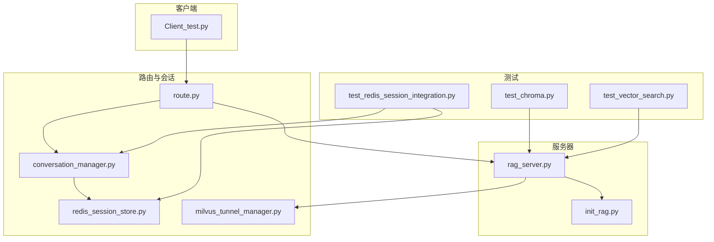
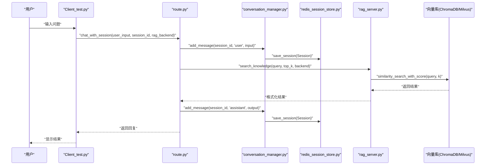
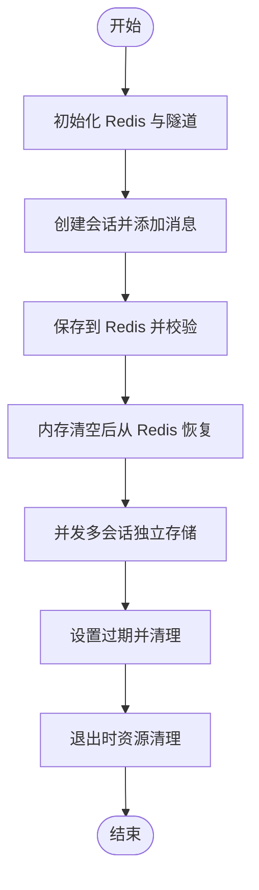
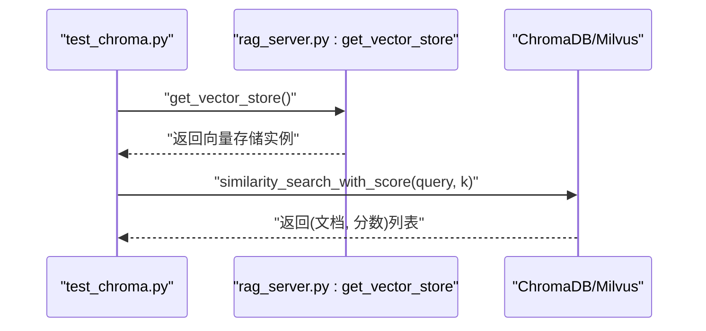
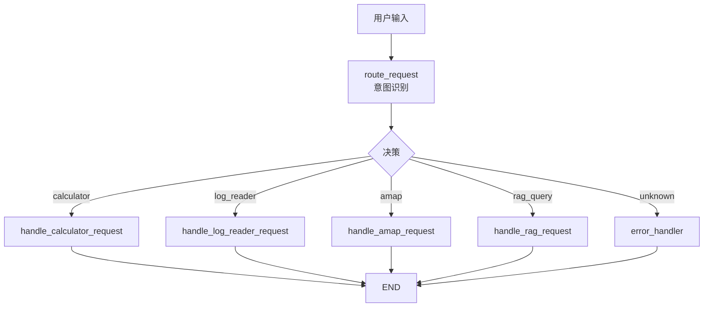
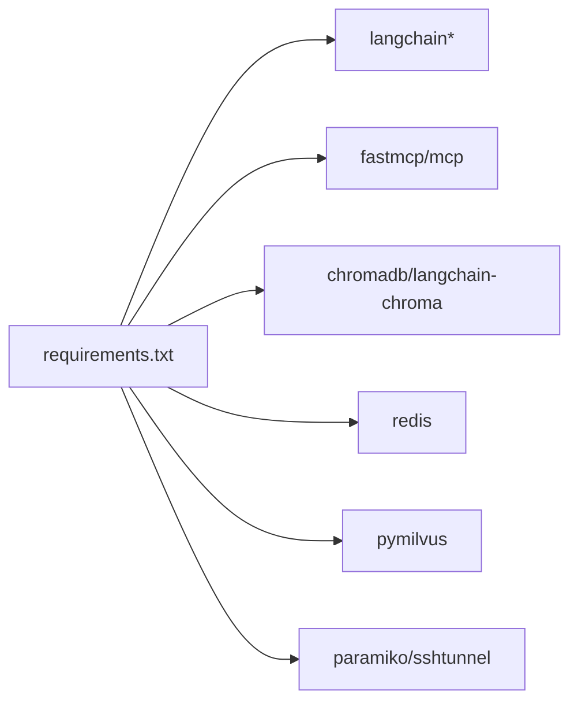

# 集成测试

<cite>
**本文档引用的文件**
- [test_redis_session_integration.py](file://test/test_redis_session_integration.py)
- [README_REDIS_TEST.md](file://test/README_REDIS_TEST.md)
- [redis_session_store.py](file://Routing/redis_session_store.py)
- [conversation_manager.py](file://Routing/conversation_manager.py)
- [route.py](file://Routing/route.py)
- [Client_test.py](file://Client/Client_test.py)
- [test_chroma.py](file://test/test_chroma.py)
- [test_vector_search.py](file://test/test_vector_search.py)
- [rag_server.py](file://Server/rag_server.py)
- [init_rag.py](file://Server/init_rag.py)
- [milvus_tunnel_manager.py](file://Routing/milvus_tunnel_manager.py)
- [requirements.txt](file://requirements.txt)
- [README.md](file://README.md)
</cite>

## 目录
1. [简介](#简介)
2. [项目结构](#项目结构)
3. [核心组件](#核心组件)
4. [架构总览](#架构总览)
5. [详细组件分析](#详细组件分析)
6. [依赖分析](#依赖分析)
7. [性能考虑](#性能考虑)
8. [故障排查指南](#故障排查指南)
9. [结论](#结论)
10. [附录](#附录)

## 简介
本文件面向 AiOps 项目的集成测试，聚焦多组件协同工作验证，包括：
- MCP 服务器间通信测试
- 代理系统的集成验证
- 向量数据库的集成测试（ChromaDB 与 Milvus）
- 端到端工作流的测试设计（数据流验证、错误传播测试、边界条件处理）
- Redis 会话存储集成测试（会话生命周期、并发、过期清理、资源清理）
- 测试环境搭建与依赖管理最佳实践

## 项目结构
项目采用模块化分层组织，核心模块如下：
- Routing：路由与会话管理、Redis 存储、隧道管理
- Server：RAG 服务器、向量索引初始化
- Client：交互式客户端与测试客户端
- test：各类集成与单元测试脚本
- 根目录：依赖清单、环境说明与快速开始

**图表来源**
- [Client_test.py:1-230](file://Client/Client_test.py#L1-L230)
- [route.py:1-553](file://Routing/route.py#L1-L553)
- [conversation_manager.py:1-275](file://Routing/conversation_manager.py#L1-L275)
- [redis_session_store.py:1-228](file://Routing/redis_session_store.py#L1-L228)
- [milvus_tunnel_manager.py:1-101](file://Routing/milvus_tunnel_manager.py#L1-L101)
- [rag_server.py:1-363](file://Server/rag_server.py#L1-L363)
- [init_rag.py:1-506](file://Server/init_rag.py#L1-L506)
- [test_redis_session_integration.py:1-328](file://test/test_redis_session_integration.py#L1-L328)
- [test_chroma.py:1-29](file://test/test_chroma.py#L1-L29)
- [test_vector_search.py:1-66](file://test/test_vector_search.py#L1-L66)

**章节来源**
- [README.md:1-125](file://README.md#L1-L125)

## 核心组件
- 路由与会话管理：负责意图识别、多代理路由、会话上下文构建与持久化
- Redis 会话存储：提供会话元数据与消息的持久化、活跃会话索引与过期清理
- RAG 服务器：提供知识检索工具，支持 ChromaDB 与 Milvus 后端
- 向量索引初始化：批量加载文档、分块、嵌入与索引构建
- 客户端：交互式对话与自动化测试，贯穿端到端验证

**章节来源**
- [route.py:1-553](file://Routing/route.py#L1-L553)
- [conversation_manager.py:1-275](file://Routing/conversation_manager.py#L1-L275)
- [redis_session_store.py:1-228](file://Routing/redis_session_store.py#L1-L228)
- [rag_server.py:1-363](file://Server/rag_server.py#L1-L363)
- [init_rag.py:1-506](file://Server/init_rag.py#L1-L506)
- [Client_test.py:1-230](file://Client/Client_test.py#L1-L230)

## 架构总览
端到端工作流从客户端发起，经路由与会话管理，调用 RAG 服务器进行知识检索，最终返回结果。Redis 作为会话持久化层，Milvus 通过 SSH 隧道提供远程向量检索能力。

**图表来源**
- [Client_test.py:180-197](file://Client/Client_test.py#L180-L197)
- [route.py:351-414](file://Routing/route.py#L351-L414)
- [conversation_manager.py:166-184](file://Routing/conversation_manager.py#L166-L184)
- [redis_session_store.py:36-84](file://Routing/redis_session_store.py#L36-L84)
- [rag_server.py:193-244](file://Server/rag_server.py#L193-L244)

## 详细组件分析

### Redis 会话存储集成测试
目标：验证完整会话生命周期、并发管理、过期清理与资源清理；确认 Redis 持久化一致性与可靠性。

- 测试用例
  - 完整生命周期：创建、保存、加载、恢复、删除
  - 会话恢复：内存清空后从 Redis 恢复
  - 并发管理：多会话独立存储与活跃列表
  - 过期清理：手动设置过期并触发清理
  - 资源清理：退出时关闭连接与隧道

- 关键验证点
  - 会话元数据与消息列表写入 Redis 的键空间与 TTL
  - 活跃会话有序集合与历史列表的维护
  - 过期会话清理后 Redis 侧一致性
  - 异常路径（网络中断、Redis 不可用）的健壮性

**图表来源**
- [test_redis_session_integration.py:26-328](file://test/test_redis_session_integration.py#L26-L328)
- [redis_session_store.py:36-220](file://Routing/redis_session_store.py#L36-L220)
- [conversation_manager.py:122-233](file://Routing/conversation_manager.py#L122-L233)
- [route.py:298-347](file://Routing/route.py#L298-L347)

**章节来源**
- [test_redis_session_integration.py:1-328](file://test/test_redis_session_integration.py#L1-L328)
- [README_REDIS_TEST.md:1-174](file://test/README_REDIS_TEST.md#L1-L174)
- [redis_session_store.py:1-228](file://Routing/redis_session_store.py#L1-L228)
- [conversation_manager.py:1-275](file://Routing/conversation_manager.py#L1-L275)
- [route.py:298-347](file://Routing/route.py#L298-L347)

### 向量数据库集成测试（ChromaDB 与 Milvus）
目标：验证向量检索工具链的可用性、索引构建、查询性能与数据一致性。

- ChromaDB 集成测试
  - 直接加载本地持久化向量库，执行相似度检索
  - 验证返回文档与元数据字段
  - 环境变量与嵌入模型配置

- Milvus 集成测试
  - 通过 SSH 隧道连接远程 Milvus
  - 检查向量搜索接口兼容性与统计信息
  - 验证连接建立、查询执行与断开清理

**图表来源**
- [test_chroma.py:1-29](file://test/test_chroma.py#L1-L29)
- [rag_server.py:161-191](file://Server/rag_server.py#L161-L191)
- [rag_server.py:86-126](file://Server/rag_server.py#L86-L126)

**章节来源**
- [test_chroma.py:1-29](file://test/test_chroma.py#L1-L29)
- [test_vector_search.py:1-66](file://test/test_vector_search.py#L1-L66)
- [rag_server.py:1-363](file://Server/rag_server.py#L1-L363)
- [init_rag.py:294-496](file://Server/init_rag.py#L294-L496)
- [milvus_tunnel_manager.py:1-101](file://Routing/milvus_tunnel_manager.py#L1-L101)

### MCP 服务器间通信与代理系统集成
目标：验证路由工作流、代理调用与工具链协作。

- 路由工作流
  - 意图识别节点根据历史与当前输入决策
  - 条件边将请求路由至计算器、日志读取、高德地图或 RAG 代理
  - 错误处理节点兜底

- 代理系统
  - 客户端通过 chat_with_session 发起请求
  - 会话管理器记录用户与 AI 消息
  - RAG 服务器提供知识检索工具

**图表来源**
- [route.py:149-256](file://Routing/route.py#L149-L256)
- [route.py:61-108](file://Routing/route.py#L61-L108)
- [Client_test.py:180-197](file://Client/Client_test.py#L180-L197)

**章节来源**
- [route.py:1-553](file://Routing/route.py#L1-L553)
- [Client_test.py:1-230](file://Client/Client_test.py#L1-L230)

## 依赖分析
- 核心依赖
  - fastmcp、langchain、langchain-community、langchain-core、langchain-mcp-adapters、mcp、httpx
  - chromadb、langchain-chroma、pypdf
  - redis、paramiko、sshtunnel
  - pymilvus

- 环境变量
  - DASHSCOPE_API_KEY、AMAP_API_KEY
  - SSH_*、REDIS_*、MILVUS_* 等连接参数

**图表来源**
- [requirements.txt:1-17](file://requirements.txt#L1-L17)

**章节来源**
- [requirements.txt:1-17](file://requirements.txt#L1-L17)
- [README.md:64-69](file://README.md#L64-L69)

## 性能考虑
- 向量检索性能
  - 批量嵌入与分批插入，避免单次请求过大
  - Milvus 索引参数与 nprobe 调优
- 会话持久化
  - Redis TTL 控制与键空间设计，避免热键
  - 批量写入与有序集合更新的原子性
- 网络与隧道
  - SSH 隧道复用与连接池化，减少握手开销
- 客户端与服务端
  - 工具缓存命中率监控，降低重复调用
  - 请求超时与重试策略

## 故障排查指南
- Redis 相关
  - 确认 Redis 服务运行与端口可达
  - 检查 SSH 隧道是否建立成功
  - 参数化密钥加载兼容性问题（paramiko 版本）

- 向量库相关
  - ChromaDB 持久化目录权限与磁盘空间
  - Milvus 连接参数与远程端口映射
  - 嵌入模型 API 密钥与配额

- 路由与代理
  - 意图识别失败时的回退策略
  - 代理工具不可用时的错误传播与降级

**章节来源**
- [README_REDIS_TEST.md:94-125](file://test/README_REDIS_TEST.md#L94-L125)
- [route.py:298-347](file://Routing/route.py#L298-L347)
- [rag_server.py:61-84](file://Server/rag_server.py#L61-L84)

## 结论
通过覆盖 Redis 会话存储、向量数据库与 MCP 代理系统的集成测试，能够有效验证 AiOps 在真实环境下的稳定性与一致性。建议在持续集成中同时运行单元与集成测试，并针对性能热点（向量检索、会话持久化、隧道连接）进行基准测试与回归验证。

## 附录
- 测试环境搭建
  - 安装依赖：pip install -r requirements.txt
  - 配置环境变量：DASHSCOPE_API_KEY、AMAP_API_KEY 等
  - 启动 Redis（本地或容器）与 Milvus（通过隧道）
  - 运行集成测试脚本与客户端进行端到端验证

- 最佳实践
  - 使用独立测试命名空间与隔离数据目录
  - 对关键路径增加超时与重试
  - 记录测试日志并定期归档
  - 对外依赖（Milvus、DashScope）增加健康检查