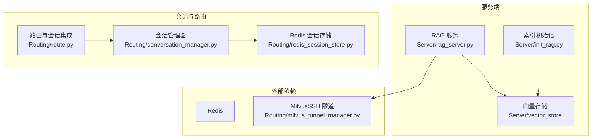
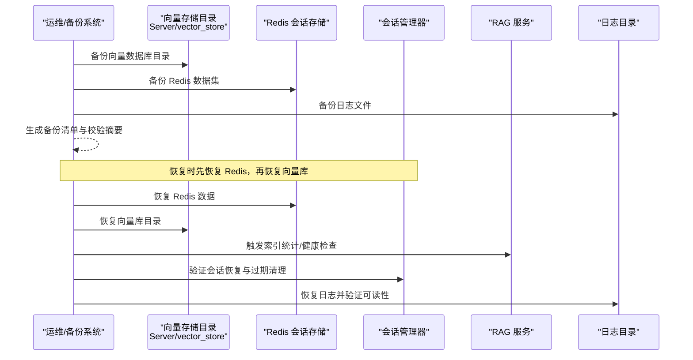
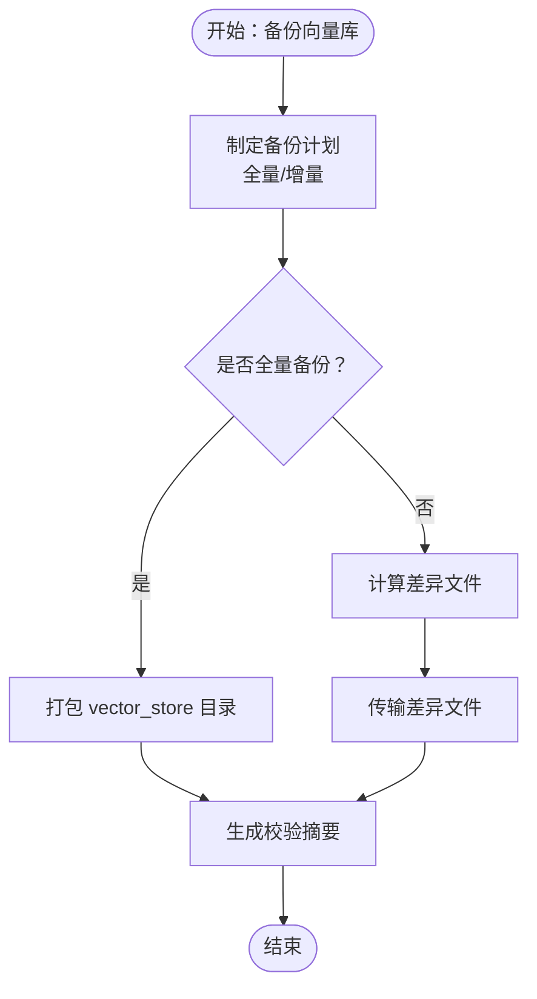
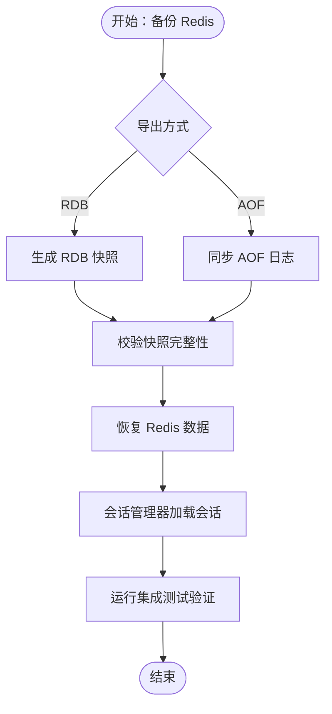
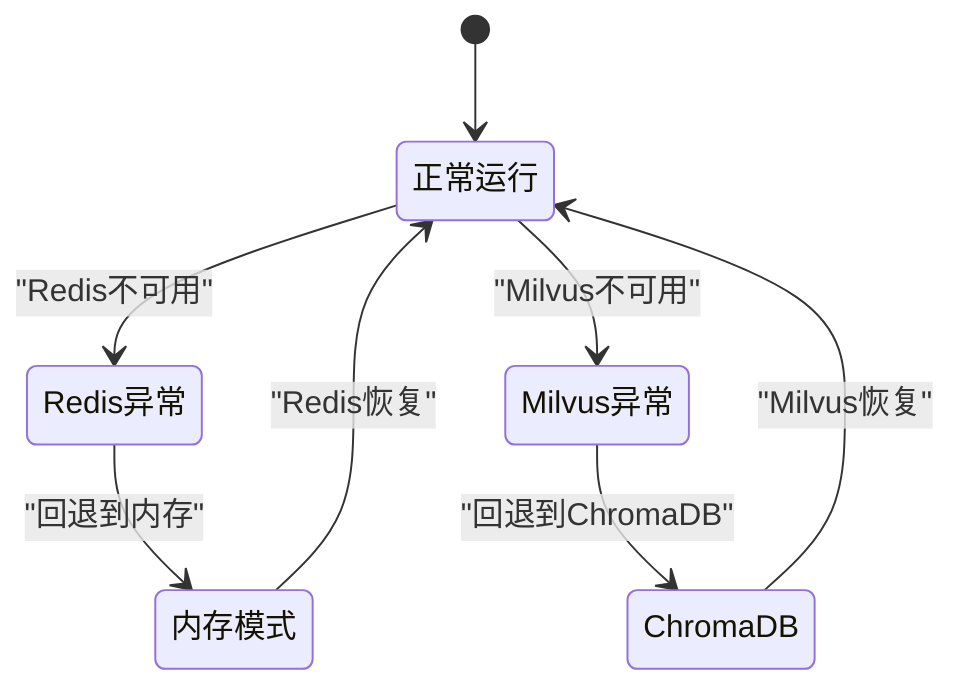
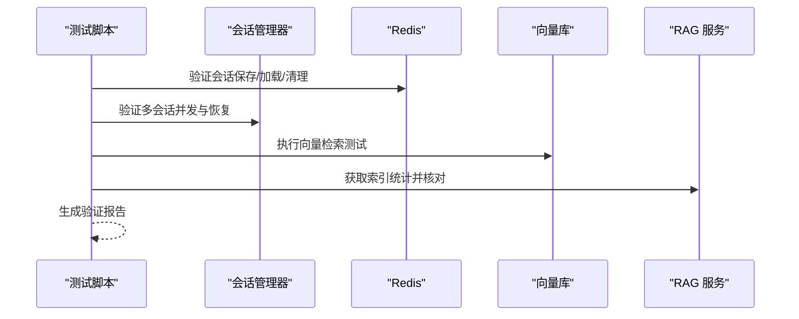
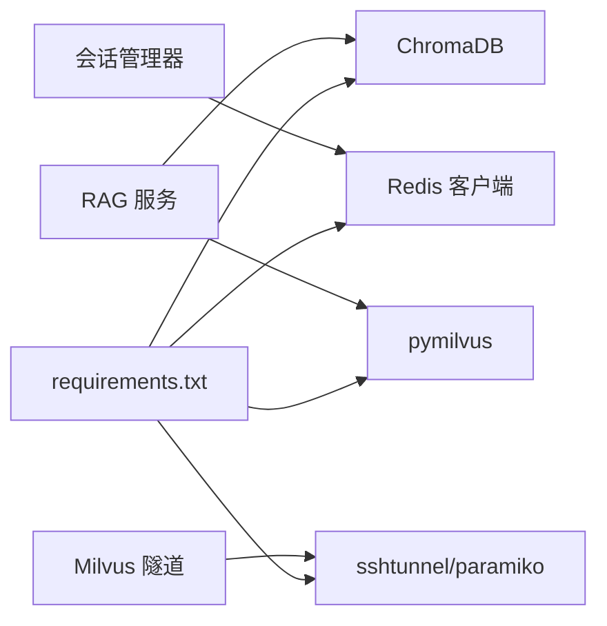

# 备份恢复

<cite>
**本文引用的文件**
- [README.md](file://README.md)
- [requirements.txt](file://requirements.txt)
- [redis_session_store.py](file://Routing/redis_session_store.py)
- [conversation_manager.py](file://Routing/conversation_manager.py)
- [rag_server.py](file://Server/rag_server.py)
- [init_rag.py](file://Server/init_rag.py)
- [milvus_tunnel_manager.py](file://Routing/milvus_tunnel_manager.py)
- [route.py](file://Routing/route.py)
- [test_redis_session_integration.py](file://test/test_redis_session_integration.py)
- [test_vector_search.py](file://test/test_vector_search.py)
- [测评.json](file://Data/测评.json)
- [design.md](file://.kiro/specs/redis-installation/design.md)
</cite>

## 目录
1. [简介](#简介)
2. [项目结构](#项目结构)
3. [核心组件](#核心组件)
4. [架构总览](#架构总览)
5. [详细组件分析](#详细组件分析)
6. [依赖分析](#依赖分析)
7. [性能考量](#性能考量)
8. [故障排查指南](#故障排查指南)
9. [结论](#结论)
10. [附录](#附录)

## 简介
本文件面向 AiOps 项目，制定一套系统化的备份与恢复策略，覆盖以下数据域：
- 向量数据库（ChromaDB 本地持久化目录）
- Redis 会话存储（会话元数据、消息列表、活跃索引）
- 日志数据（应用日志与测试日志）

同时明确全量与增量备份策略、灾难恢复计划、业务连续性保障、备份验证与恢复测试流程、备份存储安全与合规要求，以及紧急情况下的快速恢复操作指南。

## 项目结构
项目采用模块化组织，关键与备份相关的位置如下：
- 向量数据库持久化目录：Server/vector_store（ChromaDB）
- Redis 会话存储：Routing/redis_session_store.py、Routing/conversation_manager.py
- RAG 服务与向量索引初始化：Server/rag_server.py、Server/init_rag.py
- SSH 隧道（Milvus 远程访问）：Routing/milvus_tunnel_manager.py
- 路由与会话管理：Routing/route.py
- 测试与验证：test/test_redis_session_integration.py、test/test_vector_search.py
- 示例数据：Data/测评.json

**图表来源**
- [rag_server.py:48-48](file://Server/rag_server.py#L48-L48)
- [init_rag.py:39-40](file://Server/init_rag.py#L39-L40)
- [conversation_manager.py:100-120](file://Routing/conversation_manager.py#L100-L120)
- [redis_session_store.py:17-34](file://Routing/redis_session_store.py#L17-L34)
- [milvus_tunnel_manager.py:14-48](file://Routing/milvus_tunnel_manager.py#L14-L48)
- [route.py:298-347](file://Routing/route.py#L298-L347)

**章节来源**
- [README.md:1-125](file://README.md#L1-L125)
- [requirements.txt:1-17](file://requirements.txt#L1-L17)

## 核心组件
- 向量数据库（ChromaDB）：持久化目录位于 Server/vector_store，包含集合与嵌入数据。
- Redis 会话存储：会话元数据、消息列表、活跃会话索引、历史会话列表均以键空间形式存储。
- RAG 服务与索引：提供向量检索工具、切换后端、加载文档、统计索引信息等。
- SSH 隧道：为 Milvus 远程访问提供安全通道（与备份策略相关但不直接备份）。

**章节来源**
- [rag_server.py:48-48](file://Server/rag_server.py#L48-L48)
- [init_rag.py:39-40](file://Server/init_rag.py#L39-L40)
- [redis_session_store.py:36-84](file://Routing/redis_session_store.py#L36-L84)
- [conversation_manager.py:100-120](file://Routing/conversation_manager.py#L100-L120)
- [milvus_tunnel_manager.py:14-48](file://Routing/milvus_tunnel_manager.py#L14-L48)

## 架构总览
备份与恢复涉及以下数据流与组件：

**图表来源**
- [rag_server.py:356-362](file://Server/rag_server.py#L356-L362)
- [init_rag.py:294-496](file://Server/init_rag.py#L294-L496)
- [redis_session_store.py:36-84](file://Routing/redis_session_store.py#L36-L84)
- [conversation_manager.py:234-258](file://Routing/conversation_manager.py#L234-L258)

## 详细组件分析

### 向量数据库备份策略（ChromaDB）
- 存储位置：Server/vector_store（包含集合与嵌入数据）
- 备份方式：
  - 全量备份：定期打包整个 vector_store 目录，包含集合、元数据与嵌入文件
  - 增量备份：基于文件时间戳或大小差异的差异拷贝（需结合监控工具）
- 恢复顺序：先恢复 Redis 会话存储，再恢复向量库目录；随后通过 RAG 服务工具验证索引统计与检索
- 验证：使用向量检索测试脚本验证查询可用性

**图表来源**
- [rag_server.py:48-48](file://Server/rag_server.py#L48-L48)
- [init_rag.py:39-40](file://Server/init_rag.py#L39-L40)

**章节来源**
- [rag_server.py:48-48](file://Server/rag_server.py#L48-L48)
- [init_rag.py:39-40](file://Server/init_rag.py#L39-L40)
- [test_vector_search.py:18-36](file://test/test_vector_search.py#L18-L36)

### Redis 会话存储备份策略
- 数据结构：
  - 会话元数据：session:{id}:meta（哈希）
  - 消息列表：session:{id}:messages（列表）
  - 活跃会话索引：sessions:active（有序集合）
  - 历史会话列表：sessions:history（列表，保留最近 50 个）
- 备份方式：
  - 全量备份：导出 Redis 数据集（建议使用 RDB 快照或 AOF 同步）
  - 增量备份：启用 AOF 追加重写，结合定时快照
- 恢复顺序：先恢复 Redis，再通过会话管理器加载会话；验证活跃列表与历史列表一致性
- 验证：使用集成测试脚本验证会话生命周期、恢复、并发与过期清理

**图表来源**
- [redis_session_store.py:36-84](file://Routing/redis_session_store.py#L36-L84)
- [conversation_manager.py:148-164](file://Routing/conversation_manager.py#L148-L164)
- [test_redis_session_integration.py:26-106](file://test/test_redis_session_integration.py#L26-L106)

**章节来源**
- [redis_session_store.py:36-84](file://Routing/redis_session_store.py#L36-L84)
- [conversation_manager.py:148-164](file://Routing/conversation_manager.py#L148-L164)
- [test_redis_session_integration.py:26-106](file://test/test_redis_session_integration.py#L26-L106)

### 日志数据备份策略
- 日志位置：项目根目录 logs/（示例：logs/Logs.txt）
- 备份方式：
  - 全量备份：压缩归档日志目录
  - 增量备份：基于时间窗口的日志滚动与差异传输
- 恢复顺序：恢复日志目录后，验证日志可读性与时间线连续性
- 验证：确认日志文件可被应用读取，无损坏或乱码

**章节来源**
- [README.md:34-35](file://README.md#L34-L35)

### 灾难恢复计划与业务连续性
- 恢复目标：
  - RTO：根据业务容忍度设定（例如数小时内恢复核心功能）
  - RPO：尽可能接近实时（AOF + 定时快照）
- 业务连续性：
  - 会话管理器支持内存与 Redis 双模式，Redis 失效时自动回退内存模式
  - RAG 服务支持切换后端（ChromaDB 与 Milvus），在 Milvus 不可用时回退到本地向量库
- 失败场景演练：
  - Redis 断连：验证会话回退内存模式与清理过期会话
  - 向量库损坏：验证 RAG 服务回退与重新索引流程

**图表来源**
- [conversation_manager.py:112-118](file://Routing/conversation_manager.py#L112-L118)
- [rag_server.py:177-182](file://Server/rag_server.py#L177-L182)

**章节来源**
- [conversation_manager.py:112-118](file://Routing/conversation_manager.py#L112-L118)
- [rag_server.py:177-182](file://Server/rag_server.py#L177-L182)

### 备份验证与恢复测试流程
- 验证清单：
  - 向量库：检索测试、统计信息核对（总数、源文件数）
  - Redis：会话生命周期、消息同步、活跃列表、历史列表、过期清理
  - 日志：可读性、时间线、完整性
- 恢复测试步骤：
  1) 恢复 Redis 数据集
  2) 恢复 vector_store 目录
  3) 启动 RAG 服务并执行检索测试
  4) 运行集成测试脚本验证会话功能
  5) 恢复日志目录并验证读取

**图表来源**
- [test_redis_session_integration.py:26-106](file://test/test_redis_session_integration.py#L26-L106)
- [test_vector_search.py:18-36](file://test/test_vector_search.py#L18-L36)
- [rag_server.py:307-353](file://Server/rag_server.py#L307-L353)

**章节来源**
- [test_redis_session_integration.py:26-106](file://test/test_redis_session_integration.py#L26-L106)
- [test_vector_search.py:18-36](file://test/test_vector_search.py#L18-L36)
- [rag_server.py:307-353](file://Server/rag_server.py#L307-L353)

### 备份存储的安全性与合规要求
- 访问控制：
  - 限制备份文件访问权限，仅授权运维账号可读写
  - 使用加密介质存储备份（本地磁盘加密或云存储加密）
- 传输安全：
  - 通过受信网络传输备份，必要时启用加密通道
- 审计与追踪：
  - 记录备份与恢复操作日志，保留审计轨迹
- 合规性：
  - 符合所在地区数据保护法规（如个人信息保护法）
  - 对敏感数据进行脱敏或匿名化处理后再备份

[本节为通用指导，不直接分析具体文件]

### 紧急情况下的快速恢复操作指南
- 步骤概览：
  1) 确认故障范围（Redis、向量库、日志）
  2) 从最近可用备份恢复 Redis
  3) 恢复 vector_store 目录
  4) 启动 RAG 服务并执行检索验证
  5) 运行集成测试脚本验证会话功能
  6) 恢复日志目录并验证读取
- 快速回退：
  - Redis 不可用：启用内存模式，等待修复
  - Milvus 不可用：回退到 ChromaDB，待修复后切换回 Milvus

**章节来源**
- [conversation_manager.py:112-118](file://Routing/conversation_manager.py#L112-L118)
- [rag_server.py:177-182](file://Server/rag_server.py#L177-L182)
- [test_redis_session_integration.py:287-324](file://test/test_redis_session_integration.py#L287-L324)

## 依赖分析
- 向量库依赖：ChromaDB、DashScope 嵌入模型
- Redis 依赖：redis-py、会话管理与持久化
- Milvus 依赖：pymilvus、SSH 隧道
- 环境变量：DASHSCOPE_API_KEY、MILVUS_*、REDIS_* 等

**图表来源**
- [requirements.txt:1-17](file://requirements.txt#L1-L17)
- [rag_server.py:10-35](file://Server/rag_server.py#L10-L35)
- [milvus_tunnel_manager.py:8-11](file://Routing/milvus_tunnel_manager.py#L8-L11)
- [route.py:24-28](file://Routing/route.py#L24-L28)

**章节来源**
- [requirements.txt:1-17](file://requirements.txt#L1-L17)
- [rag_server.py:10-35](file://Server/rag_server.py#L10-L35)
- [milvus_tunnel_manager.py:8-11](file://Routing/milvus_tunnel_manager.py#L8-L11)
- [route.py:24-28](file://Routing/route.py#L24-L28)

## 性能考量
- 备份窗口：向量库体量较大，建议在低峰时段执行全量备份；增量备份结合 RDB/AOF
- 并发与一致性：备份期间尽量避免大规模写入；必要时暂停写入或使用只读快照
- 恢复速度：优先恢复 Redis，再恢复向量库，缩短业务停机时间

[本节为通用指导，不直接分析具体文件]

## 故障排查指南
- Redis 相关：
  - 连接失败：检查隧道与主机/端口配置
  - 数据丢失：确认 AOF/RDB 配置与快照策略
  - 过期清理异常：检查 TTL 设置与清理逻辑
- 向量库相关：
  - 检索失败：确认集合存在与嵌入维度一致
  - 索引统计异常：检查 flush 与加载状态
- 日志相关：
  - 无法读取：检查文件权限与编码

**章节来源**
- [redis_session_store.py:193-219](file://Routing/redis_session_store.py#L193-L219)
- [rag_server.py:307-353](file://Server/rag_server.py#L307-L353)
- [test_vector_search.py:18-36](file://test/test_vector_search.py#L18-L36)

## 结论
本策略以“先 Redis、后向量库、再日志”的顺序组织备份与恢复，结合全量与增量手段，确保在灾难发生时快速恢复核心能力。通过测试脚本与工具验证，持续保障业务连续性与数据一致性。

[本节为总结，不直接分析具体文件]

## 附录
- 示例数据：Data/测评.json（用于测试与演示）
- Redis 安装与配置参考：.kiro/specs/redis-installation/design.md

**章节来源**
- [测评.json:1-93](file://Data/测评.json#L1-L93)
- [design.md:1-78](file://.kiro/specs/redis-installation/design.md#L1-L78)