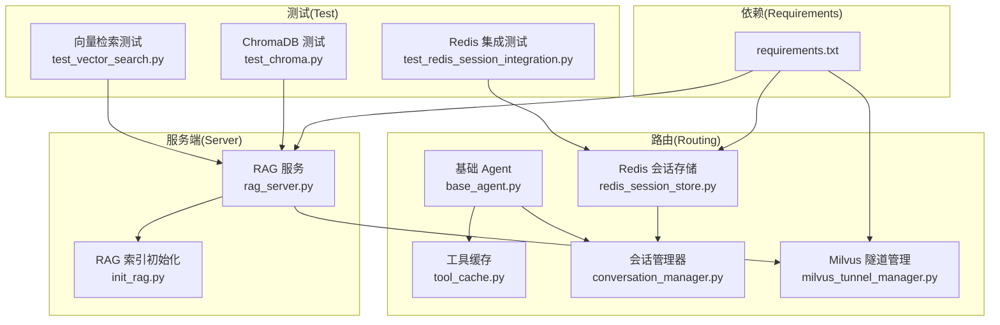
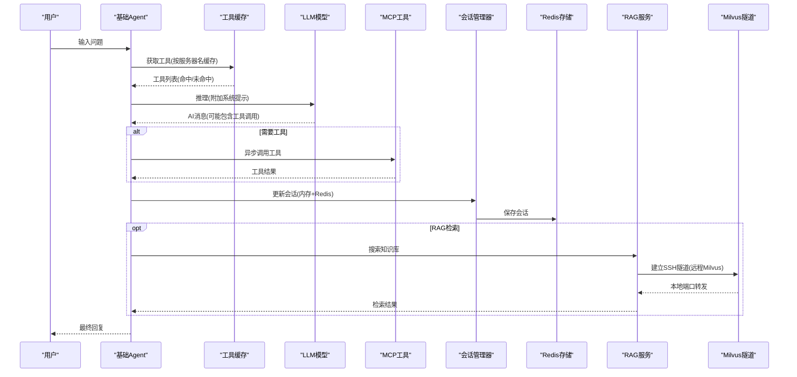
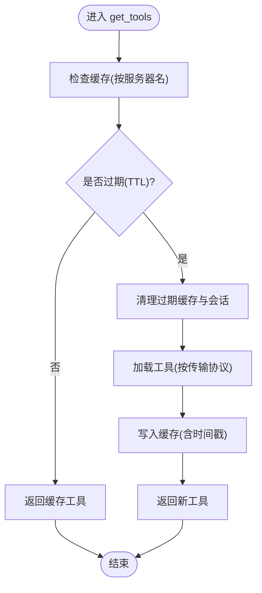
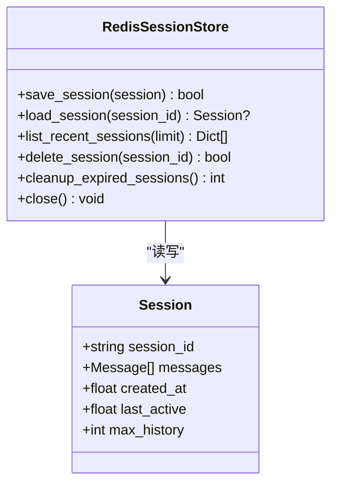
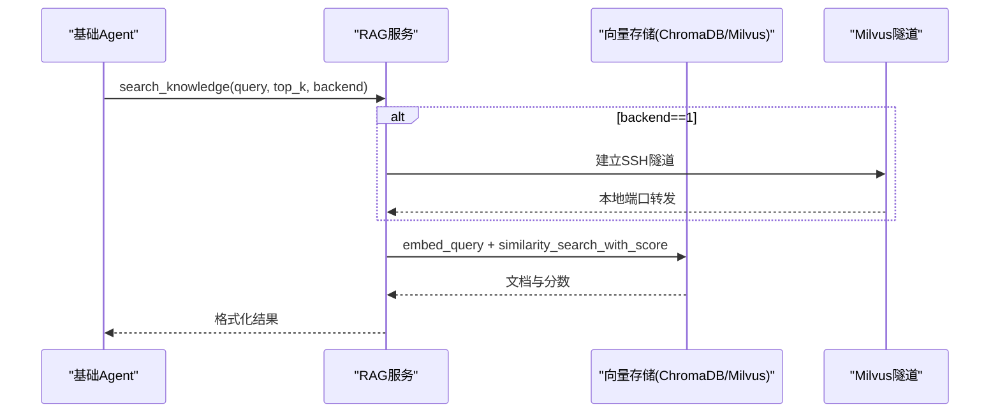
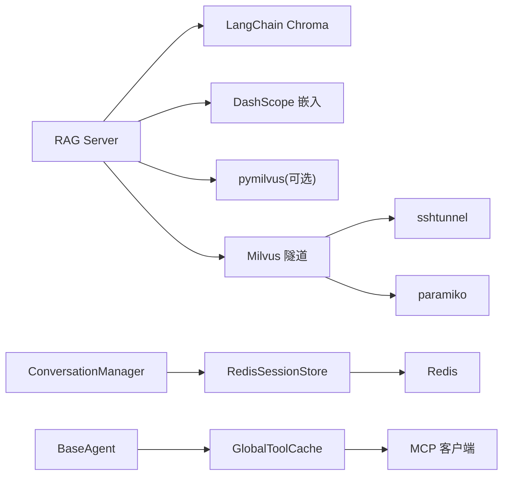

# 性能优化

<cite>
**本文引用的文件**
- [tool_cache.py](file://Routing/tool_cache.py)
- [redis_session_store.py](file://Routing/redis_session_store.py)
- [milvus_tunnel_manager.py](file://Routing/milvus_tunnel_manager.py)
- [rag_server.py](file://Server/rag_server.py)
- [init_rag.py](file://Server/init_rag.py)
- [base_agent.py](file://routing/base_agent.py)
- [conversation_manager.py](file://routing/conversation_manager.py)
- [test_vector_search.py](file://test/test_vector_search.py)
- [test_chroma.py](file://test/test_chroma.py)
- [test_redis_session_integration.py](file://test/test_redis_session_integration.py)
- [README_REDIS_TEST.md](file://test/README_REDIS_TEST.md)
- [requirements.txt](file://requirements.txt)
- [quickstart.py](file://quickstart.py)
- [demo_conversation.py](file://demo_conversation.py)
</cite>

## 目录
1. [简介](#简介)
2. [项目结构](#项目结构)
3. [核心组件](#核心组件)
4. [架构总览](#架构总览)
5. [详细组件分析](#详细组件分析)
6. [依赖关系分析](#依赖关系分析)
7. [性能考量](#性能考量)
8. [故障排查指南](#故障排查指南)
9. [结论](#结论)
10. [附录](#附录)

## 简介
本指南聚焦 AiOps 项目的性能优化，围绕以下关键领域展开：
- 工具缓存优化：减少 MCP 工具加载开销，降低冷启动延迟
- Redis 会话存储优化：提升会话持久化与并发访问性能
- 向量数据库查询优化：优化 ChromaDB 与 Milvus 的检索性能
- 内存使用优化：会话与工具缓存的生命周期管理
- 并发处理优化：异步工具调用与消息处理
- 网络延迟优化：SSH 隧道与远程服务连接
- 缓存策略与配置：工具缓存与会话缓存的调优
- 性能测试与基准：向量检索、Redis 会话持久化与整体链路测试
- 资源限制与扩容：部署与容量规划建议

## 项目结构
项目采用模块化组织，核心性能相关模块如下：
- 路由与工具：Routing 目录下的工具缓存、会话存储、隧道管理与基础 Agent
- 服务端：Server 目录下的 RAG 服务、索引初始化与向量检索
- 测试：test 目录下的向量检索、Redis 会话集成测试与辅助脚本
- 依赖：requirements.txt 定义了向量检索、Redis、SSH 隧道与 Milvus 等依赖

图表来源
- [tool_cache.py:1-302](file://Routing/tool_cache.py#L1-L302)
- [redis_session_store.py:1-228](file://Routing/redis_session_store.py#L1-L228)
- [milvus_tunnel_manager.py:1-101](file://Routing/milvus_tunnel_manager.py#L1-L101)
- [rag_server.py:1-363](file://Server/rag_server.py#L1-L363)
- [init_rag.py:1-506](file://Server/init_rag.py#L1-L506)
- [base_agent.py:1-497](file://routing/base_agent.py#L1-L497)
- [conversation_manager.py:1-275](file://routing/conversation_manager.py#L1-L275)
- [test_vector_search.py:1-66](file://test/test_vector_search.py#L1-L66)
- [test_chroma.py:1-29](file://test/test_chroma.py#L1-L29)
- [test_redis_session_integration.py:1-328](file://test/test_redis_session_integration.py#L1-L328)
- [requirements.txt:1-17](file://requirements.txt#L1-L17)

章节来源
- [requirements.txt:1-17](file://requirements.txt#L1-L17)

## 核心组件
- 工具缓存 GlobalToolCache：基于服务器名称的 TTL 缓存，支持 stdio 与 streamable-http 两种传输协议，避免重复加载 MCP 工具，降低冷启动成本
- Redis 会话存储 RedisSessionStore：将会话元数据与消息列表持久化到 Redis，提供保存、加载、列出与删除会话的能力，并维护活跃会话索引
- 会话管理器 ConversationManager：统一管理多轮对话，支持内存与 Redis 双层缓存，自动清理过期会话
- RAG 服务 RAG Server：提供向量检索工具，支持 ChromaDB 与 Milvus（通过 SSH 隧道），封装相似度搜索与统计查询
- Milvus 隧道管理 MilvusTunnelManager：通过 SSH 隧道安全连接远程 Milvus，支持多种密钥类型加载
- 基础 Agent BaseAgent：统一工具加载、消息处理与错误处理，构建 LangGraph 工作流，支持异步工具调用

章节来源
- [tool_cache.py:39-302](file://Routing/tool_cache.py#L39-L302)
- [redis_session_store.py:14-228](file://Routing/redis_session_store.py#L14-L228)
- [conversation_manager.py:82-275](file://routing/conversation_manager.py#L82-L275)
- [rag_server.py:51-363](file://Server/rag_server.py#L51-L363)
- [milvus_tunnel_manager.py:14-101](file://Routing/milvus_tunnel_manager.py#L14-L101)
- [base_agent.py:29-497](file://routing/base_agent.py#L29-L497)

## 架构总览
系统通过基础 Agent 统一接入工具缓存，Agent 在推理阶段调用 LLM，必要时调用工具；工具来自 GlobalToolCache，避免重复加载。会话管理器负责多轮对话上下文的内存与 Redis 持久化。RAG 服务提供向量检索能力，支持本地 ChromaDB 与远程 Milvus（经 SSH 隧道）。Redis 会话存储与 Milvus 隧道分别服务于会话持久化与远程向量检索。

图表来源
- [base_agent.py:102-318](file://routing/base_agent.py#L102-L318)
- [tool_cache.py:85-140](file://Routing/tool_cache.py#L85-L140)
- [conversation_manager.py:148-184](file://routing/conversation_manager.py#L148-L184)
- [redis_session_store.py:36-88](file://Routing/redis_session_store.py#L36-L88)
- [rag_server.py:193-245](file://Server/rag_server.py#L193-L245)
- [milvus_tunnel_manager.py:20-89](file://Routing/milvus_tunnel_manager.py#L20-L89)

## 详细组件分析

### 工具缓存优化（GlobalToolCache）
- 缓存策略
  - 基于服务器名称的 TTL 缓存，默认 5 分钟
  - 支持 stdio 与 streamable-http 两种传输协议
  - 线程安全：使用 asyncio.Lock 保护并发访问
- 加载流程
  - 首次加载：根据配置选择传输协议，创建客户端/会话，加载工具并缓存
  - 后续访问：命中缓存直接返回；过期则清理并重新加载
- 性能收益
  - 避免重复启动 MCP 服务器进程或建立 HTTP 会话
  - 减少冷启动延迟，提升 Agent 首次响应速度
- 优化建议
  - 根据工具稳定性调整 TTL：稳定工具可延长 TTL，频繁变更工具缩短 TTL
  - 对高频工具设置更短的过期时间，平衡新鲜度与性能
  - 在工具加载失败时记录详细错误，便于定位传输协议与环境问题

图表来源
- [tool_cache.py:85-140](file://Routing/tool_cache.py#L85-L140)

章节来源
- [tool_cache.py:39-302](file://Routing/tool_cache.py#L39-L302)
- [base_agent.py:44-67](file://routing/base_agent.py#L44-L67)

### Redis 会话存储优化（RedisSessionStore）
- 存储结构
  - 会话元数据：哈希键 session:{id}:meta
  - 消息列表：列表键 session:{id}:messages（批量 rpush）
  - 活跃会话索引：有序集合 sessions:active（按 last_active）
  - 历史会话列表：列表键 sessions:history（最多 50 个）
- 操作流程
  - 保存：原子性写入元数据与消息，设置 TTL；更新活跃索引与历史列表
  - 加载：先加载元数据，再批量拉取消息，重建 Session 对象
  - 列表：从活跃索引 zrevrange 获取最近活跃会话
  - 删除：删除元数据与消息键，从活跃索引移除
  - 清理：按 last_active 超时阈值清理过期会话
- 性能考量
  - 批量操作：消息批量 rpush，减少网络往返
  - TTL 策略：统一设置会话过期时间，避免内存泄漏
  - 索引维护：活跃索引与历史列表保证查询效率
- 优化建议
  - 合理设置会话 TTL：结合业务场景权衡保留时长与内存占用
  - 批量写入：在高并发场景下合并多次保存操作
  - 压缩消息内容：对长文本消息考虑压缩存储（需评估 CPU 开销）

图表来源
- [redis_session_store.py:14-228](file://Routing/redis_session_store.py#L14-L228)
- [conversation_manager.py:35-79](file://routing/conversation_manager.py#L35-L79)

章节来源
- [redis_session_store.py:14-228](file://Routing/redis_session_store.py#L14-L228)
- [conversation_manager.py:82-275](file://routing/conversation_manager.py#L82-L275)

### 向量数据库查询优化（RAG Server 与 Milvus 隧道）
- 后端选择
  - ChromaDB：本地持久化，适合小规模与开发测试
  - Milvus：远程集群，通过 SSH 隧道访问，适合大规模检索
- 检索接口
  - 相似度搜索：统一接口 similarity_search_with_score，返回文档与分数
  - 统计查询：获取实体数量、索引文件列表等
- Milvus 搜索参数
  - metric_type: COSINE
  - nprobe: 16（影响召回与延迟的折中）
- 索引初始化
  - 文档加载与分块：RecursiveCharacterTextSplitter，过滤无效内容
  - 向量化：DashScope text-embedding-v3
  - 批量插入：分批处理，避免 API 限流
- 性能优化建议
  - 调整 nprobe：在召回与延迟间权衡，大规模数据集可适当增大
  - 选择合适 metric_type：COSINE 通常效果好，但需与嵌入维度匹配
  - 批量大小：根据 Milvus 写入能力与网络状况调整批次
  - 隧道优化：复用隧道连接，避免频繁建立/断开

图表来源
- [rag_server.py:193-245](file://Server/rag_server.py#L193-L245)
- [rag_server.py:86-126](file://Server/rag_server.py#L86-L126)
- [milvus_tunnel_manager.py:20-89](file://Routing/milvus_tunnel_manager.py#L20-L89)

章节来源
- [rag_server.py:51-363](file://Server/rag_server.py#L51-L363)
- [init_rag.py:294-496](file://Server/init_rag.py#L294-L496)
- [milvus_tunnel_manager.py:14-101](file://Routing/milvus_tunnel_manager.py#L14-L101)

### 并发与异步处理
- 工具调用：BaseAgent 的 tools_node 异步执行工具，避免阻塞主线程
- 会话更新：ConversationManager 在添加消息后异步持久化到 Redis，减少前端等待
- 工具缓存：GlobalToolCache 使用 asyncio.Lock 保证并发安全
- 建议
  - 控制工具并发数量，避免 MCP 服务器或外部 API 限流
  - 对工具调用结果进行节流与聚合，减少 LLM 重复处理

章节来源
- [base_agent.py:131-217](file://routing/base_agent.py#L131-L217)
- [conversation_manager.py:166-184](file://routing/conversation_manager.py#L166-L184)
- [tool_cache.py:47-65](file://Routing/tool_cache.py#L47-L65)

## 依赖关系分析
- 向量检索：RAG Server 依赖 LangChain Chroma 与 DashScope 嵌入模型；可选依赖 Milvus，通过隧道管理器连接
- 会话持久化：RedisSessionStore 依赖 Redis 客户端；ConversationManager 可选启用 Redis
- 工具加载：GlobalToolCache 依赖 MCP 客户端与传输协议（stdio/streamable-http）
- 网络隧道：MilvusTunnelManager 依赖 paramiko 与 sshtunnel

图表来源
- [rag_server.py:17-32](file://Server/rag_server.py#L17-L32)
- [redis_session_store.py:7-34](file://Routing/redis_session_store.py#L7-L34)
- [tool_cache.py:18-25](file://Routing/tool_cache.py#L18-L25)
- [milvus_tunnel_manager.py:8-11](file://Routing/milvus_tunnel_manager.py#L8-L11)
- [conversation_manager.py:100-120](file://routing/conversation_manager.py#L100-L120)

章节来源
- [requirements.txt:1-17](file://requirements.txt#L1-L17)

## 性能考量

### 内存使用优化
- 工具缓存：TTL 过期清理，避免长期持有 MCP 客户端与会话
- 会话历史：限制 max_history，避免无限增长导致内存压力
- 会话清理：定期清理过期会话，释放内存与 Redis 空间
- 建议
  - 根据对话复杂度调整 max_history
  - 在高并发场景下监控缓存命中率与内存占用

章节来源
- [tool_cache.py:244-297](file://Routing/tool_cache.py#L244-L297)
- [conversation_manager.py:63-79](file://routing/conversation_manager.py#L63-L79)
- [conversation_manager.py:234-253](file://routing/conversation_manager.py#L234-L253)

### 并发处理优化
- 工具并发：BaseAgent 的 tools_node 异步执行工具，避免阻塞
- 批量写入：RedisSessionStore 使用批量 rpush，减少网络往返
- 批量插入：init_rag.py 分批向 Milvus 插入，避免限流
- 建议
  - 控制并发上限，结合外部 API 速率限制
  - 对工具调用结果进行去重与合并

章节来源
- [base_agent.py:131-217](file://routing/base_agent.py#L131-L217)
- [redis_session_store.py:64-72](file://Routing/redis_session_store.py#L64-L72)
- [init_rag.py:236-272](file://Server/init_rag.py#L236-L272)

### 网络延迟优化
- SSH 隧道：MilvusTunnelManager 复用隧道连接，避免频繁建立
- 连接超时：工具加载时设置超时，防止阻塞
- Redis 连接池：建议使用连接池与合适的超时配置
- 建议
  - 隧道复用与保活
  - 传输协议选择：streamable-http 适合低延迟场景，stdio 适合本地工具

章节来源
- [milvus_tunnel_manager.py:70-82](file://Routing/milvus_tunnel_manager.py#L70-L82)
- [tool_cache.py:212-224](file://Routing/tool_cache.py#L212-L224)
- [redis_session_store.py:27-34](file://Routing/redis_session_store.py#L27-L34)

### 缓存策略与配置
- 工具缓存
  - TTL：默认 300 秒，可根据工具稳定性调整
  - 传输协议：stdio 与 streamable-http，按环境选择
- 会话缓存
  - 内存+Redis 双层缓存：优先内存，缺失时从 Redis 加载
  - TTL：会话过期时间可配置，建议结合业务场景
- 建议
  - 高频工具缩短 TTL，保证工具最新
  - 会话 TTL 与 max_history 组合，平衡体验与资源

章节来源
- [tool_cache.py:62-101](file://Routing/tool_cache.py#L62-L101)
- [conversation_manager.py:100-120](file://routing/conversation_manager.py#L100-L120)
- [redis_session_store.py:17-34](file://Routing/redis_session_store.py#L17-L34)

### 性能测试与基准
- 向量检索测试
  - 直接测试 ChromaDB：加载向量存储，执行 similarity_search_with_score
  - RAG 服务测试：通过工具接口查询，验证返回结构与分数
- Redis 会话持久化测试
  - 集成测试：验证完整生命周期、会话恢复、并发管理与过期清理
  - 单元测试：Mock Redis，验证逻辑正确性
- 基准建议
  - 向量检索：固定查询集合，测量延迟与吞吐，记录 nprobe 对召回的影响
  - 会话持久化：并发写入与读取，测量 Redis 延迟与吞吐
  - 工具加载：多次调用同一工具，统计首次加载与缓存命中差异

章节来源
- [test_vector_search.py:1-66](file://test/test_vector_search.py#L1-L66)
- [test_chroma.py:1-29](file://test/test_chroma.py#L1-L29)
- [test_redis_session_integration.py:1-328](file://test/test_redis_session_integration.py#L1-L328)
- [README_REDIS_TEST.md:1-174](file://test/README_REDIS_TEST.md#L1-L174)

## 故障排查指南
- 工具加载失败
  - 检查 MCP 配置文件与传输协议
  - 确认 AMAP_API_KEY 等环境变量
  - 查看超时与异常日志
- Redis 连接问题
  - 确认 Redis 服务运行与端口可达
  - 检查 SSH 隧道配置与密钥格式
  - 使用 redis-cli 验证连接
- Milvus 连接问题
  - 隧道是否建立成功
  - 远端端口与本地转发端口配置
  - pymilvus 版本与依赖
- 会话恢复失败
  - 检查 Redis 中 session:{id}:meta 与 session:{id}:messages 是否存在
  - 确认 last_active 时间戳与过期清理逻辑

章节来源
- [tool_cache.py:194-242](file://Routing/tool_cache.py#L194-L242)
- [redis_session_store.py:86-131](file://Routing/redis_session_store.py#L86-L131)
- [milvus_tunnel_manager.py:84-89](file://Routing/milvus_tunnel_manager.py#L84-L89)
- [test_redis_session_integration.py:96-106](file://test/test_redis_session_integration.py#L96-L106)

## 结论
通过工具缓存、Redis 会话持久化与向量检索优化，AiOps 在响应速度、资源利用与可扩展性方面得到显著提升。建议在生产环境中：
- 根据业务场景调整缓存 TTL 与会话策略
- 优化 Milvus 检索参数与批量写入策略
- 建立完善的性能测试与监控体系
- 结合资源限制制定扩容策略，确保高并发下的稳定性

## 附录
- 快速启动与演示
  - 快速启动脚本：展示 Agent 创建与工具列表
  - 演示脚本：展示工具缓存与循环对话
- 依赖清单：向量检索、Redis、SSH 隧道与 Milvus 等关键依赖

章节来源
- [quickstart.py:1-68](file://quickstart.py#L1-L68)
- [demo_conversation.py:1-102](file://demo_conversation.py#L1-L102)
- [requirements.txt:1-17](file://requirements.txt#L1-L17)