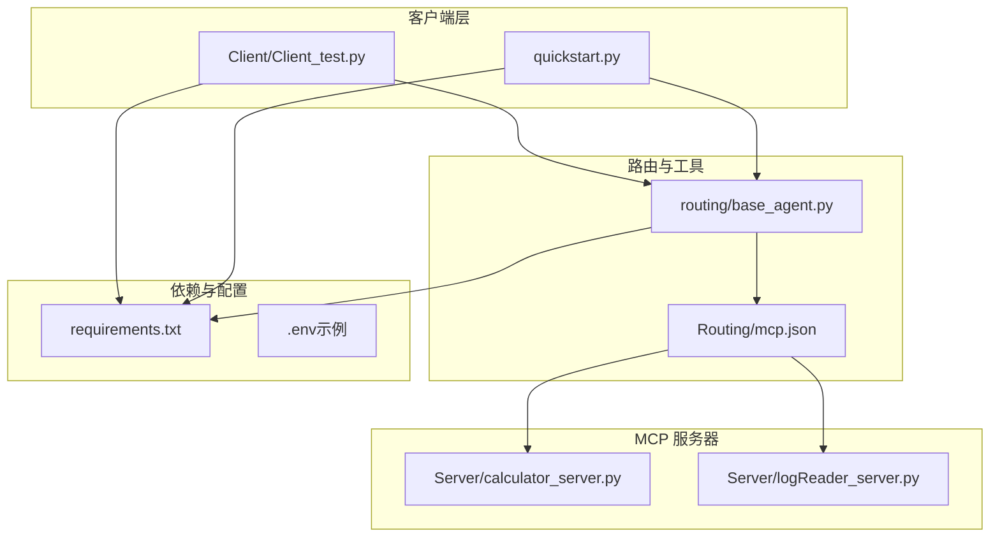
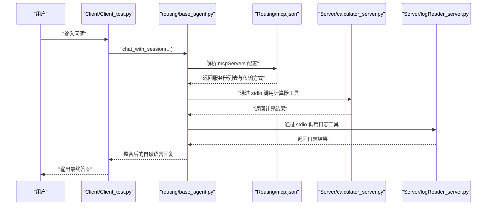
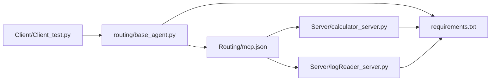

# 环境配置

<cite>
**本文引用的文件**
- [requirements.txt](file://requirements.txt)
- [README.md](file://README.md)
- [Routing/mcp.json](file://Routing/mcp.json)
- [quickstart.py](file://quickstart.py)
- [routing/base_agent.py](file://routing/base_agent.py)
- [Server/calculator_server.py](file://Server/calculator_server.py)
- [Server/logReader_server.py](file://Server/logReader_server.py)
- [Client/Client_test.py](file://Client/Client_test.py)
- [test/README_REDIS_TEST.md](file://test/README_REDIS_TEST.md)
</cite>

## 目录
1. [简介](#简介)
2. [项目结构](#项目结构)
3. [核心组件](#核心组件)
4. [架构总览](#架构总览)
5. [详细组件分析](#详细组件分析)
6. [依赖关系分析](#依赖关系分析)
7. [性能考虑](#性能考虑)
8. [故障排查指南](#故障排查指南)
9. [结论](#结论)
10. [附录](#附录)

## 简介
本指南面向首次部署 AiOps 项目的开发者，提供从 Python 环境到 MCP 服务器配置的完整落地步骤。重点涵盖：
- Python 3.9+ 环境搭建与虚拟环境创建
- 依赖包安装与版本约束说明
- .env 环境变量配置模板与 API 密钥设置
- MCP 服务器配置文件 mcp.json 的参数说明与示例
- 常见环境问题排查与解决方案（依赖冲突、权限问题、Redis 连接等）

## 项目结构
项目采用“客户端-路由-服务器”三层组织方式，配合 MCP 协议实现工具与外部数据源的标准化接入。

图示来源
- [Client/Client_test.py:1-230](file://Client/Client_test.py#L1-L230)
- [quickstart.py:1-68](file://quickstart.py#L1-L68)
- [routing/base_agent.py:1-497](file://routing/base_agent.py#L1-L497)
- [Routing/mcp.json:1-29](file://Routing/mcp.json#L1-L29)
- [Server/calculator_server.py:1-111](file://Server/calculator_server.py#L1-L111)
- [Server/logReader_server.py:1-151](file://Server/logReader_server.py#L1-L151)
- [requirements.txt:1-17](file://requirements.txt#L1-L17)

章节来源
- [README.md:1-125](file://README.md#L1-L125)

## 核心组件
- Python 环境与依赖
  - Python 版本要求：3.9 及以上
  - 依赖清单位于 requirements.txt，包含 LangChain 生态、MCP 相关适配器、向量库、Redis、SSH 隧道、PDF 处理等
- MCP 配置
  - mcp.json 定义了多个 MCP 服务器（高德地图、计算器、日志读取、RAG 知识库），并指定传输方式（stdio/streamable-http）
- 环境变量
  - .env 文件用于存放 API 密钥与 LLM 配置（例如 DashScope API Key、高德地图 API Key、Redis/SSH 参数等）

章节来源
- [README.md:93-100](file://README.md#L93-L100)
- [requirements.txt:1-17](file://requirements.txt#L1-L17)
- [Routing/mcp.json:1-29](file://Routing/mcp.json#L1-L29)

## 架构总览
下图展示从客户端发起请求到 MCP 服务器执行工具的典型调用链路。

图示来源
- [Client/Client_test.py:180-230](file://Client/Client_test.py#L180-L230)
- [routing/base_agent.py:102-318](file://routing/base_agent.py#L102-L318)
- [Routing/mcp.json:1-29](file://Routing/mcp.json#L1-L29)
- [Server/calculator_server.py:108-111](file://Server/calculator_server.py#L108-L111)
- [Server/logReader_server.py:148-151](file://Server/logReader_server.py#L148-L151)

## 详细组件分析

### Python 环境与虚拟环境
- 版本要求
  - 项目技术栈明确要求 Python >= 3.9
- 虚拟环境
  - 推荐使用 venv 创建隔离环境，并在 Windows/Linux/macOS 下分别激活
- 依赖安装
  - 使用 pip 安装 requirements.txt 中声明的所有依赖

章节来源
- [README.md:53-62](file://README.md#L53-L62)
- [README.md:93-96](file://README.md#L93-L96)
- [requirements.txt:1-17](file://requirements.txt#L1-L17)

### 依赖包安装与版本约束
- 核心依赖类别
  - LangChain 生态：langchain、langchain-community、langchain-core、langchain-mcp-adapters
  - MCP 相关：mcp、fastmcp
  - 向量库：chromadb、langchain-chroma、pymilvus
  - 会话与缓存：redis、paramiko、sshtunnel
  - 文档与网络：pypdf、httpx、requests
  - 环境变量：python-dotenv
- 安装流程
  - 在已激活的虚拟环境中执行 pip install -r requirements.txt

章节来源
- [requirements.txt:1-17](file://requirements.txt#L1-L17)
- [README.md:60-61](file://README.md#L60-L61)

### .env 环境变量配置模板与 API 密钥设置
- 必要密钥
  - DashScope API Key：用于 LLM 服务
  - 高德地图 API Key：用于地图相关工具
- 可选密钥（与 Redis/SSH 相关）
  - Redis 连接参数（主机、端口、密码等）
  - SSH 连接参数（主机、端口、用户名、私钥路径、隧道端口等）
- LLM 配置（可选）
  - LLM_BASE_URL、LLM_MODEL、LLM_TEMPERATURE

章节来源
- [README.md:64-69](file://README.md#L64-L69)
- [routing/base_agent.py:73-85](file://routing/base_agent.py#L73-L85)
- [test/README_REDIS_TEST.md:49-64](file://test/README_REDIS_TEST.md#L49-L64)

### MCP 服务器配置文件 mcp.json 参数说明与示例
- 结构概览
  - mcpServers：服务器集合
    - amap-maps-streamableHTTP：高德地图 MCP 服务，使用 streamable-http 传输
    - calculator：本地计算器服务器，使用 stdio 传输
    - log-reader：本地日志读取服务器，使用 stdio 传输
    - rag-knowledge：本地 RAG 知识库服务器，使用 stdio 传输
- 关键字段
  - url：远程 MCP 服务器地址（含占位的 API Key）
  - command/args：本地服务器进程启动命令与参数
  - transport：传输方式（stdio 或 streamable-http）
- 配置示例
  - 高德地图：通过占位符注入 AMAP_API_KEY
  - 本地服务器：通过相对路径指向对应 Python 文件

章节来源
- [Routing/mcp.json:1-29](file://Routing/mcp.json#L1-L29)

### 本地 MCP 服务器示例
- 计算器服务器
  - 提供加减乘除工具，以 stdio 方式运行
- 日志读取服务器
  - 提供读取最新日志、按关键词搜索、统计信息等工具，以 stdio 方式运行

章节来源
- [Server/calculator_server.py:1-111](file://Server/calculator_server.py#L1-L111)
- [Server/logReader_server.py:1-151](file://Server/logReader_server.py#L1-L151)

### 客户端与会话管理
- Client_test.py
  - 支持循环对话、会话历史加载、工具缓存统计、RAG 后端切换等
  - 自动初始化 Redis 与 SSH 隧道（若需要）
- 路由与 Agent
  - base_agent.py 负责统一工具加载、消息处理、错误处理与工作流编排

章节来源
- [Client/Client_test.py:1-230](file://Client/Client_test.py#L1-L230)
- [routing/base_agent.py:1-497](file://routing/base_agent.py#L1-L497)

## 依赖关系分析
- 组件耦合
  - 客户端依赖路由层；路由层依赖 MCP 配置；MCP 配置驱动本地/远程服务器
  - 服务器侧依赖 python-dotenv 读取 .env；Agent 层依赖 LLM 与工具缓存
- 外部依赖
  - DashScope API、高德地图 API、Redis、SSH 隧道、向量库（ChromaDB/Milvus）

图示来源
- [Client/Client_test.py:180-230](file://Client/Client_test.py#L180-L230)
- [routing/base_agent.py:102-318](file://routing/base_agent.py#L102-L318)
- [Routing/mcp.json:1-29](file://Routing/mcp.json#L1-L29)
- [Server/calculator_server.py:108-111](file://Server/calculator_server.py#L108-L111)
- [Server/logReader_server.py:148-151](file://Server/logReader_server.py#L148-L151)
- [requirements.txt:1-17](file://requirements.txt#L1-L17)

## 性能考虑
- 工具缓存与延迟初始化
  - Agent 采用延迟初始化与全局工具缓存，减少重复加载开销
- 传输方式选择
  - 本地服务器使用 stdio，延迟低；远程 MCP 使用 streamable-http，注意网络抖动影响
- 向量库后端
  - 本地 ChromaDB 与远程 Milvus 的性能与稳定性差异较大，按需切换

章节来源
- [routing/base_agent.py:44-67](file://routing/base_agent.py#L44-L67)
- [routing/base_agent.py:444-463](file://routing/base_agent.py#L444-L463)

## 故障排查指南
- 依赖冲突与安装失败
  - 确保使用 Python 3.9+ 并在独立虚拟环境中安装
  - 若出现版本冲突，优先降低 paramiko 至 3.4.0（临时方案），或参考测试文档更新 SSH 隧道实现
- 权限问题
  - Windows 上若涉及 .pem 私钥，确保文件权限正确且路径可读
- Redis 连接问题
  - 确认 Redis 服务在 localhost:6379 运行；若使用远程 Redis，需建立 SSH 隧道
  - 使用 redis-cli ping 验证连通性
- LLM 与 API 密钥
  - 检查 .env 中 DASHSCOPE_API_KEY 与 AMAP_API_KEY 是否正确
  - 若 LLM 请求异常，检查 LLM_BASE_URL、LLM_MODEL、LLM_TEMPERATURE 等环境变量
- MCP 服务器启动
  - 本地服务器需确保 Python 可执行路径正确，args 指向相对路径文件
  - 远程 MCP 服务器需确认网络可达与 API Key 注入

章节来源
- [test/README_REDIS_TEST.md:68-78](file://test/README_REDIS_TEST.md#L68-L78)
- [test/README_REDIS_TEST.md:94-114](file://test/README_REDIS_TEST.md#L94-L114)
- [routing/base_agent.py:73-85](file://routing/base_agent.py#L73-L85)
- [Server/calculator_server.py:108-111](file://Server/calculator_server.py#L108-L111)
- [Server/logReader_server.py:148-151](file://Server/logReader_server.py#L148-L151)

## 结论
按照本指南完成 Python 环境、依赖安装、.env 配置与 MCP 服务器配置后，即可运行客户端进行交互式对话。若遇到问题，优先检查密钥、网络与 Redis/SSH 隧道连通性，再结合工具缓存与日志定位具体模块。

## 附录

### 快速开始流程（文字版）
- 创建并激活虚拟环境
- 安装依赖：pip install -r requirements.txt
- 在 .env 中配置 API 密钥与 LLM 参数
- 运行客户端：python Client/Client_test.py
- 或运行快速启动脚本：python quickstart.py

章节来源
- [README.md:53-78](file://README.md#L53-L78)
- [quickstart.py:59-68](file://quickstart.py#L59-L68)