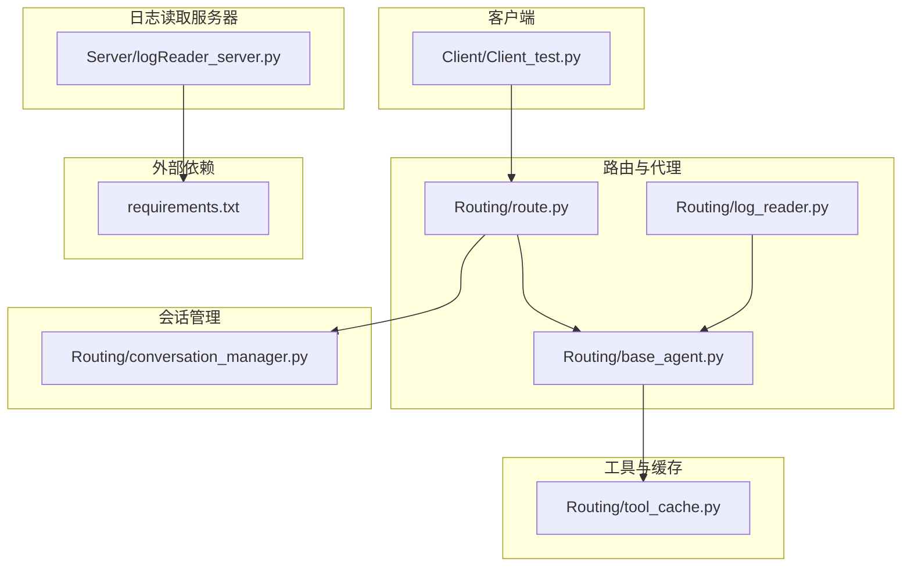
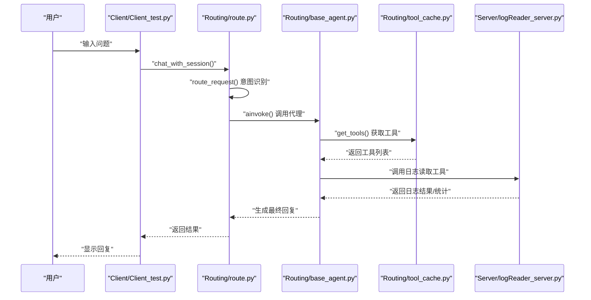
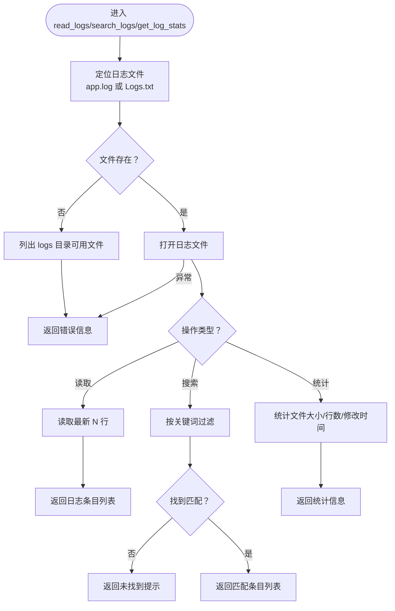
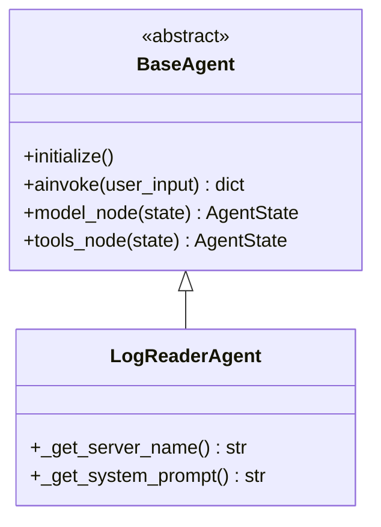
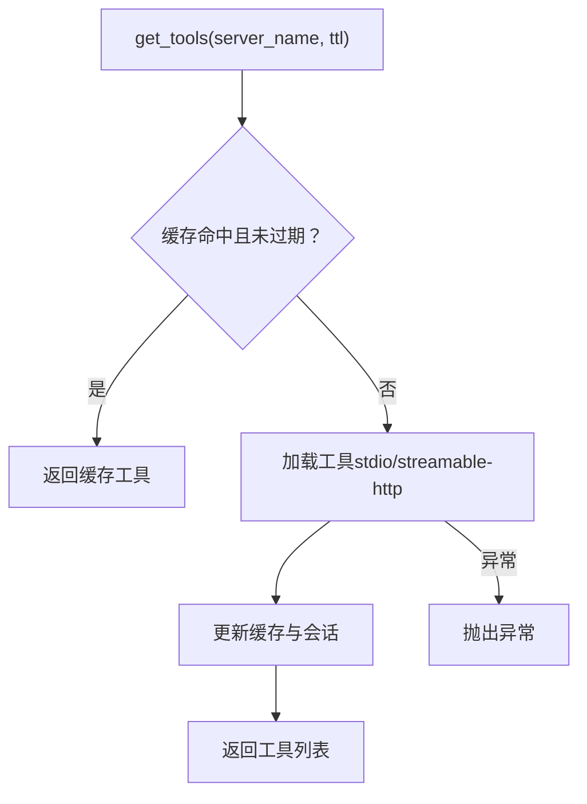
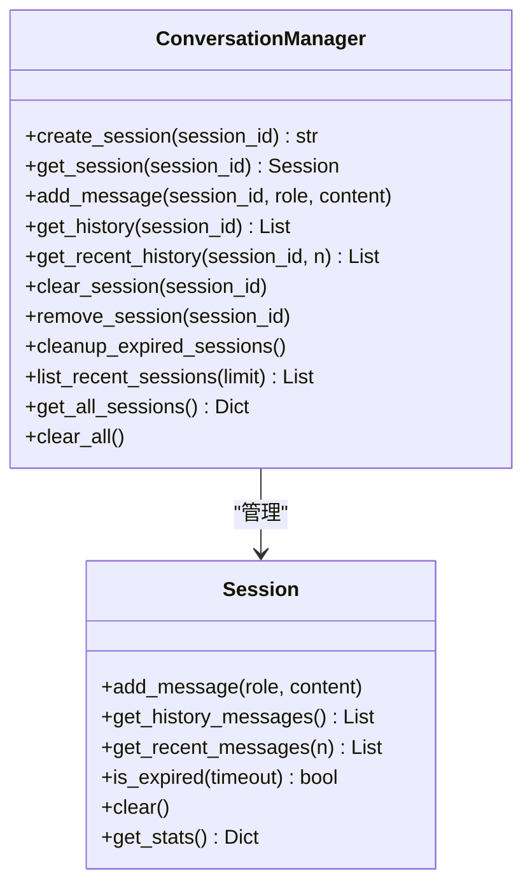
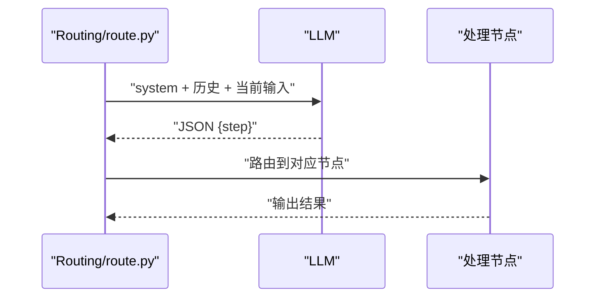
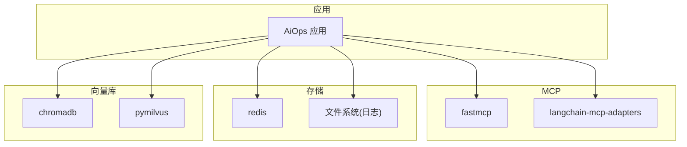

# 监控日志

<cite>
**本文档引用的文件**
- [README.md](file://README.md)
- [requirements.txt](file://requirements.txt)
- [quickstart.py](file://quickstart.py)
- [Server/logReader_server.py](file://Server/logReader_server.py)
- [Routing/base_agent.py](file://Routing/base_agent.py)
- [Routing/conversation_manager.py](file://Routing/conversation_manager.py)
- [Routing/tool_cache.py](file://Routing/tool_cache.py)
- [Routing/route.py](file://Routing/route.py)
- [Client/Client_test.py](file://Client/Client_test.py)
</cite>

## 目录
1. [简介](#简介)
2. [项目结构](#项目结构)
3. [核心组件](#核心组件)
4. [架构总览](#架构总览)
5. [详细组件分析](#详细组件分析)
6. [依赖分析](#依赖分析)
7. [性能考虑](#性能考虑)
8. [故障排查指南](#故障排查指南)
9. [结论](#结论)
10. [附录](#附录)

## 简介
本文件面向 AiOps 项目的监控与日志管理，目标是：
- 建立系统的监控指标体系：性能指标、业务指标、健康检查指标
- 规范日志收集与存储策略：结构化日志格式与日志级别
- 提供日志分析与告警最佳实践：关键错误识别与处理
- 解释分布式追踪与性能监控的实现方法
- 给出监控仪表板配置与常用监控工具使用指南

说明：当前仓库未内置集中式监控与日志采集组件，本文在现有代码基础上提出可落地的监控方案与实施建议。

## 项目结构
项目采用模块化设计，围绕“路由-代理-工具缓存-会话管理”的链路组织代码，日志读取能力通过 MCP 服务器实现。

图表来源
- [Client/Client_test.py:1-230](file://Client/Client_test.py#L1-L230)
- [Routing/route.py:1-553](file://Routing/route.py#L1-L553)
- [Routing/base_agent.py:1-497](file://Routing/base_agent.py#L1-L497)
- [Routing/log_reader.py:1-11](file://Routing/log_reader.py#L1-L11)
- [Routing/tool_cache.py:1-302](file://Routing/tool_cache.py#L1-L302)
- [Routing/conversation_manager.py:1-275](file://Routing/conversation_manager.py#L1-L275)
- [Server/logReader_server.py:1-151](file://Server/logReader_server.py#L1-L151)
- [requirements.txt:1-17](file://requirements.txt#L1-L17)

章节来源
- [README.md:1-125](file://README.md#L1-L125)
- [requirements.txt:1-17](file://requirements.txt#L1-L17)

## 核心组件
- 路由与工作流：负责意图识别、路由到相应代理，并管理会话上下文与历史消息。
- 代理基类与专用代理：统一封装模型调用、工具调用、错误处理与工作流编排。
- 工具缓存：统一加载与缓存 MCP 工具，支持 TTL 过期与连接生命周期管理。
- 会话管理：多轮对话上下文持久化与清理，支持内存与 Redis 持久化。
- 日志读取服务器：通过 MCP 提供日志读取、搜索与统计能力。

章节来源
- [Routing/route.py:1-553](file://Routing/route.py#L1-L553)
- [Routing/base_agent.py:1-497](file://Routing/base_agent.py#L1-L497)
- [Routing/tool_cache.py:1-302](file://Routing/tool_cache.py#L1-L302)
- [Routing/conversation_manager.py:1-275](file://Routing/conversation_manager.py#L1-L275)
- [Server/logReader_server.py:1-151](file://Server/logReader_server.py#L1-L151)

## 架构总览
下图展示从客户端到日志读取服务器的典型调用链路与监控点位。

图表来源
- [Client/Client_test.py:1-230](file://Client/Client_test.py#L1-L230)
- [Routing/route.py:1-553](file://Routing/route.py#L1-L553)
- [Routing/base_agent.py:1-497](file://Routing/base_agent.py#L1-L497)
- [Routing/tool_cache.py:1-302](file://Routing/tool_cache.py#L1-L302)
- [Server/logReader_server.py:1-151](file://Server/logReader_server.py#L1-L151)

## 详细组件分析

### 日志读取服务器（MCP）
- 功能：提供读取最新日志、按关键词搜索、获取日志统计等工具。
- 数据流：从 logs 目录读取 app.log 或 Logs.txt；若未找到，返回可用文件列表或错误信息。
- 错误处理：文件不存在、读取异常均返回结构化错误对象。

图表来源
- [Server/logReader_server.py:18-151](file://Server/logReader_server.py#L18-L151)

章节来源
- [Server/logReader_server.py:1-151](file://Server/logReader_server.py#L1-L151)

### 代理基类与专用代理
- 统一模型绑定、工具调用、错误处理与工作流编排。
- 日志读取代理通过系统提示词引导对日志进行分析与总结。

图表来源
- [Routing/base_agent.py:29-497](file://Routing/base_agent.py#L29-L497)

章节来源
- [Routing/base_agent.py:1-497](file://Routing/base_agent.py#L1-L497)

### 工具缓存（TTL 与连接管理）
- 缓存策略：按服务器名缓存工具列表，支持 TTL 过期与重载。
- 连接管理：记录并复用 MCP 客户端会话，避免重复建立连接。
- 统计接口：暴露缓存服务器数量、缓存条数、活跃会话数。

图表来源
- [Routing/tool_cache.py:85-302](file://Routing/tool_cache.py#L85-L302)

章节来源
- [Routing/tool_cache.py:1-302](file://Routing/tool_cache.py#L1-L302)

### 会话管理（Redis/内存）
- 多轮对话上下文：限制历史长度、超时清理、持久化到 Redis。
- 统计接口：消息数量、创建时间、最后活跃时间、持续时长。

图表来源
- [Routing/conversation_manager.py:35-275](file://Routing/conversation_manager.py#L35-L275)

章节来源
- [Routing/conversation_manager.py:1-275](file://Routing/conversation_manager.py#L1-L275)

### 路由与工作流（意图识别与多轮上下文）
- 意图识别：基于 LLM 的结构化输出，识别计算器、日志读取、地图、RAG 查询四类。
- 上下文构建：将最近若干轮消息拼接到当前输入，提升理解准确性。
- 节点编排：条件边路由到对应处理节点，最终汇聚到结束节点。

图表来源
- [Routing/route.py:149-291](file://Routing/route.py#L149-L291)

章节来源
- [Routing/route.py:1-553](file://Routing/route.py#L1-L553)

## 依赖分析
- 外部依赖：fastmcp、langchain、langchain-mcp-adapters、redis、pymilvus、chromadb 等。
- 运行时依赖：MCP 服务器（stdio/streamable-http）、Redis、SSH 隧道（用于远端 Redis）。

图表来源
- [requirements.txt:1-17](file://requirements.txt#L1-L17)

章节来源
- [requirements.txt:1-17](file://requirements.txt#L1-L17)

## 性能考虑
- 工具加载与缓存
  - 使用 TTL 缓存工具列表，减少重复连接开销；在会话结束时统一清理。
  - 通过连接复用降低 MCP 服务器启动成本。
- 会话与历史
  - 控制历史消息数量与长度，避免上下文过长导致 LLM 推理变慢。
  - Redis 持久化可提升跨进程/容器的会话一致性，但需关注网络延迟。
- 日志读取
  - 搜索与统计应限制扫描范围（例如按时间窗口），避免全量扫描大文件。
  - 对高频查询可引入索引或预聚合统计。

[本节为通用指导，无需特定文件来源]

## 故障排查指南
- 日志读取失败
  - 现象：返回“日志文件不存在于预期位置”或“可用文件列表”。
  - 排查：确认 logs 目录是否存在、文件名是否为 app.log 或 Logs.txt；检查权限与编码。
- 工具加载失败
  - 现象：控制台打印“加载工具失败”，或超时错误。
  - 排查：检查 MCP 服务器配置、传输协议（stdio/http）、环境变量（如 AMAP_API_KEY）。
- 会话异常
  - 现象：Redis 连接失败或会话丢失。
  - 排查：确认 Redis 地址/端口/密码；必要时降级为内存模式。
- 客户端中断
  - 现象：Ctrl+C 后资源未清理。
  - 排查：确保触发清理流程（关闭 Redis、SSH 隧道、清理缓存）。

章节来源
- [Server/logReader_server.py:18-151](file://Server/logReader_server.py#L18-L151)
- [Routing/tool_cache.py:118-242](file://Routing/tool_cache.py#L118-L242)
- [Routing/conversation_manager.py:100-120](file://Routing/conversation_manager.py#L100-L120)
- [Client/Client_test.py:26-37](file://Client/Client_test.py#L26-L37)

## 结论
- 当前系统具备基础的日志读取能力与会话管理能力，但缺少集中式监控与日志采集组件。
- 建议在现有链路上补充：结构化日志、指标埋点、告警规则与可视化仪表板。
- 通过 TTL 缓存、连接复用与历史截断，可在不牺牲体验的前提下提升系统稳定性与可观测性。

[本节为总结，无需特定文件来源]

## 附录

### 监控指标体系建议
- 性能指标
  - 请求延迟：路由决策、代理推理、工具调用、日志读取
  - 并发会话数、活跃工具缓存数
  - Redis 读写延迟与命中率
- 业务指标
  - 意图识别准确率（计算器/日志/地图/RAG）
  - 日志查询命中率、平均搜索耗时
  - 会话留存率、平均会话时长
- 健康检查指标
  - MCP 服务器连通性、工具加载成功率
  - Redis 可用性、SSH 隧道状态
  - 日志文件存在性、可读性

[本节为概念性建议，无需特定文件来源]

### 日志收集与存储策略
- 结构化日志格式
  - 建议字段：timestamp、level、service、trace_id、span_id、module、event、payload、error
  - 示例：以 JSON 格式输出，便于解析与检索
- 日志级别
  - TRACE/INFO/WARN/ERROR；日志读取服务器内部错误统一返回 error 字段
- 存储
  - 本地：logs 目录滚动文件；远端：集中式日志平台（如 ELK/Splunk）
  - 建议：按天/小时切分，保留 7-30 天归档

[本节为概念性建议，无需特定文件来源]

### 日志分析与告警最佳实践
- 关键错误识别
  - 工具加载超时、MCP 连接失败、Redis 不可用、日志文件缺失
- 处理流程
  - 记录完整上下文（会话 ID、用户输入、历史消息）
  - 降级策略：内存模式、默认返回、重试机制
- 告警阈值
  - 连接失败率、工具加载失败率、日志查询失败率、会话清理异常

[本节为概念性建议，无需特定文件来源]

### 分布式追踪与性能监控
- 追踪
  - 为每个会话生成 trace_id，贯穿路由、代理、工具调用、日志读取
  - 使用 OpenTelemetry 或自定义追踪库记录 span
- 性能监控
  - 采集关键节点耗时直方图、错误率、吞吐量
  - 与日志联动：错误日志自动关联 trace_id

[本节为概念性建议，无需特定文件来源]

### 监控仪表板与工具使用
- 常用工具
  - Prometheus + Grafana：指标采集与可视化
  - ELK Stack：日志采集、搜索与分析
  - Jaeger/Tempo：分布式追踪
- 仪表板建议
  - 实时会话数、意图分布、工具调用成功率、日志查询性能、Redis 健康度

[本节为概念性建议，无需特定文件来源]