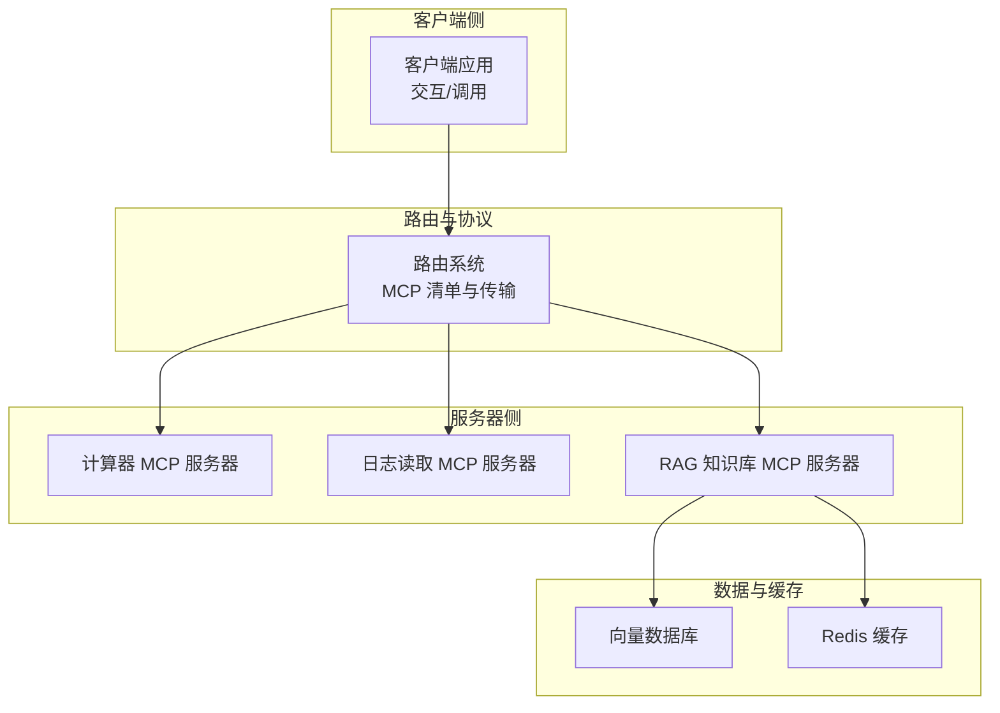
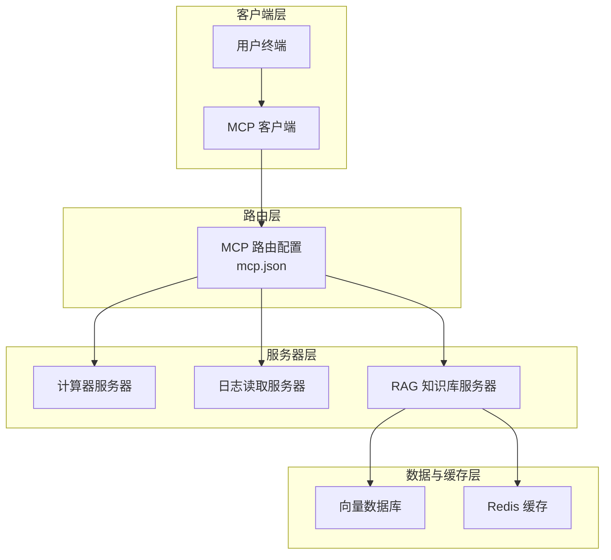
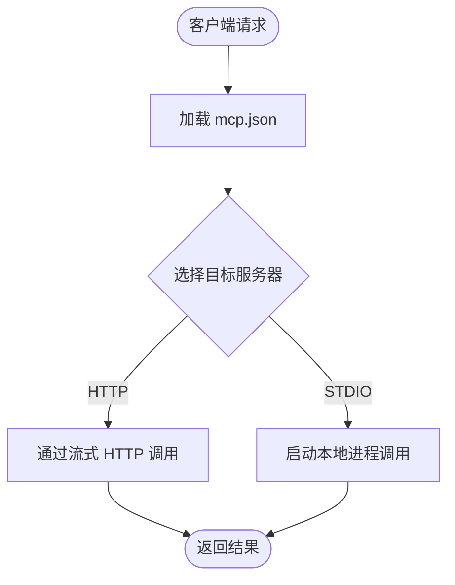
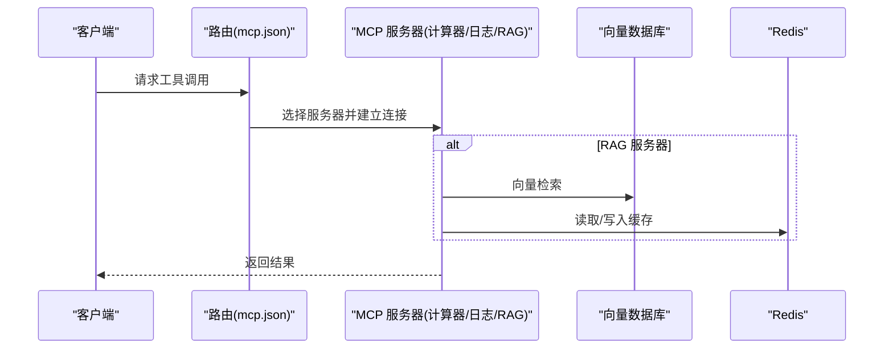
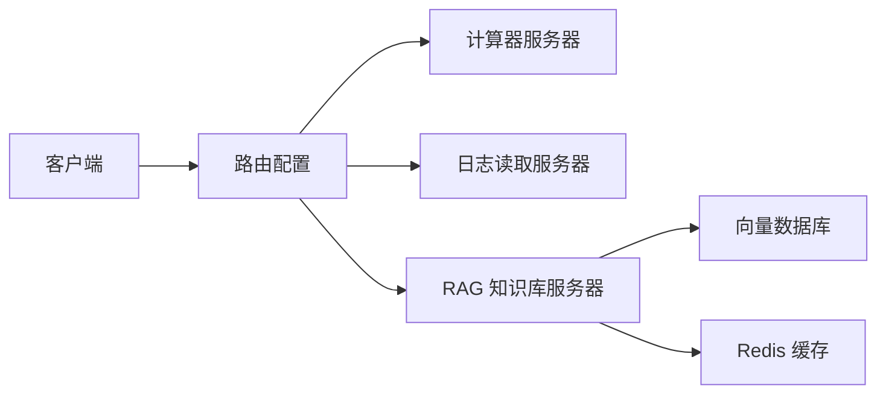

# 部署架构

<cite>
**本文引用的文件**
- [README.md](file://README.md)
- [requirements.txt](file://requirements.txt)
- [quickstart.py](file://quickstart.py)
- [Routing/mcp.json](file://Routing/mcp.json)
- [.gitignore](file://.gitignore)
- [Server/__init__.py](file://Server/__init__.py)
- [Routing/__init__.py](file://Routing/__init__.py)
</cite>

## 目录
1. [简介](#简介)
2. [项目结构](#项目结构)
3. [核心组件](#核心组件)
4. [架构总览](#架构总览)
5. [详细组件分析](#详细组件分析)
6. [依赖分析](#依赖分析)
7. [性能考量](#性能考量)
8. [故障排查指南](#故障排查指南)
9. [结论](#结论)
10. [附录](#附录)

## 简介
本部署架构文档面向 AiOps 项目，聚焦于系统的整体部署拓扑与实施策略，覆盖单机部署、集群部署与容器化部署三种模式；明确客户端、路由系统、MCP 服务器、向量数据库与 Redis 缓存的部署位置与依赖关系；给出开发/测试/生产三类环境的配置差异与最佳实践；并阐述网络架构、端口配置与安全要点，以及高可用与负载均衡的实现建议。

## 项目结构
AiOps 采用模块化分层组织，核心模块包括：
- 客户端（Client）：负责与用户交互与工具调用
- 路由系统（Routing）：集中管理 MCP 服务器清单与传输方式
- 服务器（Server）：提供具体工具能力（计算器、日志读取、RAG 知识库）
- 向量存储（Vector Store）：持久化嵌入向量与检索
- 缓存（Redis）：会话与中间结果缓存
- 依赖（requirements.txt）：统一声明第三方库与版本约束

图表来源
- [Routing/mcp.json:1-29](file://Routing/mcp.json#L1-L29)
- [requirements.txt:1-17](file://requirements.txt#L1-L17)

章节来源
- [README.md:1-125](file://README.md#L1-L125)
- [requirements.txt:1-17](file://requirements.txt#L1-L17)
- [Routing/mcp.json:1-29](file://Routing/mcp.json#L1-L29)

## 核心组件
- 客户端与交互
  - 快速启动演示脚本展示了客户端创建 Agent、列出工具与发起对话的流程，体现客户端作为工具调用入口的角色。
- 路由系统
  - mcp.json 声明了多个 MCP 服务器（高德地图、计算器、日志读取、RAG），并指定传输方式（HTTP/STDIO），是部署时决定组件耦合与通信路径的关键。
- MCP 服务器
  - 计算器、日志读取、RAG 知识库服务器通过命令行启动，依赖本地 Python 环境与对应工具链。
- 向量数据库与缓存
  - 项目依赖中包含向量数据库与 Redis 客户端，结合路由与服务器侧组件，形成检索与缓存能力。

章节来源
- [quickstart.py:1-68](file://quickstart.py#L1-L68)
- [Routing/mcp.json:1-29](file://Routing/mcp.json#L1-L29)
- [requirements.txt:1-17](file://requirements.txt#L1-L17)

## 架构总览
下图展示从客户端到各 MCP 服务器、再到向量数据库与缓存的整体部署视图。客户端通过路由系统选择目标 MCP 服务器；服务器侧可按需访问向量数据库与 Redis 缓存。

图表来源
- [Routing/mcp.json:1-29](file://Routing/mcp.json#L1-L29)
- [requirements.txt:1-17](file://requirements.txt#L1-L17)

## 详细组件分析

### 组件一：MCP 路由系统
- 部署位置与职责
  - 路由系统集中管理 MCP 服务器清单与传输方式，决定客户端调用路径与服务器启动方式。
- 关键配置项
  - 服务器清单：包含高德地图、计算器、日志读取、RAG 知识库四类服务器。
  - 传输方式：HTTP（流式 HTTP）与 STDIO（本地进程）混合。
- 依赖关系
  - 客户端依赖该配置进行工具发现与调用；服务器侧组件需与配置中的命令/参数保持一致。

图表来源
- [Routing/mcp.json:1-29](file://Routing/mcp.json#L1-L29)

章节来源
- [Routing/mcp.json:1-29](file://Routing/mcp.json#L1-L29)

### 组件二：MCP 服务器（计算器/日志读取/RAG）
- 部署位置与启动方式
  - 通过 mcp.json 中的命令与参数以本地进程方式启动，适合单机部署与开发调试。
- 依赖关系
  - 服务器实现依赖 LangChain/LangGraph 与 MCP 协议适配库；RAG 服务器同时依赖向量数据库与 Redis。
- 扩展性
  - 新增服务器可通过 mcp.json 增加条目，保持客户端零改动。

图表来源
- [Routing/mcp.json:1-29](file://Routing/mcp.json#L1-L29)
- [requirements.txt:1-17](file://requirements.txt#L1-L17)

章节来源
- [Routing/mcp.json:1-29](file://Routing/mcp.json#L1-L29)
- [requirements.txt:1-17](file://requirements.txt#L1-L17)

### 组件三：向量数据库与 Redis 缓存
- 部署位置与职责
  - 向量数据库用于 RAG 检索；Redis 用于会话与中间结果缓存。
- 部署模式
  - 单机：本地进程或 Docker 容器内运行。
  - 集群：向量数据库与 Redis 均可横向扩展，需配合服务发现与负载均衡。
- 依赖关系
  - 服务器侧组件通过客户端库访问，路由系统不直接暴露其地址，降低耦合。

章节来源
- [requirements.txt:1-17](file://requirements.txt#L1-L17)

### 组件四：客户端与交互
- 部署位置与职责
  - 客户端负责用户交互、工具调用与结果呈现；可独立部署于用户终端或服务端。
- 与路由系统的关系
  - 通过 mcp.json 与服务器建立连接；在容器化场景中，客户端可与路由/服务器在同一网络内部署。

章节来源
- [quickstart.py:1-68](file://quickstart.py#L1-L68)

## 依赖分析
- 第三方依赖
  - 项目对 FastMCP、LangChain、LangGraph、MCP 协议适配库、向量数据库与 Redis 客户端有直接依赖。
- 组件耦合
  - 客户端与路由系统强耦合（配置驱动）；服务器与数据/缓存弱耦合（通过库访问）。
- 外部接口
  - 高德地图 MCP 服务通过 HTTP 传输；本地服务器通过 STDIO 传输。

图表来源
- [Routing/mcp.json:1-29](file://Routing/mcp.json#L1-L29)
- [requirements.txt:1-17](file://requirements.txt#L1-L17)

章节来源
- [requirements.txt:1-17](file://requirements.txt#L1-L17)
- [Routing/mcp.json:1-29](file://Routing/mcp.json#L1-L29)

## 性能考量
- 传输方式选择
  - HTTP 适合跨网络调用与可观测性；STDIO 适合本地低延迟调用。
- 并发与资源
  - 服务器侧应限制并发与内存占用，避免阻塞；向量数据库与 Redis 需要合理的连接池与超时设置。
- 缓存策略
  - 利用 Redis 缓存热点查询与中间结果，减少重复检索与计算。
- 检索优化
  - 向量数据库应配置合适的索引与批量写入策略，提升检索吞吐。

## 故障排查指南
- 环境与依赖
  - 确认 Python 虚拟环境已激活且依赖完整安装。
- 配置校验
  - 检查 mcp.json 中服务器地址、命令与参数是否正确。
- 服务器健康
  - 对本地服务器，验证进程是否正常启动；对 HTTP 服务器，检查网络连通与鉴权。
- 数据与缓存
  - 核对向量数据库与 Redis 的连接参数与权限；确认索引与键空间存在。
- 日志与监控
  - 启用客户端与服务器侧日志，定位失败请求与异常堆栈。

章节来源
- [quickstart.py:60-68](file://quickstart.py#L60-L68)
- [README.md:53-78](file://README.md#L53-L78)

## 结论
AiOps 的部署架构以“配置驱动的路由系统”为核心，结合本地进程与 HTTP 两种传输方式，实现客户端与多类 MCP 服务器的灵活组合。通过将向量数据库与 Redis 作为可插拔的数据层，系统可在单机、集群与容器化环境中按需演进。建议在生产环境强化安全与可观测性，并采用负载均衡与高可用策略保障稳定性。

## 附录

### 不同环境的配置差异与最佳实践
- 开发环境
  - 使用 STDIO 本地服务器，简化调试；向量数据库与 Redis 可以本地容器运行。
- 测试环境
  - 引入最小化集群（单副本）验证路由与数据层连通性；启用基础日志与指标采集。
- 生产环境
  - 服务器与数据层均采用高可用部署；路由系统通过服务发现与负载均衡对外暴露；严格区分网络隔离与访问控制。

### 网络架构设计与端口配置
- 传输方式与端口
  - HTTP 传输通常使用标准端口（如 80/443），需配置反向代理与 TLS；STDIO 传输无需网络端口。
- 服务发现与负载均衡
  - 对外暴露的 HTTP 服务器建议通过反向代理或服务网格实现负载均衡与健康检查。
- 安全考虑
  - 在生产环境启用 HTTPS/TLS、访问令牌与防火墙策略；敏感密钥通过安全渠道注入。

### 部署模式建议
- 单机部署
  - 适用于开发与小规模测试；将客户端、路由、服务器与数据/缓存部署在同一主机或容器内。
- 集群部署
  - 服务器与数据层横向扩展；通过服务发现与负载均衡实现高可用；引入监控与告警。
- 容器化部署
  - 使用容器编排平台（如 Kubernetes）管理生命周期与扩缩容；通过 ConfigMap/Secret 注入配置与密钥；持久化卷挂载数据层。