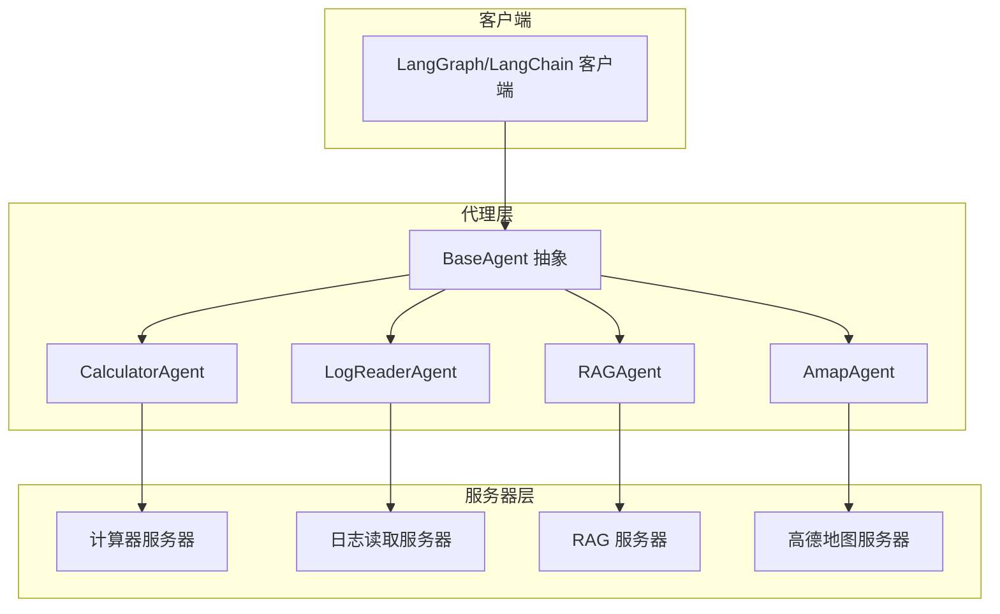
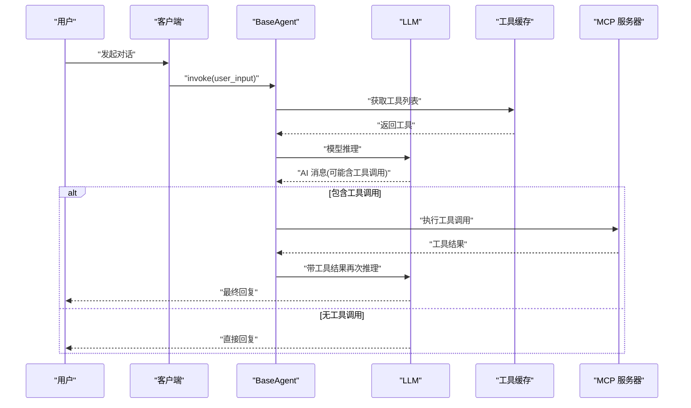
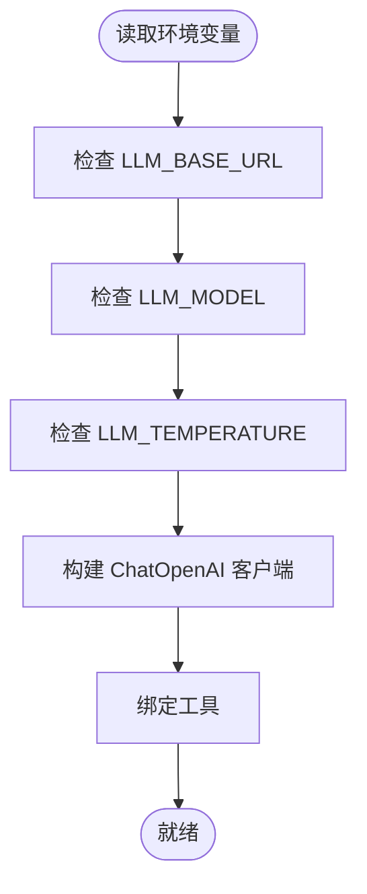
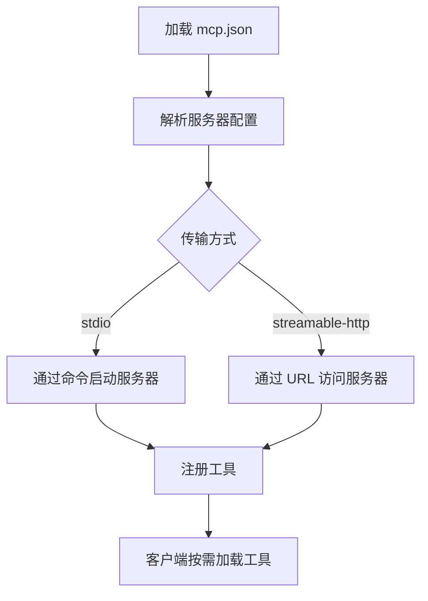
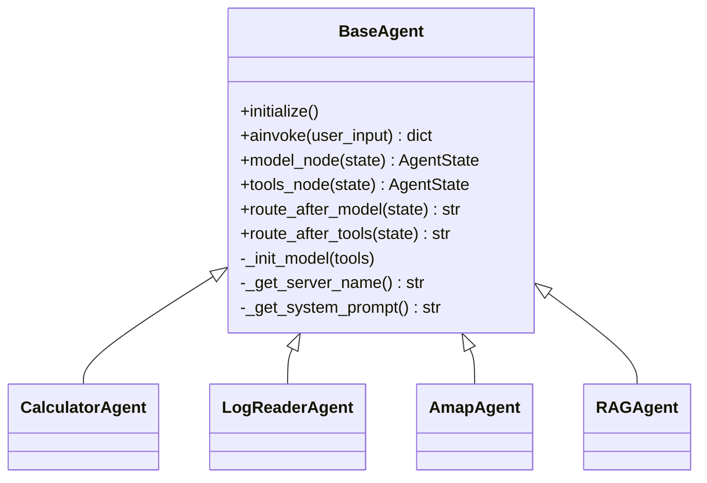
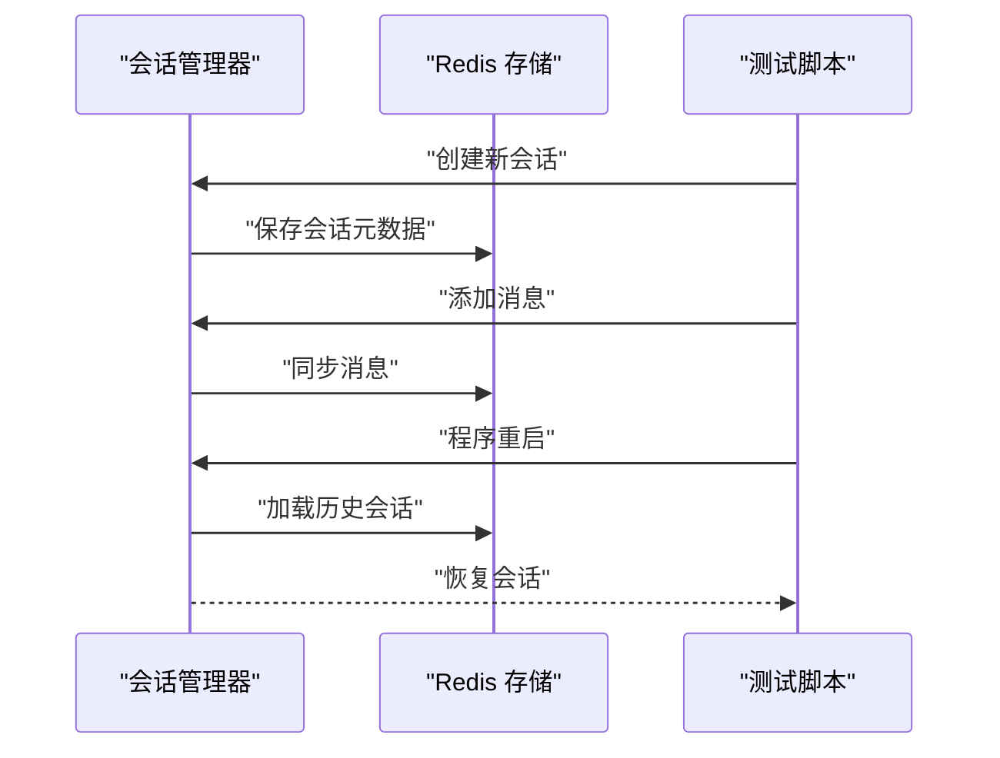
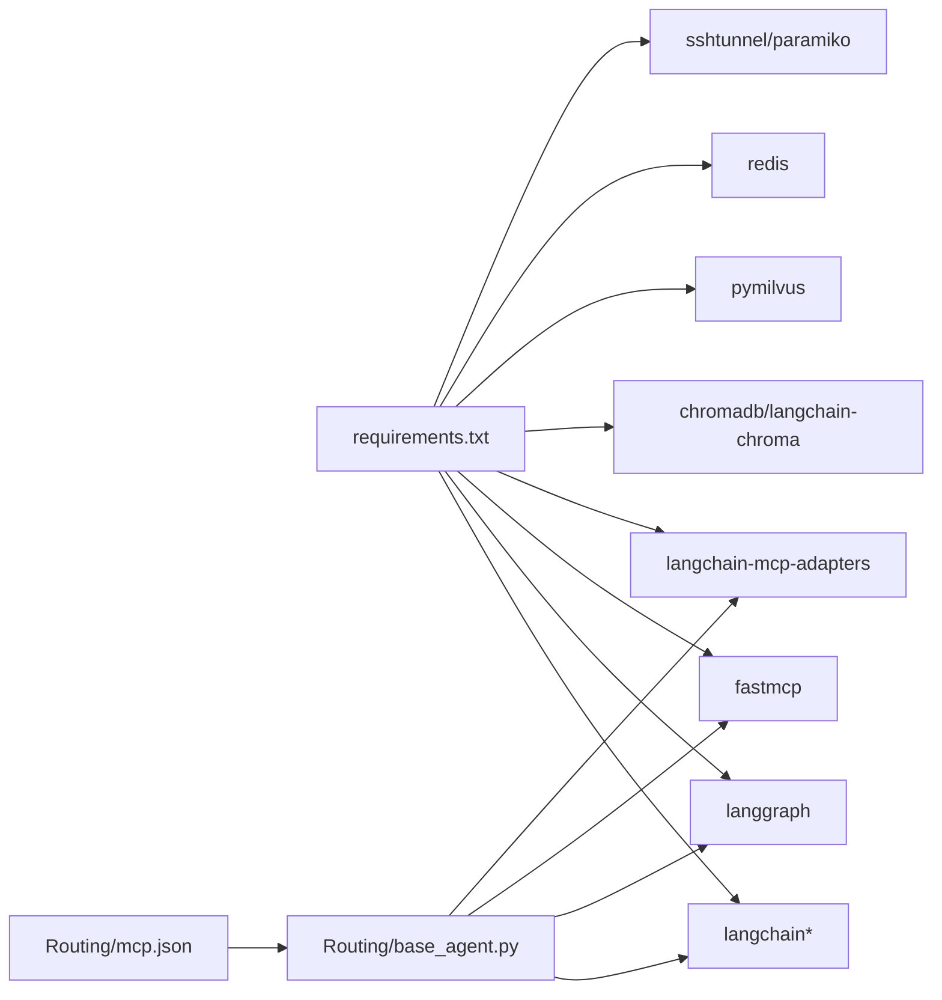

# 部署运维

<cite>
**本文引用的文件**
- [README.md](file://README.md)
- [requirements.txt](file://requirements.txt)
- [LLM_CONFIG_GUIDE.md](file://LLM_CONFIG_GUIDE.md)
- [quickstart.py](file://quickstart.py)
- [demo_conversation.py](file://demo_conversation.py)
- [Routing/base_agent.py](file://Routing/base_agent.py)
- [Routing/mcp.json](file://Routing/mcp.json)
- [Routing/log_reader.py](file://Routing/log_reader.py)
- [Server/__init__.py](file://Server/__init__.py)
- [Client/__init__.py](file://Client/__init__.py)
- [.kiro/specs/redis-installation/design.md](file://.kiro/specs/redis-installation/design.md)
- [.kiro/specs/redis-installation/.config.kiro](file://.kiro/specs/redis-installation/.config.kiro)
- [test/README_REDIS_TEST.md](file://test/README_REDIS_TEST.md)
</cite>

## 目录
1. [简介](#简介)
2. [项目结构](#项目结构)
3. [核心组件](#核心组件)
4. [架构总览](#架构总览)
5. [详细组件分析](#详细组件分析)
6. [依赖分析](#依赖分析)
7. [性能考量](#性能考量)
8. [故障排除指南](#故障排除指南)
9. [结论](#结论)
10. [附录](#附录)

## 简介
本指南面向运维团队，提供 AiOps 项目的部署与运维实践，涵盖开发、测试、生产三类环境的配置差异，容器化与云平台部署建议，监控与日志最佳实践，故障排除与应急响应流程，性能优化与资源调优方法，以及备份恢复与灾难恢复策略。目标是帮助团队稳定、可靠地运行与维护系统。

## 项目结构
项目采用“客户端-代理-服务器”三层架构，结合 MCP（Model Context Protocol）协议实现工具与外部数据源的标准化连接。核心模块包括：
- 客户端层：LangGraph/LangChain 客户端封装，负责创建 Agent 并发起对话。
- 代理层：BaseAgent 抽象与具体 Agent（计算器、日志读取、高德地图、RAG），统一工具加载、消息处理与错误处理。
- 服务器层：各 MCP 服务器（计算器、日志读取、RAG、高德地图）通过 mcp.json 配置注册与传输方式。
- 配置与测试：LLM 配置、Redis 会话持久化测试与安装设计文档。

图表来源
- [Client/__init__.py:1-12](file://Client/__init__.py#L1-L12)
- [Routing/base_agent.py:29-497](file://Routing/base_agent.py#L29-L497)
- [Routing/mcp.json:1-29](file://Routing/mcp.json#L1-L29)
- [Server/__init__.py:1-5](file://Server/__init__.py#L1-L5)

章节来源
- [README.md:1-125](file://README.md#L1-L125)
- [requirements.txt:1-17](file://requirements.txt#L1-L17)
- [Client/__init__.py:1-12](file://Client/__init__.py#L1-L12)
- [Routing/base_agent.py:29-497](file://Routing/base_agent.py#L29-L497)
- [Routing/mcp.json:1-29](file://Routing/mcp.json#L1-L29)
- [Server/__init__.py:1-5](file://Server/__init__.py#L1-L5)

## 核心组件
- LLM 配置与模型切换：通过环境变量集中管理，支持 DashScope、OpenAI、DeepSeek、Moonshot、本地 Ollama 等。
- MCP 服务器配置：mcp.json 定义各服务器的传输方式与启动参数，支持 stdio 与 streamable-http。
- 代理基类与具体 Agent：BaseAgent 统一工具加载、消息处理、错误处理；具体 Agent 实现系统提示词与服务器名称。
- 会话与缓存：工具缓存减少重复加载；Redis 会话持久化支持多轮对话与程序重启恢复。
- 快速启动与演示：quickstart.py 展示 Agent 创建与对话流程；demo_conversation.py 展示工具缓存与循环对话。

章节来源
- [LLM_CONFIG_GUIDE.md:1-92](file://LLM_CONFIG_GUIDE.md#L1-L92)
- [Routing/mcp.json:1-29](file://Routing/mcp.json#L1-L29)
- [Routing/base_agent.py:29-497](file://Routing/base_agent.py#L29-L497)
- [quickstart.py:1-68](file://quickstart.py#L1-L68)
- [demo_conversation.py:1-102](file://demo_conversation.py#L1-L102)

## 架构总览
系统通过 LangGraph 构建状态图，Agent 在模型节点与工具节点之间流转，实现“思考-调用工具-反思”的闭环。MCP 服务器通过 mcp.json 注册，客户端按需加载工具并执行。

图表来源
- [Routing/base_agent.py:102-318](file://Routing/base_agent.py#L102-L318)
- [Routing/mcp.json:1-29](file://Routing/mcp.json#L1-L29)

## 详细组件分析

### LLM 配置与模型切换
- 配置项集中于环境变量，包括 API 基础地址、模型名与温度。
- 支持多家 LLM 提供商与本地模型，切换时需匹配对应 API Key。
- 修改后需重启进程生效。

图表来源
- [Routing/base_agent.py:68-89](file://Routing/base_agent.py#L68-L89)
- [LLM_CONFIG_GUIDE.md:68-82](file://LLM_CONFIG_GUIDE.md#L68-L82)

章节来源
- [LLM_CONFIG_GUIDE.md:1-92](file://LLM_CONFIG_GUIDE.md#L1-L92)
- [Routing/base_agent.py:68-89](file://Routing/base_agent.py#L68-L89)

### MCP 服务器与传输方式
- mcp.json 定义服务器名称、URL/命令、传输方式（stdio/streamable-http）。
- 服务器通过 Python 脚本启动（stdio），或通过 HTTP 流式访问（streamable-http）。
- 传输方式影响工具发现与调用稳定性。

图表来源
- [Routing/mcp.json:1-29](file://Routing/mcp.json#L1-L29)

章节来源
- [Routing/mcp.json:1-29](file://Routing/mcp.json#L1-L29)

### 代理基类与具体 Agent
- BaseAgent 统一状态结构、节点函数、路由逻辑与错误处理。
- 具体 Agent 实现系统提示词与服务器名称，保证职责单一。
- 工具缓存与会话管理由上游模块提供，降低耦合。

图表来源
- [Routing/base_agent.py:29-497](file://Routing/base_agent.py#L29-L497)

章节来源
- [Routing/base_agent.py:29-497](file://Routing/base_agent.py#L29-L497)

### 会话与缓存
- 工具缓存：首次加载工具后复用，显著降低延迟。
- Redis 会话持久化：支持多轮对话与程序重启后的会话恢复。
- 测试覆盖：单元测试与集成测试分别验证 Mock 与真实 Redis 环境下的功能。

图表来源
- [test/README_REDIS_TEST.md:1-174](file://test/README_REDIS_TEST.md#L1-L174)

章节来源
- [test/README_REDIS_TEST.md:1-174](file://test/README_REDIS_TEST.md#L1-L174)

### 快速启动与演示
- quickstart.py：创建 Agent、列出工具、执行示例对话，便于验证环境与配置。
- demo_conversation.py：演示工具缓存、循环对话与会话管理，便于理解系统行为。

章节来源
- [quickstart.py:1-68](file://quickstart.py#L1-L68)
- [demo_conversation.py:1-102](file://demo_conversation.py#L1-L102)

## 依赖分析
- Python 依赖集中在 requirements.txt，涵盖 LangChain/LangGraph、MCP 适配器、向量数据库、Redis、SSH 隧道等。
- 代理层依赖 LLM 提供商 SDK（通过 ChatOpenAI 绑定工具），服务器层通过 mcp.json 配置与外部工具对接。
- 客户端导出 LangGraph/LangChain Agent 创建接口，保持向后兼容。

图表来源
- [requirements.txt:1-17](file://requirements.txt#L1-L17)
- [Routing/base_agent.py:68-89](file://Routing/base_agent.py#L68-L89)
- [Routing/mcp.json:1-29](file://Routing/mcp.json#L1-L29)

章节来源
- [requirements.txt:1-17](file://requirements.txt#L1-L17)
- [Routing/base_agent.py:68-89](file://Routing/base_agent.py#L68-L89)
- [Routing/mcp.json:1-29](file://Routing/mcp.json#L1-L29)

## 性能考量
- 工具缓存：避免重复加载 MCP 工具，降低冷启动开销。
- 会话持久化：Redis 作为会话存储，注意内存与持久化策略，避免阻塞。
- LLM 调用：合理设置温度与模型，平衡确定性与创造性；批量请求与并发控制需结合业务场景评估。
- 向量检索：ChromaDB 本地部署与 Milvus 远程部署的性能差异较大，需根据数据规模与查询延迟要求选择。
- 网络与传输：stdio 与 streamable-http 的稳定性与延迟不同，生产环境建议优先使用稳定的网络与传输方式。

章节来源
- [Routing/base_agent.py:145-217](file://Routing/base_agent.py#L145-L217)
- [test/README_REDIS_TEST.md:66-78](file://test/README_REDIS_TEST.md#L66-L78)
- [LLM_CONFIG_GUIDE.md:68-82](file://LLM_CONFIG_GUIDE.md#L68-L82)

## 故障排除指南
- 环境与依赖
  - 确认虚拟环境已激活且依赖完整安装。
  - LLM 配置需匹配 API Key 与基础地址，修改后需重启进程。
- MCP 服务器
  - 检查 mcp.json 中服务器 URL/命令与传输方式是否正确。
  - stdio 服务器需确保 Python 路径与脚本可执行。
- Redis 会话持久化
  - 本地 Redis：确认服务运行、端口可达、防火墙放行。
  - 远程 Redis：通过 SSH 隧道建立本地转发，检查密钥与端口映射。
  - Paramiko 版本问题：若出现 DSSKey 相关报错，按测试文档建议降级或更新密钥加载逻辑。
- 常见问题定位
  - 使用 redis-cli 或 Python 客户端验证 Redis 连通性。
  - 观察工具调用链路，定位在模型推理、工具执行还是结果回传阶段的异常。

章节来源
- [quickstart.py:60-68](file://quickstart.py#L60-L68)
- [LLM_CONFIG_GUIDE.md:76-82](file://LLM_CONFIG_GUIDE.md#L76-L82)
- [Routing/mcp.json:1-29](file://Routing/mcp.json#L1-L29)
- [test/README_REDIS_TEST.md:20-115](file://test/README_REDIS_TEST.md#L20-L115)

## 结论
通过统一的代理基类、标准化的 MCP 服务器配置与完善的会话持久化机制，AiOps 项目具备良好的可维护性与可扩展性。结合合理的 LLM 配置、缓存与传输策略，以及完善的监控与测试体系，运维团队可以稳定地支撑从开发到生产的全生命周期运维。

## 附录

### 开发/测试/生产环境配置差异
- 开发环境
  - 本地 Redis（Docker 或系统服务），便于快速迭代。
  - LLM 使用 DashScope 或本地 Ollama，便于离线测试。
  - MCP 服务器通过 stdio 启动，简化调试。
- 测试环境
  - 使用独立 Redis 实例，隔离测试数据。
  - 配置与生产一致的 LLM 与 MCP 传输方式，验证集成稳定性。
- 生产环境
  - Redis 配置持久化与内存上限，启用安全策略（密码、绑定特定 IP、防火墙）。
  - LLM 选择高可用提供商，配置限流与熔断。
  - MCP 服务器通过稳定网络与 HTTPS 流式传输，确保低延迟与高可用。

章节来源
- [.kiro/specs/redis-installation/design.md:23-46](file://.kiro/specs/redis-installation/design.md#L23-L46)
- [LLM_CONFIG_GUIDE.md:18-66](file://LLM_CONFIG_GUIDE.md#L18-L66)
- [Routing/mcp.json:1-29](file://Routing/mcp.json#L1-L29)

### 容器化部署方案
- 建议
  - 使用多阶段构建，缩小镜像体积。
  - 将 LLM API Key 与 MCP 服务器凭据通过环境变量注入。
  - 将 Redis 与 MCP 服务器作为独立服务，通过网络连接。
- 关键点
  - 确保容器内 Python 依赖与系统库完整。
  - 为日志输出配置标准输出重定向，便于容器日志采集。
  - 为 Redis 与 MCP 服务器暴露必要端口并配置健康检查。

章节来源
- [requirements.txt:1-17](file://requirements.txt#L1-L17)
- [Routing/mcp.json:1-29](file://Routing/mcp.json#L1-L29)
- [.kiro/specs/redis-installation/design.md:48-62](file://.kiro/specs/redis-installation/design.md#L48-L62)

### 云平台部署指南
- 推荐
  - 使用托管 Redis（如云厂商 Redis 服务）以获得高可用与备份。
  - MCP 服务器部署在可弹性扩缩容的实例或容器组中。
  - LLM API 通过云厂商的 API Gateway 或服务网格进行限流与鉴权。
- 安全
  - 通过 VPC/子网隔离敏感服务。
  - 使用密钥管理服务（KMS）管理 API Key 与证书。
  - 启用审计日志与网络访问控制。

章节来源
- [.kiro/specs/redis-installation/design.md:70-78](file://.kiro/specs/redis-installation/design.md#L70-L78)
- [LLM_CONFIG_GUIDE.md:32-66](file://LLM_CONFIG_GUIDE.md#L32-L66)

### 监控与日志管理最佳实践
- 指标监控
  - LLM 调用延迟、错误率、Token 使用量。
  - 工具调用成功率与平均耗时。
  - Redis 连接数、内存使用、命中率与持久化状态。
  - MCP 服务器可用性与响应时间。
- 日志管理
  - 统一结构化日志格式，包含会话 ID、步骤、错误码。
  - 将日志输出至标准输出，配合容器日志采集器集中存储。
  - 对敏感信息（API Key、会话内容）脱敏处理。
- 告警配置
  - 设定阈值告警（延迟、错误率、内存、连接数）。
  - 结合业务 SLA 设置多级告警与升级策略。

章节来源
- [test/README_REDIS_TEST.md:66-78](file://test/README_REDIS_TEST.md#L66-L78)
- [Routing/base_agent.py:111-129](file://Routing/base_agent.py#L111-L129)

### 备份恢复与灾难恢复策略
- 备份
  - Redis：启用 RDB/AOF 持久化，定期快照与归档。
  - 配置文件与密钥：通过版本化存储与密钥管理服务保护。
- 恢复
  - 制定恢复演练计划，验证从备份到服务可用的全流程。
  - 对 MCP 服务器与 LLM API 的可用性进行冗余与故障转移。
- 灾难恢复
  - 建立跨区域复制与多活架构，缩短 RTO/RPO。
  - 对关键数据与服务设定恢复优先级与资源预留。

章节来源
- [.kiro/specs/redis-installation/design.md:39-46](file://.kiro/specs/redis-installation/design.md#L39-L46)
- [.kiro/specs/redis-installation/.config.kiro:1-5](file://.kiro/specs/redis-installation/.config.kiro#L1-L5)