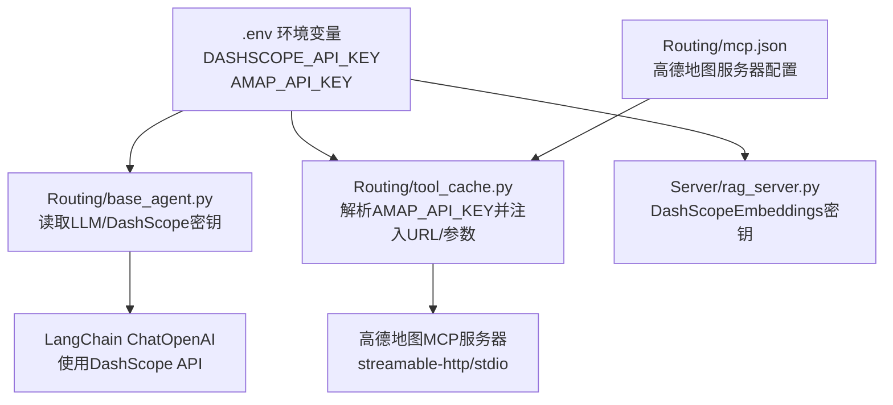
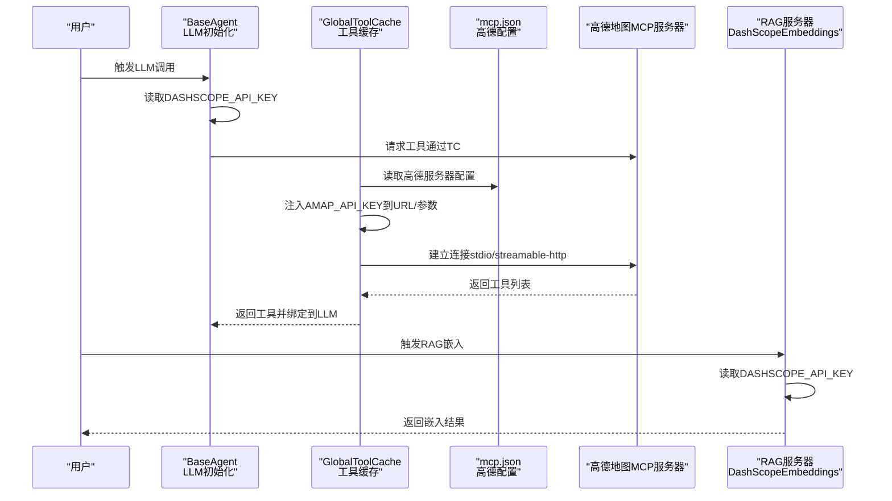
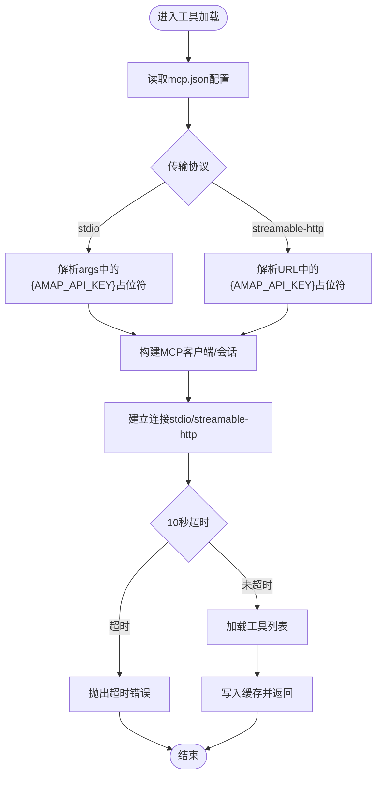
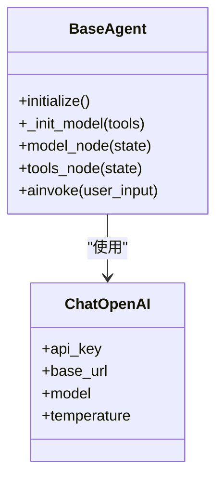
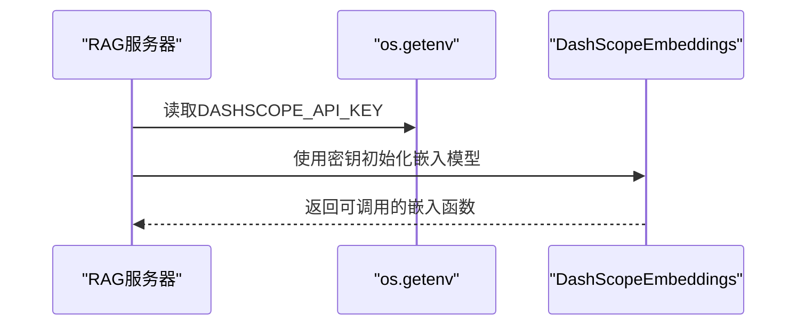
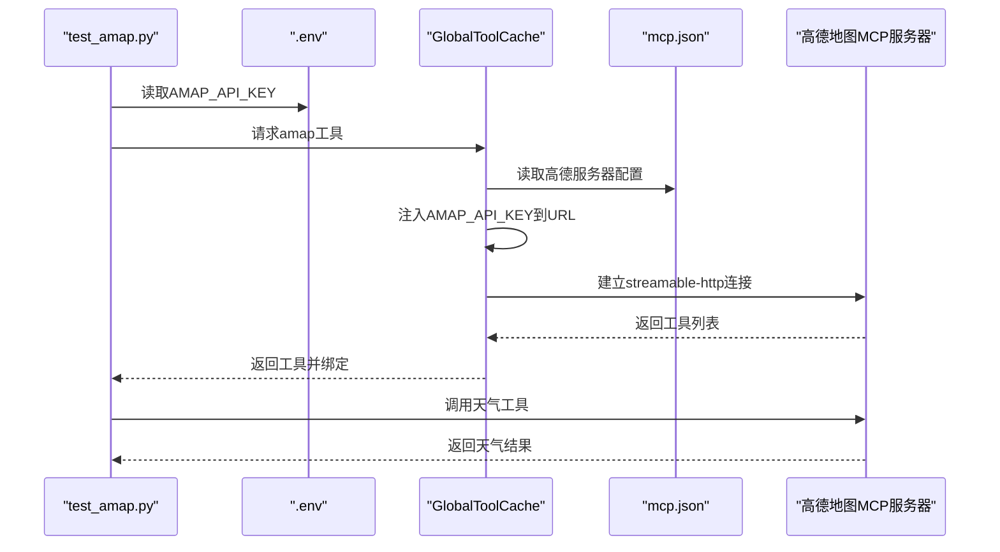
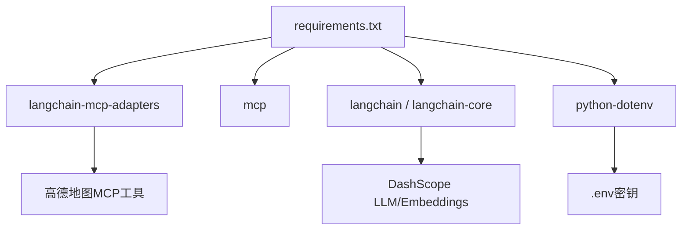

# API密钥管理

<cite>
**本文档引用的文件**
- [README.md](file://README.md)
- [LLM_CONFIG_GUIDE.md](file://LLM_CONFIG_GUIDE.md)
- [requirements.txt](file://requirements.txt)
- [Routing/base_agent.py](file://Routing/base_agent.py)
- [Routing/tool_cache.py](file://Routing/tool_cache.py)
- [Routing/amap.py](file://Routing/amap.py)
- [Routing/mcp.json](file://Routing/mcp.json)
- [Server/rag_server.py](file://Server/rag_server.py)
- [test/test_amap.py](file://test/test_amap.py)
</cite>

## 目录
1. [简介](#简介)
2. [项目结构](#项目结构)
3. [核心组件](#核心组件)
4. [架构总览](#架构总览)
5. [详细组件分析](#详细组件分析)
6. [依赖分析](#依赖分析)
7. [性能考虑](#性能考虑)
8. [故障排查指南](#故障排查指南)
9. [结论](#结论)
10. [附录](#附录)

## 简介
本文件聚焦于项目中API密钥的配置与管理，涵盖高德地图API密钥与DashScope API密钥的使用方式、安全存储与轮换策略、访问控制、配置模板与验证方法、监控与限额管理、故障处理机制，以及加密存储与安全传输方案。文档同时给出最佳实践与合规要求，帮助团队在保障安全的前提下高效使用第三方服务。

## 项目结构
项目采用模块化设计，API密钥主要通过环境变量注入，配合MCP工具缓存与LLM客户端实现统一管理。关键位置如下：
- 环境变量配置：根目录的.env文件（由README与LLM配置指南说明）
- 工具缓存与密钥注入：Routing/tool_cache.py
- LLM与DashScope密钥：Routing/base_agent.py
- 高德地图密钥注入：Routing/mcp.json与Routing/tool_cache.py
- RAG向量嵌入密钥：Server/rag_server.py
- 测试与验证：test/test_amap.py

**图表来源**
- [README.md:64-69](file://README.md#L64-L69)
- [LLM_CONFIG_GUIDE.md:8-16](file://LLM_CONFIG_GUIDE.md#L8-L16)
- [Routing/tool_cache.py:141-242](file://Routing/tool_cache.py#L141-L242)
- [Routing/mcp.json:3-6](file://Routing/mcp.json#L3-L6)
- [Routing/base_agent.py:70-88](file://Routing/base_agent.py#L70-L88)
- [Server/rag_server.py:37-175](file://Server/rag_server.py#L37-L175)

**章节来源**
- [README.md:64-69](file://README.md#L64-L69)
- [LLM_CONFIG_GUIDE.md:8-16](file://LLM_CONFIG_GUIDE.md#L8-L16)
- [Routing/tool_cache.py:141-242](file://Routing/tool_cache.py#L141-L242)
- [Routing/mcp.json:3-6](file://Routing/mcp.json#L3-L6)
- [Routing/base_agent.py:70-88](file://Routing/base_agent.py#L70-L88)
- [Server/rag_server.py:37-175](file://Server/rag_server.py#L37-L175)

## 核心组件
- 环境变量与配置文件
  - .env文件集中存放API密钥与LLM基础配置，由README与LLM配置指南明确说明。
- 工具缓存与密钥注入
  - GlobalToolCache负责MCP服务器连接与工具加载，支持stdio与streamable-http两种传输协议；在解析URL与命令参数时，将AMAP_API_KEY注入到高德地图服务器请求中。
- LLM与DashScope密钥
  - BaseAgent在初始化LLM时从环境变量读取DASHSCOPE_API_KEY，并通过ChatOpenAI进行调用。
- RAG嵌入向量密钥
  - RAG服务器在创建DashScopeEmbeddings时显式传入DASHSCOPE_API_KEY。
- 验证与测试
  - test_amap.py通过加载.env并检查AMAP_API_KEY是否设置，随后尝试加载高德地图工具并调用天气工具，作为密钥有效性验证的参考流程。

**章节来源**
- [README.md:64-69](file://README.md#L64-L69)
- [LLM_CONFIG_GUIDE.md:8-16](file://LLM_CONFIG_GUIDE.md#L8-L16)
- [Routing/tool_cache.py:141-242](file://Routing/tool_cache.py#L141-L242)
- [Routing/base_agent.py:70-88](file://Routing/base_agent.py#L70-L88)
- [Server/rag_server.py:37-175](file://Server/rag_server.py#L37-L175)
- [test/test_amap.py:20-26](file://test/test_amap.py#L20-L26)

## 架构总览
下图展示API密钥在系统中的流转路径与作用域：

**图表来源**
- [Routing/base_agent.py:70-88](file://Routing/base_agent.py#L70-L88)
- [Routing/tool_cache.py:141-242](file://Routing/tool_cache.py#L141-L242)
- [Routing/mcp.json:3-6](file://Routing/mcp.json#L3-L6)
- [Server/rag_server.py:37-175](file://Server/rag_server.py#L37-L175)

## 详细组件分析

### 工具缓存与密钥注入（GlobalToolCache）
- 功能要点
  - 统一管理MCP服务器连接与工具加载，避免重复连接与加载。
  - 支持stdio与streamable-http两种传输协议。
  - 在解析命令参数与URL时，将AMAP_API_KEY替换到占位符中，确保高德地图服务器请求携带密钥。
  - 提供TTL缓存与会话管理，提升性能并降低第三方服务压力。
- 密钥注入流程
  - 对于stdio：遍历args，若包含AMAP_API_KEY占位符，则替换为环境变量值。
  - 对于streamable-http：直接在URL中替换AMAP_API_KEY占位符。
  - 若未设置AMAP_API_KEY，HTTP路径分支会抛出错误，防止静默失败。
- 错误处理
  - 连接超时设置为10秒，避免长时间阻塞。
  - 工具加载失败时记录错误并抛出异常，便于上层感知。

**图表来源**
- [Routing/tool_cache.py:141-242](file://Routing/tool_cache.py#L141-L242)

**章节来源**
- [Routing/tool_cache.py:141-242](file://Routing/tool_cache.py#L141-L242)

### LLM与DashScope密钥（BaseAgent）
- 功能要点
  - 从环境变量读取DASHSCOPE_API_KEY与LLM基础配置。
  - 使用ChatOpenAI封装DashScope API，实现统一的LLM调用入口。
  - 将工具绑定到LLM，形成“模型节点-工具节点”的工作流。
- 安全与配置
  - 通过环境变量集中管理密钥，避免硬编码。
  - LLM_BASE_URL、LLM_MODEL、LLM_TEMPERATURE等参数同样来自环境变量，便于切换与审计。

**图表来源**
- [Routing/base_agent.py:70-88](file://Routing/base_agent.py#L70-L88)

**章节来源**
- [Routing/base_agent.py:70-88](file://Routing/base_agent.py#L70-L88)

### RAG嵌入向量密钥（Server/rag_server.py）
- 功能要点
  - 从环境变量读取DASHSCOPE_API_KEY，创建DashScopeEmbeddings实例。
  - 支持ChromaDB与Milvus两种向量存储后端，均通过DashScope API生成嵌入向量。
- 安全与配置
  - 密钥在创建嵌入模型时显式传入，确保调用链路清晰且可审计。

**图表来源**
- [Server/rag_server.py:37-175](file://Server/rag_server.py#L37-L175)

**章节来源**
- [Server/rag_server.py:37-175](file://Server/rag_server.py#L37-L175)

### 高德地图密钥配置与验证（mcp.json与test_amap.py）
- 配置要点
  - mcp.json中高德地图服务器使用streamable-http传输，URL包含{AMAP_API_KEY}占位符。
  - GlobalToolCache在加载高德地图工具时，将AMAP_API_KEY注入到URL中。
- 验证流程
  - test_amap.py加载.env，检查AMAP_API_KEY是否设置。
  - 尝试加载amap工具并调用天气工具，作为密钥有效性与工具可用性的验证。

**图表来源**
- [Routing/mcp.json:3-6](file://Routing/mcp.json#L3-L6)
- [Routing/tool_cache.py:198-242](file://Routing/tool_cache.py#L198-L242)
- [test/test_amap.py:20-62](file://test/test_amap.py#L20-L62)

**章节来源**
- [Routing/mcp.json:3-6](file://Routing/mcp.json#L3-L6)
- [Routing/tool_cache.py:198-242](file://Routing/tool_cache.py#L198-L242)
- [test/test_amap.py:20-62](file://test/test_amap.py#L20-L62)

## 依赖分析
- 外部依赖与密钥相关性
  - langchain-mcp-adapters与mcp：用于MCP协议通信，依赖AMAP_API_KEY进行高德地图工具访问。
  - langchain与langchain-core：用于LLM调用，依赖DASHSCOPE_API_KEY。
  - python-dotenv：用于加载.env文件中的环境变量。
- 潜在风险
  - 若AMAP_API_KEY缺失，streamable-http路径会抛出错误；若DASHSCOPE_API_KEY缺失，LLM初始化可能失败。
  - 依赖版本需与第三方服务兼容，避免协议或接口变更导致的调用失败。

**图表来源**
- [requirements.txt:1-17](file://requirements.txt#L1-L17)

**章节来源**
- [requirements.txt:1-17](file://requirements.txt#L1-L17)

## 性能考虑
- 工具缓存与连接复用
  - GlobalToolCache通过TTL缓存与会话复用减少重复连接，降低第三方服务压力。
- 超时控制
  - streamable-http连接设置10秒超时，避免长时间阻塞影响用户体验。
- 向量存储后端
  - RAG服务器支持ChromaDB与Milvus，可根据数据规模与查询复杂度选择合适后端，平衡性能与成本。

[本节为通用指导，无需特定文件来源]

## 故障排查指南
- 高德地图工具加载失败
  - 检查AMAP_API_KEY是否设置且有效。
  - 确认mcp.json中高德服务器URL包含{AMAP_API_KEY}占位符。
  - 观察工具加载日志，若出现超时，检查网络连通性与第三方服务状态。
- LLM调用失败
  - 检查DASHSCOPE_API_KEY是否设置且与LLM_BASE_URL匹配。
  - 确认LLM相关环境变量（LLM_MODEL、LLM_TEMPERATURE）合理。
- RAG嵌入失败
  - 确认DASHSCOPE_API_KEY存在且可用。
  - 检查向量存储后端（ChromaDB/Milvus）连接状态。
- 测试验证
  - 使用test_amap.py验证AMAP_API_KEY与工具加载流程。

**章节来源**
- [test/test_amap.py:20-62](file://test/test_amap.py#L20-L62)
- [Routing/tool_cache.py:198-242](file://Routing/tool_cache.py#L198-L242)
- [Server/rag_server.py:37-175](file://Server/rag_server.py#L37-L175)

## 结论
本项目通过环境变量集中管理API密钥，结合工具缓存与LLM客户端实现统一的密钥注入与调用。高德地图与DashScope的密钥分别在MCP配置与LLM/嵌入初始化阶段注入，形成清晰的调用链路。建议在生产环境中强化密钥轮换、访问控制与监控告警，确保安全与稳定。

[本节为总结，无需特定文件来源]

## 附录

### 配置模板与验证方法
- .env配置模板（示例）
  - DASHSCOPE_API_KEY=your_dashscope_api_key
  - AMAP_API_KEY=your_amap_api_key
  - LLM_BASE_URL=https://dashscope.aliyuncs.com/compatible-mode/v1
  - LLM_MODEL=qwen-max
  - LLM_TEMPERATURE=0
- 验证方法
  - 运行test_amap.py检查AMAP_API_KEY与工具加载。
  - 在README中查看环境变量配置说明与快速开始步骤。

**章节来源**
- [README.md:64-69](file://README.md#L64-L69)
- [LLM_CONFIG_GUIDE.md:8-16](file://LLM_CONFIG_GUIDE.md#L8-L16)
- [test/test_amap.py:20-62](file://test/test_amap.py#L20-L62)

### 安全存储与传输方案
- 环境变量集中管理
  - 所有API密钥通过.env文件管理，避免硬编码与泄露。
- 传输安全
  - 高德地图通过HTTPS（streamable-http）与MCP协议访问，建议在防火墙与网络层面限制访问来源。
- 加密存储与轮换
  - 建议使用密钥管理服务（如KMS）与自动化轮换机制，定期更换密钥并更新环境变量。
- 访问控制
  - 限制.env文件权限，仅授予必要人员访问；在CI/CD中使用受控的密钥注入机制。

[本节为通用指导，无需特定文件来源]

### 监控、限额与合规
- 监控与告警
  - 对第三方服务调用次数、成功率与错误类型进行监控，设置阈值告警。
- 限额管理
  - 根据服务商限额策略，设置调用频率上限与熔断机制，避免超额使用。
- 合规要求
  - 确保密钥使用符合服务商条款与数据保护法规；在日志中避免打印敏感信息。

[本节为通用指导，无需特定文件来源]