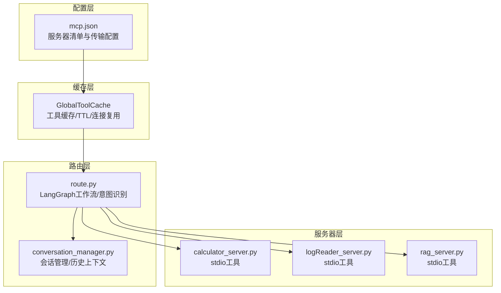
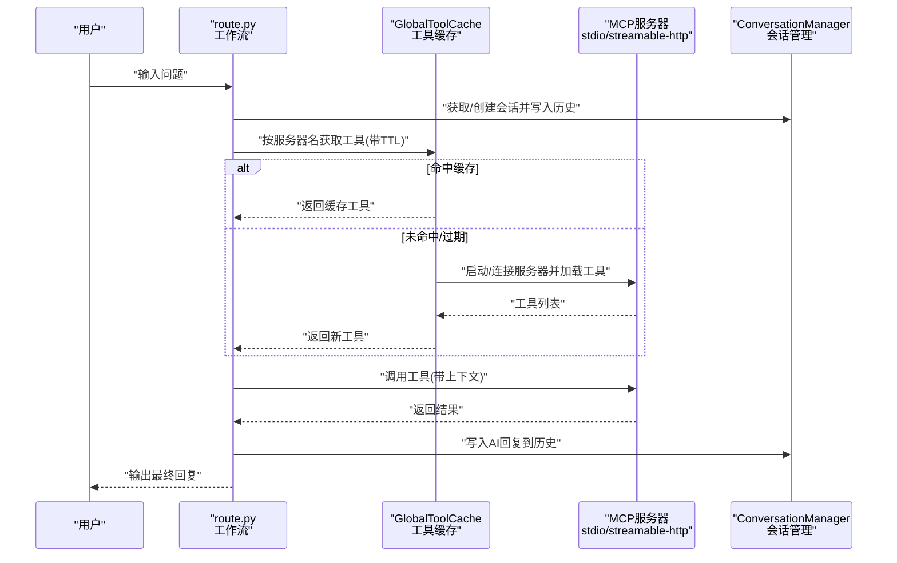
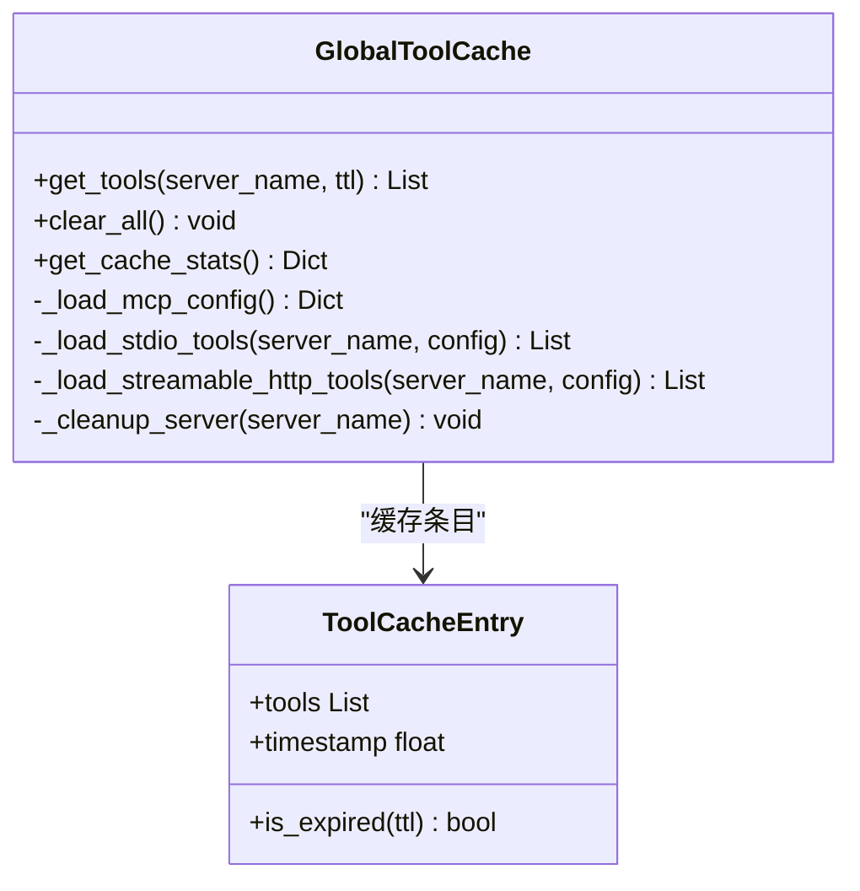
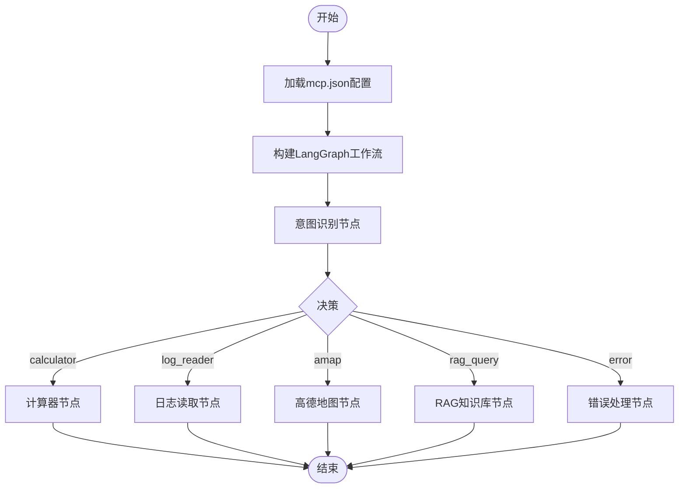
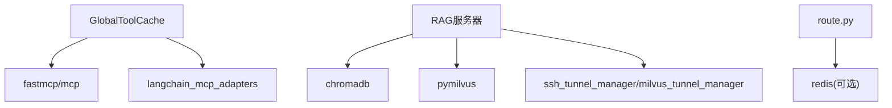

# MCP服务器配置

<cite>
**本文引用的文件**
- [mcp.json](file://Routing/mcp.json)
- [tool_cache.py](file://Routing/tool_cache.py)
- [route.py](file://Routing/route.py)
- [conversation_manager.py](file://Routing/conversation_manager.py)
- [ssh_tunnel_manager.py](file://Routing/ssh_tunnel_manager.py)
- [milvus_tunnel_manager.py](file://Routing/milvus_tunnel_manager.py)
- [calculator_server.py](file://Server/calculator_server.py)
- [logReader_server.py](file://Server/logReader_server.py)
- [rag_server.py](file://Server/rag_server.py)
- [init_rag.py](file://Server/init_rag.py)
- [requirements.txt](file://requirements.txt)
- [quickstart.py](file://quickstart.py)
- [demo_conversation.py](file://demo_conversation.py)
</cite>

## 目录
1. [简介](#简介)
2. [项目结构](#项目结构)
3. [核心组件](#核心组件)
4. [架构总览](#架构总览)
5. [详细组件分析](#详细组件分析)
6. [依赖分析](#依赖分析)
7. [性能考虑](#性能考虑)
8. [故障排查指南](#故障排查指南)
9. [结论](#结论)
10. [附录](#附录)

## 简介
本文件系统性阐述MCP服务器配置，围绕mcp.json配置文件展开，逐项解释服务器类型、传输协议、端口与认证方式等关键要素；并结合各MCP服务器（计算器、日志读取、RAG知识库）的实现细节，给出参数、连接超时、重试机制、环境变量、依赖与最佳实践。同时提供配置验证方法、常见错误排查技巧，以及热更新与动态配置管理的可行方案。

## 项目结构
该项目采用“路由+工具缓存+会话管理+多MCP服务器”的分层架构：
- 配置层：mcp.json集中定义各MCP服务器的传输方式与启动参数
- 缓存层：GlobalToolCache负责按服务器名缓存工具与会话，支持TTL与连接复用
- 路由层：LangGraph工作流根据用户输入路由到计算器、日志读取、高德地图或RAG代理
- 会话层：ConversationManager管理多轮对话历史与Redis持久化
- 服务器层：各Server目录下的MCP服务器以stdio或streamable-http形式提供工具

图表来源
- [mcp.json:1-29](file://Routing/mcp.json#L1-L29)
- [tool_cache.py:39-140](file://Routing/tool_cache.py#L39-L140)
- [route.py:258-291](file://Routing/route.py#L258-L291)
- [conversation_manager.py:82-121](file://Routing/conversation_manager.py#L82-L121)
- [calculator_server.py:108-111](file://Server/calculator_server.py#L108-L111)
- [logReader_server.py:148-151](file://Server/logReader_server.py#L148-L151)
- [rag_server.py:356-363](file://Server/rag_server.py#L356-L363)

章节来源
- [mcp.json:1-29](file://Routing/mcp.json#L1-L29)
- [tool_cache.py:39-140](file://Routing/tool_cache.py#L39-L140)
- [route.py:258-291](file://Routing/route.py#L258-L291)
- [conversation_manager.py:82-121](file://Routing/conversation_manager.py#L82-L121)

## 核心组件
- mcp.json：MCP服务器清单与传输配置的唯一事实来源
- GlobalToolCache：按服务器名缓存工具与会话，支持stdio与streamable-http两种传输
- route.py：LangGraph工作流，负责意图识别与路由，支持历史上下文
- ConversationManager：会话生命周期管理，支持内存与Redis持久化
- 各MCP服务器：以FastMCP框架实现，暴露工具函数并通过stdio或HTTP提供服务

章节来源
- [mcp.json:1-29](file://Routing/mcp.json#L1-L29)
- [tool_cache.py:39-140](file://Routing/tool_cache.py#L39-L140)
- [route.py:149-234](file://Routing/route.py#L149-L234)
- [conversation_manager.py:82-121](file://Routing/conversation_manager.py#L82-L121)

## 架构总览
下图展示了从用户输入到工具执行的完整链路，包括配置加载、工具缓存、会话管理与服务器调用。

图表来源
- [tool_cache.py:85-140](file://Routing/tool_cache.py#L85-L140)
- [tool_cache.py:141-243](file://Routing/tool_cache.py#L141-L243)
- [route.py:351-414](file://Routing/route.py#L351-L414)
- [conversation_manager.py:166-184](file://Routing/conversation_manager.py#L166-L184)

## 详细组件分析

### mcp.json配置详解
- 顶层键：mcpServers
  - 键名：服务器别名（如calculator、log-reader、rag-knowledge、amap-maps-streamableHTTP）
  - 值对象字段：
    - url：当transport为streamable-http时，HTTP端点URL（支持环境变量替换）
    - transport：传输协议，支持stdio与streamable-http
    - command/args：当transport为stdio时，启动命令与参数（支持相对路径解析与环境变量替换）

关键要点
- 服务器类型：本地进程（stdio）或远端HTTP（streamable-http）
- 传输协议：stdio用于本地Python进程；streamable-http用于远端HTTP服务
- 端口与认证：stdio无需端口；streamable-http通过URL与环境变量注入API密钥
- 路径解析：相对路径以Routing目录为基准进行规范化与存在性校验

章节来源
- [mcp.json:1-29](file://Routing/mcp.json#L1-L29)
- [tool_cache.py:141-164](file://Routing/tool_cache.py#L141-L164)
- [tool_cache.py:198-243](file://Routing/tool_cache.py#L198-L243)

### 工具缓存与连接管理（GlobalToolCache）
- 缓存策略
  - 以服务器名为键，缓存工具列表与会话句柄
  - 默认TTL为300秒，可通过get_tools传入覆盖
  - 过期后自动清理并重建连接
- 传输适配
  - stdio：MultiServerMCPClient + StdioServerParameters，支持命令与参数解析、路径规范化、环境变量替换
  - streamable-http：streamable_http_client + ClientSession，支持10秒连接超时
- 会话复用
  - 缓存ClientSession或Transport，避免重复握手
- 清理机制
  - clear_all：关闭所有会话并清空缓存
  - 过期清理：按TTL回收

图表来源
- [tool_cache.py:39-140](file://Routing/tool_cache.py#L39-L140)
- [tool_cache.py:141-243](file://Routing/tool_cache.py#L141-L243)
- [tool_cache.py:244-290](file://Routing/tool_cache.py#L244-L290)

章节来源
- [tool_cache.py:39-140](file://Routing/tool_cache.py#L39-L140)
- [tool_cache.py:141-243](file://Routing/tool_cache.py#L141-L243)
- [tool_cache.py:244-290](file://Routing/tool_cache.py#L244-L290)

### 路由与会话管理（route.py + conversation_manager.py）
- 路由工作流
  - 使用LangGraph构建StateGraph，节点包括意图识别、计算器、日志读取、高德地图、RAG知识库与错误处理
  - 意图识别通过LLM结构化输出（Route模型）判定下一步
  - 支持历史上下文拼接，增强多轮对话连贯性
- 会话管理
  - 支持内存与Redis双层持久化，自动清理过期会话
  - 提供创建、添加消息、获取历史、清理与统计接口
  - 与工具缓存配合，实现跨轮对话的工具复用

图表来源
- [route.py:258-291](file://Routing/route.py#L258-L291)
- [route.py:149-234](file://Routing/route.py#L149-L234)

章节来源
- [route.py:149-234](file://Routing/route.py#L149-L234)
- [route.py:258-291](file://Routing/route.py#L258-L291)
- [conversation_manager.py:82-121](file://Routing/conversation_manager.py#L82-L121)

### 各MCP服务器配置与参数

#### 计算器服务器（calculator_server.py）
- 传输：stdio
- 启动参数：command为python，args为../Server/calculator_server.py
- 工具函数：加法、减法、乘法、除法，含除零保护
- 运行入口：mcp.run(transport="stdio")

章节来源
- [mcp.json:7-13](file://Routing/mcp.json#L7-L13)
- [calculator_server.py:108-111](file://Server/calculator_server.py#L108-L111)

#### 日志读取服务器（logReader_server.py）
- 传输：stdio
- 启动参数：command为python，args为../Server/logReader_server.py
- 工具函数：读取最新日志、按关键词搜索、获取日志统计
- 日志路径：优先app.log或Logs.txt，位于logs目录

章节来源
- [mcp.json:14-20](file://Routing/mcp.json#L14-L20)
- [logReader_server.py:148-151](file://Server/logReader_server.py#L148-L151)

#### RAG知识库服务器（rag_server.py）
- 传输：stdio
- 启动参数：command为python，args为../Server/rag_server.py
- 工具函数：知识检索、切换后端、加载文档、获取索引统计
- 向量后端：默认ChromaDB（本地持久化），可切换Milvus（通过SSH隧道）
- 环境变量：DASHSCOPE_API_KEY、MILVUS_LOCAL_PORT、MILVUS_COLLECTION_NAME

章节来源
- [mcp.json:21-27](file://Routing/mcp.json#L21-L27)
- [rag_server.py:356-363](file://Server/rag_server.py#L356-L363)

#### 高德地图服务器（amap-maps-streamableHTTP）
- 传输：streamable-http
- URL模板：支持{AMAP_API_KEY}占位符，运行时由环境变量替换
- 适用场景：外部HTTP MCP服务

章节来源
- [mcp.json:3-6](file://Routing/mcp.json#L3-L6)

### 连接超时与重试机制
- streamable-http连接超时：10秒（硬编码在工具加载流程）
- stdio连接：无显式超时，受底层stdio启动与工具加载影响
- 重试建议：当前实现未内置重试逻辑，可在业务侧（如路由层）增加重试包装

章节来源
- [tool_cache.py:212-223](file://Routing/tool_cache.py#L212-L223)

### 环境变量与依赖
- 环境变量（示例）
  - DASHSCOPE_API_KEY：RAG嵌入模型与Milvus隧道
  - AMAP_API_KEY：高德地图HTTP服务
  - MILVUS_SSH_* / SSH_*：SSH隧道配置（用于Redis/Milvus）
  - LLM_*：LLM推理配置（用于路由意图识别）
- 依赖包：requirements.txt中包含fastmcp、langchain、chromadb、pymilvus、sshtunnel等

章节来源
- [rag_server.py:37-38](file://Server/rag_server.py#L37-L38)
- [milvus_tunnel_manager.py:42-48](file://Routing/milvus_tunnel_manager.py#L42-L48)
- [requirements.txt:1-17](file://requirements.txt#L1-L17)

### 配置示例与最佳实践

开发环境（本地）
- 使用stdio服务器（计算器、日志读取、RAG）
- 无需网络穿透，直接启动对应Python脚本
- 推荐：将mcp.json中的args改为绝对路径或确保相对路径正确

生产环境（远端HTTP）
- 使用streamable-http服务器（如高德地图）
- 在部署机上设置AMAP_API_KEY
- 对外暴露HTTP端点，内部通过NAT/反向代理访问

安全与稳定性
- 为RAG服务器设置DASHSCOPE_API_KEY
- Milvus后端需配置SSH隧道参数（MILVUS_SSH_*）
- 会话管理建议启用Redis持久化，提高多实例扩展能力

章节来源
- [mcp.json:1-29](file://Routing/mcp.json#L1-L29)
- [rag_server.py:37-38](file://Server/rag_server.py#L37-L38)
- [milvus_tunnel_manager.py:42-48](file://Routing/milvus_tunnel_manager.py#L42-L48)
- [route.py:298-347](file://Routing/route.py#L298-L347)

### 配置验证与常见错误排查
- 配置验证
  - JSON语法：确保mcp.json为合法JSON
  - 服务器存在性：GlobalToolCache按服务器名加载时若无配置将报错
  - 传输一致性：stdio必须提供command/args；streamable-http必须提供url
- 常见错误与排查
  - “未找到服务器配置”：检查mcp.json中服务器名是否与调用一致
  - “连接超时”：streamable-http默认10秒超时，检查网络与API密钥
  - “Milvus不可用”：确认pymilvus安装与SSH隧道参数正确
  - “日志文件不存在”：确认logs目录与文件名（app.log/Logs.txt）

章节来源
- [tool_cache.py:128-140](file://Routing/tool_cache.py#L128-L140)
- [tool_cache.py:212-223](file://Routing/tool_cache.py#L212-L223)
- [rag_server.py:31-33](file://Server/rag_server.py#L31-L33)
- [logReader_server.py:40-44](file://Server/logReader_server.py#L40-L44)

### 热更新与动态配置管理
- 现状：GlobalToolCache按TTL缓存，过期后自动重建；mcp.json在应用启动时一次性加载
- 热更新方案
  - 文件监控：监听mcp.json变更，触发重新加载与缓存失效
  - 动态切换：在路由层新增“刷新缓存”接口，按服务器名强制重建
  - 连接池：为streamable-http维护长连接池，减少频繁重建成本
- 建议：结合配置中心（如Consul/KV）与事件驱动，实现配置变更的灰度发布

章节来源
- [tool_cache.py:67-78](file://Routing/tool_cache.py#L67-L78)
- [tool_cache.py:109-116](file://Routing/tool_cache.py#L109-L116)

## 依赖分析
- 工具加载依赖：fastmcp、mcp、langchain_mcp_adapters
- 向量存储：chromadb（本地）、pymilvus（远程）
- SSH隧道：sshtunnel、paramiko
- 会话持久化：redis（可选）

图表来源
- [requirements.txt:1-17](file://requirements.txt#L1-L17)
- [tool_cache.py:18-25](file://Routing/tool_cache.py#L18-L25)
- [rag_server.py:10-16](file://Server/rag_server.py#L10-L16)
- [milvus_tunnel_manager.py:8-11](file://Routing/milvus_tunnel_manager.py#L8-L11)
- [route.py:330-346](file://Routing/route.py#L330-L346)

章节来源
- [requirements.txt:1-17](file://requirements.txt#L1-L17)
- [tool_cache.py:18-25](file://Routing/tool_cache.py#L18-L25)
- [rag_server.py:10-16](file://Server/rag_server.py#L10-L16)
- [milvus_tunnel_manager.py:8-11](file://Routing/milvus_tunnel_manager.py#L8-L11)
- [route.py:330-346](file://Routing/route.py#L330-L346)

## 性能考虑
- 工具缓存：避免重复加载与连接，显著降低延迟
- 会话复用：同一会话内工具无需重复加载
- 向量检索：Milvus后端具备更高吞吐，但需考虑SSH隧道开销
- 批量处理：RAG初始化与存储采用分批策略，避免API限流

## 故障排查指南
- 工具加载失败
  - 检查mcp.json中transport与参数是否匹配
  - 确认stdio命令与args可执行且路径正确
- HTTP连接失败
  - 校验AMAP_API_KEY是否设置
  - 检查网络连通性与超时阈值
- Milvus连接异常
  - 确认SSH隧道参数与密钥格式
  - 检查本地端口占用与远程端口映射
- 会话丢失
  - 若启用Redis，确认连接参数与网络可达

章节来源
- [tool_cache.py:198-243](file://Routing/tool_cache.py#L198-L243)
- [milvus_tunnel_manager.py:50-89](file://Routing/milvus_tunnel_manager.py#L50-L89)
- [route.py:298-347](file://Routing/route.py#L298-L347)

## 结论
mcp.json作为MCP服务器配置的核心，定义了服务器类型、传输协议与启动参数。通过GlobalToolCache的TTL缓存与连接复用、LangGraph的意图路由与历史上下文、以及会话管理的持久化能力，系统实现了高性能、可扩展的多Agent协作。生产部署建议采用streamable-http与Redis持久化，并完善SSH隧道与API密钥管理；同时可引入配置热更新与灰度发布机制，进一步提升运维效率与稳定性。

## 附录
- 快速启动与演示
  - quickstart.py：展示Agent创建与工具列表
  - demo_conversation.py：演示工具缓存与多轮对话
- RAG初始化
  - init_rag.py：扫描Data目录并建立向量索引，支持ChromaDB与Milvus

章节来源
- [quickstart.py:8-68](file://quickstart.py#L8-L68)
- [demo_conversation.py:19-102](file://demo_conversation.py#L19-L102)
- [init_rag.py:294-497](file://Server/init_rag.py#L294-L497)