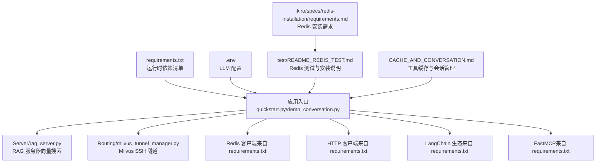
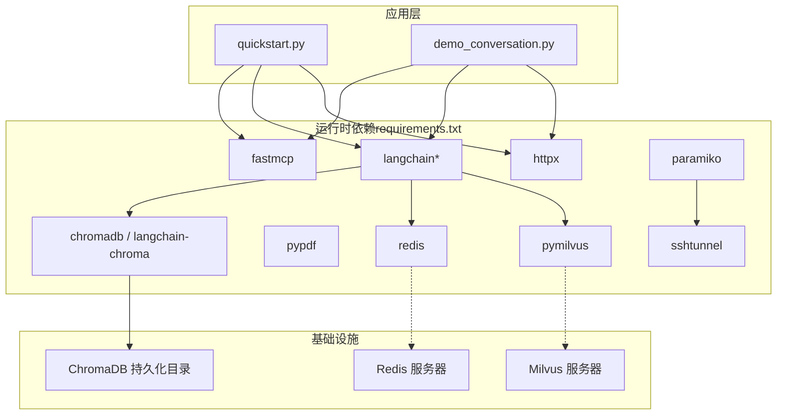
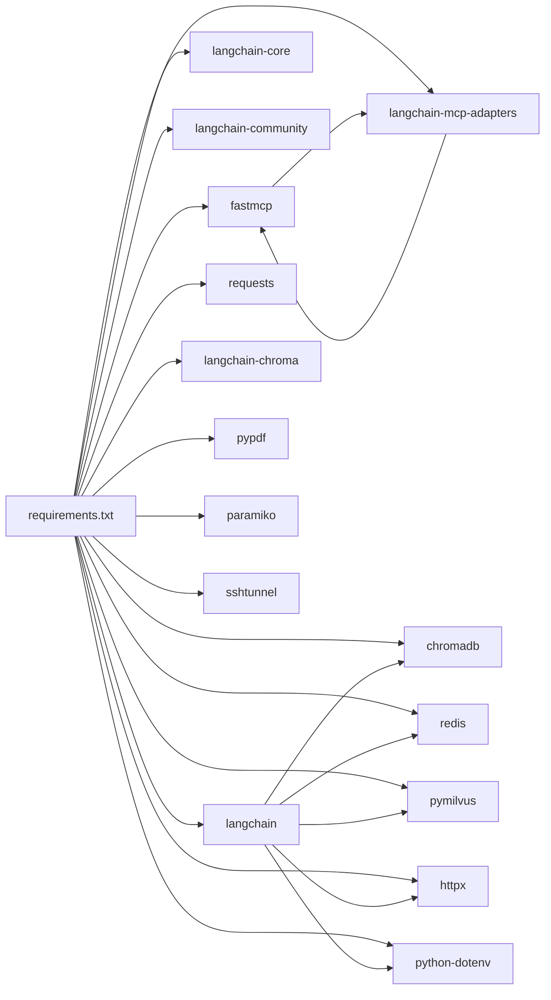

# 依赖配置

<cite>
**本文引用的文件**
- [requirements.txt](file://requirements.txt)
- [README.md](file://README.md)
- [LLM_CONFIG_GUIDE.md](file://LLM_CONFIG_GUIDE.md)
- [test/README_REDIS_TEST.md](file://test/README_REDIS_TEST.md)
- [CACHE_AND_CONVERSATION.md](file://CACHE_AND_CONVERSATION.md)
- [.kiro/specs/redis-installation/requirements.md](file://.kiro/specs/redis-installation/requirements.md)
- [quickstart.py](file://quickstart.py)
- [demo_conversation.py](file://demo_conversation.py)
- [Server/rag_server.py](file://Server/rag_server.py)
- [Routing/milvus_tunnel_manager.py](file://Routing/milvus_tunnel_manager.py)
</cite>

## 目录
1. [简介](#简介)
2. [项目结构](#项目结构)
3. [核心组件](#核心组件)
4. [架构总览](#架构总览)
5. [详细组件分析](#详细组件分析)
6. [依赖分析](#依赖分析)
7. [性能考量](#性能考量)
8. [故障排查指南](#故障排查指南)
9. [结论](#结论)
10. [附录](#附录)

## 简介
本文件面向项目依赖配置的全面说明，重点围绕 requirements.txt 中列出的依赖包进行逐项解析，涵盖版本要求、兼容性说明、安装注意事项，并结合项目 README、LLM 配置指南、Redis 测试说明与缓存对话文档，给出不同操作系统与 Python 环境下的安装与兼容性检查方法，同时提供依赖冲突排查、开发与运行时依赖区分、更新与版本升级最佳实践等实用建议。

## 项目结构
该项目围绕“基于 MCP 协议的智能代理系统”展开，依赖清单集中于 requirements.txt；运行时涉及 LLM 配置（.env）、Redis 会话持久化、向量数据库（ChromaDB/Milvus）与 SSH 隧道等基础设施。下图概览了与依赖相关的关键文件与模块关系。

图表来源
- [requirements.txt](file://requirements.txt)
- [quickstart.py](file://quickstart.py)
- [demo_conversation.py](file://demo_conversation.py)
- [test/README_REDIS_TEST.md](file://test/README_REDIS_TEST.md)
- [CACHE_AND_CONVERSATION.md](file://CACHE_AND_CONVERSATION.md)
- [Server/rag_server.py](file://Server/rag_server.py)
- [Routing/milvus_tunnel_manager.py](file://Routing/milvus_tunnel_manager.py)
- [.kiro/specs/redis-installation/requirements.md](file://.kiro/specs/redis-installation/requirements.md)

章节来源
- [README.md](file://README.md)
- [requirements.txt](file://requirements.txt)

## 核心组件
- 运行时依赖：由 requirements.txt 统一声明，涵盖 MCP 客户端与适配器、LangChain 生态、HTTP 客户端、向量数据库、Redis、SSH 隧道、PDF 处理等。
- 配置与环境：.env 文件承载 LLM API Key、基础 URL、模型名称与温度等；README 提及 Python 版本要求（>=3.9）。
- 基础设施：Redis 用于会话持久化；Milvus 通过 SSH 隧道连接；ChromaDB 作为向量搜索后端之一。
- 工具缓存与会话管理：通过全局缓存与会话管理器提升性能与用户体验。

章节来源
- [requirements.txt](file://requirements.txt)
- [README.md](file://README.md)
- [LLM_CONFIG_GUIDE.md](file://LLM_CONFIG_GUIDE.md)
- [test/README_REDIS_TEST.md](file://test/README_REDIS_TEST.md)
- [CACHE_AND_CONVERSATION.md](file://CACHE_AND_CONVERSATION.md)

## 架构总览
下图展示了依赖在系统中的作用与交互关系，强调运行时依赖与基础设施的关系。

图表来源
- [requirements.txt](file://requirements.txt)
- [quickstart.py](file://quickstart.py)
- [demo_conversation.py](file://demo_conversation.py)
- [Server/rag_server.py](file://Server/rag_server.py)
- [Routing/milvus_tunnel_manager.py](file://Routing/milvus_tunnel_manager.py)

## 详细组件分析

### 运行时依赖清单与版本要求
- fastmcp>=0.1.0：MCP 客户端框架，用于与 MCP 服务器交互。
- langchain>=0.3.0、langchain-community>=0.3.0、langchain-core>=0.3.0：LangChain 生态核心库，提供链式调用、工具加载、提示词模板等能力。
- langchain-mcp-adapters>=0.1.0：LangChain 与 MCP 的适配器，实现动态工具加载与路由。
- python-dotenv>=1.0.0：读取 .env 环境变量文件。
- requests>=2.31.0、httpx>=0.25.0：HTTP 客户端，前者用于传统 HTTP 请求，后者支持异步与更现代的 HTTP/2 等特性。
- chromadb>=0.4.0、langchain-chroma>=0.1.0：ChromaDB 向量数据库及其 LangChain 适配器。
- pypdf>=3.0.0：PDF 文档解析与提取。
- redis>=4.0.0：Redis 客户端，用于会话持久化与缓存。
- paramiko==3.4.0：SSH 客户端库，用于 Milvus/Redis 等远程服务的 SSH 隧道。
- sshtunnel>=0.4.0：SSH 隧道封装，简化本地端口转发。
- pymilvus>=2.4.0：Milvus 向量数据库客户端，配合 SSH 隧道访问远程 Milvus。

章节来源
- [requirements.txt](file://requirements.txt)

### Python 版本要求与兼容性
- Python 版本要求：>=3.9（来自 README 技术栈说明）。
- 兼容性建议：
  - 在 Windows/Linux/macOS 上均推荐使用 Python 3.9+。
  - 若使用较新的 Python 版本（如 3.12+），建议先在隔离的虚拟环境中安装依赖，观察是否存在第三方库的兼容性问题。
  - 对于 paramiko==3.4.0，若后续版本移除了某些旧接口，需参考 Redis 测试文档中的降级或适配建议。

章节来源
- [README.md](file://README.md)
- [test/README_REDIS_TEST.md](file://test/README_REDIS_TEST.md)

### 安装注意事项与系统依赖
- 虚拟环境：建议使用 venv 创建并激活虚拟环境，避免与系统 Python 环境冲突。
- 依赖安装：使用 pip 安装 requirements.txt 中的依赖。
- 环境变量：在 .env 中配置 LLM API Key、基础 URL、模型名称与温度等。
- Redis：用于会话持久化，支持本地安装、Docker 运行或通过 SSH 隧道连接远程 Redis。
- Milvus：通过 SSH 隧道访问远程 Milvus，注意密钥类型与隧道端口配置。
- ChromaDB：作为向量搜索后端之一，需要持久化目录（相对项目根目录）。

章节来源
- [README.md](file://README.md)
- [LLM_CONFIG_GUIDE.md](file://LLM_CONFIG_GUIDE.md)
- [test/README_REDIS_TEST.md](file://test/README_REDIS_TEST.md)
- [Server/rag_server.py](file://Server/rag_server.py)
- [Routing/milvus_tunnel_manager.py](file://Routing/milvus_tunnel_manager.py)

### 不同操作系统与 Python 环境下的安装指南
- Windows
  - 创建并激活虚拟环境，安装依赖。
  - Redis：可下载官方 Windows 版本，或使用 Docker。
  - Milvus：通过 SSH 隧道连接远程实例。
- Linux（Ubuntu/Debian）
  - 使用包管理器安装 Redis 服务器并启动。
  - Python 使用系统包管理器或 pyenv 安装指定版本。
- macOS
  - 使用 Homebrew 安装 Redis 并启动。
  - Python 使用 Homebrew 或 pyenv 安装指定版本。

章节来源
- [test/README_REDIS_TEST.md](file://test/README_REDIS_TEST.md)
- [.kiro/specs/redis-installation/requirements.md](file://.kiro/specs/redis-installation/requirements.md)

### 兼容性检查方法
- Python 版本检查：在虚拟环境中运行 Python -c "import sys; print(sys.version)"。
- 依赖完整性：pip list | grep -E "(fastmcp|langchain|httpx|chromadb|redis|pymilvus|paramiko|sshtunnel|pypdf)"。
- LLM 配置验证：运行 LLM 配置指南中的快速测试命令，确认模型配置生效。
- Redis 连接验证：使用 redis-cli ping 或 Python 客户端测试连接。
- Milvus 连接验证：通过 SSH 隧道建立后，尝试连接本地端口并执行简单查询。

章节来源
- [LLM_CONFIG_GUIDE.md](file://LLM_CONFIG_GUIDE.md)
- [test/README_REDIS_TEST.md](file://test/README_REDIS_TEST.md)
- [Routing/milvus_tunnel_manager.py](file://Routing/milvus_tunnel_manager.py)

### 依赖冲突排查与解决策略
- 版本冲突
  - 现象：pip 安装时报错，提示依赖版本不兼容。
  - 排查：使用 pipdeptree 查看依赖树，定位冲突来源。
  - 解决：降低或提升相关包版本，或使用 pip install -U --force-reinstall 强制重装。
- paramiko 密钥类型问题
  - 现象：出现 module 'paramiko' has no attribute 'DSSKey'。
  - 排查：确认 paramiko 版本与密钥类型匹配。
  - 解决：按 Redis 测试文档建议降级至 3.4.0，或更新密钥加载逻辑以兼容新版本。
- httpx 与 requests 兼容
  - 建议：在同一项目中优先使用 httpx，避免同时引入两个 HTTP 客户端导致的上下文混淆。
- LangChain 生态一致性
  - 建议：langchain、langchain-community、langchain-core 保持相同主版本，避免 API 变更导致的导入或行为差异。

章节来源
- [test/README_REDIS_TEST.md](file://test/README_REDIS_TEST.md)
- [requirements.txt](file://requirements.txt)

### 开发依赖与运行时依赖的区别与管理
- 运行时依赖：requirements.txt 中列出的所有包，用于应用运行期。
- 开发依赖：本仓库未提供独立的开发依赖清单文件，建议在团队协作中明确区分：
  - 开发工具：pytest、black、flake8、pre-commit 等。
  - 文档与规范：markdownlint、reStructuredText 工具等。
- 管理方法：
  - 使用 requirements-dev.txt 或 pyproject.toml 的 [project.optional-dependencies] 管理开发依赖。
  - 在 CI/CD 中分别安装运行时与开发依赖，确保测试与构建环境隔离。

（本节为通用实践建议，不直接分析具体文件）

### 依赖更新与版本升级最佳实践
- 逐步升级：先升级次要版本，再升级主版本，每次升级后运行完整测试。
- 回滚策略：保留上一个版本的 requirements.txt，以便快速回滚。
- 兼容性验证：在隔离环境中验证升级后的功能，特别是 LangChain 与 MCP 适配器的兼容性。
- 锁定关键版本：对易变库（如 httpx、paramiko）采用锁定策略，避免意外破坏。
- 自动化检查：在 CI 中加入依赖扫描与兼容性检查步骤。

（本节为通用实践建议，不直接分析具体文件）

## 依赖分析
下图展示依赖之间的耦合关系与使用场景。

图表来源
- [requirements.txt](file://requirements.txt)

章节来源
- [requirements.txt](file://requirements.txt)

## 性能考量
- 工具缓存：通过全局工具缓存避免重复加载 MCP 工具，显著降低延迟。
- 会话管理：限制历史消息数量与会话超时，防止内存膨胀。
- 向量搜索后端：ChromaDB 与 Milvus 的选择与配置影响检索性能与稳定性。
- HTTP 客户端：httpx 支持异步与连接池，有助于提升并发性能。

章节来源
- [CACHE_AND_CONVERSATION.md](file://CACHE_AND_CONVERSATION.md)
- [Server/rag_server.py](file://Server/rag_server.py)

## 故障排查指南
- Redis 连接失败
  - 检查 Redis 服务是否运行、端口是否正确、防火墙是否阻断。
  - 使用 redis-cli ping 或 Python 客户端进行验证。
- Milvus 连接失败
  - 检查 SSH 隧道是否建立成功，密钥类型是否被 paramiko 支持。
  - 确认本地端口与远程端口映射正确。
- paramiko 密钥问题
  - 降级至 3.4.0 或更新密钥加载逻辑以兼容新版本。
- LLM 配置无效
  - 确认 .env 文件中 API Key 与 BASE_URL 匹配，修改后需重启进程生效。
- 向量搜索异常
  - 检查 ChromaDB 持久化目录是否存在与可写，确认 Milvus 连接参数与集合存在。

章节来源
- [test/README_REDIS_TEST.md](file://test/README_REDIS_TEST.md)
- [Routing/milvus_tunnel_manager.py](file://Routing/milvus_tunnel_manager.py)
- [LLM_CONFIG_GUIDE.md](file://LLM_CONFIG_GUIDE.md)
- [Server/rag_server.py](file://Server/rag_server.py)

## 结论
本项目的依赖配置以 MCP 为核心，围绕 LangChain 生态、HTTP 客户端、向量数据库、Redis 与 Milvus 等基础设施构建。通过明确的版本要求、兼容性检查与故障排查策略，可在不同操作系统与 Python 环境下稳定运行。建议在团队协作中进一步完善开发依赖管理与自动化验证流程，确保长期可维护性与可扩展性。

## 附录
- 快速启动与演示脚本可用于验证依赖安装与功能运行。
- Redis 与 Milvus 的安装与连接说明可作为部署阶段的参考。

章节来源
- [quickstart.py](file://quickstart.py)
- [demo_conversation.py](file://demo_conversation.py)
- [test/README_REDIS_TEST.md](file://test/README_REDIS_TEST.md)
- [.kiro/specs/redis-installation/requirements.md](file://.kiro/specs/redis-installation/requirements.md)