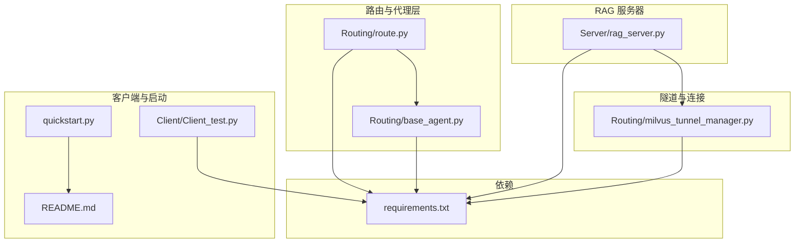
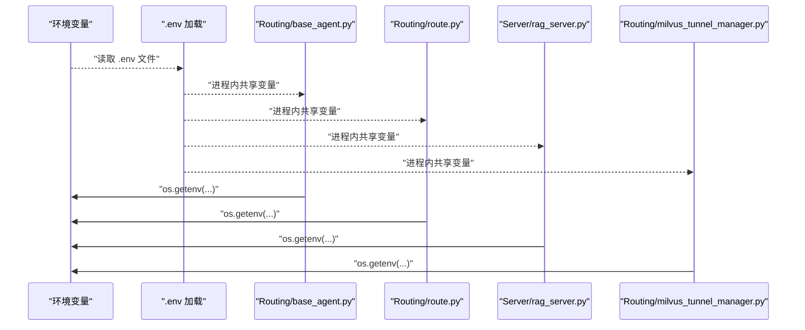
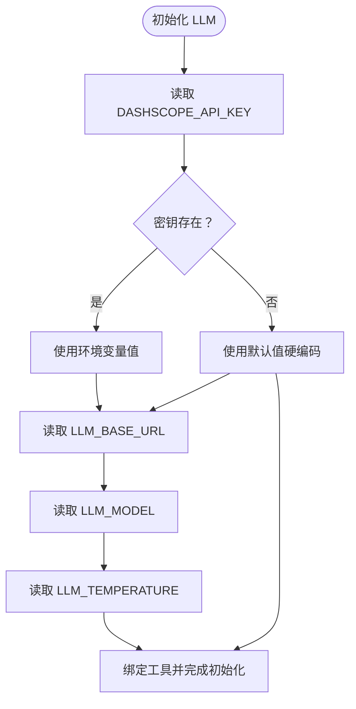
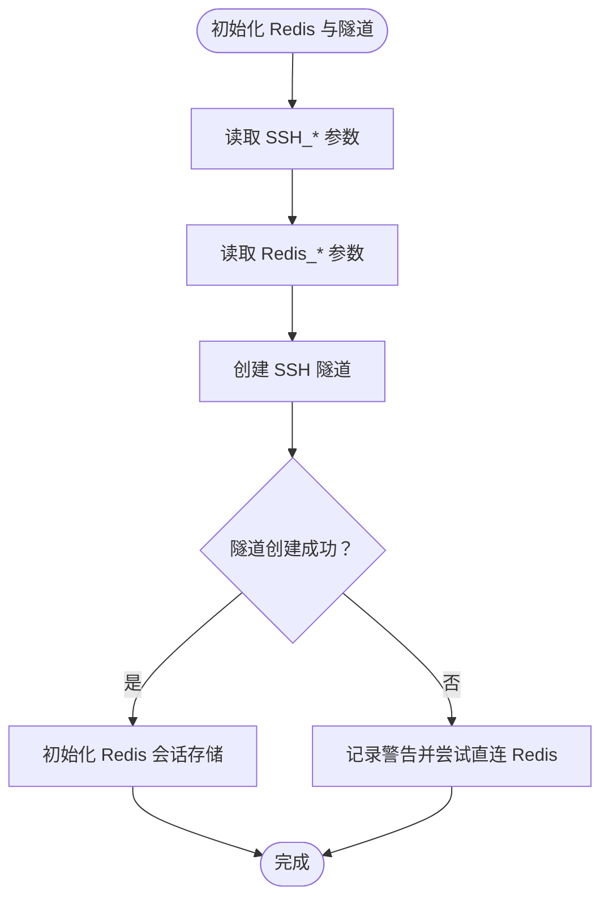
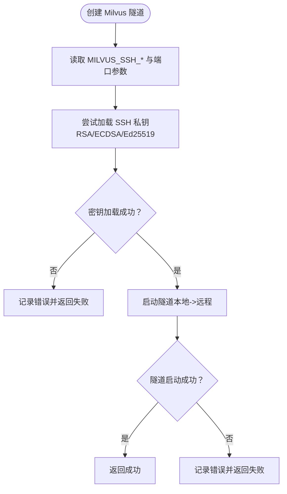
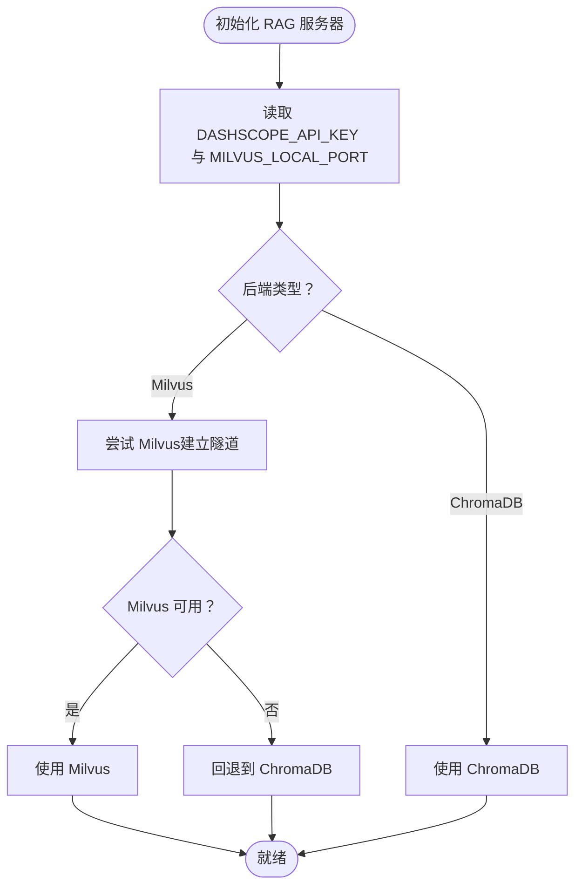
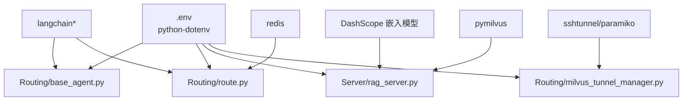

# 环境变量配置

<cite>
**本文引用的文件**
- [README.md](file://README.md)
- [requirements.txt](file://requirements.txt)
- [quickstart.py](file://quickstart.py)
- [Routing/base_agent.py](file://Routing/base_agent.py)
- [Routing/route.py](file://Routing/route.py)
- [Routing/milvus_tunnel_manager.py](file://Routing/milvus_tunnel_manager.py)
- [Server/rag_server.py](file://Server/rag_server.py)
- [Client/Client_test.py](file://Client/Client_test.py)
</cite>

## 目录
1. [简介](#简介)
2. [项目结构](#项目结构)
3. [核心组件](#核心组件)
4. [架构总览](#架构总览)
5. [详细组件分析](#详细组件分析)
6. [依赖分析](#依赖分析)
7. [性能考虑](#性能考虑)
8. [故障排查指南](#故障排查指南)
9. [结论](#结论)
10. [附录](#附录)

## 简介
本指南围绕本项目中的环境变量配置进行全面说明，涵盖以下方面：
- 已使用的环境变量清单与用途
- 优先级与作用域（进程内、模块内、默认值）
- 安全存储策略与最小暴露原则
- 不同部署环境（开发、测试、生产）的配置模板与最佳实践
- 验证方法与错误处理机制
- 加密存储与安全管理建议
- 自动化脚本与工具推荐

## 项目结构
项目采用模块化组织，环境变量主要在以下模块被集中读取与使用：
- 路由与代理层：Routing/route.py、Routing/base_agent.py
- RAG 服务器：Server/rag_server.py
- Milvus SSH 隧道：Routing/milvus_tunnel_manager.py
- 客户端测试：Client/Client_test.py
- 快速启动与说明：quickstart.py、README.md
- 依赖声明：requirements.txt

图表来源
- [Routing/route.py:26-28](file://Routing/route.py#L26-L28)
- [Routing/base_agent.py:72-85](file://Routing/base_agent.py#L72-L85)
- [Server/rag_server.py:34-35](file://Server/rag_server.py#L34-L35)
- [Routing/milvus_tunnel_manager.py:42-48](file://Routing/milvus_tunnel_manager.py#L42-L48)
- [Client/Client_test.py:218-222](file://Client/Client_test.py#L218-L222)
- [quickstart.py:60-68](file://quickstart.py#L60-L68)
- [README.md:64-78](file://README.md#L64-L78)
- [requirements.txt:1-17](file://requirements.txt#L1-L17)

章节来源
- [README.md:1-125](file://README.md#L1-L125)
- [requirements.txt:1-17](file://requirements.txt#L1-L17)

## 核心组件
本节梳理项目中涉及的环境变量及其作用范围与默认值。

- LLM 与 DashScope 相关
  - DASHSCOPE_API_KEY：DashScope API 密钥，用于 LLM 访问
  - LLM_BASE_URL：LLM 基础 URL，默认值来自环境变量或硬编码默认值
  - LLM_MODEL：模型名称，默认值来自环境变量或硬编码默认值
  - LLM_TEMPERATURE：采样温度，默认值来自环境变量或硬编码默认值

- SSH 隧道与远程服务
  - SSH_HOST、SSH_PORT、SSH_USER、SSH_KEY_PATH：通用 SSH 连接参数
  - MILVUS_SSH_HOST、MILVUS_SSH_PORT、MILVUS_SSH_USER、MILVUS_SSH_KEY_PATH：Milvus 专用 SSH 参数，若未设置则回退到通用 SSH 参数
  - MILVUS_REMOTE_PORT、MILVUS_LOCAL_PORT：Milvus 远端与本地转发端口
  - REDIS_HOST、REDIS_PORT、REDIS_PASSWORD、REDIS_SESSION_TTL：Redis 连接与会话 TTL

- RAG 与向量库
  - MILVUS_LOCAL_PORT：RAG 服务器中 Milvus 本地端口（默认值来自环境变量或硬编码默认值）
  - DASHSCOPE_API_KEY：嵌入模型初始化所需

- 工具缓存与 MCP
  - mcp.json：工具与服务器配置文件（非环境变量，但与工具加载相关）

章节来源
- [Routing/base_agent.py:72-85](file://Routing/base_agent.py#L72-L85)
- [Routing/route.py:30-35](file://Routing/route.py#L30-L35)
- [Routing/route.py:302-313](file://Routing/route.py#L302-L313)
- [Routing/milvus_tunnel_manager.py:42-48](file://Routing/milvus_tunnel_manager.py#L42-L48)
- [Server/rag_server.py:37-38](file://Server/rag_server.py#L37-L38)
- [Routing/route.py:545-549](file://Routing/route.py#L545-L549)

## 架构总览
下图展示环境变量在系统中的读取与使用路径，体现“模块内读取、默认值回退、进程内共享”的特点。

图表来源
- [Routing/base_agent.py:72-85](file://Routing/base_agent.py#L72-L85)
- [Routing/route.py:26-28](file://Routing/route.py#L26-L28)
- [Routing/route.py:30-35](file://Routing/route.py#L30-L35)
- [Server/rag_server.py:34-35](file://Server/rag_server.py#L34-L35)
- [Routing/milvus_tunnel_manager.py:42-48](file://Routing/milvus_tunnel_manager.py#L42-L48)

## 详细组件分析

### LLM 与 DashScope 配置
- 读取顺序与默认值
  - 从进程环境读取 DASHSCOPE_API_KEY
  - LLM_BASE_URL、LLM_MODEL、LLM_TEMPERATURE 从环境变量读取，缺失时使用硬编码默认值
- 作用域
  - 仅在初始化 LLM 时使用，影响后续工具绑定与调用
- 安全建议
  - 仅在必要范围内暴露密钥；避免在日志或错误堆栈中打印密钥
  - 使用只读权限的 .env 文件与最小权限账户

图表来源
- [Routing/base_agent.py:72-85](file://Routing/base_agent.py#L72-L85)

章节来源
- [Routing/base_agent.py:72-85](file://Routing/base_agent.py#L72-L85)

### 路由与会话管理中的环境变量
- 读取与默认值
  - SSH 连接参数：SSH_HOST、SSH_PORT、SSH_USER、SSH_KEY_PATH
  - Redis 连接参数：REDIS_HOST、REDIS_PORT、REDIS_PASSWORD、REDIS_SESSION_TTL
  - 若 SSH_* 未设置，回退到通用默认值
- 作用域
  - 用于创建 SSH 隧道与初始化 Redis 会话存储
- 错误处理
  - 隧道创建失败时记录警告并尝试直连 Redis
  - Redis 初始化失败时回退到内存模式

图表来源
- [Routing/route.py:298-347](file://Routing/route.py#L298-L347)

章节来源
- [Routing/route.py:298-347](file://Routing/route.py#L298-L347)

### Milvus SSH 隧道管理
- 读取与默认值
  - MILVUS_SSH_* 优先使用 Milvus 专用参数；若未设置则回退到通用 SSH_* 参数
  - MILVUS_REMOTE_PORT、MILVUS_LOCAL_PORT 提供默认值
- 作用域
  - 用于建立本地到远程 Milvus 的安全隧道
- 错误处理
  - 密钥格式识别失败、文件不存在、隧道启动异常均会被捕获并返回失败

图表来源
- [Routing/milvus_tunnel_manager.py:42-89](file://Routing/milvus_tunnel_manager.py#L42-L89)

章节来源
- [Routing/milvus_tunnel_manager.py:42-89](file://Routing/milvus_tunnel_manager.py#L42-L89)

### RAG 服务器中的环境变量
- 读取与默认值
  - DASHSCOPE_API_KEY：用于嵌入模型初始化
  - MILVUS_LOCAL_PORT：默认值来自环境变量或硬编码默认值
- 作用域
  - 用于选择 Milvus 或 ChromaDB 作为向量存储后端，并在 Milvus 模式下建立隧道
- 错误处理
  - Milvus 不可用时回退到 ChromaDB 并记录提示

图表来源
- [Server/rag_server.py:34-38](file://Server/rag_server.py#L34-L38)
- [Server/rag_server.py:161-190](file://Server/rag_server.py#L161-L190)

章节来源
- [Server/rag_server.py:34-38](file://Server/rag_server.py#L34-L38)
- [Server/rag_server.py:161-190](file://Server/rag_server.py#L161-L190)

### 客户端测试与启动流程中的环境变量
- 客户端测试
  - 在测试入口显式加载 .env 并执行测试
- 快速启动
  - 启动脚本中包含对 .env 中 API Keys 的依赖提示

章节来源
- [Client/Client_test.py:218-222](file://Client/Client_test.py#L218-L222)
- [quickstart.py:60-68](file://quickstart.py#L60-L68)

## 依赖分析
- 环境变量加载依赖
  - python-dotenv：用于从 .env 文件加载环境变量
- LLM 与嵌入模型
  - langchain、langchain-community、langchain-core：LLM 与工具绑定
  - DashScope 嵌入模型：text-embedding-v3
- 连接与隧道
  - redis：会话存储
  - sshtunnel、paramiko：SSH 隧道与密钥加载
  - pymilvus：Milvus 连接（可选）

图表来源
- [requirements.txt:1-17](file://requirements.txt#L1-L17)
- [Routing/base_agent.py:72-85](file://Routing/base_agent.py#L72-L85)
- [Routing/route.py:26-28](file://Routing/route.py#L26-L28)
- [Server/rag_server.py:34-35](file://Server/rag_server.py#L34-L35)
- [Routing/milvus_tunnel_manager.py:42-48](file://Routing/milvus_tunnel_manager.py#L42-L48)

章节来源
- [requirements.txt:1-17](file://requirements.txt#L1-L17)

## 性能考虑
- 环境变量读取成本极低，通常可忽略
- 隧道与 Redis 连接的建立可能带来额外开销，建议在应用启动阶段一次性初始化并复用
- 在 Milvus 后端下，首次连接建立隧道与集合加载可能较慢，应避免频繁重建隧道

## 故障排查指南
- 常见问题与定位
  - LLM 初始化失败：检查 DASHSCOPE_API_KEY 是否正确设置；确认 LLM_BASE_URL、LLM_MODEL、LLM_TEMPERATURE 的默认值是否符合预期
  - SSH 隧道失败：检查 SSH_HOST、SSH_PORT、SSH_USER、SSH_KEY_PATH；确认密钥格式与权限；查看隧道日志
  - Redis 初始化失败：检查 REDIS_HOST、REDIS_PORT、REDIS_PASSWORD；确认网络可达性与权限
  - Milvus 不可用：确认 pymilvus 是否安装；查看回退逻辑是否生效
- 建议的日志与验证
  - 在关键初始化处打印环境变量读取结果（仅在调试模式）
  - 对密钥与敏感参数进行最小化暴露，避免在日志中输出

章节来源
- [Routing/route.py:326-327](file://Routing/route.py#L326-L327)
- [Routing/milvus_tunnel_manager.py:84-89](file://Routing/milvus_tunnel_manager.py#L84-L89)
- [Server/rag_server.py:31-33](file://Server/rag_server.py#L31-L33)

## 结论
本项目通过统一的环境变量读取与默认值回退机制，实现了跨模块的一致配置。建议在实际部署中：
- 使用 .env 文件集中管理敏感信息，并严格控制其权限
- 在 CI/CD 中通过受控渠道注入环境变量，避免明文泄露
- 对 SSH 密钥与数据库凭据实施最小权限与定期轮换策略
- 在生产环境中启用密钥管理服务（如 KMS），并在应用侧以只读方式访问

## 附录

### 环境变量清单与默认值
- LLM 与 DashScope
  - DASHSCOPE_API_KEY：必填（用于 LLM 与嵌入模型）
  - LLM_BASE_URL：可选（默认值来自硬编码）
  - LLM_MODEL：可选（默认值来自硬编码）
  - LLM_TEMPERATURE：可选（默认值来自硬编码）

- SSH 与 Redis
  - SSH_HOST、SSH_PORT、SSH_USER、SSH_KEY_PATH：可选（通用 SSH 参数）
  - MILVUS_SSH_HOST、MILVUS_SSH_PORT、MILVUS_SSH_USER、MILVUS_SSH_KEY_PATH：可选（优先于通用 SSH 参数）
  - MILVUS_REMOTE_PORT、MILVUS_LOCAL_PORT：可选（默认值来自硬编码）
  - REDIS_HOST、REDIS_PORT、REDIS_PASSWORD、REDIS_SESSION_TTL：可选（默认值来自硬编码）

- RAG 与向量库
  - MILVUS_LOCAL_PORT：可选（默认值来自硬编码）
  - DASHSCOPE_API_KEY：必填（嵌入模型初始化）

章节来源
- [Routing/base_agent.py:72-85](file://Routing/base_agent.py#L72-L85)
- [Routing/route.py:30-35](file://Routing/route.py#L30-L35)
- [Routing/route.py:302-313](file://Routing/route.py#L302-L313)
- [Routing/milvus_tunnel_manager.py:42-48](file://Routing/milvus_tunnel_manager.py#L42-L48)
- [Server/rag_server.py:37-38](file://Server/rag_server.py#L37-L38)

### 不同部署环境的配置模板与最佳实践
- 开发环境
  - 使用本地 Redis 与本地向量库（ChromaDB）
  - SSH 隧道可禁用或指向本地模拟服务
  - .env 中仅包含必要的最小密钥
- 测试环境
  - 使用独立的测试 Redis 与 Milvus 实例
  - 通过 CI 注入环境变量，避免提交到仓库
- 生产环境
  - 使用密钥管理服务（KMS）与只读凭据
  - 严格限制 .env 文件权限（仅应用运行用户可读）
  - 启用健康检查与失败回退策略（如 Milvus 不可用时回退到 ChromaDB）

### 验证方法与错误处理机制
- 验证方法
  - 在启动阶段打印关键环境变量读取结果（调试模式）
  - 对 LLM 初始化、SSH 隧道与 Redis 连接进行单元测试
- 错误处理
  - 隧道与 Redis 初始化失败时记录警告并回退到安全模式
  - Milvus 不可用时回退到 ChromaDB 并提示

### 加密存储与安全管理
- 建议
  - 使用密钥管理服务（如 AWS Secrets Manager、Azure Key Vault、GCP Secret Manager）
  - 应用侧以只读方式访问密钥，避免写入磁盘
  - 定期轮换密钥并审计访问日志

### 自动化脚本与工具推荐
- 自动化脚本
  - 启动脚本：在启动前加载 .env 并校验关键变量
  - 部署脚本：在 CI/CD 中注入环境变量并验证
- 工具推荐
  - python-dotenv：加载 .env 文件
  - sshtunnel/paramiko：SSH 隧道与密钥管理
  - redis：会话存储
  - pymilvus：Milvus 连接（可选）

章节来源
- [requirements.txt:1-17](file://requirements.txt#L1-L17)
- [README.md:64-78](file://README.md#L64-L78)