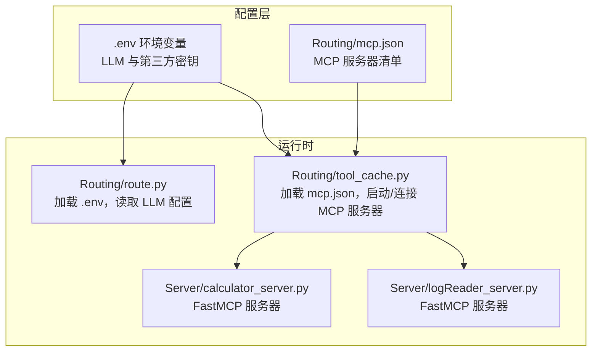
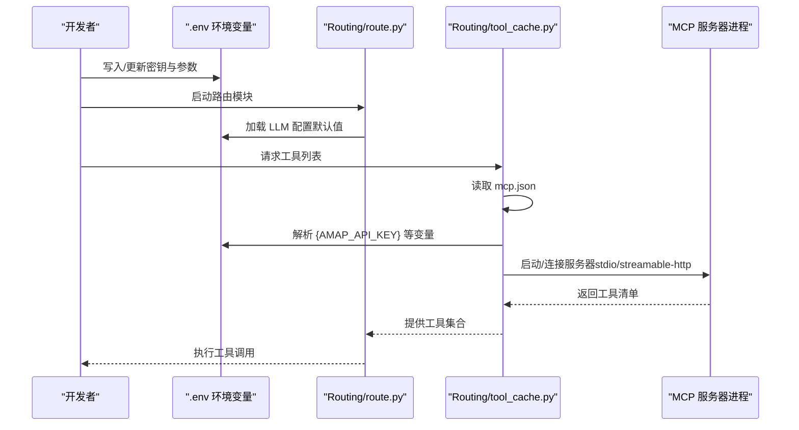
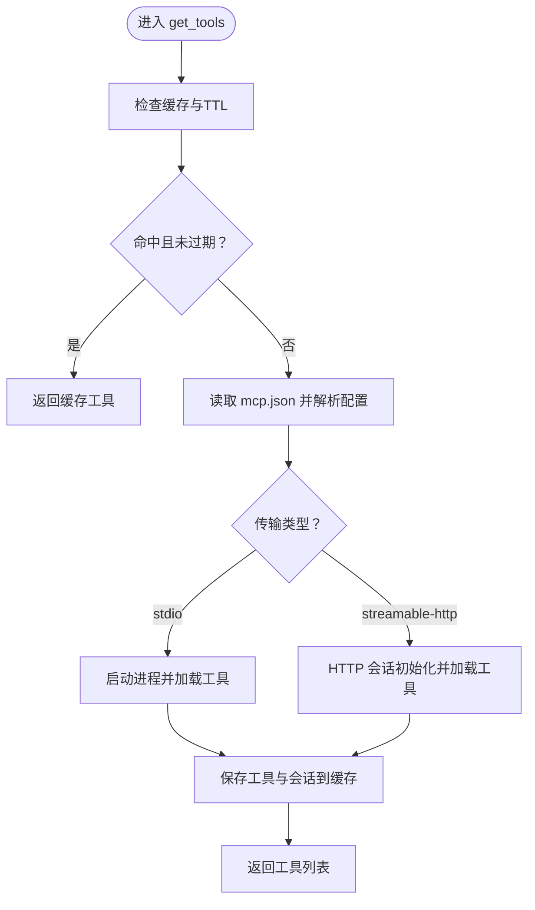
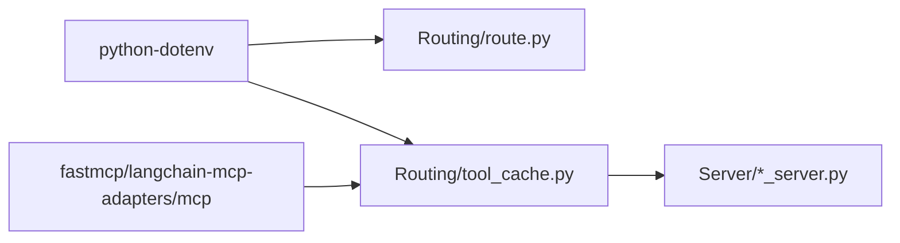

# 配置管理

<cite>
**本文引用的文件**
- [mcp.json](file://Routing/mcp.json)
- [tool_cache.py](file://Routing/tool_cache.py)
- [route.py](file://Routing/route.py)
- [calculator_server.py](file://Server/calculator_server.py)
- [logReader_server.py](file://Server/logReader_server.py)
- [LLM_CONFIG_GUIDE.md](file://LLM_CONFIG_GUIDE.md)
- [README.md](file://README.md)
- [requirements.txt](file://requirements.txt)
- [quickstart.py](file://quickstart.py)
- [test_output.txt](file://test_output.txt)
- [README_REDIS_TEST.md](file://test/README_REDIS_TEST.md)
</cite>

## 目录
1. [简介](#简介)
2. [项目结构](#项目结构)
3. [核心组件](#核心组件)
4. [架构总览](#架构总览)
5. [详细组件分析](#详细组件分析)
6. [依赖分析](#依赖分析)
7. [性能考量](#性能考量)
8. [故障排查指南](#故障排查指南)
9. [结论](#结论)
10. [附录](#附录)

## 简介
本指南面向开发者与运维人员，系统梳理 AiOps 项目的配置管理实践，重点覆盖以下方面：
- 配置文件结构与配置项含义：包括 mcp.json 的服务器配置、.env 的环境变量配置与加载机制
- 配置优先级、继承关系与覆盖规则：结合代码中的加载顺序与默认值策略
- 完整配置模板与示例：覆盖开发、测试与生产环境
- 配置验证方法与常见错误排查
- 安全考虑：敏感信息保护与环境隔离
- 配置热更新与动态配置的可行方案与限制
- 帮助开发者正确理解与管理项目的各类配置

## 项目结构
项目采用“模块化 + 配置驱动”的组织方式：
- 配置集中于根目录与子模块内：
  - mcp.json：MCP 服务器清单与传输协议配置
  - .env：LLM 与第三方服务的密钥与基础参数（由 python-dotenv 加载）
- 代码层按功能拆分：
  - Routing：路由与工具缓存（加载 mcp.json 并按需启动/连接 MCP 服务器）
  - Server：各 MCP 服务器实现（计算器、日志读取、RAG 等）
  - 文档与测试：配置指南、测试说明与日志输出

**图表来源**
- [mcp.json:1-29](file://Routing/mcp.json#L1-L29)
- [tool_cache.py:67-83](file://Routing/tool_cache.py#L67-L83)
- [route.py:26-38](file://Routing/route.py#L26-L38)
- [calculator_server.py:108-111](file://Server/calculator_server.py#L108-L111)
- [logReader_server.py:148-151](file://Server/logReader_server.py#L148-L151)

**章节来源**
- [README.md:1-125](file://README.md#L1-L125)
- [requirements.txt:1-17](file://requirements.txt#L1-L17)

## 核心组件
- 环境变量与 LLM 配置
  - .env 文件集中管理 LLM 与第三方 API 的密钥与基础参数
  - 代码通过 python-dotenv 加载 .env，并在运行时读取默认值
- MCP 服务器配置
  - mcp.json 描述服务器清单、传输协议与启动参数
  - 工具缓存模块负责加载配置、解析环境变量、启动或连接服务器，并缓存工具列表
- 服务器实现
  - 各自独立的 MCP 服务器以 stdio 方式运行，可被路由模块统一发现与调用

**章节来源**
- [LLM_CONFIG_GUIDE.md:1-92](file://LLM_CONFIG_GUIDE.md#L1-L92)
- [route.py:26-38](file://Routing/route.py#L26-L38)
- [tool_cache.py:67-83](file://Routing/tool_cache.py#L67-L83)
- [mcp.json:1-29](file://Routing/mcp.json#L1-L29)

## 架构总览
下图展示配置在系统中的流向与作用范围。

**图表来源**
- [route.py:26-38](file://Routing/route.py#L26-L38)
- [tool_cache.py:141-196](file://Routing/tool_cache.py#L141-L196)
- [mcp.json:1-29](file://Routing/mcp.json#L1-L29)

## 详细组件分析

### mcp.json 配置详解
- 作用：定义 MCP 服务器清单，包括服务器名称、传输协议与启动参数
- 关键字段
  - mcpServers：服务器对象集合
    - url：当 transport 为 streamable-http 时，用于 HTTP 连接
    - command/args：当 transport 为 stdio 时，用于启动本地进程
    - transport：stdio 或 streamable-http
- 环境变量替换
  - 若 url 或 args 中包含占位符，将在运行时替换为对应环境变量值
- 默认值与容错
  - 代码对缺失配置与 JSON 格式错误进行显式处理

**章节来源**
- [mcp.json:1-29](file://Routing/mcp.json#L1-L29)
- [tool_cache.py:67-83](file://Routing/tool_cache.py#L67-L83)
- [tool_cache.py:141-196](file://Routing/tool_cache.py#L141-L196)
- [tool_cache.py:198-242](file://Routing/tool_cache.py#L198-L242)

### 环境变量与 LLM 配置
- 配置来源
  - .env 文件集中管理 LLM 与第三方 API 的密钥与基础参数
  - 代码通过 python-dotenv 加载 .env，并在运行时读取默认值
- 关键项
  - LLM_BASE_URL：LLM API 基础地址
  - LLM_MODEL：模型名称
  - LLM_TEMPERATURE：采样温度（0-1）
  - DASHSCOPE_API_KEY：DashScope API 密钥
  - AMAP_API_KEY：高德地图 API 密钥
- 默认值与覆盖
  - 代码中对 LLM_* 项提供了默认值；若 .env 未设置，则使用默认值
  - 其他项（如 API Key）未设置时，将触发错误或导致连接失败

**章节来源**
- [LLM_CONFIG_GUIDE.md:1-92](file://LLM_CONFIG_GUIDE.md#L1-L92)
- [route.py:26-38](file://Routing/route.py#L26-L38)

### 工具缓存与配置加载流程
- 加载顺序
  - 读取 mcp.json
  - 解析 transport 与参数
  - 解析环境变量（如 {AMAP_API_KEY}）
  - 启动/连接服务器并加载工具
  - 缓存工具列表与会话，支持 TTL 过期
- 关键行为
  - 支持 stdio 与 streamable-http 两种传输协议
  - 对 HTTP 连接设置超时保护
  - 对缓存过期进行清理与重载
  - 对缺失配置与异常进行日志与错误抛出

**图表来源**
- [tool_cache.py:85-116](file://Routing/tool_cache.py#L85-L116)
- [tool_cache.py:118-196](file://Routing/tool_cache.py#L118-L196)
- [tool_cache.py:198-242](file://Routing/tool_cache.py#L198-L242)

**章节来源**
- [tool_cache.py:67-83](file://Routing/tool_cache.py#L67-L83)
- [tool_cache.py:85-116](file://Routing/tool_cache.py#L85-L116)
- [tool_cache.py:118-196](file://Routing/tool_cache.py#L118-L196)
- [tool_cache.py:198-242](file://Routing/tool_cache.py#L198-L242)

### 各 MCP 服务器实现
- 计算器服务器
  - 以 stdio 方式运行，提供加减乘除工具
  - 启动时加载 .env，确保密钥可用
- 日志读取服务器
  - 以 stdio 方式运行，提供读取、搜索与统计日志的工具
  - 启动时加载 .env，读取日志目录与文件名

**章节来源**
- [calculator_server.py:108-111](file://Server/calculator_server.py#L108-L111)
- [logReader_server.py:148-151](file://Server/logReader_server.py#L148-L151)

## 依赖分析
- 配置相关依赖
  - python-dotenv：加载 .env 文件
  - fastmcp、mcp、langchain-mcp-adapters：MCP 协议与工具适配
- 配置加载链路
  - route.py 依赖 dotenv 加载 LLM 配置
  - tool_cache.py 依赖 mcp.json 与 dotenv 解析 API Key
  - 服务器实现依赖 dotenv 读取密钥

**图表来源**
- [requirements.txt:1-17](file://requirements.txt#L1-L17)
- [route.py:26-38](file://Routing/route.py#L26-L38)
- [tool_cache.py:18-24](file://Routing/tool_cache.py#L18-L24)

**章节来源**
- [requirements.txt:1-17](file://requirements.txt#L1-L17)

## 性能考量
- 工具缓存
  - 默认 TTL 为 5 分钟，减少重复启动/连接成本
  - 过期后自动清理并重建，避免资源泄漏
- 传输协议
  - stdio：本地进程通信，延迟低但受限于进程生命周期
  - streamable-http：网络连接，支持超时与会话复用，适合远端服务
- 日志与可观测性
  - 工具加载过程包含日志输出，便于定位问题
  - 可参考测试输出日志定位服务器启动与工具加载状态

**章节来源**
- [tool_cache.py:62-65](file://Routing/tool_cache.py#L62-L65)
- [tool_cache.py:104-108](file://Routing/tool_cache.py#L104-L108)
- [tool_cache.py:212-223](file://Routing/tool_cache.py#L212-L223)
- [test_output.txt:17-182](file://test_output.txt#L17-L182)

## 故障排查指南
- 常见问题与定位
  - mcp.json 不存在或格式错误：工具缓存模块会抛出明确异常
  - 服务器启动失败：检查 command/args 与相对路径解析
  - API Key 未设置：高德地图 HTTP 服务器会因缺少密钥报错
  - LLM 配置未生效：确认 .env 是否正确加载与默认值覆盖
- 排查步骤
  - 核对 mcp.json 与 .env 的语法与键名
  - 查看工具缓存日志输出，确认加载与超时情况
  - 验证服务器进程是否正常启动
  - 使用快速启动脚本或测试脚本验证配置效果

**章节来源**
- [tool_cache.py:73-76](file://Routing/tool_cache.py#L73-L76)
- [tool_cache.py:130-131](file://Routing/tool_cache.py#L130-L131)
- [tool_cache.py:205-207](file://Routing/tool_cache.py#L205-L207)
- [quickstart.py:60-68](file://quickstart.py#L60-L68)

## 结论
本项目通过“配置文件 + 环境变量 + 运行时解析”的组合，实现了清晰、可维护的配置体系。mcp.json 负责 MCP 服务器的声明与传输协议，.env 负责 LLM 与第三方 API 的密钥与参数。工具缓存模块在运行时解析配置、启动/连接服务器并缓存工具，兼顾性能与稳定性。建议在团队内统一配置模板与命名规范，完善自动化校验与热更新策略，持续提升配置治理水平。

## 附录

### 配置模板与示例
- .env 模板（示例）
  - LLM_BASE_URL、LLM_MODEL、LLM_TEMPERATURE、DASHSCOPE_API_KEY、AMAP_API_KEY
- mcp.json 模板（示例）
  - mcpServers：包含服务器名称、transport、url/command/args 等字段

**章节来源**
- [LLM_CONFIG_GUIDE.md:8-16](file://LLM_CONFIG_GUIDE.md#L8-L16)
- [mcp.json:1-29](file://Routing/mcp.json#L1-L29)

### 配置验证方法
- 启动路由模块，观察工具加载日志
- 运行快速启动脚本，验证工具可用性
- 对比测试输出日志，确认服务器启动与工具加载状态

**章节来源**
- [quickstart.py:14-18](file://quickstart.py#L14-L18)
- [test_output.txt:17-182](file://test_output.txt#L17-L182)

### 安全考虑
- 敏感信息保护
  - 将密钥与密码放入 .env，避免硬编码
  - 使用 .gitignore 忽略 .env 与私钥文件
- 环境隔离
  - 不同环境使用不同 .env 文件，或通过 CI/CD 注入环境变量
- 传输安全
  - 高德地图 HTTP 服务器使用 HTTPS 与 API Key
  - 本地 stdio 服务器无需网络暴露

**章节来源**
- [README.md:1-125](file://README.md#L1-L125)
- [mcp.json:3-6](file://Routing/mcp.json#L3-L6)

### 配置热更新与动态配置
- 现状
  - .env 需要重启进程才生效
  - mcp.json 由工具缓存模块在首次加载时读取，后续可通过 TTL 控制刷新
- 建议方案
  - 引入配置中心或文件监控，触发缓存失效与重载
  - 对关键配置（如 API Key）支持进程内热更新（需评估安全性与一致性）

**章节来源**
- [LLM_CONFIG_GUIDE.md:78-78](file://LLM_CONFIG_GUIDE.md#L78-L78)
- [tool_cache.py:62-65](file://Routing/tool_cache.py#L62-L65)
- [tool_cache.py:104-108](file://Routing/tool_cache.py#L104-L108)