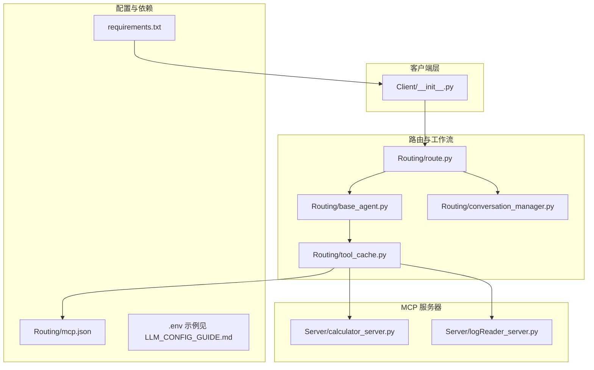
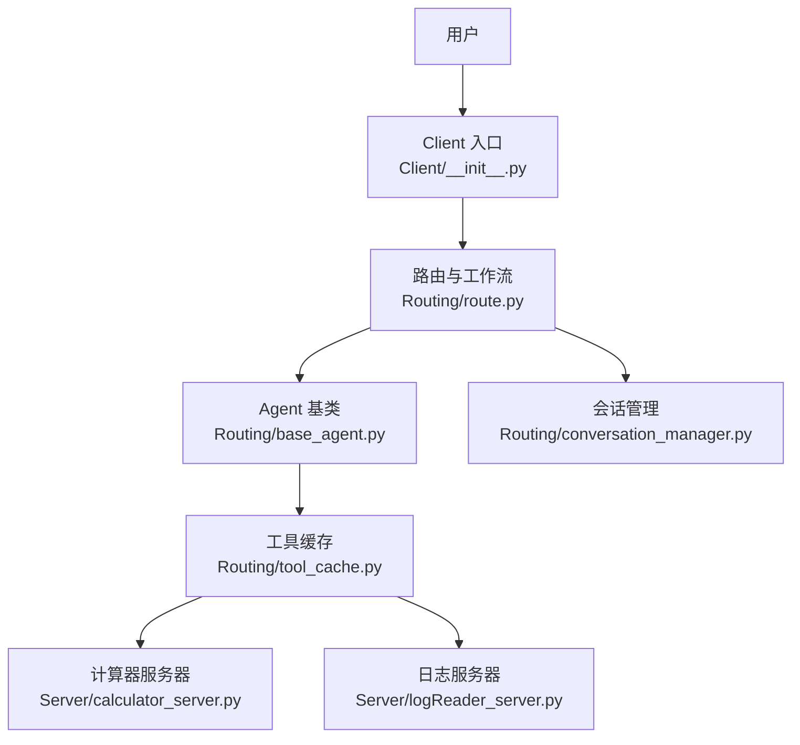
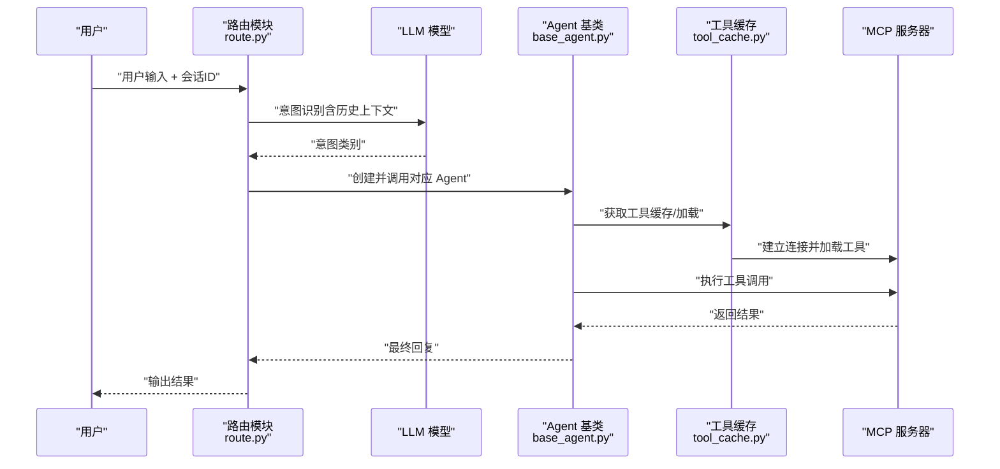
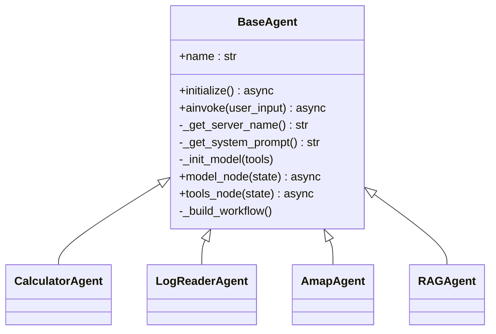
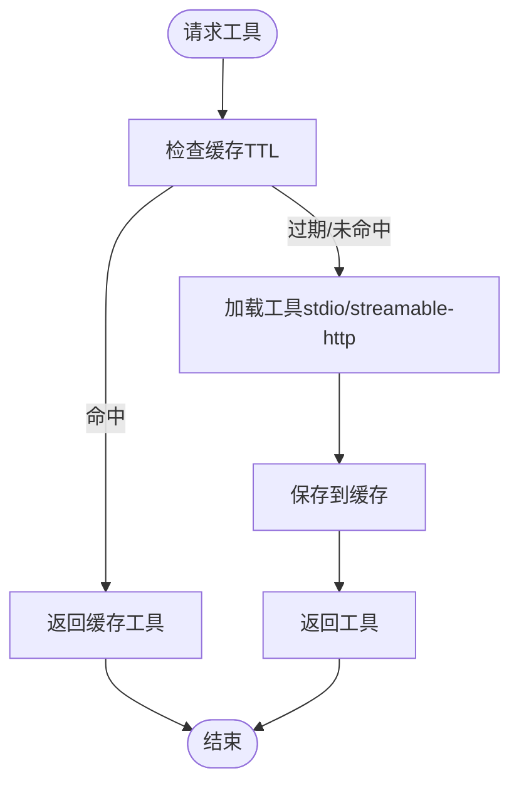
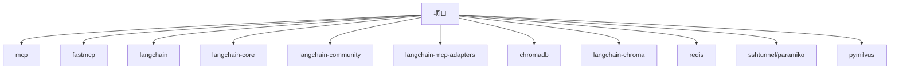

# 项目概述

<cite>
**本文档引用的文件**
- [README.md](file://README.md)
- [quickstart.py](file://quickstart.py)
- [demo_conversation.py](file://demo_conversation.py)
- [requirements.txt](file://requirements.txt)
- [Routing/mcp.json](file://Routing/mcp.json)
- [Routing/base_agent.py](file://Routing/base_agent.py)
- [Routing/route.py](file://Routing/route.py)
- [Routing/tool_cache.py](file://Routing/tool_cache.py)
- [Routing/conversation_manager.py](file://Routing/conversation_manager.py)
- [Server/calculator_server.py](file://Server/calculator_server.py)
- [Server/logReader_server.py](file://Server/logReader_server.py)
- [Client/__init__.py](file://Client/__init__.py)
- [CACHE_AND_CONVERSATION.md](file://CACHE_AND_CONVERSATION.md)
- [LLM_CONFIG_GUIDE.md](file://LLM_CONFIG_GUIDE.md)
- [Prompt提示词整理/router.md](file://Prompt提示词整理/router.md)
</cite>

## 目录
1. [引言](#引言)
2. [项目结构](#项目结构)
3. [核心组件](#核心组件)
4. [架构总览](#架构总览)
5. [详细组件分析](#详细组件分析)
6. [依赖分析](#依赖分析)
7. [性能考虑](#性能考虑)
8. [故障排除指南](#故障排除指南)
9. [结论](#结论)
10. [附录](#附录)

## 引言
本项目基于 Model Context Protocol（MCP）协议，构建了一个智能代理系统，旨在通过标准化协议将大语言模型（LLM）与外部工具/数据源高效连接。系统采用 LangChain 与 LangGraph 实现多智能体工作流，支持动态工具加载、高德地图集成、RAG 知识检索、日志分析等多种能力。项目强调模块化设计、统一抽象与可扩展性，既适合初学者快速上手，也为资深开发者提供了深入的技术细节与优化空间。

## 项目结构
项目采用按功能域划分的模块化组织方式，核心目录与职责如下：
- Client：客户端封装与入口，提供 LangGraph/LangChain 适配器的统一导出
- Routing：路由与工作流核心，包含 Agent 基类、工具缓存、会话管理、路由器等
- Server：MCP 服务器实现，提供计算器、日志读取、RAG 等工具
- test：单元与集成测试
- vector_store：向量数据库持久化目录
- doc：文档与指南
- 根目录：快速启动脚本、环境配置与依赖清单

**图表来源**
- [Client/__init__.py:1-12](file://Client/__init__.py#L1-L12)
- [Routing/route.py:1-553](file://Routing/route.py#L1-L553)
- [Routing/base_agent.py:1-497](file://Routing/base_agent.py#L1-L497)
- [Routing/tool_cache.py:1-302](file://Routing/tool_cache.py#L1-L302)
- [Routing/conversation_manager.py:1-275](file://Routing/conversation_manager.py#L1-L275)
- [Server/calculator_server.py:1-111](file://Server/calculator_server.py#L1-L111)
- [Server/logReader_server.py:1-151](file://Server/logReader_server.py#L1-L151)
- [Routing/mcp.json:1-29](file://Routing/mcp.json#L1-L29)
- [requirements.txt:1-17](file://requirements.txt#L1-L17)

**章节来源**
- [README.md:5-36](file://README.md#L5-L36)
- [Client/__init__.py:1-12](file://Client/__init__.py#L1-L12)
- [Routing/mcp.json:1-29](file://Routing/mcp.json#L1-L29)
- [requirements.txt:1-17](file://requirements.txt#L1-L17)

## 核心组件
- 路由与意图识别：基于 LangGraph 的 StateGraph 工作流，通过结构化输出识别用户意图并路由至相应 Agent
- Agent 基类：统一工具加载、消息处理、错误处理与工作流构建，大幅降低代码重复
- 工具缓存：全局 TTL 缓存与会话管理，避免重复加载 MCP 服务器工具，提升响应速度
- 会话管理：支持多轮对话与历史上下文，提供会话创建、消息存储、过期清理与 Redis 持久化
- MCP 服务器：计算器、日志读取、RAG 等工具通过标准协议暴露，支持 stdio 与 streamable-http 两种传输

**章节来源**
- [Routing/route.py:149-256](file://Routing/route.py#L149-L256)
- [Routing/base_agent.py:29-318](file://Routing/base_agent.py#L29-L318)
- [Routing/tool_cache.py:39-297](file://Routing/tool_cache.py#L39-L297)
- [Routing/conversation_manager.py:82-274](file://Routing/conversation_manager.py#L82-L274)

## 架构总览
系统采用“客户端-路由-工作流-基础设施-外部工具”的分层架构。客户端通过统一入口调用路由模块；路由模块根据用户输入与历史上下文进行意图识别，选择合适的 Agent；Agent 基类负责工具加载与推理；基础设施层提供工具缓存与会话管理；外部工具通过 MCP 服务器提供。

**图表来源**
- [Client/__init__.py:1-12](file://Client/__init__.py#L1-L12)
- [Routing/route.py:258-291](file://Routing/route.py#L258-L291)
- [Routing/base_agent.py:238-256](file://Routing/base_agent.py#L238-L256)
- [Routing/tool_cache.py:118-196](file://Routing/tool_cache.py#L118-L196)
- [Routing/conversation_manager.py:100-146](file://Routing/conversation_manager.py#L100-L146)
- [Server/calculator_server.py:108-111](file://Server/calculator_server.py#L108-L111)
- [Server/logReader_server.py:148-151](file://Server/logReader_server.py#L148-L151)

## 详细组件分析

### 路由与意图识别（Routing/route.py）
- 职责：接收用户输入，结合会话历史进行意图识别，路由到计算器、日志读取、高德地图或 RAG 知识库代理
- 关键流程：route_request 节点使用结构化输出识别意图；handle_*_request 节点调用对应 Agent 并返回结果
- 会话集成：通过 conversation_manager 获取最近历史，构建带上下文的输入

**图表来源**
- [Routing/route.py:149-233](file://Routing/route.py#L149-L233)
- [Routing/route.py:351-414](file://Routing/route.py#L351-L414)
- [Routing/base_agent.py:44-66](file://Routing/base_agent.py#L44-L66)
- [Routing/tool_cache.py:85-116](file://Routing/tool_cache.py#L85-L116)

**章节来源**
- [Routing/route.py:149-256](file://Routing/route.py#L149-L256)
- [Routing/route.py:351-414](file://Routing/route.py#L351-L414)

### Agent 基类与工作流（Routing/base_agent.py）
- 统一抽象：BaseAgent 定义 AgentState、模型节点、工具节点、路由逻辑与工作流构建
- 工具加载：延迟初始化，使用全局工具缓存避免重复加载
- 错误处理：统一捕获模型调用与工具执行异常，保证稳定性
- 系统提示词：各专用 Agent（计算器、日志读取、高德地图、RAG）通过系统提示词指导推理

**图表来源**
- [Routing/base_agent.py:29-318](file://Routing/base_agent.py#L29-L318)

**章节来源**
- [Routing/base_agent.py:29-318](file://Routing/base_agent.py#L29-L318)

### 工具缓存与会话管理（Routing/tool_cache.py、Routing/conversation_manager.py）
- 工具缓存：GlobalToolCache 以服务器名为键进行 TTL 缓存，支持 stdio 与 streamable-http 两种传输；自动管理会话生命周期
- 会话管理：ConversationManager 支持多会话并发、历史长度限制、会话超时清理与 Redis 持久化

**图表来源**
- [Routing/tool_cache.py:85-116](file://Routing/tool_cache.py#L85-L116)
- [Routing/tool_cache.py:118-196](file://Routing/tool_cache.py#L118-L196)

**章节来源**
- [Routing/tool_cache.py:39-297](file://Routing/tool_cache.py#L39-L297)
- [Routing/conversation_manager.py:82-274](file://Routing/conversation_manager.py#L82-L274)

### MCP 服务器（Server/calculator_server.py、Server/logReader_server.py）
- 计算器服务器：提供加减乘除工具，通过 stdio 传输
- 日志服务器：提供日志读取、搜索与统计工具，通过 stdio 传输

**章节来源**
- [Server/calculator_server.py:1-111](file://Server/calculator_server.py#L1-L111)
- [Server/logReader_server.py:1-151](file://Server/logReader_server.py#L1-L151)

### 快速启动与演示（quickstart.py、demo_conversation.py）
- quickstart.py：展示 Agent 创建、工具加载与示例对话流程
- demo_conversation.py：演示工具缓存、循环对话与会话管理的实际效果

**章节来源**
- [quickstart.py:1-68](file://quickstart.py#L1-L68)
- [demo_conversation.py:1-102](file://demo_conversation.py#L1-L102)

## 依赖分析
项目依赖围绕 MCP 协议与 LangChain/LangGraph 生态展开，核心依赖包括：
- fastmcp、mcp：MCP 协议客户端与会话管理
- langchain、langchain-community、langchain-core：LLM 与消息处理
- langchain-mcp-adapters：MCP 工具加载适配器
- chromadb、langchain-chroma：本地向量检索
- redis：会话持久化
- sshtunnel、paramiko：SSH 隧道与远程连接
- pymilvus：远程向量检索

**图表来源**
- [requirements.txt:1-17](file://requirements.txt#L1-L17)

**章节来源**
- [requirements.txt:1-17](file://requirements.txt#L1-L17)

## 性能考虑
- 工具缓存：通过 TTL 缓存避免重复加载 MCP 服务器工具，显著降低延迟（二次调用可提升 20-30 倍响应速度）
- 会话管理：限制历史消息数量与会话超时，防止内存膨胀
- 传输协议：stdio 与 streamable-http 双通道，按场景选择最优方案
- 并发与清理：工作流结束后主动清理缓存与会话，避免资源泄漏

**章节来源**
- [CACHE_AND_CONVERSATION.md:229-244](file://CACHE_AND_CONVERSATION.md#L229-L244)
- [Routing/tool_cache.py:281-297](file://Routing/tool_cache.py#L281-L297)
- [Routing/conversation_manager.py:267-271](file://Routing/conversation_manager.py#L267-L271)

## 故障排除指南
- 工具加载失败：检查 MCP 配置文件路径、服务器脚本可执行性与依赖安装
- 会话历史未保持：确认传递正确的会话 ID、历史消息数量未超限
- 内存占用过高：调整历史消息上限与会话超时时间，定期清理过期会话
- LLM 配置问题：核对 .env 中 API Key 与模型参数，确保与基础 URL 匹配

**章节来源**
- [CACHE_AND_CONVERSATION.md:296-324](file://CACHE_AND_CONVERSATION.md#L296-L324)
- [LLM_CONFIG_GUIDE.md:68-81](file://LLM_CONFIG_GUIDE.md#L68-L81)

## 结论
本项目以 MCP 协议为核心，结合 LangChain/LangGraph 实现了高度模块化与可扩展的智能代理系统。通过统一的 Agent 基类、工具缓存与会话管理，系统在性能与易用性之间取得平衡，既能满足初学者的快速上手需求，又为进阶用户提供深入定制的空间。未来可在多模态工具接入、分布式会话存储与跨域安全等方面进一步演进。

## 附录
- 快速开始：参考 README 的环境准备、配置与运行步骤
- 意图识别提示词：参考 Prompt 提示词整理中的 router.md
- LLM 配置：参考 LLM_CONFIG_GUIDE.md 的 .env 配置与模型切换说明

**章节来源**
- [README.md:51-78](file://README.md#L51-L78)
- [Prompt提示词整理/router.md:1-70](file://Prompt提示词整理/router.md#L1-L70)
- [LLM_CONFIG_GUIDE.md:1-92](file://LLM_CONFIG_GUIDE.md#L1-L92)